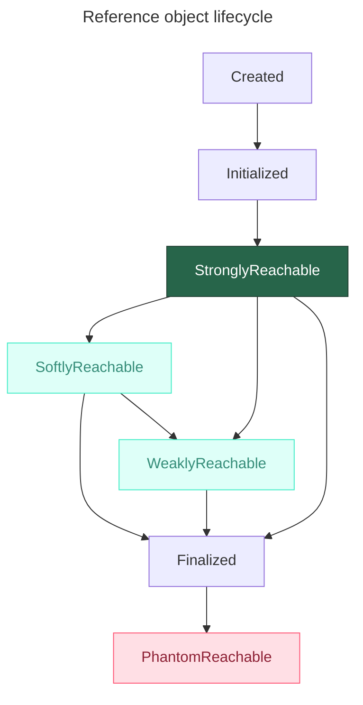

---
aliases:
  - Garbage Collector
  - GC
  - Java Reference
  - Phantom Reference
  - Reference
  - ReferenceQueue
  - Soft Reference
  - Strong Reference
  - Weak Reference
  - WeakHashMap
  - Java-ссылки
  - Мягкая ссылка
  - Сборщик мусора
  - Сильная ссылка
  - Слабая ссылка
  - Фантомная ссылка
---
## Типы ссылок в Java

> java.lang.ref

Тип ссылки в Java влияет на **жизненный цикл объекта** и то, **как Garbage Collector (GC) решает, когда можно удалить объект из памяти**.

Java Reference бывают типов:

- `Strong` → объект жив, пока на него есть ссылки
- `Soft` → объект жив, пока есть память в куче
  - подходит для логов
- `Weak` → объект удаляется при следующей сборке, если у него нет strong-ссылок.
  - подходит для мета информации об объекте
- `Phantom` → Post-mortem: объект уже мёртв, ссылка нужна для уведомления об очистке

### Сравнение типов ссылок

| Тип ссылки              | Класс              | Когда GC удаляет объект                                   | Типичное использование                  |
| ----------------------- | ------------------ | --------------------------------------------------------- | --------------------------------------- |
| **Strong** (Сильная)    | `Object ref`       | **Никогда**, пока ссылка существует                       | Обычные объекты (по умолчанию)          |
| **Soft** (Мягкая)       | `SoftReference`    | Только при **нехватке памяти** (перед `OutOfMemoryError`) | Кэширование данных                      |
| **Weak** (Слабая)       | `WeakReference`    | При **следующей сборке мусора**, если нет сильных ссылок  | `WeakHashMap`, канонические отображения |
| **Phantom** (Фантомная) | `PhantomReference` | После **финализации**, но перед освобождением памяти      | Очистка ресурсов, логирование удаления  |

- **Метод `get()`**
  - `Strong`, `Soft`, `Weak` → Возвращают объект (или `null`, если собран).
  - `Phantom` → **Всегда возвращает `null`** (используется только с `ReferenceQueue`).
- **Управление памятью**
  - Позволяет создавать **кэши**, которые не приводят к `OutOfMemoryError` (`Soft`).
  - Позволяет избегать **утечек памяти** в мапах (`WeakHashMap`).

---

## Пример работы со ссылками

```java
// Strong
Object object = new Object(); //создал объект
object = null; //теперь может быть собран сборщиком мусора

// Weak Reference
Counter counter = new Counter();
WeakReference weakCounter = new WeakReference(counter);
counter = null;
// теперь weakCounter будет удален сборщиком мусора, т.к. не содержит в себе сильной ссылки

// Soft Reference
Counter counter = new Counter();
SoftReference softCounter = new SoftReference(counter);
counter = null;
// теперь softCounter будет удален сборщиком мусора, но не сразу, а в отличие от weak ссылки удаление не случится пока не появится острая нехватка памяти

// Можно отслеживать цикл жизни при помощи `ReferenceQueue`
ReferenceQueue refQueue = new ReferenceQueue();
DigitalCounter digit = new DigitalCounter();
PhantomReference phantom = new PhantomReference(digit, refQueue);
```

### Цикл жизни ссылочного объекта


