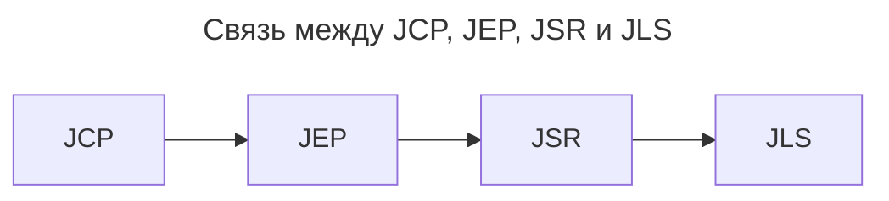
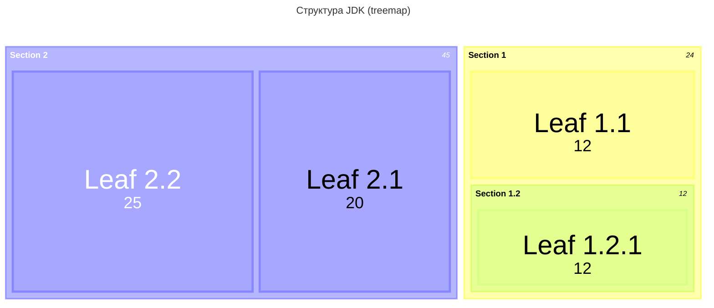
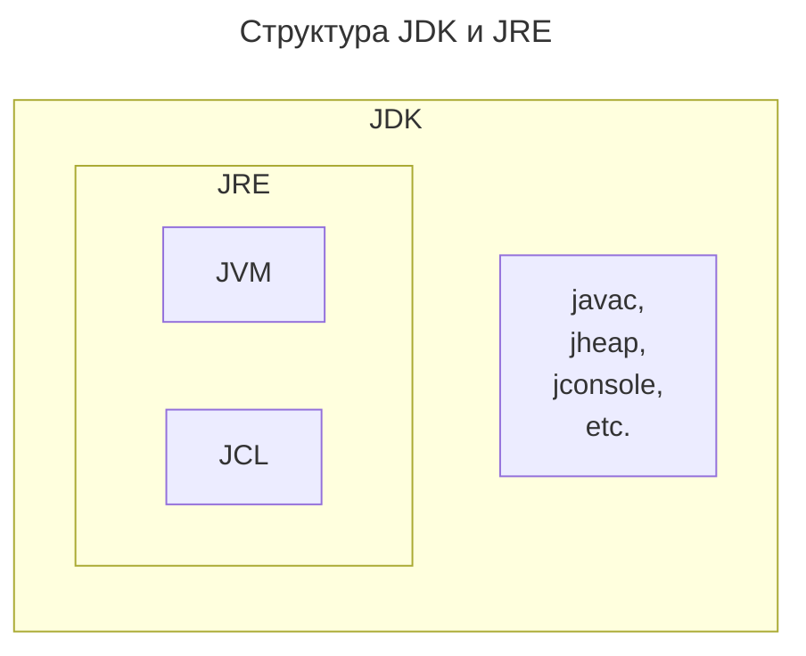
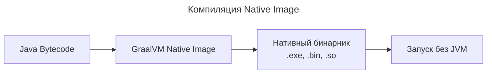

---
aliases:
  - Early binding
  - J2EE
  - J2SE
  - Jakarta EE
  - JAR
  - Java 2 Enterprise Edition
  - Java 2 Standard Edition
  - Java Archive
  - Java Class Library
  - Java Community Process
  - Java Compiler
  - Java Development Kit
  - Java Enterprise Edition
  - Java EE
  - Java Language Specification
  - Java launcher
  - Java Management Extensions
  - Java Memory Model
  - Java Native Interface
  - Java Platform Standard Edition
  - Java Runtime Environment
  - Java Specification Request
  - Java Specification Requests
  - Java Virtual Machine
  - javac
  - JCL
  - JCP
  - JDK
  - JEP
  - JLS
  - JMM
  - JMX
  - JNI
  - JRE
  - JSR
  - JVM
  - MBean
  - Native Image
  - Static binding
  - Раннее связывание
  - Статическое связывание
---
## JNI — Java Native Interface

Java Native Interface (**JNI**) — стандартный механизм для запуска кода под управлением виртуальной машины Java (JVM), который написан на языках C/C++ или Ассемблере и скомпонован в виде динамических библиотек; позволяет не использовать статическое связывание.

> [!info] статическое связывание ≡ early binding
> Если **связывание проводится компилятором перед запуском программы**, то оно называется статическим или ранним связыванием (early binding).

JNI — это интерфейс, позволяющий из Java вызывать нативные функции. Например, метод C++, который что-нибудь делает. Допустим, мы пишем большую программу на простом и любимом Java или Kotlin, и нужно реализовать задачу коммивояжера для нашего клиента. Или мы пишем генетический алгоритм, который ищет что-то в большом объёме данных, и так уж вышло, что у нас есть замечательная реализация на C++. Особенно часто я слышу про JNI в gamedev- и в automotive-проектах.

## JLS, JSR, JEP, JCP — Java Specs

В чем разница (или связь) между JLS, JSR и JEP?

JCP, JEP, JSR и JLS связаны цепочкой стандартизации:



### JSR, Java Specification Requests

Java Specification Requests

Запрос спецификации Java (Java Specification Request, JSR) — это **==формальный запрос к сообществу Java на добавление и усовершенствование технологий==**. Это орган, который стандартизирует API-интерфейсы на платформе технологии Java и используется для группировки API-интерфейсов в блоки, например, JAX-RS (Java API для веб-сервисов RESTful). Для каждого JSR всегда существует эталонная реализация по умолчанию.

### JEP, JDK Enhancement Proposal

JDK Enhancement Proposal

JEP — Предложение по улучшению JDK.

### JLS, Java Language Specification

Java Language Specification

JLS — спецификация языка Java.

### JCP, Java Community Process

JCP — Java Community Process.

## JAR — Java Archive

JAR-файл — это Java-архив (**J**ava **AR**chive). ~~_Аналог exe._~~ Это простой архивный файл, сжатый (иногда с нулевой компрессией) по алгоритму zip. Он был создан для удобства распространения программ, написанных на Java. Так как обычная программа содержит тысячи файлов. Файл может содержать:

- файл манифеста `META-INF/MANIFEST.MF`
- java-файлы (исходный код)
- class-файлы
- файлы, необходимые для работы программы: картинки, файлы с настройками и прочее (ресурсы)
- электронные подписи, которые позволяют защитить программу от модификации

Манифест — это текстовый файл формата `ключ: значение`; он содержит описание jar-файла. В нём могут быть следующие ключи:

- **Manifest-Version** — версия манифеста
- **Main-Class** — имя главного класса (должен содержать метод `main`); такой jar-файл можно запустить как обычный исполняемый файл
- **Class-Path** — позволяет указать `CLASSPATH`, необходимый для полноценной работы программы
- **SHA-Digest** — контрольная сумма определенного файла внутри архива

## JMX — Java Management Extensions

**Java Management Extensions** (JMX) — это технология, входящая в J2SE начиная с J2SE 5.0. JMX ==предназначен для контроля и управления приложениями, системными объектами, устройствами (например, принтерами) и компьютерными сетями==. Она позволяет управлять внутренним состоянием так называемых MBean-ов, которые по сути являются классами Java, предоставляющими доступ к части своих полей и методов извне.

### MBean

Стандартный MBean определяется с помощью интерфейса с именем `<имя>MBean` и его реализацией `<имя>` соответственно. Интерфейс определяет все экспортируемые наружу методы и атрибуты MBean-а. Атрибуты должны следовать правилам именования getter-ов и setter-ов.

Пример:

```java
public interface MyMBean {
    String getMyName();
    void setSomeValue(int value1);
    int getSomeValue();
    void writeToConsole(String message);
    String concat(String str1, String str2);
}
```

### J2EE — Java Enterprise Edition

**≡ Jakarta EE ≡ Java EE**

Jakarta EE (ранее — Java Platform, Enterprise Edition, сокр. Java EE, до версии 5.0 — Java 2 Enterprise Edition или J2EE). В 2018 Eclipse Foundation переименовала Java EE в Jakarta EE — **==набор спецификаций и соответствующей документации для языка Java, описывающей архитектуру серверной платформы для задач средних и крупных предприятий==**.

Включает в себя больше пакетов, чем J2SE. Напр: javax.servlet.\*, javax.enterprise.context.\*, ...

### J2SE — Java 2 Standard Edition

**≡ Java Platform Standard Edition ≡ Java 2 Standard Edition**

J2SE — стандартная версия платформы Java 2, предназначенная для создания и исполнения апплетов и приложений, рассчитанных на индивидуальное пользование или на использование в масштабах малого предприятия. Не включает в себя многие возможности, предоставляемые более мощной и расширенной платформой Java 2 Enterprise Edition (J2EE), рассчитанной на создание коммерческих приложений масштаба крупных и средних предприятий.

Содержит пакеты:

- java.lang
  - Object, Enum, Class, ClassLoader, Throwable, Error, Exception, RuntimeException, Thread, String, StringBuffer, StringBuilder, Comparable, Iterable, Process, Runtime, SecurityManager, System, Math, StrictMath
- java.lang.\*
- java.math
- java.sql
- ...

## JDK — Java Development Kit

Структура JDK (treemap):



Схема состава JDK и JRE:



### JCL, Java Class Library

[[java-collection-framework]]

[[stream-api]]

[[java-concurrency-utilities]]

[[java-thread]]

[[reflection-api]]

[[serializable]]

[[math]]

[[functional-interface]]

[[logger]]

[[java-persistence-api]]

**Java Class Library** Features are accessed through classes provided in packages.

- `java.lang` содержит основополагающие классы и интерфейсы, тесно связанные с языком и системой исполнения.
- I/O и networking: доступ к файловой системе платформы и сетям через пакеты `java.io`, `java.nio` и `java.net`. Для сетевого взаимодействия SCTP доступен через `com.sun.nio.sctp`.
- Mathematics: `java.math` предоставляет математические выражения и вычисления, а также десятичные и целые числа произвольной точности.
- Collections и Utilities: встроенные структуры данных и утилитарные классы для регулярных выражений, конкурентности, логирования и сжатия данных.
- GUI и 2D Graphics: пакет AWT (`java.awt`) — базовые GUI-операции и привязка к нативной системе, а также 2D Graphics API. Пакет Swing (`javax.swing`) построен на AWT и предоставляет платформонезависимый набор виджетов и Pluggable look and feel.
- Sound: интерфейсы и классы для чтения, записи, секвенирования и синтеза звуковых данных.
- Text: `java.text` работает с текстом, датами, числами и сообщениями.
- Image: `java.awt.image` и `javax.imageio` предоставляют API для записи, чтения и модификации изображений.
- XML: SAX, DOM, StAX, XSLT transforms, XPath и различные API для веб-сервисов, такие как SOAP и JAX-WS.
- Security: `java.security` и сервисы шифрования `javax.crypto`.
- Databases: доступ к SQL-базам данных через `java.sql`.
- Scripting: пакет `javax.script` даёт доступ к совместимым скриптовым языкам.
- Applets: `java.applet` позволяет загружать приложения по сети и запускать их в защищённой песочнице.
- Java Beans: `java.beans` предоставляет способы управления переиспользуемыми компонентами.
- Introspection и reflection: `java.lang.Class` представляет класс, другие классы, такие как Method и Constructor, доступны в `java.lang.reflect`.

### javac, java compiler

**Java Compiler**. Оптимизирующий компилятор java, включенный в состав многих JDK. Компилятор принимает исходные коды, соответствующие спецификации Java language specification, и возвращает байт-код, соответствующий спецификации Java Virtual Machine Specification.

**Java Heap** — предоставляет набор инструментов, помогающий разработчикам Java обнаруживать и устранять первопричину проблем с памятью в их приложениях.

**JConsole** — это инструмент мониторинга, соответствующий спецификации Java Management Extensions (JMX).

### java launcher

java launcher (`java.exe` или `javaw.exe`) — это простое приложение (simple C application): оно загружает различные DLL, которые на самом деле являются JVM.

#### JNI, Java Native Interface

Java launcher выполняет определённый набор `Java Native Interface` (`JNI`) вызовов. JNI — это механизм, соединяющий мир виртуальной машины Java и мир C++. Получается, что launcher — это не JVM, а её загрузчик. Он знает, какие правильные команды нужно выполнить, чтобы запустилась JVM. Знает, как организовать всё необходимое окружение при помощи JNI вызовов.

В эту организацию окружения входит и создание главного потока, который обычно называется `main`.

## [[jvm]] — Java Virtual Machine

### Реализации JVM

#### Таблица сравнения основных реализаций JVM

| **Параметр**                      | **OpenJDK HotSpot**                                             | **Oracle GraalVM**                                               | **Eclipse OpenJ9**                             | **Azul Zing**                                                      |
| --------------------------------- | --------------------------------------------------------------- | ---------------------------------------------------------------- | ---------------------------------------------- | ------------------------------------------------------------------ |
| Разработчик                       | Oracle / OpenJDK                                                | Oracle / GraalVM Team                                            | Eclipse Foundation                             | Azul Systems                                                       |
| Тип                               | Классическая JIT-машина                                         | JIT + AOT (Native Image)                                         | Оптимизированная JIT                           | Высокопроизводительная JIT                                         |
| Стартовое время                   | Среднее (1–3 сек)                                               | ⚡ Очень быстрое (Native Image) / Среднее (JVM mode)              | ⚡ Очень быстрое                                | ⚡ Очень быстрое                                                    |
| Потребление памяти                | Среднее                                                         | ✅ Низкое (Native Image) / Среднее                                | ✅ Низкое                                       | ❌ Высокое (за счёт GC)                                             |
| Производительность (пиковая)      | ✅ Очень высокая                                                 | ✅ Высокая (JVM mode) / 💥 Выше (Native Image для коротких задач) | ✅ Высокая (часто ближе к HotSpot)              | ✅ Самая высокая (особенно при низкой задержке)                     |
| GC (сборщик мусора)               | G1 ZGC Shenandoah CMS Parallel                                  | Зависит от режима (обычно G1/ZGC)                                | Eclipse OOM (Optimized for low pause)          | C4 (Continuously Concurrent Compacting Collector) — почти без пауз |
| Поддержка Native Image (AOT)      | ❌ Нет                                                           | ✅ Да (основная фишка)                                            | ❌ Нет                                          | ❌ Нет                                                              |
| Поддержка многопоточности         | Отличная                                                        | Отличная                                                         | Отличная                                       | ✅ Лучшая в мире (для high-throughput)                              |
| Поддержка ARM / Cloud / Container | ✅ Хорошая                                                       | ✅ Отличная (особенно Native Image)                               | ✅ Отличная                                     | ✅ Отличная                                                         |
| Лицензия                          | GPL v2 with CPE (OpenJDK)                                       | Apache 2.0                                                       | EPL 2.0                                        | Коммерческая (бесплатна до определённого размера)                  |
| Используется в                    | Большинство Java-приложений Spring Micronaut Quarkus (JVM mode) | Serverless микросервисы контейнеры GraalVM Native                | IBM WebSphere Red Hat RHEL Eclipse IDE Alibaba | Финансовые системы HFT трейдинг                                    |
| Особенности                       | Лидер по стабильности экосистема                                | Может компилировать Java в нативный бинарник (без JVM!)          | Маленький footprint отлично для Docker/облака  | Непревзойдённые гарантии низкой задержки (мс)                      |

#### Устаревшие JVM, снятые с поддержки

- Oracle JRockit
- IBM J9
  - переход на Eclipse OpenJ9

#### Native Image

**Native Image** — это технология, которая **компилирует Java-код Ahead-of-Time (AOT)** в нативный исполняемый файл (бинарник), который может запускаться без JVM.

Схема компиляции Native Image:



#### Преимущества

- **AOT-компиляция** (Ahead-of-Time) вместо JIT
- **Отсутствие JVM** во время выполнения
- **Мгновенный старт** (milliseconds вместо seconds)
- **Меньшее потребление памяти**
- **Более низкая latency**

> [!info] OpenJDK vs Oracle
> OpenJDK является основной реализацией Java, управляемой сообществом и поддерживаемой Oracle, которая предоставляет исходный код. В то время как Oracle JDK — коммерческий продукт Oracle, основанный на этом коде, но с закрытым исходным кодом и платной поддержкой. Oracle — основная организация-разработчик и спонсор OpenJDK.

#### HFT (High-Frequency Trading)

**HFT** — это алгоритмический трейдинг, характеризующийся **высокоскоростной торговлей** с использованием мощных компьютеров и сложных алгоритмов.

##### Ключевые характеристики

- ⏱️ **Микросекундные задержки** (latency)
- 🔁 **Огромное количество сделок** в секунду
- 📈 **Арбитражные стратегии**
- 🤖 **Полная автоматизация**

#### Выбор JVM

| Цель                                                   | Рекомендуемая JVM                    |
| ------------------------------------------------------ | ------------------------------------ |
| Обычный enterprise-сервис (Spring Boot Jakarta EE)     | HotSpot (OpenJDK) — безопасный выбор |
| Микросервисы Docker Cloud Serverless                   | GraalVM Native Image или OpenJ9      |
| Приложения с жёсткими требованиями к памяти (IoT edge) | OpenJ9                               |
| Финансовые системы HFT трейдинг                        | Azul Zing                            |
| Быстрый старт приложений (CLI скрипты)                 | GraalVM Native Image                 |
| Альтернатива Oracle — без лицензионных рисков          | OpenJDK + OpenJ9                     |

#### Назначение JVM

| JVM              | Статус         | Лучше всего подходит для                    |
| ---------------- | -------------- | ------------------------------------------- |
| HotSpot          | 👑 Лидер       | Большинство случаев стабильность экосистема |
| GraalVM          | 🚀 Инноватор   | Serverless контейнеры Native Image          |
| OpenJ9           | 🏆 Экономичный | Docker Kubernetes низкое потребление памяти |
| Azul Zing        | 💰 Премиум     | Финансы HFT где критичны паузы GC           |
| JRockit / IBM J9 | ☠️ Устарели    | Не использовать                             |

#### Подробнее о ключевых альтернативах

### [[jmm]] — Java Memory Model

Модель памяти Java
