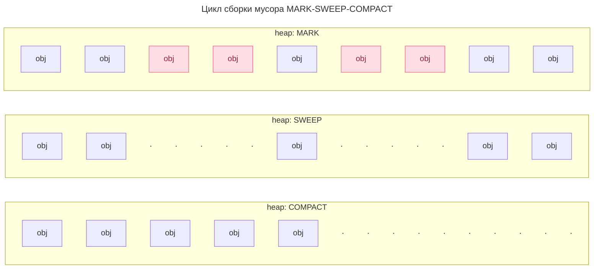
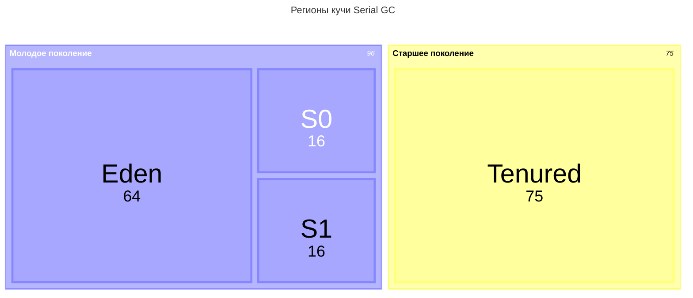
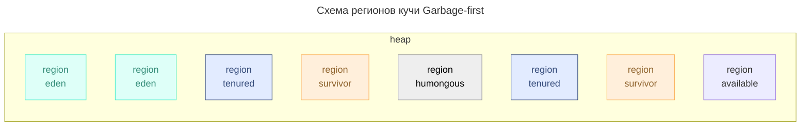

---
aliases:
  - Barrier
  - C4
  - CMS
  - Compact
  - Concurrent Mark Sweep
  - Continuously Concurrent Compacting Collector
  - Dead Objects
  - Eden
  - Epsilon
  - Epsilon GC
  - Evacuate
  - Floating Garbage
  - Full GC
  - G1
  - Garbage Collection
  - Garbage Collector
  - Garbage First
  - Garbage-First
  - GC
  - GC Roots
  - Heap
  - Humongous
  - Live Objects
  - Long-Lived Objects
  - Major GC
  - Mark
  - Minor GC
  - Mutator Threads
  - No-Op Garbage Collector
  - Old Generation
  - Pacing
  - Parallel
  - Parallel GC
  - SATB
  - Serial
  - Serial GC
  - Shenandoah
  - Shenandoah GC
  - Short-Lived Objects
  - Snapshot-At-The-Beginning Barrier
  - Stop The World
  - STW
  - Survivor
  - Sweep
  - Tenured
  - Throughput
  - Weak Generational Hypothesis
  - Young Generation
  - ZGC
  - Zing
  - Барьеры
  - Долгоживущие объекты
  - Короткоживущие объекты
  - Куча
  - Мажорная сборка
  - Минорная сборка
  - Молодое поколение
  - Мутаторные потоки
  - Плавающий мусор
  - Полная сборка
  - Сборка мусора
  - Сборщик мусора
  - Слабая гипотеза о поколениях
  - Старшее поколение
---

## Сборка мусора

В большинстве случаев в Java мы не удаляем объекты из памяти вручную, потому что сборка мусора — это автоматизированный процесс.

Все объекты в Runtime можно разделить на:

- **живые** — объекты, которые используются основными потоками приложения;
- **мёртвые** — объекты, на которые не осталось ссылок из корневых множеств.

Присутствие в Runtime большой теневой службы создаёт конкуренцию за вычислительные ресурсы. Поэтому столько, сколько существуют сборщики мусора, идёт работа над их оптимизацией.

В основу одной из первых идей оптимизации работы сборщика легла слабая гипотеза о поколениях.

### Слабая гипотеза о поколениях

Объекты в runtime можно разделить на категории по их числу и продолжительности жизни:

- **short-lived objects ≡ короткоживущие объекты** — цикл жизни не превышает цикл выполнения одного метода, например итераторы, объекты в циклах, переменные методов, боксинг-оболочки.
- **medium-lived objects ≡ объекты со средней продолжительностью жизни** — цикл жизни от одного до нескольких циклов выполнения методов, например объекты сессий, кэш, транспортные объекты.
- **long-lived objects ≡ долгоживущие объекты** — цикл жизни стремится ко времени работы приложения, например сервисы, статические поля классов, константы.

Учитывая рассмотренные особенности, принято делить объекты на поколения:

- **young generation ≡ молодое поколение** — short-lived и medium-lived;
- **old generation ≡ старшее поколение** — long-lived.

Согласно многим исследованиям, абсолютное большинство объектов относится к молодому поколению.

> **Слабая гипотеза о поколениях**
> Вероятность смерти как функция от возраста снижается очень быстро: молодые объекты «умирают» чаще, чем старые, при этом их большинство.

Вывод из слабой гипотезы о поколениях: имеет смысл разделить кучу на регионы по поколениям и проводить чистку в регионе молодого поколения чаще, чем в регионе старшего.

Отсюда появляется деление циклов сборки:

- **minor gc ≡ минорный цикл сборки** — сборка мусора в молодом поколении.
- **major gc ≡ мажорный цикл сборки** — сборка мусора в старом поколении. Случается реже, чем минорный цикл. В общем случае происходит по событию заполнения.
- **full gc ≡ полный цикл сборки** — full gc = minor gc + major gc. Обычно инициируется, когда сборщик переходит в failure mode, например когда новые объекты создаются быстрее, чем он успевает высвобождать данные.

Выделение поколений с отдельными циклами сборки привело к необходимости структурировать кучу `heap` на регионы `regions` по их назначению. Модель регионов кучи определяется сборщиком мусора.

Некоторые модели регионов так же основываются на слабой гипотезе о поколениях.

- Пример структуры кучи Parallel GC HotSpot JDK8+:
  - ![[Untitled 6 2.webp|Untitled 6 2.webp|600]]

### Критерии эффективности сборщика

Типовые метрики, по которым оценивается качество сборщика:

- **`максимальное STW`** — на длительном промежутке работы приложения.
- **`throughput` (пропускная способность)** — отношение общего времени работы программы к общему времени простоя на длительном промежутке.
- **`resources` (объём ресурсов)** — процессорное время или память, потребляемые сборщиком.
- **`promptness` (период проворства)** — время от момента, когда объект стал не нужен, до момента его фактического удаления из памяти. Имеет значение в ситуациях ограниченной памяти.

> **Невозможно оптимизировать все критерии сразу**
> Поэтому при выборе и настройке сборщика приходится подбирать оптимальное решение для конкретной ситуации.

### Цикл сборки мусора

Цикл алгоритма сборки мусора можно поделить на фазы. В общем случае выделяются следующие фазы:

1. **MARK** — пометить живые объекты в процессе обхода графа объектов.
2. **EVACUATE** — эвакуация живых объектов.
3. **SWEEP** — зачистка мёртвых объектов.
4. **COMPACT** — дефрагментация объектов в памяти.

Цикл сборки:

**EVACUATE**

Фаза эвакуации — это процесс, при котором объекты «эвакуируются» из одного региона памяти в другой. Главная цель эвакуации — разделить регионы памяти на содержащие живые и мёртвые объекты перед очисткой.

Процесс эвакуации включает следующие шаги:

1. Определение «живых» объектов.
2. Перемещение «живых» объектов.
3. Обновление ссылок: ссылки на эвакуированный объект обновляются, чтобы указывать на новое местоположение объекта в памяти.

Фазы сборки мусора могут происходить в конкурентном режиме или в режиме `STW` (Stop The World).

- `Concurrent` (конкурентный режим) означает, что потоки сборщика работают параллельно с основными потоками приложения.
- Выполнение фазы сборки мусора в `STW` приводит к прерыванию выполнения основных потоков приложения.

> **Mutator threads**
> Для выполнения операций сборки бывает важно прерывать основные потоки приложения, так как среди них есть потоки-мутаторы `mutator threads`. Мутаторы меняют ссылки на объекты. Изменение графа ссылок одновременно со сканированием графа сборщиком может привести к проблеме плавающего мусора либо коррупции данных.

#### GC Roots — корневые множества

GC Roots (корни сборки мусора) — это специальные точки входа, с которых сборщик мусора начинает анализ достижимости объектов.

- Если объект не достижим ни из одного из корней, он является "мусором" и подлежит очистке.

В Java к GC Roots относятся:

1. **Thread Stacks** — активные потоки выполнения.
2. **Статические поля** классов, включая переменные и методы.
3. **[[jdk-jls-jni|JNI]] ссылки** — объекты, на которые ссылаются нативные методы через Java Native Interface.
4. Мониторы и **объекты синхронизации**:
   - `synchronized` блоки;
   - объекты в состоянии `wait()` или `notify()`.
5. Объекты, загруженные через системный загрузчик классов **[[classloader|Bootstrap ClassLoader]]**:
   - в частности объекты `java.lang` пакета, например `System.out`, `System.in`, `Runtime.getRuntime()`.
6. Специальные объекты [[jvm|JVM]], например **String Pool**.

### Сравнение сборщиков

JDK 12 поставляет сборщики на выбор:

1. `Serial`
2. `Parallel`
3. `Concurrent Mark Sweep` (CMS)
4. `Garbage-First` (G1)
5. `Shenandoah`
6. `ZGC`
7. `Epsilon`
8. `C4` — Continuously Concurrent Compacting Collector от Azul

Краткое сравнение сборщиков:

|                            | Parallel   | G1             | ZGC                        | Shenandoah         | Azul C4               |
| -------------------------- | ---------- | -------------- | -------------------------- | ------------------ | --------------------- |
| Max STW-pause, ms ~        | 10 000     | 200            | 10                         | 10                 | 5                     |
| Throughput                 | ⭐⭐⭐⭐⭐    | ⭐⭐⭐          | ⭐⭐                       | ⭐⭐                | ⭐⭐⭐⭐⭐               |
| Promptness                 | ⭐          | ⭐⭐⭐          | ⭐⭐⭐⭐⭐                    | ⭐⭐⭐⭐⭐            | ⭐⭐⭐⭐⭐               |
| Max heap, GB               | 10         | 100            | 16 384                     | 16 384             | ∞                     |
| Max CPU load               | Low        | mid            | high, G1 + 20%             | high, G1 + 30%     | high, G1 + 5%         |
| Max mem load               | mid        | mid            | high, G1 + 30%             | high, G1 + 20%     | mid                   |
| Latency guarantee          | нет        | soft real time | near strict real time      | near real time     | strict real time      |
| Java                       | JDK 5+     | JDK 9+         | JDK 11+                    | JDK 12+            | JDK 8+                |
| Memory barriers            | mark phase | write, SATB    | load, store                | read, write        | read, write           |
| Barriers throughput cost ≤ | 3%         | 15%            | 4%                         | 10%                | 8%                    |

### Serial GC

Вышел в JDK 1. Подходит для сборки мусора в однопоточном режиме.

**Регионы кучи**

- эдем `eden`;
- область выживших `Survival 0`, `Survival 1` ≡ From Space, To Space;
- `Tenured`.

Схема регионов:

- Распределение поколений по регионам на примере Serial GC:
  - ![[6b03a9e6d8174da3a7b228eb9acbe001.png]]

**Алгоритм сборки**

- Все новые объекты появляются в Эдеме.
- При заполнении Эдема происходит `minor gc`, в ходе которой все живые перемещаются всегда в одну область: S0 или S1.
- После некоторого числа перемещений по пространствам выживших объект переходит в старшее поколение и перемещается в Tenured регион.
- Когда заканчивается место в Tenured, запускается `major gc`.
- После `major gc` производится дефрагментация региона.

**Особенности работы**

- Минорный и мажорный цикл сборки происходят в `STW` в 1 поток.
- Большие объекты создаются сразу в Tenured.

**Применение**

Oracle рекомендует этот сборщик для одноядерных систем с размером кучи до 100 МБ, когда прерывания работы основных потоков до 10 секунд не являются критическими.

### Parallel GC

Параллельный сборщик мусора является адаптированной версией серийного сборщика для многоядерных систем. Сохраняет похожую структуру регионов и идею алгоритма сборки.

**Регионы кучи**

- эдем `eden`;
- область выживших `Survival 0`, `Survival 1`;
- `Old Gen`.

**Особенности работы**

- `minor gc` и `major gc` происходят в несколько потоков в `STW`.
- При настройке можно указать целевые показатели максимального STW и пропускной способности, к которым он будет стремиться.
  - Не стоит задавать оба показателя сразу: это ведёт к непредсказуемому поведению.
- Более короткие `STW` по сравнению с серийным сборщиком благодаря распараллеливанию работы.
- Для эффективной работы рекомендованный запас свободной памяти — 30% памяти кучи. Риск при нехватке — частые Full GC.

**Применение**

Многоядерные системы с размером кучи до 4 ГБ, когда прерывания работы основных потоков до 10 секунд не являются критическими.

### CMS GC — Concurrent Mark Sweep

Идея алгоритма заложена в названии: фазы маркировки и удаления мёртвых объектов происходят конкурентно с основными потоками приложения.

**Регионы кучи**

- эдем `eden`;
- область выживших `Survival 0`, `Survival 1`;
- `Tenured`.

**Особенности алгоритма**

- В реальности фаза маркировки объектов поделена на 3 подэтапа, 2 из которых происходят в режиме STW-прерывания.
- Так как один из подэтапов маркировки происходит в конкурентном режиме, есть шанс, что мусор будет помечен как живой объект. В спецификации эта аномалия называется плавающим мусором `floating garbage`.
- `minor gc` происходит в несколько потоков в STW.
- `major gc` происходит в несколько потоков в конкурентном режиме. Запускается не по событию заполнения региона, а по периоду, и в нём отсутствует фаза дефрагментации региона старшего поколения.
- Этот факт в совокупности с наличием плавающего мусора приводит к повышенному потреблению памяти. Oracle рекомендует увеличить размер кучи CMS-сборщика на 20% по сравнению с кучей для Parallel GC.

**Схема**

- ![[f9fd549a2a104f1eb7acf5098dd0afe8.png]]

**Применимость**

По сравнению с Parallel GC CMS обеспечивает более короткие управляемые прерывания, но при этом снижается пропускная способность приложения.

В современном мире CMS имеет смысл использовать для поддержания legacy-систем на JDK 8 либо младше.

Проблема плавающего мусора стала одной из причин, по которой на смену CMS пришёл Garbage First сборщик. Это случилось в JDK 9. В этой же версии CMS получил статус Deprecated, а начиная с JDK 14 он удалён из поставки.

- JEP 363 (2019/08/03) — Remove the Concurrent Mark Sweep.

### G1 GC — Garbage First

Основная идея Garbage First сборщика — постоянно сканировать регионы и за счёт знания о регионах эффективно восстанавливать память.

**Схема регионов кучи**

- G1 делит кучу на множество регионов **равного размера** (обычно от 1 до 32 МБ).
- Тип региона может меняться динамически.
- Типы регионов:
  - `eden`, `survivor`, `tenured`;
  - `humongous` регионы — для объектов размера более 50% размера региона;
  - `available` регионы — зарезервированное пространство для будущих аллокаций.

*Схема «Пример деления на регионы сборщиком G1»:*

Новшеством G1 становится внедрение функций-барьеров.

> **Barrier ≡ Барьеры**
> Барьеры — это фрагменты кода, которые при помощи [[jvm|JIT]]-компиляции встраиваются в точку доступа к объекту памяти.
> Барьеры выполняются не в выделенных потоках сборщика, а в основных потоках приложения — в потоках-мутаторах.

Самый интересный из барьеров G1 называется `Snapshot-At-The-Beginning Barrier` (SATB).

- SATB-барьер активируется, если цикл алгоритма сборщика находится в фазе начальной маркировки живых объектов и происходит изменение ссылки на объект мутатором.
- SATB-барьер записывает старую ссылку на объект в SATB-буфер.
- Использование SATB-буферов в фазах алгоритма сборщика позволяет решить проблемы плавающего мусора и коррупции данных в условиях полностью конкурентной маркировки объектов.

**Особенности алгоритма**

- G1 постоянно сканирует регионы в конкурентном режиме, знает, в каком из них больше мусора, и чистит эти регионы первыми — «Garbage First!».
  - ![[Untitled 10 2.webp|Untitled 10 2.webp|300]]
- `minor gc` происходят параллельно в `STW`, но не во всех регионах, а лишь в некоторых, что минимизирует продолжительность `STW`.
- Основной цикл сборки называется `mixed gc`, так как включает фазы маркировки живых объектов и фазу очистки областей старого и молодого поколений. Большинство подэтапов смешанного цикла происходит в конкурентном режиме.
- Алгоритм предусматривает специальное поведение для `humongous` объектов: они не перемещаются между регионами, и в их регион не подселяют другие объекты. Такой подход экономит ресурсы, но может стать проблемой, если в рантайме появляется много больших объектов.
- Есть возможность задать целевой показатель максимальной задержки, под который подстроится алгоритм. `Soft real time` — гарантия достижимости целевого показателя.
- Для эффективной работы рекомендованный запас свободной памяти — 20% регионов. Риск при нехватке — деградация до Serial mode, снижение throughput.

**Применение**

G1 обеспечивает низкие STW-прерывания на уровне до 200 мс, но при этом снижается пропускная способность алгоритма. Гарантированный throughput приложения с G1 — всего 90%.

G1 стал универсальным сборщиком, который используется JVM по умолчанию начиная с JDK 9.

Подходит для приложений со средним размером кучи, условно от 4 до 100 ГБ, в которых пропускная способность не является критически значимым показателем.

### ZGC

Главная идея Z-сборщика — обеспечить алгоритм сборки, при котором задержки не увеличиваются с ростом кучи и числа объектов.

Он поддерживает приложения с кучей размером до 16 ТБ, а эффективная работа сборщика позволяет обеспечить STW-паузы на субмиллисекундном уровне.

- Продолжительность прерываний основных потоков при нормальной работе может составлять менее 1 мс (обычно < 1 мс, максимум 10 мс).

**Модель регионов** основывается не на поколениях, а на цветах указателей.

- ZGC структурирует кучу на множество регионов одинакового размера.
- Роль типов регионов выполняют цвета, закодированные в указателе на объект.
  - Цвет указателя определяется комбинацией из 4 битов. Каждый бит цвета отражает свойство объекта, которое учитывается в алгоритме сборки.
- Так как информация о регионе хранится в указателе, при изменении цвета объект как бы перемещается в другой регион, что снижает нагрузку на эвакуацию.
- Схема указателя в памяти: ![[7dab152360259f7536af5cd17cc9677f.png]]

**Особенности алгоритма**

- Указатель на объект реализует модель виртуальной адресации. Указатели хранятся в специальных таблицах (`Forwarding Table`), поэтому один объект памяти может иметь несколько адресов. Соответственно, объект может единовременно находиться в нескольких регионах и участвовать в разных фазах сборки.
- ZGC поддерживает только системы с 64-битной адресацией:
  - 44 бита для адресации 16 ТБ;
  - 16 бит зарезервировано;
  - 4 бита определяют цвет указателя — комбинация битов с флагами: `marked0 0001, marked1 0010, remapped 0100, finalizable 1000`.
- Сборщик использует функции-барьеры. Он управляет их логикой и при этом стремится делегировать максимально большую часть работы с объектами основным потокам приложения.
  - В частности, эвакуация объектов происходит исключительно в рамках основных потоков.
  - За счёт этой особенности размер и число объектов в куче не влияют на продолжительность задержек.
- Цикл сборки представляет собой 7 фаз. Фазы структурированы так, что начальные фазы текущего цикла включают действия финальных фаз прошлого цикла.
  - Чтобы различать, в какой фазе цикла находится текущий объект, используются биты цвета указателя, в частности биты Marked0, Marked1.

Из негативных сторон алгоритма можно выделить:

- Из-за широкого применения барьеров скорость чтения объектов памяти основными потоками приложения снижается на 5%.
- Для эффективной работы необходимо поддерживать запас свободной памяти кучи не менее 25% от общего размера. Риск при нехватке — рост числа псевдо-STW-прерываний.

> **Псевдо-STW-прерывания**
> Псевдо-STW (Stop-The-World) паузы — это кратковременные блокировки потоков приложения, которые возникают из-за нехватки свободной памяти в куче. В отличие от обычных STW-пауз они обычно длятся менее 1 мс, но могут участиться при высокой нагрузке.

Фазы алгоритма ZGC:

1. Pause Mark Start — поиск живых объектов по `gc roots` с окрашиванием.
2. Concurrent Map — продолжение поиска живых объектов, достижимых из найденных корней, в конкурентном режиме.
3. Pause Mark End — обработка специальных кейсов, в частности soft- и weak-references.
4. Concurrent Prepare for Relocate — создание `relocation set` — набора регионов, в которых есть объекты, подлежащие эвакуации.
5. Pause Relocate Start — составление соответствий старого и нового адресов перемещаемого объекта, таблиц переадресации `forwarding tables`.
6. Concurrent Relocate — продолжение предыдущего шага при помощи барьеров.
7. Concurrent Remap — перенаправление старых указателей на новые. Данный этап совмещён с Concurrent Map следующего цикла сборки.

**Применение** ZGC — все кейсы, где строгий SLA по latency либо большой размер кучи. В частности:

- многие сервисы Hypixel-сервера (игры Minecraft) используют этот сборщик;
- ZGC является типовым решением для таких инструментов, как Elasticsearch и Kafka.

### Shenandoah GC

> Shenandoah ≡ Шанандо ≡ Шандара

Основная идея Shenandoah похожа на ZGC: Shenandoah стремится к тому, чтобы время и количество прерываний не зависели от размера кучи.

![[Pasted image 20250514235845.png]]

Production ready с JDK 15, экспериментальный режим — с JDK 12.

**Схема регионов**

- Shenandoah структурирует кучу на множество регионов одинакового размера.
- Тип региона может меняться в рантайме динамически.
- Типы регионов:
  - регион живых объектов, не подлежащих очистке;
  - регион живых объектов, подлежащий очистке;
  - регион, забронированный для перемещения в него выживших;
  - humongous регион для больших объектов.

> **Метаданные объекта в куче**
> Каждый объект кучи имеет заголовок `header`. Метаструктура полей заголовка может варьироваться в зависимости от типа объекта, но всегда есть обязательные поля:
> 1. `MARK WORD` — используется при блокировках, хешировании, очистке мусора.
> 2. `CLASS POINTER` — указатель на класс объекта.

**Особенности алгоритма**

- При использовании Shenandoah в метаструктуре объекта кучи появляется третье обязательное поле — `FORWARD POINTER` (указатель перенаправления).
  - Если указатель перенаправления указывает на себя, значит, происходит работа с целевым объектом; если на другой объект — надо обновить ссылку и продолжить работу с объектом, указанным в FORWARD POINTER.
  - Эту работу делает поток-мутатор за счёт наличия соответствующего барьера.
  - Такой подход позволяет существенно экономить ресурсы при эвакуации: сборщику не нужно перемещать объект, достаточно объявить его копию и переназначить указатель перенаправления.
- Сам алгоритм сборки разбит на 8 фаз, большинство из которых происходит в конкурентном режиме. STW-прерывания есть (отмечены красным на графике), но они занимают незначительное время.
- Более сложный Failure Mode, чем у прочих сборщиков:
  - если сборщик перестаёт справляться с высвобождением памяти для новых объектов, включается Pacing, который притормаживает работу основных потоков приложения;
  - если Pacing недостаточно, включается Degenerated GC, когда все фазы сборки проходят в режиме STW;
  - если и этого недостаточно, останавливаются все потоки и происходит полная сборка мусора.

Фазы алгоритма Shenandoah GC:

1. Init Mark — инициация маркировки происходит в **STW**.
2. Concurrent Marking — конкурентная маркировка происходит параллельно.
3. Final Mark — финальная маркировка происходит в **STW**.
4. Concurrent Sweep — конкурентная очистка.
5. Concurrent Evacuation — конкурентная эвакуация.
6. Init Update Refs — инициация обновления ссылок происходит в **STW**.
7. Concurrent Update Refs — конкурентное обновление ссылок происходит параллельно.
8. Final Update Refs — финальное обновление ссылок происходит в **STW**.

### Epsilon GC

Второе название Epsilon — **No-Op Garbage Collector**, так как он не выполняет никаких действий. Можно легко заполнить память и спровоцировать OutOfMemoryError. Преимущество Epsilon в том, что он обещает предельно низкие накладные расходы на сборку мусора без снижения пропускной способности приложения.

> **JEP 318 от 2017/02/14, JDK 11**
> Epsilon управляет распределением памяти, но не реализует какой-либо реальный механизм восстановления памяти. Как только доступная куча Java будет исчерпана, JVM завершит работу.

Применение этого сборщика довольно широкое:

- short-lived приложения:
  - тесты;
  - CI/CD пайплайны.
- бенчмарки, профилирование:
  - можно провести замер производительности без потери пропускной способности, связанной с работой сборщика.
- специальные задачи, когда требуется low-latency приложение с ручным управлением памятью:
  - благодаря Epsilon такие приложения возможно создавать на Java.

### Azul C4

> **Continuously Concurrent Compacting Collector**

C4 — первый в мире полностью конкурентный сборщик мусора с постоянной компактификацией, разработанный Azul Systems.

- Это единственный GC, который используется в JVM Azul Zing (на момент 2024 года).
- C4 является частью ядра [[jvm|jvm]] Azul Zing.

**Назначение**

Максимальная предсказуемость, низкие паузы при очень больших кучах.

- Оптимальным считается размер кучи 100 ГБ .. 10 ТБ.

**Регионы кучи**

- Все регионы фиксированного размера 2 МБ.
- Каждый регион содержит:
  1. объекты (размером до 2 МБ);
  2. битмап живых объектов (1 бит на 8 байт = 256 КБ на регион);
  3. таблицу forwarding pointers (для перемещаемых объектов).
- Типы регионов:
  - `Free` — свободны;
  - `Live` — содержат живые объекты;
  - `Reclaimable` — содержат мёртвые объекты, готовы к сборке;
  - `Relocating` — объекты в состоянии перемещения.

**Особенности алгоритма сборки**

- **Маркировка (Marking):**
  - Все корневые ссылки (стеки, статики, [[jdk-jls-jni|JNI]]) обходятся за один короткий STW (< 1 мс).
  - После этого все последующие ссылки отслеживаются через write barrier.
  - Если поток пишет ссылку на объект, C4 автоматически проверяет, жив ли этот объект. Если нет — ссылка заменяется на forwarding pointer.
- **Перемещение (Relocation):**
  - Когда объект становится "мёртвым", он не удаляется сразу — он помечается как "relocating".
  - Когда любой поток пытается прочитать ссылку на такой объект, C4 автоматически перемещает его в свободную область кучи и обновляет указатель (на лету).
  - Это называется "on-demand relocation": объекты перемещаются только при обращении, а не пачками.
- **Компактификация (Compaction):**
  - Так как объекты перемещаются конкурентно и по запросу, куча всегда компактна — никакой фрагментации.

**Особенности работы**

- Полностью конкурентный: все фазы GC (mark, relocate, compact) выполняются одновременно с приложением — без stop-the-world (STW) пауз дольше нескольких миллисекунд (обычно < 10 мс даже при сотнях ГБ кучи).
- Постоянная компактификация — нет фрагментации, нет Full GC.
- **Read/Write Barriers:**
  - Write barrier: при записи ссылки — проверка, жив ли целевой объект.
  - Read barrier: при чтении ссылки — если она указывает на перемещаемый объект, выполняется forwarding (перенаправление) на новое место.
  - Эти барьеры реализованы на уровне JIT-компилятора и процессора (x86_64) — очень оптимизированы.
- Виртуальная цветовая адресация, **pointer coloring**:
  - Указатели в C4 — это 64-битные адреса, но младшие 3–4 бита используются как флаги состояния:
    - `000` — обычный живой объект;
    - `001` — объект в процессе перемещения;
    - `010` — мёртвый объект;
    - `1xx` — специальные метаданные.

**Применение**

- Для production доступно только по коммерческой лицензии.
- Для dev C4 можно внедрить бесплатно.

Лидер в сегменте HFT и HL-financial services.

1. **Финансовые рынки / HFT (High-Frequency Trading):**
   - клиенты: Goldman Sachs, JPMorgan, Citadel, Virtu Financial;
   - задача: обработка 100K+ сообщений/сек, latency < 100 мкс, никаких "глюков" из-за GC.
2. **Крупные облачные платформы (SaaS, микросервисы):**
   - клиенты: SAP, Oracle Cloud, Alibaba Cloud;
   - задача: многотенантные JVM с кучами до 500 ГБ, десятки тысяч транзакций в минуту.
3. **Игровые серверы и стриминговые платформы:**
   - клиенты: Twitch, Roblox, Epic Games;
   - задача: 100K+ игроков на одном сервере, минимальные лаги, предсказуемость;
   - решение: Zing + C4 вместо G1/ZGC.
4. **Медицинские системы (реальное время):**
   - клиенты: GE Healthcare, Siemens Healthineers;
   - задача: обработка данных с MRI/CT в реальном времени, latency < 1 мс;
     - MRI/CT — магнитно-резонансная томография / компьютерная томография;
   - решение: Zing + C4 на embedded-платформах.

> **Многотенантный (мультиарендный) — архитектурный подход**
> Один экземпляр программного приложения обслуживает множество клиентов (тенантов), каждый из которых работает в своей изолированной среде, но использует общую базу данных, сервер и приложение. Такой подход позволяет клиентам совместно использовать ресурсы, что снижает затраты и упрощает управление.
