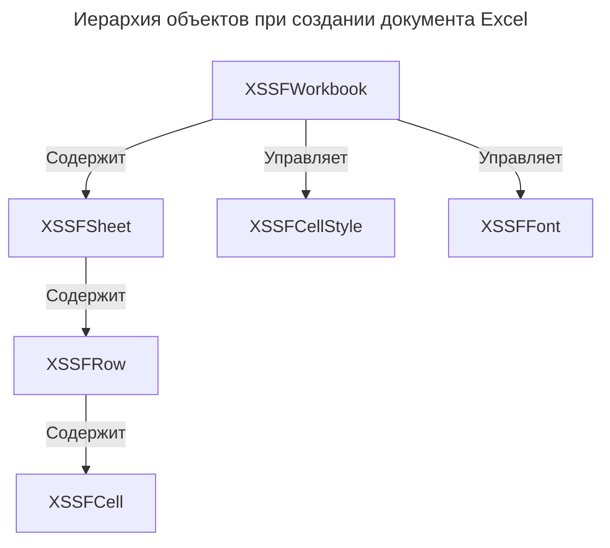

---
aliases:
  - Apache POI
  - XSSFCellStyle
  - XSSFFont
  - XSSFRow
  - XSSFSheet
  - XSSFWorkbook
---
## Назначение класса XSSFWorkbook

Класс `XSSFWorkbook` представляет собой высокоуровневую Java-абстракцию для работы с файлами электронных таблиц Microsoft Excel формата Office Open XML (с расширением `.xlsx`). Он реализует базовый интерфейс `Workbook` и служит главной точкой входа для создания, чтения и модификации книг Excel, а также управления их стилями и свойствами. Префикс `XSSF` в названии означает XML Spreadsheet Format.

## Принадлежность к технологии Apache POI

Данный класс является частью открытого проекта Apache POI, а именно модуля `poi-ooxml`, который отвечает за обработку современных форматов на базе Office Open XML. Apache POI — это стандартная и наиболее мощная Java-библиотека для манипуляции документами пакета Microsoft Office.

## Цели использования технологии

Технология Apache POI необходима для программного создания, чтения и изменения файлов форматов Microsoft Office (Excel, Word, PowerPoint) непосредственно из Java-кода. Она позволяет автоматизировать генерацию отчетов, выгрузку данных в Excel или парсинг загруженных пользователями документов без необходимости установки самого пакета Microsoft Office на сервере.

## Практический пример создания документа

Создание и сохранение простой книги Excel с помощью XSSFWorkbook

```java
import org.apache.poi.xssf.usermodel.XSSFWorkbook;
import org.apache.poi.xssf.usermodel.XSSFSheet;
import org.apache.poi.xssf.usermodel.XSSFRow;
import java.io.FileOutputStream;

try (XSSFWorkbook workbook = new XSSFWorkbook()) {
  XSSFSheet sheet = workbook.createSheet("Отчет");
  XSSFRow row = sheet.createRow(0);
  row.createCell(0).setCellValue("Название");
  row.createCell(1).setCellValue("Значение");
  
  try (FileOutputStream fos = new FileOutputStream("report.xlsx")) {
    workbook.write(fos);
  }
}
```

## Иерархия объектов при работе с книгой

Иерархия объектов при создании документа Excel


