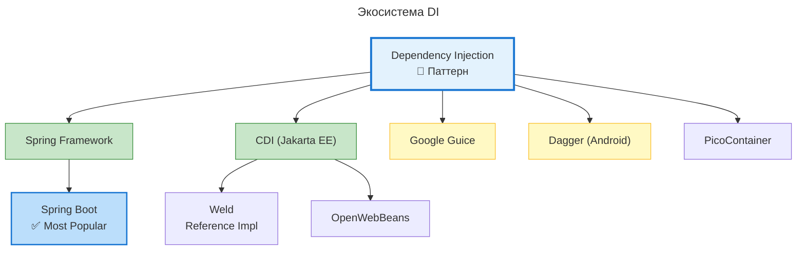

---
aliases:
  - ApplicationContext
  - BeanManager
  - CDI
  - Contexts
  - Contexts and Dependency Injection
  - Dagger
  - Decorators
  - Dependency Injection
  - DI
  - Events
  - Google Guice
  - Hilt
  - Interceptors
  - Jakarta EE
  - Java EE
  - JSR-365
  - OpenWebBeans
  - PicoContainer
  - Producers
  - Qualifiers
  - Scopes
  - Spring
  - Spring Boot
  - Spring DI
  - Spring Framework
  - Weld
  - Внедрение зависимостей
  - Декораторы
  - Интерцепторы
  - Квалификаторы
  - Контексты
  - Производители
  - События
---

## Dependency Injection (DI) vs CDI

**Краткий ответ**

| Термин | Что это | Статус |
|--------|---------|--------|
| **Dependency Injection (DI)** | **Паттерн/принцип** проектирования | ✅ Концепция |
| **CDI (Contexts and Dependency Injection)** | **Java-спецификация** (JSR-365), реализующая DI | ✅ Стандарт Jakarta EE |

> **DI — это ЧТО (концепция).**
> **CDI — это КАК (конкретная реализация/стандарт).**

## Экосистема DI



## Детальное сравнение DI и CDI

| Критерий | **Dependency Injection (DI)** | **CDI** |
|----------|------------------------------|---------|
| **Уровень** | Паттерн проектирования | Java-спецификация (JSR-365) |
| **Что это** | Концепция внедрения зависимостей | Стандарт + реализация DI для Java EE/Jakarta EE |
| **Зависимости** | Нет (это принцип) | `jakarta.enterprise` (ранее `javax.enterprise`) |
| **Реализации** | Spring, Guice, Dagger, CDI | Weld, OpenWebBeans |
| **Контексты** | Зависит от реализации | ✅ Встроенные (Request, Session, Application, etc.) |
| **События (Events)** | Зависит от реализации | ✅ Встроенная система событий |
| **Интерцепторы** | Зависит от реализации | ✅ Встроенные (`@Interceptor`) |
| **Декораторы** | Зависит от реализации | ✅ Встроенные (`@Decorator`) |
| **Qualifiers** | Зависит от реализации | ✅ Встроенные (`@Qualifier`) |
| **Производители** | Зависит от реализации | ✅ Встроенные (`@Produces`) |
| **Scope** | Зависит от реализации | ✅ Стандартные (`@Singleton`, `@RequestScoped`, etc.) |

## Пример кода: одно и то же по-разному

### Чистый DI (принцип)

```java
// ✅ DI как принцип — просто внедрение через конструктор
public class LicenseResolver {
    private final ObjectMapper objectMapper;

    // Зависимость внедряется извне
    public LicenseResolver(ObjectMapper objectMapper) {
        this.objectMapper = objectMapper;
    }
}

// Кто-то снаружи создаёт и передаёт зависимость
ObjectMapper mapper = new ObjectMapper();
LicenseResolver resolver = new LicenseResolver(mapper);  // ✅ DI вручную
```

### Spring DI (реализация DI)

```java
// ✅ Spring реализует DI через аннотации
@Component
public class LicenseResolver {

    private final ObjectMapper objectMapper;

    @Autowired  // Spring внедряет зависимость
    public LicenseResolver(ObjectMapper objectMapper) {
        this.objectMapper = objectMapper;
    }
}

// Контейнер создаёт и управляет
ApplicationContext ctx = new AnnotationConfigApplicationContext();
LicenseResolver resolver = ctx.getBean(LicenseResolver.class);
```

### CDI (спецификация и реализация)

```java
// ✅ CDI — стандарт Jakarta EE
@ApplicationScoped  // CDI scope
public class LicenseResolver {

    @Inject  // CDI внедрение (стандартное)
    private ObjectMapper objectMapper;

    // CDI также поддерживает конструктор
    @Inject
    public LicenseResolver(ObjectMapper objectMapper) {
        this.objectMapper = objectMapper;
    }
}

// CDI контейнер управляет
@ApplicationScoped
public class LicenseService {

    @Inject  // CDI внедряет LicenseResolver
    private LicenseResolver resolver;

    public void check() {
        resolver.resolve("MIT");
    }
}
```

## Ключевые особенности CDI

### Контексты

```java
@Singleton        // Один экземпляр на приложение
@ApplicationScoped // Один экземпляр на приложение
@RequestScoped    // Один экземпляр на HTTP-запрос
@SessionScoped    // Один экземпляр на сессию
@ConversationScoped // Один экземпляр на разговор (несколько запросов)
@Dependent        // Новый экземпляр каждый раз
```

### Qualifiers (квалификаторы)

```java
// ✅ CDI позволяет различать реализации через квалификаторы
@Qualifier
@Retention(RUNTIME)
@Target({TYPE, METHOD, FIELD, PARAMETER})
public @interface Production {}

@Production
public class ProductionLicenseService implements LicenseService { ... }

@Inject
@Production  // Внедряем конкретную реализацию
private LicenseService licenseService;
```

### Производители (Producers)

```java
// ✅ CDI позволяет создавать объекты программно
public class ObjectMapperProducer {

    @Produces
    @Singleton
    public ObjectMapper createObjectMapper() {
        ObjectMapper mapper = new ObjectMapper();
        mapper.configure(DeserializationFeature.FAIL_ON_UNKNOWN_PROPERTIES, false);
        return mapper;
    }
}
```

### События (Events)

```java
// ✅ CDI имеет встроенную систему событий
@Inject
private Event<LicenseCheckedEvent> licenseEvent;

public void checkLicense(String name) {
    // ...
    licenseEvent.fire(new LicenseCheckedEvent(name));  // Публикация события
}

// Подписчик на событие
public class LicenseAudit {
    public void onLicenseChecked(@Observes LicenseCheckedEvent event) {
        log.info("License checked: {}", event.getName());
    }
}
```

### Интерцепторы (Interceptors)

```java
// ✅ CDI интерцепторы для кросс-забот
@Interceptor
@Logging
public class LoggingInterceptor {

    @AroundInvoke
    public Object log(InvocationContext ctx) throws Exception {
        log.info("Calling: {}", ctx.getMethod().getName());
        return ctx.proceed();
    }
}
```

## Когда что использовать

| Сценарий | Рекомендация | Почему |
|----------|--------------|--------|
| **Spring Boot приложение** | ✅ Spring DI | Интеграция, экосистема, простота |
| **Jakarta EE / Java EE** | ✅ CDI | Стандарт платформы, встроенные контексты |
| **Микросервисы (Quarkus)** | ✅ CDI | Quarkus использует CDI как стандарт |
| **Микросервисы (Spring Cloud)** | ✅ Spring DI | Интеграция с Spring экосистемой |
| **Android приложение** | ✅ Dagger/Hilt | Оптимизировано для mobile |
| **Библиотека для других** | ⚠️ Чистый DI (без контейнера) | Не навязывать фреймворк |
| **Тесты** | ✅ Чистый DI | Легко передавать моки в конструктор |

## Миграция: Spring DI ↔ CDI

| Spring DI | CDI (Jakarta EE) |
|-----------|------------------|
| `@Component` | `@Named` / `@ApplicationScoped` |
| `@Autowired` | `@Inject` |
| `@Qualifier` | `@Qualifier` (своя аннотация) |
| `@Scope` | `@RequestScoped`, `@SessionScoped`, etc. |
| `@Bean` | `@Produces` |
| `ApplicationContext` | `BeanManager` |
| `@EventListener` | `@Observes` |
| `@Aspect` | `@Interceptor` |

> 💡 **Совет:** Не путайте **концепцию** (DI) с **реализацией** (CDI, Spring). Понимание DI как принципа важно независимо от фреймворка.
