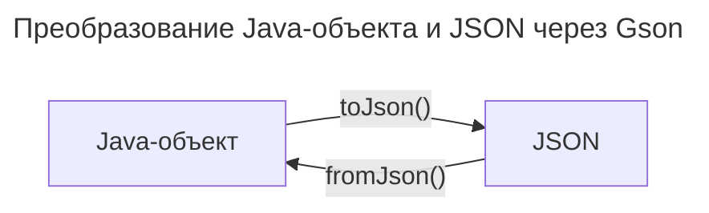

---
aliases:
  - Deserialization
  - fromJson
  - Gson
  - JSON
  - Serialization
  - toJson
  - TypeToken
  - Десериализация
  - Сериализация
---

## Gson

Gson — библиотека Google для преобразования Java‑объектов в JSON (сериализация) и обратного преобразования (десериализация).

**Преобразование данных**


## Подключение зависимости

Импорт: `import com.google.code.gson;`

**Зависимость Maven**

```xml
<!-- https://mvnrepository.com/artifact/com.google.code.gson/gson -->
<dependency>
  <groupId>com.google.code.gson</groupId>
  <artifactId>gson</artifactId>
  <version>2.10.1</version>
</dependency>
```

## toJson() — сериализация в JSON

Сериализация объекта в строку и запись в файл:

```java
Gson gson = new Gson();
String json = gson.toJson(obj);
System.out.println(json);

String fileName = System.getProperty("user.dir") + "\\emailValidatorFSM.json";
FileWriter fw = null;
try {
    fw = new FileWriter(fileName);
    BufferedWriter bw = new BufferedWriter(fw);
    gson.toJson(obj, bw);
    bw.flush();
} catch (IOException e) {
    e.printStackTrace();
} finally {
    try {
        if (fw != null) {
            fw.close();
        }
    } catch (IOException e) {
        e.printStackTrace();
    }
}
```

### PrettyPrint — форматированный вывод

```java
// pretty print
Gson gson = new GsonBuilder().setPrettyPrinting().create();
String json = gson.toJson(obj);
```

## fromJson() — десериализация из JSON

Чтение объекта и массива из JSON-файла:

```java
// простой случай
StateTransitionSet obj = (new Gson()).fromJson(new FileReader(fileName), StateTransitionSet.class);

// сложный случай
Gson gson = new Gson();
Type listType = new TypeToken<State[]>() {}.getType();
State[] obj = gson.fromJson(new FileReader(fileName), listType);
```

## TypeToken — десериализация обобщённых типов

`import com.google.gson.reflect.TypeToken;`

TypeToken — класс из библиотеки Gson, который служит для десериализации JSON‑текста в Java‑объекты обобщённых типов.

```java
Type type = new TypeToken<HashMap<LEXEM, String>>() {
}.getType();
HashMap<LEXEM, String> (new Gson()).fromJson(new FileReader(CONFIG_FILEPATH), type);
```
