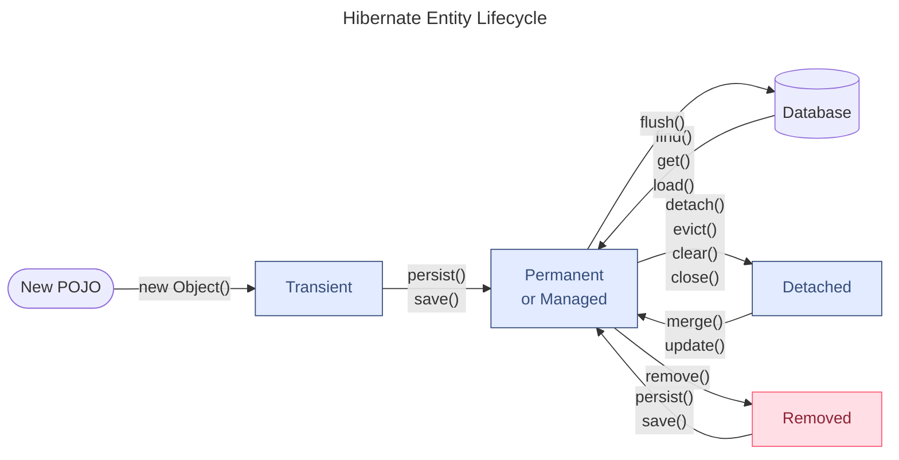
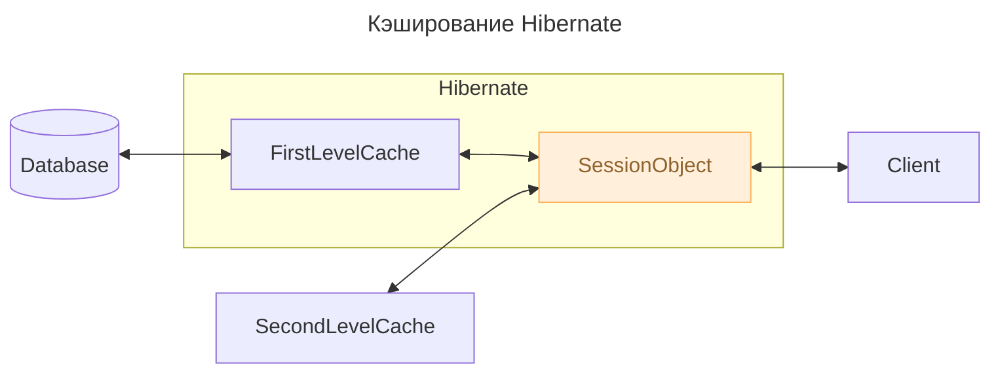

---
aliases:
  - Criteria API
  - First Level Cache
  - First-Level Cache
  - Hibernate
  - Hibernate caching
  - HQL
  - Java Persistence API
  - JPA
  - LazyInitializationException
  - n+1
  - N+1
  - N+1 problem
  - Query Cache
  - Second Level Cache
  - Second-Level Cache
  - Session
  - Кэш второго уровня
  - Кэш запросов
  - Кэш первого уровня
  - Кэширование Hibernate
  - Проблема N+1
---

## Hibernate

Hibernate — реализация API [[java-persistence-api]].

## JPA Entity Graph

Основная цель JPA Entity Graph — улучшить производительность в рантайме при загрузке базовых полей сущности и связанных сущностей и коллекций. Вкратце, Hibernate загружает весь граф в одном SELECT‑запросе, то есть все указанные связи от нужной сущности.
Он позволяет определить шаблон путём группировки связанных полей, которые нужно получить, и выбрать тип графа во время выполнения.

### @NamedEntityGraph

Аннотация `@NamedEntityGraph` задаёт атрибуты, которые нужно включить при загрузке сущности и связанных ассоциаций.

```java
@NamedEntityGraph(
  name = "post-entity-graph-with-comment-users",
  attributeNodes = {
    @NamedAttributeNode("subject"),
    @NamedAttributeNode("user"),
    @NamedAttributeNode(value = "comments", subgraph = "comments-subgraph"),
  },
  subgraphs = {
    @NamedSubgraph(
      name = "comments-subgraph",
      attributeNodes = {
        @NamedAttributeNode("user")
      }
    )
  }
)
@Entity
public class Post {

    @OneToMany(mappedBy = "post")
    private List<Comment> comments = new ArrayList<>();
    //...
}
```

### @NamedSubgraph

`@NamedSubgraph` позволяет указать атрибуты, которые нужно выгружать из дочерней сущности. Таким образом, можно построить полный граф.

- Описание EntityGraph-ов можно произвести также на JPA API:

```java
EntityGraph<Post> entityGraph = entityManager.createEntityGraph(Post.class);
entityGraph.addAttributeNodes("subject");
entityGraph.addAttributeNodes("user");
entityGraph.addSubgraph("comments")
  .addAttributeNodes("user");
```

- Описание EntityGraph-ов можно произвести также на XML.

## Проблема N+1 в JPA и Hibernate

Проблема N+1 в SQL состоит в неоптимальной конфигурации NativeQuery-запросов, когда требуется приобщить к данным информацию из иерархически более высокой таблицы. Неопытный разработчик может начать опрашивать иерархически более высокую таблицу по FOREIGN_KEY в полученной выборке.

- Решается проблема простым INNER JOIN-ом:

```java
List<Tuple> comments = entityManager.createNativeQuery("""
    SELECT
        pc.id AS id,
        pc.review AS review,
        p.title AS postTitle
    FROM post_comment pc
    JOIN post p ON pc.post_id = p.id
    """, Tuple.class)
.getResultList();
```

Для того чтобы обойти эту проблему в Hibernate, в зависимости от ситуации, используются методы:

- **`JOIN FETCH`** — HQL-запрос, который позволит в 1 запрос прочитать сущность со всеми связями при `@ManyToMany`
- **`FetchType.LAZY`** — параметр нотации связей для поля (внутри нотации `@OneToMany()`, etc)
- `@LazyCollection(LazyCollectionOption.TRUE)`
- `@LazyCollection(LazyCollectionOption.EXTRA)`
  - часто может выступать как оптимальный вариант для `@ManyToMany`-связи
  - может провоцировать N+1 проблему, если обходить в цикле значения полученной коллекции

## Hibernate ORM

Hibernate Framework — это фреймворк для языка Java, предназначенный для работы с базами данных. Он реализует объектно-реляционную модель — технологию, которая «соединяет» программные сущности и соответствующие записи в базе.

Hibernate построен на спецификации JPA 2.1 — наборе правил, который описывает взаимодействие программных объектов с записями в базах данных. JPA поясняет, как управлять сохранением данных из кода на Java в базу. Но сама по себе спецификация — только теоретические правила, а в «чистой» Java её реализации нет. Hibernate — одна из самых популярных реализаций JPA на рынке.

Главная функция Hibernate заключается в том, чтобы взять значения из Java-класса и отобразить их в таблице базы данных. С помощью конфигурации указывается, как извлечь данные из класса и соединить их с определёнными столбцами в таблице БД.

### Отслеживание SQL-операций Hibernate в логе

- Можно вызвать метод `LOGGER.info` относительно коллекции, возвращённой запросом:

```java
List<PostComment> comments = entityManager.createQuery("""
    select pc
    from PostComment pc
    join fetch pc.post p
    """, PostComment.class)
.getResultList();

for (PostComment comment : comments) {
    LOGGER.info(
        "The Post '{}' got this review '{}'",
        comment.getPost().getTitle(),
        comment.getReview()
    );
}
```

- В терминале будет видно:

```java
SELECT p.id AS id1_0_0_, p.title AS title2_0_0_ FROM post p WHERE p.id = 1
-- The Post 'High-Performance Java Persistence - Part 1' got this review
-- 'Excellent book to understand Java Persistence'

SELECT p.id AS id1_0_0_, p.title AS title2_0_0_ FROM post p WHERE p.id = 2
-- The Post 'High-Performance Java Persistence - Part 2' got this review
-- 'Must-read for Java developers'

SELECT p.id AS id1_0_0_, p.title AS title2_0_0_ FROM post p WHERE p.id = 3
-- The Post 'High-Performance Java Persistence - Part 3' got this review
-- 'Five Stars'

SELECT p.id AS id1_0_0_, p.title AS title2_0_0_ FROM post p WHERE p.id = 4
-- The Post 'High-Performance Java Persistence - Part 4' got this review
-- 'A great reference book'
```

## Hibernate Entity Lifecycle

Каждая `Entity` всегда находится в одном из 4 состояний: Transient → Persistent (Managed) → Detached → Removed.



- `evict()` — изгнать

### Transient

Это объект, который создан вручную как POJO, а не загружен из базы. Особенность объекта в том, что Hibernate не учитывает этот объект, и действия с объектом не влияют на Hibernate.

```java
EmployeeEntity employee = new EmployeeEntity();
```

### Persistent (Managed)

Самый распространённый случай — объекты, связанные с движком Hibernate. Для того чтобы перевести объект в это состояние, нужно загрузить объект из Hibernate или сохранить объект в Hibernate.

```java
Employee employee = session.load(Employee.class, 1);
// OR
Employee employee = new Employee();
session.save(employee);
```

### Detached

Состояние, в котором находится объект, когда он был отключён от сессии, когда транзакция закрыта.

```java
session.close();
session.evict(entity);
```

### Removed

Состояние, когда объект удалён из базы, но остался в Java.

```java
Employee employee = session.load(Employee.class, 1);
//после загрузки у объекта состояние Persisted
session.remove(employee);
//после удаления у объекта состояние Removed
session.save(employee);
//а теперь снова Persisted
session.close();
//а теперь состояние Detached
```

## Сессия Hibernate

Сессия используется для получения физического соединения с базой данных (далее — БД). Сессию создают (открывают сессию) каждый раз, когда возникает необходимость, а потом, когда необходимо, уничтожают (закрывают сессию).

- Сессии создаются при необходимости, а затем уничтожаются, потому что они не являются потокобезопасными и не должны быть открыты в течение длительного времени.

```java
Session session = sessionFactory.openSession();
Transaction transaction = null;
try {
    transaction = session.beginTransaction();
    // Here we make some work.
    transaction.commit();
} catch (Exception e) {
    if (transaction != null) {
        transaction.rollback();
        e.printStackTrace();
    }
    e.printStackTrace();
} finally {
    session.close();
}
```

- Основные методы:

```java
Transaction beginTransaction()
//Начинает транзакцию и возвращает объект Transaction.

void cancelQuery()
//Отменяет выполнение текущего запроса.

void clear()
//Полностью очищает сессию.

Connection close()
//Заканчивает сессию, освобождает JDBC-соединение и выполняет очистку.

Criteria createCriteria(String entityName)
//Создание нового экземпляра Criteria для объекта с указанным именем.

Criteria createCriteria(Class persistentClass)
//Создание нового экземпляра Criteria для указанного класса.

Serializable getIdentifier(Object object)
//Возвращает идентификатор данной сущности как сущности, связанной с данной сессией.

void update(String entityName, Object object)
void update(Object object)
//Обновляет экземпляр с идентификатором, указанным в аргументе.

void saveOrUpdate(Object object)
//Сохраняет или обновляет указанный экземпляр.

Serializable save(Object object)
//Сохраняет экземпляр, предварительно назначив сгенерированный идентификатор.

boolean isOpen()
//Проверяет, открыта ли сессия.

boolean isDirty()
//Проверяет, есть ли в данной сессии какие-либо изменения, которые должны быть синхронизированы с базой данных (далее — БД).

boolean isConnected()
//Проверяет, подключена ли сессия в данный момент.

Transaction getTransaction()
//Получает связанную с этой сессией транзакцию.

void refresh(Object object)
//Обновляет состояние экземпляра из БД.

SessionFactory getSessionFactory()
//Возвращает фабрику сессий (SessionFactory), которая создала данную сессию.

Session get(String entityName, Serializable id)
//Возвращает сохранённый экземпляр с указанными именем сущности и идентификатором. Если таких сохранённых экземпляров нет — возвращает null.

void delete(String entityName, Object object)
//Удаляет сохранённый экземпляр из БД.

void delete(Object object)
//Удаляет сохранённый экземпляр из БД.

SQLQuery createSQLQuery(String queryString)
//Создаёт новый экземпляр SQL-запроса (SQLQuery) для данной SQL-строки.

Query createQuery(String queryString)
//Создаёт новый экземпляр запроса (Query) для данной HQL-строки.

Query createFilter(Object collection, String queryString)
//Создаёт новый экземпляр запроса (Query) для данной коллекции и фильтр-строки.
```

Экземпляр сессии может находиться в одном из трёх состояний:

**Transient**

Это новый экземпляр устойчивого класса, который не привязан к сессии и ещё не представлен в БД. Он не имеет значения, по которому может быть идентифицирован.

**Persistent**

Можно создать переходный экземпляр класса, связав его с сессией. Устойчивый экземпляр класса представлен в БД, а значение идентификатора связано с сессией.

**Detached**

После того как сессия закрыта, экземпляр класса становится отдельным, независимым экземпляром класса.

## Основные аннотации Hibernate JPA

### @Entity

Эта аннотация указывает Hibernate, что данный класс является сущностью (entity bean). Такой класс должен иметь конструктор по умолчанию (пустой конструктор).

```java
@Entity
@Table(name = "HIBERNATE_DEVELOPERS")
public class Developer {
    @Id
    @GeneratedValue(strategy = GenerationType.AUTO)
    @Column(name = "id")
    private int id;
    @Column(name = "FIRST_NAME")
    private String firstName;
    @Column(name = "LAST_NAME")
    private String lastName;
    @Column(name = "SPECIALTY")
    private String specialty;
    @Column(name = "EXPERIENCE")
    private int experience;

    // Default Constructor
    public Developer() {
    }
}
```

### @Table

С помощью этой аннотации Hibernate связывает (map) данный класс с конкретной таблицей. Аннотация @Table имеет различные атрибуты, с помощью которых можно указать имя таблицы, каталог, БД и уникальность столбцов в таблице БД.

```java
@Table(name = "CUST", schema = "RECORDS")
```

### @Id

С помощью аннотации @Id указывается первичный ключ (Primary Key) данного класса.

### @GeneratedValue

Эта аннотация используется вместе с аннотацией @Id и определяет такие параметры, как `strategy` и `generator`.

### @Column

Аннотация @Column определяет, к какому столбцу в таблице БД относится конкретное поле (атрибут) класса.

Наиболее часто используемые атрибуты аннотации @Column: **name**, **unique**, **nullable**, **length**.

### @OrderBy

Указание сортировки. В примере множество кошек будет отсортировано по имени по возрастанию.

```java
@Table(name = "cat_table")
public class Cat implements Serializable {

    @OrderBy("firstName asc")
    private Set catsSet;
    ...
}
```

### @Transient

Указывает, что свойство не нужно записывать. Значения под этой аннотацией не записываются в базу данных (также не участвуют в сериализации). static и final переменные экземпляра всегда transient.

```java
@Entity
@Table(name = "cat_table")
public class Cat implements Serializable {

    @Transient
    public boolean isNew() {
        return id == null;
    }

    ...
}
```

### @Temporal

Применяется к полям или свойствам с типом java.util.Date и java.util.Calendar. Например, если в БД время сохраняется как sql.Date, то чтобы использовать дату из java.util.Date, указывается эта аннотация.

```java
public class Cat implements Serializable {

    private java.util.Date birthDate; // in DB schema uses sql.Date in column BIRTH_DATE.

    @Temporal(TemporalType.DATE)
    @Column(name = "BIRTH_DATE")
    public Date getBirthDate() {
        return this.birthDate;
    }
    ...
}
```

### @Embeddable, @Embedded

Определяет класс, экземпляры которого хранятся как неотъемлемая часть исходного объекта. Каждый из @Embedded экземпляров сопоставляется с таблицей базы данных сущности.

```java
@Embeddable public class Address {
    protected String street;
    protected String city;
    protected String state;
    @Embedded protected Zipcode zipcode;
}

@Embeddable public class Zipcode {
    protected String zip;
    protected String plusFour;
}
```

### Аннотации связей — @OneToMany, @JoinColumn и другие

- `@OneToOne(orphanRemoval, mappedBy, cascade)`
  - `CascadeType.ALL` — означает, что операция, например запись, должна распространяться и на дочерние таблицы.
  - `mappedBy` — обратная сторона связи сущности. Связана с `@JoinColumn`.
  - `orphanRemoval` — позволяет удалять объекты-сироты. При удалении родительского объекта удаляется и дочерний.
- `@OneToMany` — указывает на связь «один ко многим». Применяется с другой стороны от сущности с `@ManyToOne`.

```java
@Entity
public class Troop {
    @OneToMany(mappedBy = "troop")
    public Set<Soldier> getSoldiers() {
    ...
}

@Entity
public class Soldier {
    @ManyToOne
    @JoinColumn(name = "troop_fk")
    public Troop getTroop() {
    ...
}
```

- `@JoinColumn` — применяется, когда внешний ключ находится в одной из сущностей. Может применяться с обеих сторон взаимосвязи.

```java
@Entity
@Table(name = "contactDetail")
public class ContactDetail implements Serializable {

    @Id
    @Column(name = "id")
    @GeneratedValue
    private int id;

    @OneToOne
    @MapsId
    @JoinColumn(name = "contactId")
    private Contact contact;

    ...
}

@Entity
@Table(name = "contact")
public class Contact implements Serializable {

    @Id
    @Column(name = "ID")
    @GeneratedValue
    private Integer id;

    @OneToOne(mappedBy = "contact", cascade = CascadeType.ALL)
    private ContactDetail contactDetail;

    ...
}
```

- `@PrimaryKeyJoinColumn` — главный ключ для ассоциированной сущности с таким же ключом
- `@ManyToMany`

```java
@Entity
@Table(name = "contact")
public class Contact implements Serializable {

    private Set<Hobby> hobbies = new HashSet<Hobby>();
    //...
    @ManyToMany
    @JoinTable(name = "contact_hobby_detail",
            joinColumns = @JoinColumn(name = "CONTACT_ID"),
            inverseJoinColumns = @JoinColumn(name = "HOBBY_ID"))
    public Set<Hobby> getHobbies() {
        return this.hobbies;
    }
    ...
}

@Entity
@Table(name = "hobby")
public class Hobby implements Serializable {

    private Set<Contact> contacts = new HashSet<Contact>();
    //...

    @ManyToMany
    @JoinTable(name = "contact_hobby_detail",
            joinColumns = @JoinColumn(name = "HOBBY_ID"),
            inverseJoinColumns = @JoinColumn(name = "CONTACT_ID"))
    public Set<Contact> getContacts() {
        return this.contacts;
    }
}
```

### FetchType: EAGER vs LAZY — стратегии загрузки

Параметр `FetchType` описывает стратегию загрузки полей сущности из родительского объекта в реляционной структуре.

> fetch — извлечь
> eager — жаждущий
> lazy — ленивый

```java
@OneToMany(fetch = FetchType.LAZY, mappedBy = "user")
```

- **FetchType.EAGER** — при загрузке родительской сущности будут загружены и все её дочерние сущности. Кроме того, Hibernate постарается сделать это одним SQL-запросом, сгенерировав здоровенный запрос и сразу получив все данные.
  - Hibernate устанавливает EAGER по умолчанию для связей `@OneToOne` и `@ManyToOne`.
- **FetchType.LAZY** — при загрузке родительской сущности дочерняя сущность загружена не будет. Вместо неё будет создан proxy-объект.
  - Hibernate устанавливает LAZY по умолчанию для связей `@OneToMany` и `@ManyToMany`.

### @LazyCollection(LazyCollectionOption.TRUE)

Нотация указывается при маппинге полей.

```java
@Entity
@Table(name = "user")
class User {
    @Column(name = "id")
    public Integer id;

    @OneToMany(cascade = CascadeType.ALL)
    @LazyCollection(LazyCollectionOption.TRUE)
    @OrderColumn(name = "order_id")
    public List<Comment> comments;
}
```

- `LazyCollectionOption.TRUE` — аналогично `FetchType.LAZY`
- `LazyCollectionOption.FALSE` — аналогично `FetchType.EAGER`
- `LazyCollectionOption.EXTRA` — позволяет адресно загружать данные из подчинённой таблицы, если задан `@OrderColumn(name = "order_id")`

```java
User user = session.load(User.class, 1);
List<Comment> comments = user.getComments();
int count = comments.size();
Comment comment = comments.get(3);
```

Максимальная эффективность достигается на `@ManyToMany`-связях.

```java
@Entity
@Table(name = "employee")
class Employee {
    @Column(name = "id")
    public Integer id;

    @ManyToMany(cascade = CascadeType.ALL)
    @JoinTable(name = "employee_task",
            joinColumns = @JoinColumn(name = "employee_id", referencedColumnName = "id"),
            inverseJoinColumns = @JoinColumn(name = "task_id", referencedColumnName = "id"))
    @LazyCollection(LazyCollectionOption.EXTRA)
    private Set<EmployeeTask> tasks = new HashSet<EmployeeTask>();
}
// ...
@Entity
@Table(name = "task")
class EmployeeTask {
    @Column(name = "id")
    public Integer id;

    @ManyToMany(cascade = CascadeType.ALL)
    @JoinTable(name = "employee_task",
            joinColumns = @JoinColumn(name = "task_id", referencedColumnName = "id"),
            inverseJoinColumns = @JoinColumn(name = "employee_id", referencedColumnName = "id"))
    @LazyCollection(LazyCollectionOption.EXTRA)
    private Set<Employee> employees = new HashSet<Employee>();
}
// ...
Employee director = session.find(Employee.class, 4);
EmployeeTask task = session.find(EmployeeTask.class, 101);
task.employees.add(director);

session.update(task);
session.flush();

/*
⇒ в таблицу employee_task будет добавлена запись
   (4, 101) → (employee_id task_id)
   без всяких чтений коллекций
*/
```

Порождает N+1 проблему при чтении в цикле.

```java
User user = session.load(User.class, 1);
List<Comment> comments = user.getComments();
for (Comment comment : comments) {
    System.out.println(comment);
}
```

### Аннотации запросов

- `@NamedQueries` — список именованных запросов. Внутри указывается список именованных запросов.
  - `@NamedQuery` — имя именованного запроса и сам запрос.

```java
@NamedQueries({
        @NamedQuery(
                name = "getContactsQuery",
                query = "from ContactEntity ce where ce.id >= :insertId"
        )
})
@Entity
@Table(name = "contact", schema = "", catalog = "javastudy")
public class ContactEntity {...}

Session session = HibernateSessionFactory.getSessionFactory().openSession();
Transaction tx = session.beginTransaction();
Query query = session.getNamedQuery("getContactsQuery").setString("insertId", "10");
List contactEntity = query.list();
tx.commit();
session.close();
```

- `@SqlResultSetMapping` — куда будет собран результат:
  - `@EntityResult` — указание сущности, в которой будет сконструирован результат.

```java
@SqlResultSetMapping(
        name = "nativeSqlResult",
        entities = @EntityResult(entityClass = ContactEntity.class)
)
public class ContactEntity {...}

public List<ContactEntity> findAllByNativeQuery2() {
    return em.createNativeQuery(ALL_CONTACT_NATIVE_QUERY, "nativeSqlResult").getResultList();
}
```

## HQL — Hibernate Query Language

Отличие между HQL и SQL состоит в том, что SQL работает с таблицами в базе данных (далее — БД) и их столбцами, а HQL — с сохраняемыми объектами (Persistent Objects) и их полями (атрибутами класса).

- FROM

```java
Query query = session.createQuery("FROM Developer");
List developers = query.list();
```

- INSERT

```java
Query query = session.createQuery("INSERT INTO Developer (firstName, lastName, specialty, experience)");
```

- UPDATE

```java
Query query = session.createQuery("UPDATE Developer SET experience = :experience WHERE id = :developerId");
query.setParameter("experience", 3);
```

- SELECT

```java
Query query = session.createQuery("SELECT D.lastName FROM Developer D");
List developers = query.list();
```

### Методы агрегации

Язык запросов Hibernate (HQL) поддерживает различные методы агрегации, доступные и в SQL:

- min(имя свойства)
- max(имя свойства)
- sum(имя свойства)
- avg(имя свойства)
- count(имя свойства)

### Criteria API

Hibernate поддерживает различные способы манипулирования объектами и транслирования их в таблицы баз данных (далее — БД). Одним из таких способов является Criteria API, который позволяет создавать запросы с критериями программным методом.

Для создания Criteria используется метод createCriteria() интерфейса Session. Этот метод возвращает экземпляр сохраняемого класса (persistent class) в результате его выполнения.

```java
Criteria criteria = session.createCriteria(Developer.class);
List developers = criteria.list();
// -----
public void listDevelopersOverThreeYears() {
    Session session = sessionFactory.openSession();
    Transaction transaction = null;
    transaction = session.beginTransaction();
    Criteria criteria = session.createCriteria(Developer.class);
    criteria.add(Restrictions.gt("experience", 3));
    List developers = criteria.list();
    for (Developer developer : developers) {
        System.out.println("=======================");
        System.out.println(developer);
        System.out.println("=======================");
    }
    transaction.commit();
    session.close();
}
```

### Пагинация результатов Criteria

```java
public Criteria setFirstResult(int firstResult)
//Этот метод указывает первый ряд результата, который начинается с 0.

public Criteria setMaxResults(int maxResults)
//Этот метод ограничивает максимальное количество объектов, которое Hibernate сможет получить в результате запроса.
```

### JOIN FETCH запросы

Требуется объяснить Hibernate, что нужно сразу загрузить все дочерние объекты для родительских объектов.

## Кэширование Hibernate



Для того чтобы кэширование стало доступным для приложения, нужно активировать его следующим образом:

```java
Session session = sessionFactory.openSession();
Query query = session.createQuery("FROM HIBERNATE_DEVELOPERS");
query.setCacheable(true);
query.setCacheRegion("developer");
List developers = query.list();
sessionFactory.close();
```

### Кэш первого уровня — First Level Cache

Кэш первого уровня — это кэш Сессии (Session), который является обязательным. Через него проходят все запросы. Перед тем как отправить объект в БД, сессия хранит объект за счёт своих ресурсов.

Если выполняется несколько обновлений объекта, Hibernate старается отсрочить (насколько это возможно) обновление, чтобы сократить количество выполненных запросов. Если закрыть сессию, то все объекты, находящиеся в кэше, теряются, а далее — либо сохраняются, либо обновляются.

### Кэш второго уровня — Second Level Cache

Кэш второго уровня является необязательным (опциональным). Изначально Hibernate будет искать необходимый объект в кэше первого уровня. В основном кэширование второго уровня отвечает за кэширование объектов.

### Кэш запросов — Query Cache

В Hibernate предусмотрен кэш для запросов, и он интегрирован с кэшем второго уровня. Это требует двух дополнительных физических мест для хранения: кэшированных запросов и временных меток для обновления таблицы БД. Этот вид кэширования эффективен только для часто используемых запросов с одинаковыми параметрами.

## LazyInitializationException

**Проблема:** возникает, когда происходит обращение к лениво загруженной (FetchType.LAZY) коллекции или полю сущности за пределами сессии (Persistence Context). Сессия (EntityManager) закрывается, а прокси-объект всё ещё не инициализирован — Hibernate не знает, как получить данные из БД без открытой сессии.

**Типичные сценарии:** обращение к коллекции `orders.getItems()` в веб-слое после завершения транзакции в сервисе.

### Решения

#### ✅ Лучшие практики

| Решение | Как работает | Когда применять |
| --- | --- | --- |
| **@Transactional** | Держит сессию открытой на время выполнения метода. | Простой случай, если логика умещается в транзакционном методе. |
| **Open Session in View (OSIV)** | Сессия открывается на время HTTP-запроса. | Удобно для Web, но может держать соединение долго (минусы: лишние SELECT, блокировки). |
| **Fetch join в JPQL** | `SELECT o FROM Order o JOIN FETCH o.items` — подгружает коллекцию сразу. | Когда знаете, что данные понадобятся. |
| **Entity Graph** | `@EntityGraph(attributePaths = {"items"})` — декларативно указываем, что загрузить. | Гибче, чем fetch join, можно переиспользовать. |
| **Hibernate.initialize()** | `Hibernate.initialize(order.getItems())` — принудительная инициализация. | Костыль, но работает. |
| **DTO проекция** | Возвращать DTO с нужными полями, а не всю сущность. | Лучший подход для отделения слоёв и контроля над запросами. |

#### ⚠️ Компромиссное решение (не рекомендуется)

Отключить ленивую загрузку — `FetchType.EAGER` (на всё).

Приводит к избыточным JOIN, падению производительности и N+1 запросам.

### 🎯 Рекомендация

Использовать DTO + явные запросы с JOIN FETCH либо Entity Graph. OSIV в высоконагруженных системах лучше избегать. В простых приложениях допускается `@Transactional` на уровне контроллера, но это размывает границы слоёв.
