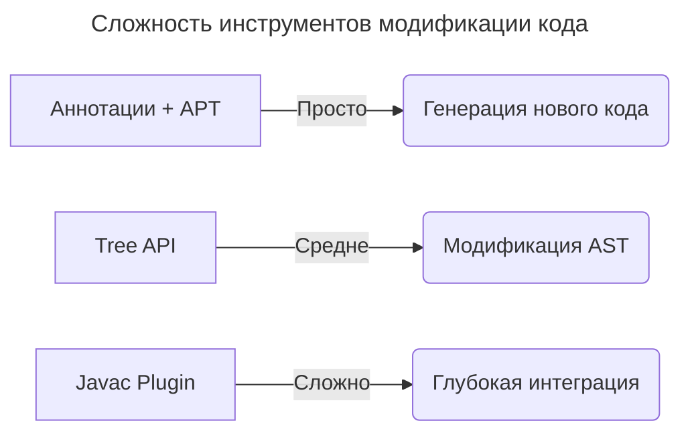

---
aliases:
  - Abstract Syntax Tree
  - Annotation Processing
  - ANTLR
  - APT
  - AST
  - Eclipse JDT
  - Java Compiler Tree API
  - Javac
  - JavacAnnotationProcessor
  - Lombok
  - MapStruct
  - Spoon
  - Абстрактное синтаксическое дерево
  - Обработка аннотаций
---

## Как работает Lombok

**Суть**

Lombok — это библиотека, которая **генерирует [[boilerplate]]-код (геттеры, сеттеры, `toString()`, `equals()` и др.) во время компиляции**, используя **аннотации** и **обработку аннотаций (Annotation Processing)**.

**Пояснение**

Boilerplate-код (от англ. _boilerplate_ — «шаблонный», «стандартный») — это избыточный, шаблонный код, который не несёт уникальной логики, и написание которого можно автоматизировать. Термин пришёл из журналистики, где _boilerplate_ означал готовые текстовые блоки для повторного использования.

**Основные механизмы работы Lombok**

- **Annotation Processing (APT)** — Lombok подключается как аннотационный процессор (`javax.annotation.processing.Processor`) и работает во время компиляции Java-кода. Когда компилятор (javac) встречает аннотацию Lombok (например, `@Getter`), он передаёт управление процессору Lombok. Lombok анализирует [[ast]] (Abstract Syntax Tree) исходного кода и модифицирует его, добавляя новые методы.
- **Модификация AST (Abstract Syntax Tree)** — Lombok не генерирует `.java`-файлы (как, например, делает MapStruct), а изменяет AST напрямую. Скомпилированный `.class`-файл будет содержать сгенерированные методы, но в исходном коде их не будет.
- **Интеграция с IDE** — чтобы IDE (IntelliJ IDEA, Eclipse) «видели» сгенерированные методы, Lombok предоставляет плагины для IDE (Lombok Plugin в IntelliJ) и агент для Eclipse (`lombok.jar` добавляется в `eclipse.ini`).

---

## Пример: превращение @Getter в код

Исходный код:

```java
import lombok.Getter;

@Getter
public class Person {
    private String name;
    private int age;
}
```

После обработки Lombok (в байт-коде `.class`):

```java
public class Person {
    private String name;
    private int age;

    // Сгенерированные геттеры
    public String getName() {
        return this.name;
    }

    public int getAge() {
        return this.age;
    }
}
```

**Важно:** в исходном коде (`Person.java`) геттеров нет, но в скомпилированном классе (`Person.class`) они есть.

---

## Модификация байт-кода

Lombok использует внутренние API компилятора (javac или ECJ для Eclipse):

- Для javac: Lombok подключается через `JavacAnnotationProcessor` и изменяет AST до генерации байт-кода.
- Для Eclipse: используется агент (`lombok.agent`), который модифицирует поведение ECJ-компилятора.

---

## Поддержка в сборщиках

Lombok требует добавления зависимостей в `pom.xml`/`build.gradle` и подключения аннотационного процессора.

Пример для Maven:

```xml
<dependency>
    <groupId>org.projectlombok</groupId>
    <artifactId>lombok</artifactId>
    <version>1.18.30</version>
    <scope>provided</scope> <!-- Не нужен в runtime -->
</dependency>
```

---

## Ограничения Lombok

- **Зависит от внутренних API компилятора** — может сломаться при обновлении Java (например, в Java 16+ потребовались дополнительные настройки из-за ограничений JEP 396).
- **Проблемы с рефлексией** — некоторые библиотеки (например, Hibernate, Jackson) могут не увидеть сгенерированные методы без дополнительных аннотаций (`@Data`, `@Getter`).
- **Несовместимость с некоторыми инструментами** — например, JaCoCo (покрытие кода) может некорректно учитывать сгенерированные методы.

---

## Альтернативы Lombok

| Способ | Описание |
| ------ | -------- |
| **Ручное написание** | Полный контроль, но много boilerplate. |
| **Records (Java 14+)** | Автоматические `equals()`, `hashCode()`, геттеры (`record Person(String name, int age) {}`). |
| **MapStruct** | Генерация кода через APT (создаёт реальные `.java`-файлы). |
| **Immutables** | Генерация неизменяемых классов. |

**Вывод**

Lombok работает через **изменение AST на этапе компиляции**, добавляя методы прямо в байт-код. Это удобно, но требует:

- Подключения плагинов для IDE.
- Осторожности при обновлении Java.
- Понимания, что сгенерированный код существует только в `.class`-файлах.

Вместо Lombok можно использовать **Records** (Java 14+) или **ручное написание** кода.

---

## AST (Abstract Syntax Tree)

**AST** — это древовидное представление структуры исходного кода программы, где:

- **Каждый узел** соответствует определённой языковой конструкции (оператор, выражение, объявление).
- **Листья** — терминальные элементы (имена переменных, литералы).
- **Ветви** — отношения между конструкциями.

**Как формируется AST**

1. Исходный код → **лексер (Tokenizer)** разбивает текст на токены (`int x = 5;` → `int`, `x`, `=`, `5`, `;`).
2. Токены → **парсер (Parser)** строит дерево по правилам языка.

Пример для кода `int x = 5 + 3;`:

- `Declaration (int x)`
  - `Variable(x)`
  - `BinaryExpr(+)`
    - `Literal(5)`
    - `Literal(3)`

**Зачем нужен AST**

- **Анализ кода** — поиск ошибок (статический анализ), подсветка синтаксиса в IDE.
- **Оптимизации** — упрощение выражений (`5 + 3` → `8`).
- **Генерация кода** — трансляция в байт-код (Java) или машинный код (C++).
- **Инструменты** — Lombok (модифицирует AST для генерации геттеров), рефакторинг в IDE.

**Пример AST для Java-метода**

Исходный код:

```java
public int sum(int a, int b) {
    return a + b;
}
```

AST (упрощённо):

- `MethodDeclaration(sum)`
  - `Modifiers(public)`
  - `ReturnType(int)`
  - `Parameters`
    - `Parameter(a, int)`
    - `Parameter(b, int)`
  - `Body`
    - `ReturnStatement`
    - `BinaryExpr(+)`
      - `Variable(a)`
      - `Variable(b)`

**AST vs байт-код vs исходный код**

| Характеристика | Исходный код | AST | Байт-код |
| -------------- | ------------ | --- | -------- |
| **Уровень** | Текст | Структурированное дерево | Бинарный формат JVM |
| **Использование** | Чтение/редактирование | Анализ/трансформация | Выполнение |
| **Пример** | `int x = 5;` | Узел `VariableDeclaration` | `iconst_5; istore_1` |

**Инструменты для работы с AST в Java**

- **Java Compiler Tree API** (встроен в `javac`) — используется Lombok.
- **Eclipse JDT** — парсер AST для Eclipse.
- **ANTLR** — генератор парсеров для любых языков.

Пример через **Eclipse JDT**:

```java
ASTParser parser = ASTParser.newParser(AST.JLS15);
parser.setSource("int x = 5;".toCharArray());
CompilationUnit cu = (CompilationUnit) parser.createAST(null);
// Обход узлов дерева...
```

**Как Lombok использует AST**

Lombok **не генерирует новый код**, а изменяет существующее AST:

1. Находит класс с `@Getter`.
2. Добавляет в AST узлы для геттеров.
3. Компилятор использует модифицированное AST для генерации байт-кода.

Исходный код:

```java
@Getter
public class User {
    private String name;
}
```

AST после Lombok:

- `ClassDeclaration(User)`
  - `FieldDeclaration(name)`
  - `MethodDeclaration(getName)` (добавлено)
    - `ReturnStatement`
    - `FieldAccess(name)`

---

## Изменение AST аннотированного метода

Для изменения AST (Abstract Syntax Tree) аннотированных методов используются следующие подходы:

**Java Compiler Tree API (компилятор javac)**

Это встроенный API для работы с AST на этапе компиляции.

Пример: добавление логирования в аннотированные методы.

```java
import com.sun.source.util.Trees;
import com.sun.tools.javac.api.JavacProcessingEnvironment;
import com.sun.tools.javac.tree.JCTree;
import com.sun.tools.javac.tree.JCTree.JCStatement;
import com.sun.tools.javac.tree.TreeMaker;
import com.sun.tools.javac.util.List;
import com.sun.tools.javac.util.Names;

import javax.annotation.processing.AbstractProcessor;
import javax.annotation.processing.ProcessingEnvironment;
import javax.annotation.processing.RoundEnvironment;
import javax.annotation.processing.SupportedAnnotationTypes;
import javax.annotation.processing.SupportedSourceVersion;
import javax.lang.model.SourceVersion;
import javax.lang.model.element.Element;
import javax.lang.model.element.ElementKind;
import javax.lang.model.element.TypeElement;
import java.util.Set;

@SupportedAnnotationTypes("Loggable")
@SupportedSourceVersion(SourceVersion.RELEASE_11)
public class LoggingProcessor extends AbstractProcessor {

    private Trees trees;
    private TreeMaker maker;
    private Names names;

    @Override
    public void init(ProcessingEnvironment env) {
        super.init(env);
        this.trees = Trees.instance(env);
        JavacProcessingEnvironment jpe = (JavacProcessingEnvironment) env;
        this.maker = TreeMaker.instance(jpe.getContext());
        this.names = Names.instance(jpe.getContext());
    }

    @Override
    public boolean process(Set<? extends TypeElement> annotations, RoundEnvironment roundEnv) {
        for (Element element : roundEnv.getElementsAnnotatedWith(Loggable.class)) {
            if (element.getKind() == ElementKind.METHOD) {
                JCTree.JCMethodDecl methodDecl = (JCTree.JCMethodDecl) trees.getTree(element);

                // Добавляем вызов System.out.println в начало тела метода
                JCStatement logBefore = maker.Exec(
                    maker.Apply(
                        List.nil(),
                        maker.Select(
                            maker.Select(
                                maker.Ident(names.fromString("System")),
                                names.fromString("out")
                            ),
                            names.fromString("println")
                        ),
                        List.of(maker.Literal("Начало метода " + methodDecl.name))
                    )
                );

                JCTree.JCBlock newBody = maker.Block(
                    0,
                    List.of(logBefore).appendList(methodDecl.body.stats)
                );
                methodDecl.body = newBody;
            }
        }
        return true;
    }
}
```

**Eclipse JDT Core**

Альтернатива для работы с AST вне компилятора javac.

Пример: добавление проверки null для параметров.

```java
import org.eclipse.jdt.core.dom.*;
import org.eclipse.jdt.core.dom.rewrite.ASTRewrite;
import org.eclipse.jface.text.Document;
import org.eclipse.text.edits.TextEdit;

import java.util.List;

public class NullCheckModifier {

    public static String modifyMethod(String sourceCode) {
        ASTParser parser = ASTParser.newParser(AST.JLS15);
        parser.setSource(sourceCode.toCharArray());
        CompilationUnit cu = (CompilationUnit) parser.createAST(null);

        cu.accept(new ASTVisitor() {
            @Override
            public boolean visit(MethodDeclaration node) {
                if (node.getAnnotation("NotNullParams") != null) {
                    Block newBody = (Block) ASTNode.copySubtree(node.getAST(), node.getBody());

                    for (SingleVariableDeclaration param : (List<SingleVariableDeclaration>) node.parameters()) {
                        IfStatement nullCheck = node.getAST().newIfStatement();
                        nullCheck.setExpression(
                            node.getAST().newInfixExpression(
                                Expression.Operator.EQUALS,
                                node.getAST().newSimpleName(param.getName().getIdentifier()),
                                node.getAST().newNullLiteral()
                            )
                        );
                        nullCheck.setThenStatement(
                            node.getAST().newThrowStatement(
                                node.getAST().newClassInstanceCreation(
                                    node.getAST().newSimpleType(
                                        node.getAST().newSimpleName("IllegalArgumentException")
                                    ),
                                    List.of(
                                        node.getAST().newStringLiteral(
                                            "Параметр '" + param.getName() + "' не может быть null"
                                        )
                                    )
                                )
                            )
                        );
                        newBody.statements().add(0, nullCheck);
                    }

                    node.setBody(newBody);
                }
                return true;
            }
        });

        Document document = new Document(sourceCode);
        ASTRewrite rewriter = ASTRewrite.create(cu.getAST());
        TextEdit edits = rewriter.rewriteAST(document, null);
        edits.apply(document);
        return document.get();
    }
}
```

**Spoon (метапрограммирование для Java)**

Библиотека Spoon предоставляет удобный API для модификации Java-кода.

Пример: замена всех вызовов `System.out` на логгер.

```java
import spoon.processing.AbstractProcessor;
import spoon.reflect.code.CtInvocation;
import spoon.reflect.declaration.CtMethod;

public class LoggerProcessor extends AbstractProcessor<CtMethod<?>> {

    @Override
    public void process(CtMethod<?> method) {
        if (method.getAnnotation(Loggable.class) != null) {
            method.getElements(e -> e instanceof CtInvocation)
                .forEach(inv -> {
                    CtInvocation<?> call = (CtInvocation<?>) inv;
                    if (call.getTarget().toString().equals("System.out")) {
                        getFactory().Code()
                            .createCodeSnippetStatement(
                                "LOGGER.info(" + call.getArguments().get(0) + ")"
                            )
                            .replace(call);
                    }
                });
        }
    }
}
```

**Lombok-style трансформация через плагин компилятора**

Самый сложный, но мощный способ — написать плагин для javac.

Шаги реализации:

1. Создать класс, реализующий `com.sun.source.util.Plugin`.
2. Зарегистрировать его в `META-INF/services/com.sun.source.util.Plugin`.
3. В плагине перехватывать посещение узлов AST:

```java
import com.sun.source.tree.MethodTree;
import com.sun.source.util.JavacTask;
import com.sun.source.util.Plugin;
import com.sun.source.util.TaskEvent;
import com.sun.source.util.TaskListener;
import com.sun.source.util.TreePathScanner;

public class MyJavacPlugin implements Plugin {

    @Override
    public String getName() {
        return "MyASTModifier";
    }

    @Override
    public void init(JavacTask task, String... args) {
        task.addTaskListener(new TaskListener() {
            @Override
            public void finished(TaskEvent e) {
                if (e.getKind() == TaskEvent.Kind.PARSE) {
                    new TreePathScanner<Void, Void>() {
                        @Override
                        public Void visitMethod(MethodTree node, Void p) {
                            // Модификация метода здесь
                            return super.visitMethod(node, p);
                        }
                    }.scan(e.getCompilationUnit(), null);
                }
            }
        });
    }
}
```

---

## Ключевые моменты

**Время модификации**

- **APT** — во время компиляции.
- **Агенты** — во время загрузки классов.
- **Инструментация** — во время выполнения.

**Сложность**



**Безопасность**

- Все изменения должны сохранять семантику программы.
- Важно учитывать область видимости и побочные эффекты.

Для большинства задач достаточно комбинации APT и Tree API. Полноценные плагины компилятора требуют глубокого понимания внутреннего устройства javac.

**Вывод**

- **AST** — это «скелет» кода, с которым работают компиляторы и инструменты.
- Позволяет анализировать и изменять код до генерации байт-кода.
- Используется в: IDE (автодополнение, рефакторинг), Lombok, статических анализаторах (SonarQube).
