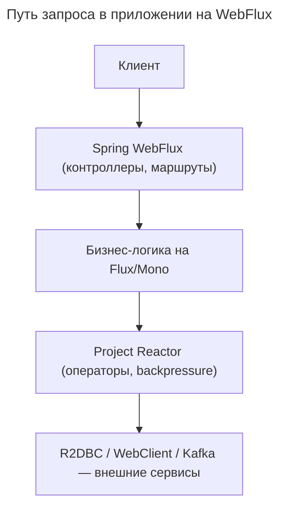

---
aliases:
  - backpressure
  - Flux
  - Mono
  - Project Reactor
  - Reactive Streams
  - Reactor
  - Spring WebFlux
  - WebFlux
---
## Project Reactor и Spring WebFlux

**Project Reactor** — библиотека реализации Reactive Streams, предоставляет типы `Flux`, `Mono` и набор операторов. **Spring WebFlux** — реактивный веб-фреймворк для создания HTTP-сервисов, использующий Project Reactor под капотом. Зависимость односторонняя: WebFlux зависит от Reactor, но не наоборот.

**Сравнение Project Reactor и Spring WebFlux**

| Характеристика | Project Reactor | Spring WebFlux |
|---|---|---|
| Что это? | Реактивная библиотека (реализация Reactive Streams) | Веб-фреймворк для HTTP-сервисов |
| Основные классы | `Flux<T>`, `Mono<T>`, операторы (`map`, `flatMap`, `filter`) | `WebClient`, `RouterFunction`, `@RestController` с `Flux`/`Mono` |
| Зависимости | Только `reactive-streams` | Project Reactor + Spring Core |
| Где используется | Любой реактивный Java-код | Веб-приложения (HTTP, WebSocket) |
| Сервер | Не предоставляет | Netty, Undertow, Tomcat (неблокирующий) |
| Аналог в других экосистемах | RxJava, Akka Streams | Node.js, Vert.x, Quarkus Reactive Routes |

**Как они связаны**

Project Reactor — низкоуровневая библиотека, «реактивный `java.util.stream`»:
- Предоставляет реактивные типы:
  ```java
  Flux<String> stream = Flux.just("a", "b", "c");
  Mono<User> user = Mono.just(new User("Alice"));
  ```
- Реализует операторы, backpressure, асинхронные цепочки.

Spring WebFlux — надстройка для веба, использует `Flux`/`Mono` везде:
- В контроллерах:
  ```java
  @GetMapping("/users")
  public Flux<User> getUsers() { ... }
  ```
- В клиенте:
  ```java
  WebClient.create().get().retrieve().bodyToFlux(User.class);
  ```
- В репозиториях (с R2DBC):
  ```java
  Flux<User> findAll();
  ```
- Предоставляет интеграцию с HTTP, маршрутизацию, сериализацию JSON.

WebFlux — это Spring MVC, но реактивный; он выбирает Project Reactor как реализацию Reactive Streams.

**Архитектура приложения**



Project Reactor работает внутри кода и WebFlux. WebFlux отвечает за взаимодействие с HTTP.

**Почему Spring выбрал Project Reactor**

1. Создан той же командой (Pivotal → VMware → Broadcom).
2. Оптимизирован под Spring (интеграция с `@Transactional`, `@Controller`).
3. Без дополнительных зависимостей — только `reactive-streams`.
4. Одна из самых быстрых реализаций Reactive Streams.

WebFlux можно заставить работать с другими `Publisher` (например, RxJava), но по умолчанию используется Reactor.

**Использование Project Reactor без WebFlux**

Reactor — универсальная библиотека, не привязанная к вебу:
- Реактивная обработка данных в batch-приложении:
  ```java
  Flux.from(fileReader)
      .map(parseLine)
      .filter(valid)
      .buffer(1000)
      .subscribe(batch -> saveToDb(batch));
  ```
- Микросервис на Vert.x с использованием `Flux` для логики.
- Тестирование реактивных цепочек без веба.

**Использование WebFlux без Project Reactor**

Технически возможно, на практике — нет. WebFlux возвращает `Flux`/`Mono` в контроллерах, использует Reactor в `WebClient`, ожидает `Publisher<T>` везде — реализация по умолчанию Reactor. Подстановка `RxJava Flowable` напрямую не сработает:

```java
@GetMapping("/data")
public Flowable<String> getData() { ... } // не сработает напрямую
```

Потребуется конвертация в `Flux`:

```java
return Flux.from(flowable);
```

Spring Boot автоматически подключает Project Reactor, если в classpath есть `spring-boot-starter-webflux`.

**Сравнение по функциональности**

| Задача | Project Reactor | Spring WebFlux |
|---|---|---|
| Создать поток данных | ✅ `Flux.just(...)` | ❌ |
| Обработать backpressure | ✅ `onBackpressureBuffer()` | ✅ (через Reactor) |
| Написать HTTP-контроллер | ❌ | ✅ `@RestController` |
| Сделать HTTP-запрос | ❌ (нет клиента) | ✅ `WebClient` |
| Подключиться к БД | ❌ | ✅ (с R2DBC) |
| Маршрутизация запросов | ❌ | ✅ `RouterFunction` |

**Итог**

| | Project Reactor | Spring WebFlux |
|---|---|---|
| Роль | Реактивная библиотека | Реактивный веб-фреймворк |
| Аналогия | Как `java.util.stream` | Как Spring MVC, но реактивный |
| Зависимость | Независимая | Зависит от Reactor |
| Используется для | Любая реактивная логика | Только веб и HTTP |

Project Reactor нужен при написании реактивного кода, WebFlux — когда этот код является частью веб-сервиса. Для изучения реактивного программирования начинают с Project Reactor (`Flux`, `Mono`, операторы); при построении веб-API добавляют WebFlux поверх.
