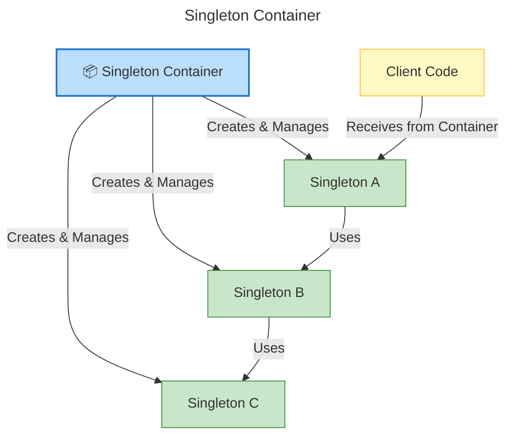
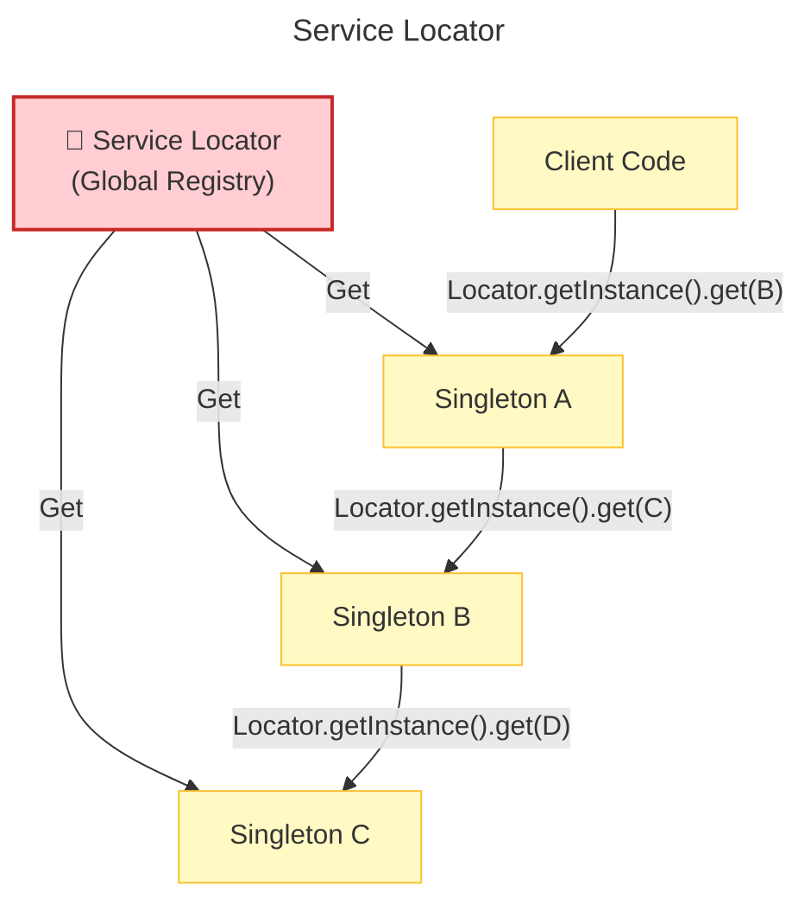
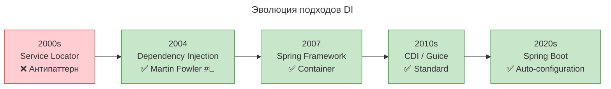

---
aliases:
  - CDI
  - Constructor Injection
  - Dependency Injection
  - DI
  - Global Registry
  - Guice
  - JNDI
  - Service Container
  - Service Container pattern
  - Service Locator
  - Service Locator pattern
  - ServiceContainer
  - ServiceLoader
  - ServiceLocator
  - Singleton
  - Singleton Container
  - Singleton Container pattern
  - SPI
  - Spring
  - Spring Boot
  - Spring Framework
  - Внедрение зависимостей
  - Глобальный реестр
  - Контейнер одиночек
  - Локатор сервисов
---

**Service Locator** — это паттерн, который даёт возможность запрашивать зависимости (сервисы) по имени или типу через единый объект-«каталог», вместо того чтобы создавать их явно или передавать через конструктор.

Простыми словами: «дай мне сервис типа `ArtifactoryClient`, а где и как он создан — мне неважно».

## Реализация на Java

**Минимальный пример (без фреймворков)**

```java
public final class ServiceLocator {
    private static final Map<Class<?>, Object> registry = new ConcurrentHashMap<>();

    public static <T> void register(Class<T> type, T instance) {
        registry.put(type, instance);
    }

    @SuppressWarnings("unchecked")
    public static <T> T get(Class<T> type) {
        T service = (T) registry.get(type);
        if (service == null) {
            throw new IllegalStateException("Service not found: " + type.getName());
        }
        return service;
    }
}
```

**Использование**

```java
// где-то при старте (в main)
ServiceLocator.register(ArtifactoryClient.class, new ArtifactoryClient(url, creds));
ServiceLocator.register(LicenseNameResolver.class, new LicenseNameResolver());

// в любом месте кода
var client = ServiceLocator.get(ArtifactoryClient.class);
var resolver = ServiceLocator.get(LicenseNameResolver.class);
```

## Сравнение с другими подходами

| Подход | Где берутся зависимости | Видимость зависимостей | Тестируемость |
|--------|-------------------------|-------------------------|---------------|
| **Constructor Injection (явные)** | Передаются в конструктор | Видны в сигнатуре конструктора | Отличная (легко подменить моки) |
| **Service Locator** | Запрашиваются через локатор | Скрыты: любой класс может вызвать `get()` | Хуже: нужно настраивать локатор для тестов |
| **DI-контейнер (Spring и т.п.)** | Контейнер внедряет сам | Часто видны (через конструктор/поля) | Хорошая (контейнер настраивается для тестов) |

## Почему Service Locator считают антипаттерном

- **Скрытые зависимости.** В коде нет явной связи: непонятно, что классу нужен `ArtifactoryClient`, пока не заглянешь внутрь метода. Это усложняет чтение и рефакторинг.
- **Глобальное состояние.** Локатор обычно делают статическим, и он становится «общей помойкой» зависимостей.
- **Сложность тестов.** Чтобы протестировать класс, нужно не только создать моки, но и зарегистрировать их в локаторе. Если логика инициализации сложная — тесты становятся хрупкими.
- **Ошибки на рантайме.** Ошибка «сервис не найден» всплывает только при вызове, а не на этапе компиляции или старта.

## Когда Service Locator уместен

- **Плагины и динамические расширения.** Когда типы сервисов неизвестны на этапе компиляции, а подключаются через SPI (`ServiceLoader`) или конфиги.
- **Legacy-код.** Когда нельзя менять сигнатуры конструкторов, но нужно как-то получать зависимости.
- **Простые CLI-утилиты с ограниченным числом компонентов**, где «локатор» — это просто удобная обёртка над статическими полями (но и тут чаще делают явную инициализацию в `main`).

## Singleton Container vs Service Locator

**Краткий ответ**

| Паттерн | Суть | Статус |
|---------|------|--------|
| **Singleton Container** | Контейнер управляет жизненным циклом singleton-объектов | ✅ Рекомендуется (Spring, CDI) |
| **Service Locator** | Объект сам запрашивает зависимости из реестра | ❌ Антипаттерн (скрытые зависимости) |

### Singleton Container

> **Централизованный контейнер**, который создаёт, хранит и управляет **singleton-объектами**.
> Объекты **не знают о контейнере** — зависимости **внедряются извне** (Dependency Injection).

**Схема**



**Пример (Spring)**

```java
// ✅ Singleton управляется контейнером
@Component  // ← Spring создаёт и хранит singleton
public class LicenseResolver {

    private final ObjectMapper objectMapper;  // ← Внедрено контейнером

    @Autowired  // ← Контейнер внедряет зависимость
    public LicenseResolver(ObjectMapper objectMapper) {
        this.objectMapper = objectMapper;
    }
}

// Контейнер (Spring ApplicationContext)
ApplicationContext ctx = new AnnotationConfigApplicationContext(AppConfig.class);
LicenseResolver resolver = ctx.getBean(LicenseResolver.class);  // ← Получаем из контейнера
```

### Service Locator

> **Глобальный реестр**, из которого объекты **самостоятельно извлекают** свои зависимости.
> Объект **знает о локаторе** и явно запрашивает зависимости.

**Схема**



**Пример**

```java
// ❌ Service Locator — глобальный реестр
public class ServiceLocator {
    private static final Map<Class<?>, Object> services = new ConcurrentHashMap<>();

    public static <T> void register(Class<T> type, T instance) {
        services.put(type, instance);
    }

    public static <T> T get(Class<T> type) {
        return type.cast(services.get(type));
    }
}

// ❌ Класс зависит от локатора (скрытая зависимость)
public class LicenseResolver {
    private final ObjectMapper objectMapper;

    public LicenseResolver() {
        // ❌ Явный вызов локатора внутри класса
        this.objectMapper = ServiceLocator.get(ObjectMapper.class);
    }
}

// Использование
ServiceLocator.register(ObjectMapper.class, new ObjectMapper());
LicenseResolver resolver = new LicenseResolver();  // ← Внутри сам достаёт зависимость
```

## Сравнительная таблица

| Критерий | Singleton Container | Service Locator |
|----------|--------------------|-----------------|
| **Зависимости** | ✅ Внедряются (DI) | ❌ Запрашиваются (SL) |
| **Видимость зависимостей** | ✅ Явные (конструктор) | ❌ Скрытые (внутри метода) |
| **Тестируемость** | ✅ Легко (mock в конструктор) | ❌ Сложно (mock в локаторе) |
| **Инкапсуляция** | ✅ Класс не знает о контейнере | ❌ Класс знает о локаторе |
| **Глобальное состояние** | ✅ Изолировано в контейнере | ❌ Статический реестр |
| **Lifecycle** | ✅ Управляется контейнером | ⚠️ Ручное управление |
| **Фреймворк** | Spring, CDI, Guice | Самописный или JNDI |
| **Статус** | ✅ Рекомендуемый паттерн | ❌ Антипаттерн (Martin Fowler #👨) |

## Когда что использовать

| Сценарий | Рекомендация | Почему |
|----------|--------------|--------|
| **Новый проект** | ✅ Singleton Container (Spring/CDI) | Лучшая архитектура |
| **Enterprise-приложение** | ✅ Singleton Container | Интеграция с экосистемой |
| **Микросервисы** | ✅ Singleton Container | Тестируемость, изоляция |
| **Legacy-код** | ⚠️ Service Locator (постепенно рефакторить) | Уже используется |
| **Утилиты / CLI** | ⚠️ Service Locator (если нет фреймворка) | Простота важнее архитектуры |
| **Библиотеки** | ❌ Избегать обоих | Предоставлять API, не контейнер |

## Эволюция подходов



> 💡 **Совет:** Для новых проектов **всегда выбирайте Singleton Container** (Spring, CDI). Service Locator используйте **только для легаси** или когда фреймворки недоступны. В современном Java-разработке DI — это стандарт де-факто.
