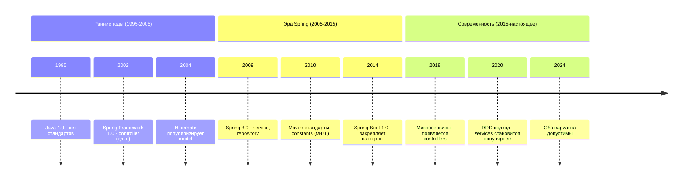

---
aliases:
  - ApiEndpoints
  - endpoint constants
  - endpoint paths
  - package structure
  - REST API paths
  - константы эндпоинтов
  - пакетная структура
  - пути эндпоинтов
---
## Размещение класса констант эндпоинтов

### Рекомендуемая структура пакетов

Для современного Java-приложения (особенно с использованием Spring Boot) оптимальная структура пакетов выглядит так:

- `src/main/java/com/example/project/`
  - `config/` — конфигурации
    - `SecurityConfig.java`
    - `SwaggerConfig.java`
  - `controller/` — контроллеры REST API
    - `UserController.java`
    - `ProductController.java`
    - `AuthController.java`
  - `service/` — бизнес-логика
  - `repository/` — работа с БД
  - `model/` — Entity / Domain модели
  - `dto/` — Data Transfer Objects
  - `exception/` — исключения
  - `constant/` — константы приложения
    - `ApiEndpoints.java` — класс с путями эндпоинтов
    - `AppConstants.java`
    - `ErrorMessages.java`
  - `util/` — утилиты
  - `Application.java`

### Итоговая рекомендация

**Имя класса:** `ApiEndpoints`

**Полный путь:** `com.example.project.constants.ApiEndpoints`

Для большинства проектов:

**Пакет:** `com.example.project.constants`

**Имя класса:** `ApiEndpoints`

**Размещение:** отдельный класс с вложенными статическими классами

```java
package com.example.project.constants;

/**
Константы путей к REST API эндпоинтам.
Используются в контроллерах и для генерации документации (Swagger/OpenAPI).
*/
public final class ApiEndpoints {

    private ApiEndpoints() {
        throw new UnsupportedOperationException("Utility class");
    }

    // Базовый путь для всех эндпоинтов
    public static final String API_V1 = "/api/v1";

    // Auth endpoints
    public static final class Auth {
        private Auth() {}
        public static final String BASE = API_V1 + "/auth";
        public static final String LOGIN = BASE + "/login";
        public static final String REGISTER = BASE + "/register";
        public static final String REFRESH = BASE + "/refresh";
        public static final String LOGOUT = BASE + "/logout";
    }

    // User endpoints
    public static final class Users {
        private Users() {}
        public static final String BASE = API_V1 + "/users";
        public static final String ROOT = BASE;
        public static final String ID = BASE + "/{id}";
        public static final String PROFILE = BASE + "/profile";
        public static final String ACTIVATE = BASE + "/activate";
    }

    // Product endpoints
    public static final class Products {
        private Products() {}
        public static final String BASE = API_V1 + "/products";
        public static final String ROOT = BASE;
        public static final String ID = BASE + "/{id}";
        public static final String SEARCH = BASE + "/search";
        public static final String CATEGORIES = BASE + "/categories";
    }

    // Order endpoints
    public static final class Orders {
        private Orders() {}
        public static final String BASE = API_V1 + "/orders";
        public static final String ROOT = BASE;
        public static final String ID = BASE + "/{id}";
        public static final String STATUS = BASE + "/{id}/status";
    }
}
```

Почему это лучший выбор:

1. Читаемость: любой разработчик быстро найдёт константы эндпоинтов.
2. Поддерживаемость: централизованное место для всех путей API.
3. Типобезопасность: нет магических строк в коде контроллеров.
4. Рефакторинг: легко изменить базовый путь для всех эндпоинтов.
5. Документация: упрощает генерацию OpenAPI/Swagger документации.
6. Тестирование: можно использовать те же константы в интеграционных тестах.

**Использование в тестах**

```java
@Test
void shouldGetUserById() {
    mockMvc.perform(get(ApiEndpoints.Users.ID, 1L))
        .andExpect(status().isOk());
}
```

---

### Альтернативные варианты размещения

#### Вариант: пакет `config`

Если константы связаны с конфигурацией:

- Путь: `com.example.project.config.ApiEndpoints`

**Когда использовать:**

- Если пути эндпоинтов могут меняться через конфигурацию
- Если используется `@ConfigurationProperties`

```java
package com.example.project.config;

import org.springframework.boot.context.properties.ConfigurationProperties;
import org.springframework.stereotype.Component;

@Component
@ConfigurationProperties(prefix = "api.endpoints")
public class ApiEndpoints {

    private String base = "/api/v1";

    private Auth auth = new Auth();
    private Users users = new Users();

    // getters/setters

    public static class Auth {
        private String login = "/auth/login";
        private String register = "/auth/register";
        // getters/setters
    }

    public static class Users {
        private String root = "/users";
        // getters/setters
    }
}
```

#### Вариант: пакет `api`

Если много связанных классов с API:

- `com.example.project.api.constants.ApiEndpoints`
- `com.example.project.api.dto.UserRequest`
- `com.example.project.api.mapper.UserMapper`

**Когда использовать:**

- В крупных проектах с несколькими API-версиями
- Если есть отдельный слой API (DTO, мапперы, валидаторы)

#### Вариант: пакет контроллеров

Если константы специфичны для одного контроллера:

```java
package com.example.project.controller;

import static com.example.project.constants.ApiEndpoints.*;

@RestController
@RequestMapping(Users.BASE)
public class UserController {

    @GetMapping
    public List<UserDto> getAll() { ... }

    @GetMapping(Users.ID)
    public UserDto getById(@PathVariable Long id) { ... }

    @PostMapping
    public UserDto create(@RequestBody UserCreateDto dto) { ... }
}
```

---

### Сравнение вариантов

| Вариант | Путь | Преимущества | Когда использовать |
|---------|------|--------------|-------------------|
| `constants.ApiEndpoints` | `com.example.project.constants.ApiEndpoints` | Централизовано, легко найти, чистая архитектура | Рекомендуется для большинства проектов |
| `config.ApiEndpoints` | `com.example.project.config.ApiEndpoints` | Интеграция с Spring Config, гибкость | Если пути могут меняться через `application.yml` |
| `api.constants.ApiEndpoints` | `com.example.project.api.constants.ApiEndpoints` | Логическая группировка всего, что связано с API | Крупные проекты, несколько версий API |
| В контроллере | `UserController.ENDPOINT` | Локальность, инкапсуляция | Если эндпоинт используется только в одном контроллере |

---

### Пример использования в контроллере

```java
package com.example.project.controller;

import com.example.project.constants.ApiEndpoints;
import com.example.project.dto.UserDto;
import com.example.project.service.UserService;
import org.springframework.web.bind.annotation.*;

import java.util.List;

import static com.example.project.constants.ApiEndpoints.Users;

@RestController
@RequestMapping(Users.BASE)
public class UserController {

    private final UserService userService;

    public UserController(UserService userService) {
        this.userService = userService;
    }

    @GetMapping
    public List<UserDto> getAllUsers() {
        return userService.findAll();
    }

    @GetMapping(Users.ID)
    public UserDto getUserById(@PathVariable Long id) {
        return userService.findById(id);
    }

    @PostMapping
    public UserDto createUser(@RequestBody UserDto userDto) {
        return userService.create(userDto);
    }

    @PutMapping(Users.ID)
    public UserDto updateUser(
            @PathVariable Long id,
            @RequestBody UserDto userDto) {
        return userService.update(id, userDto);
    }

    @DeleteMapping(Users.ID)
    public void deleteUser(@PathVariable Long id) {
        userService.delete(id);
    }

    @GetMapping(Users.PROFILE)
    public UserDto getProfile() {
        return userService.getCurrentUserProfile();
    }
}
```

---

### Пример использования в Swagger/OpenAPI

```java
package com.example.project.config;

import com.example.project.constants.ApiEndpoints;
import io.swagger.v3.oas.models.OpenAPI;
import io.swagger.v3.oas.models.info.Info;
import io.swagger.v3.oas.models.servers.Server;
import org.springframework.context.annotation.Bean;
import org.springframework.context.annotation.Configuration;

import java.util.List;

@Configuration
public class SwaggerConfig {

    @Bean
    public OpenAPI customOpenAPI() {
        return new OpenAPI()
            .info(new Info()
                .title("My Application API")
                .version("1.0.0")
                .description("REST API documentation"))
            .servers(List.of(
                new Server().url("/").description("Current server"),
                new Server().url("https://api.example.com").description("Production")
            ));
    }
}
```

```java
package com.example.project.controller;

import com.example.project.constants.ApiEndpoints;
import io.swagger.v3.oas.annotations.Operation;
import io.swagger.v3.oas.annotations.tags.Tag;
import org.springframework.web.bind.annotation.*;

import static com.example.project.constants.ApiEndpoints.Users;

@RestController
@RequestMapping(Users.BASE)
@Tag(name = "Users", description = "User management endpoints")
public class UserController {

    @GetMapping(Users.ID)
    @Operation(summary = "Get user by ID")
    public UserDto getUserById(@PathVariable Long id) {
        // ...
    }
}
```

---

### Чек-лист для размещения

```markdown
- [ ] Класс объявлен как `final` (утилитный класс)
- [ ] Приватный конструктор для предотвращения инстанцирования
- [ ] Использованы вложенные классы для группировки по доменам
- [ ] Размещён в пакете `constants` (или `config`/`api.constants`)
- [ ] Имя класса отражает содержимое: `ApiEndpoints`
- [ ] Используется `static import` для удобства в контроллерах
- [ ] Добавлена JavaDoc документация
- [ ] Константы используют интерполяцию для переиспользования базовых путей
```

---

## Единственное и множественное число в именовании пакетов

### Текущая ситуация в индустрии

| Пакет | Единственное число | Множественное число | Популярность |
|-------|-------------------|---------------------|--------------|
| `controller` / `controllers` | ✅ | ✅ | 50/50 |
| `service` / `services` | ✅ | ✅ | 50/50 |
| `repository` / `repositories` | ✅ | ✅ | 60/40 |
| `model` / `models` | ✅ | ✅ | 70/30 |
| `dto` | ❌ | ✅ | 95% |
| `constants` | ❌ | ✅ | 98% |
| `config` | ✅ | ❌ | 95% |
| `util` / `utils` | ✅ | ✅ | 60/40 |

### Почему так сложилось

**Семантическое различие**

| Тип пакета | Логика именования | Пример |
|------------|-------------------|--------|
| Слой архитектуры | Название *категории* (как «отдел») | `controller`, `service`, `repository` |
| Коллекция объектов | Название *содержимого* (что внутри) | `constants`, `dto`, `exceptions` |
| Сокращения | По соглашению | `config`, `util` |

`controller` = «пакет контроллеров» (категория компонентов), `constants` = «пакет с константами» (коллекция значений).

**Исторические причины**



### Варианты стилей

**Единственное число (классический подход Spring)**

- `src/main/java/com/example/project/`
  - `config/`
  - `controller/`
  - `service/`
  - `repository/`
  - `model/`
  - `dto/`
  - `exception/`
  - `constant/` — единственное число
  - `util/`

**Особенности**

- ✅ Согласованность со всей структурой
- ✅ Меньше символов
- ✅ Классический подход
- ❌ `constant` звучит менее естественно, чем `constants`
- ❌ Может вызывать путаницу (одна константа или все?)

**Множественное число (более современный)**

- `src/main/java/com/example/project/`
  - `configs/`
  - `controllers/`
  - `services/`
  - `repositories/`
  - `models/`
  - `dtos/`
  - `exceptions/`
  - `constants/` — множественное число
  - `utils/`

**Особенности**

- ✅ Более естественное звучание
- ✅ Чётко понятно, что внутри много объектов
- ✅ Современный тренд (особенно в микросервисах)
- ❌ Длиннее имена пакетов
- ❌ Отличается от классических соглашений Spring

**Гибридный (наиболее распространённый)**

- `src/main/java/com/example/project/`
  - `config/` — ед. ч. (сокращение)
  - `controller/` — ед. ч. (категория)
  - `service/` — ед. ч. (категория)
  - `repository/` — ед. ч. (категория)
  - `model/` — ед. ч. (категория)
  - `dto/` — мн. ч. (аббревиатура)
  - `exception/` — ед. ч. (категория)
  - `constants/` — мн. ч. (коллекция)
  - `util/` — ед. ч. (сокращение)

**Особенности**

- ✅ Следует устоявшимся соглашениям
- ✅ Большинство проектов используют именно этот подход
- ✅ Узнаваемость для других разработчиков
- ❌ Несогласованность

### Примеры из реальных проектов

**Spring Boot (официальные примеры)**

- `demo/`
  - `controller/`
  - `service/`
  - `repository/`
  - `model/`
  - `config/`
  - `constants/`

**Netflix OSS**

- `service/`
  - `controllers/`
  - `services/`
  - `repositories/`
  - `models/`
  - `configs/`
  - `constants/`

**Apache Projects**

- `project/`
  - `controller/`
  - `service/`
  - `repository/`
  - `model/`
  - `config/`
  - `constants/`

### Рекомендация

Для большинства проектов — гибридный подход:

- `src/main/java/com/example/project/`
  - `config/` — ед. ч. (сокращение)
  - `controller/` — ед. ч. (категория)
  - `service/` — ед. ч. (категория)
  - `repository/` — ед. ч. (категория)
  - `model/` — ед. ч. (категория)
  - `dto/` — мн. ч. (аббревиатура)
  - `exception/` — ед. ч. (категория)
  - `constants/` — мн. ч. (коллекция) — сюда размещается класс констант
  - `util/` — ед. ч. (сокращение)

Такую структуру увидит большинство разработчиков в существующих проектах, по ней легко найти информацию и примеры.

### Альтернатива: один стиль для всей структуры

Для полной согласованности выберите один из вариантов:

**Стиль 1: всё в единственном числе**

```java
package com.example.project.constant;  // не "constants"

public final class ApiEndpoint {
    // ...
}
```

**Стиль 2: всё во множественном числе**

```java
package com.example.project.constants;  // всё множественное

public final class ApiEndpoint {
    // ...
}
```

### Итог

Почему `controller/` в единственном числе, а `constants/` во множественном.

1. `controller` — категория компонентов (как «отдел контроллеров»).
2. `constants` — коллекция значений (много констант внутри).

**Рекомендации**

| Ситуация | Рекомендация |
|---------------|--------------|
| Новый проект со свободой выбора | Выберите один стиль и придерживайтесь его |
| Работа в команде | Следуйте существующим соглашениям |
| Открытый исходный код | Используйте гибридный (стандарт де-факто) |
| Корпоративный проект | Следуйте корпоративным стандартам |

Для класса констант эндпоинтов рекомендуется:

```java
package com.example.project.constants;  // множественное число
public final class ApiEndpoints { ... }
```

Это наиболее распространённый и естественный вариант для констант.
