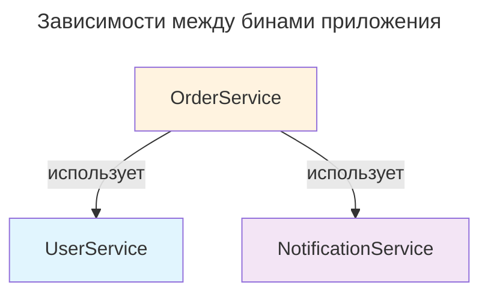

---
aliases:
  - "@SpringBootTest"
  - SpringBootTest
---
## Пример @SpringBootTest для тестирования нескольких бинов

### Архитектура тестируемого приложения

Рассмотрим типичный сценарий: три сервиса, которые взаимодействуют между собой — `UserService`, `OrderService` и `NotificationService`.



### Интеграционный тест с @SpringBootTest

```java
@SpringBootTest
class OrderServiceIntegrationTest {

    @Autowired
    private UserService userService;

    @Autowired
    private OrderService orderService;

    @Autowired
    private NotificationService notificationService;

    @Test
    void shouldCreateOrderAndSendNotification() {
        // Given: создаём пользователя через UserService
        User user = userService.createUser("Alice");

        // When: создаём заказ через OrderService
        Order order = orderService.createOrder(user.getId(), "Laptop");

        // Then: проверяем результат работы OrderService
        assertNotNull(order.getId());
        assertEquals("Laptop", order.getProduct());
        assertEquals(user, order.getUser());

        // Then: проверяем, что UserService сохранил пользователя
        Optional<User> found = userService.findById(user.getId());
        assertTrue(found.isPresent());
        assertEquals("Alice", found.get().getName());

        // Then: проверяем, что NotificationService отправил уведомление
        List<String> notifications = notificationService.getSentNotifications();
        assertThat(notifications).hasSize(1);
        assertThat(notifications.get(0)).contains("Alice");
    }

    @Test
    void shouldFailWhenUserNotFound() {
        // When & Then: OrderService должен выбросить исключение,
        // так как UserService не найдёт пользователя с id=999
        assertThrows(IllegalArgumentException.class, () -> {
            orderService.createOrder(999L, "Phone");
        });
    }
}
```

### Ключевые моменты

| Аннотация / элемент | Назначение |
|---------------------|-----------|
| `@SpringBootTest` | Загружает полный ApplicationContext приложения |
| `@Autowired` | Внедряет реальные бины из контекста в тест |
| `@Test` | Метод тестирования (JUnit 5) |
| Конструкторная инъекция | В `OrderService` — рекомендуемый способ DI |

### Варианты использования @SpringBootTest

#### 1. Тестирование с конкретным профилем

```java
@SpringBootTest(properties = "spring.profiles.active=test")
class ProfileSpecificTest { ... }
```

#### 2. Тестирование с подменой одного бина через @MockBean

Если нужно замокать только один бин (например, внешний HTTP-клиент), оставив остальные реальными:

```java
@SpringBootTest
class OrderServiceWithMockTest {

    @Autowired
    private OrderService orderService;

    @Autowired
    private UserService userService;

    @MockBean
    private ExternalPaymentGateway paymentGateway;

    @Test
    void shouldProcessPayment() {
        when(paymentGateway.pay(any())).thenReturn(true);
        // ... тест
    }
}
```

#### 3. Тестирование с тестовым срезом (slice test)

Если не нужен весь контекст, а только слой сервисов:

```java
@ServiceTest  // или @SpringBootTest + @Import({UserService.class, OrderService.class})
class ServiceLayerTest { ... }
```

### Рекомендации

✅ **Используйте `@SpringBootTest`** для полноценных интеграционных тестов, где важно проверить взаимодействие нескольких бинов
✅ **Предпочитайте конструкторную инъекцию** в бинах — это упрощает тестирование и делает зависимости явными
✅ **Применяйте `@MockBean` точечно** — только для внешних зависимостей (БД, HTTP-клиенты, очереди)
✅ **Разделяйте unit-тесты** (через `@ExtendWith(MockitoExtension.class)`) и интеграционные тесты для ускорения прогона
