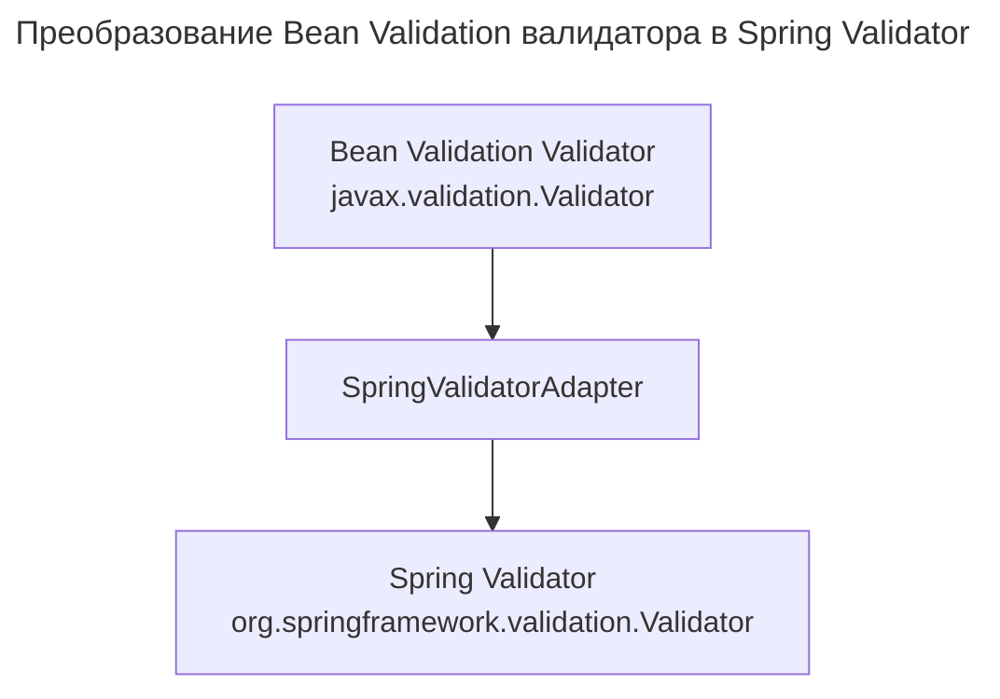

---
aliases:
  - "@Email"
  - "@NotNull"
  - "@Size"
  - "@Valid"
  - Bean Validation
  - BeanPropertyBindingResult
  - ConstraintViolation
  - jakarta.validation
  - javax.validation
  - JSR-303
  - JSR-380
  - LocalValidatorFactoryBean
  - MethodValidationPostProcessor
  - Spring Boot
  - Spring Framework
  - Spring Validator
  - SpringValidatorAdapter
  - Validation
  - Валидация
  - Спринг Валидатор
---
## SpringValidatorAdapter

**`SpringValidatorAdapter`** — это класс-адаптер в Spring Framework, который позволяет использовать Bean Validation (JSR-303/JSR-380) валидаторы в инфраструктуре валидации Spring.

## Назначение

В Spring есть две системы валидации:

| Система | Описание |
|---------|----------|
| Spring Validator | Интерфейс `org.springframework.validation.Validator` (старая система Spring) |
| Bean Validation | Аннотации `javax.validation` / `jakarta.validation` (например, `@NotNull`, `@Size`) |

`SpringValidatorAdapter` преобразует Bean Validation-валидатор в Spring Validator, чтобы их можно было использовать вместе.

## Принцип работы



## Пример использования

**Без адаптера (только Bean Validation)**

```java
@RestController
public class UserController {

    @Autowired
    private javax.validation.Validator validator; // Bean Validation

    @PostMapping("/users")
    public ResponseEntity<?> createUser(@RequestBody User user) {
        Set<ConstraintViolation<User>> violations = validator.validate(user);
        if (!violations.isEmpty()) {
            // Обработка ошибок
        }
        return ResponseEntity.ok().build();
    }
}
```

**С адаптером (Spring + Bean Validation)**

```java
@Configuration
public class ValidationConfig {

    @Autowired
    private javax.validation.Validator beanValidator;

    @Bean
    public org.springframework.validation.Validator springValidator() {
        return new SpringValidatorAdapter(beanValidator);
    }
}
```

Spring-валидацию с аннотациями Bean Validation можно использовать напрямую:

```java
@RestController
public class UserController {

    @Autowired
    private org.springframework.validation.Validator validator; // Spring Validator

    @PostMapping("/users")
    public ResponseEntity<?> createUser(@RequestBody User user) {
        Errors errors = new BeanPropertyBindingResult(user, "user");
        validator.validate(user, errors);
        if (errors.hasErrors()) {
            // Обработка ошибок
        }
        return ResponseEntity.ok().build();
    }
}
```

---

## Автоматическое использование

В Spring Boot `SpringValidatorAdapter` используется автоматически при наличии зависимости:

```xml
<dependency>
    <groupId>org.springframework.boot</groupId>
    <artifactId>spring-boot-starter-validation</artifactId>
</dependency>
```

Spring Boot автоматически создаёт `LocalValidatorFactoryBean`, который внутри использует `SpringValidatorAdapter`.

## Основные сценарии использования

| Сценарий | Описание |
|----------|----------|
| `@Valid` в контроллерах | Spring использует адаптер для Bean Validation |
| `MethodValidationPostProcessor` | Для валидации аргументов методов |
| Ручная валидация | Вызов `validator.validate()` вручную |
| Интеграция со старым кодом | Код, использующий `org.springframework.validation.Validator` |

---

## Пример: валидация с `@Valid`

```java
@RestController
public class UserController {

    @PostMapping("/users")
    public ResponseEntity<?> createUser(@Valid @RequestBody User user) {
        // Spring автоматически валидирует через SpringValidatorAdapter
        return ResponseEntity.ok().build();
    }
}

public class User {
    @NotNull
    private String username;

    @Email
    private String email;

    // getters/setters
}
```

Spring автоматически использует `SpringValidatorAdapter` для валидации.

---

## Сравнение: Spring Validator и Bean Validation

| Характеристика | Spring Validator | Bean Validation |
|----------------|------------------|-----------------|
| Пакет | `org.springframework.validation` | `javax.validation` / `jakarta.validation` |
| Метод валидации | `validate(Object, Errors)` | `validate(Object)` → `Set<ConstraintViolation>` |
| Аннотации | Свои (редко используются) | `@NotNull`, `@Size`, `@Email` и т.д. |
| Адаптер | `SpringValidatorAdapter` | — |

---

## Когда адаптер не нужен

| Сценарий | Почему |
|----------|--------|
| Используется только `@Valid` | Spring Boot настроит всё автоматически |
| Используется только Bean Validation | Не нужно преобразовывать в Spring Validator |
| Используется Spring Boot starter-validation | Адаптер уже настроен |

---

## Когда адаптер нужен

| Сценарий | Почему |
|----------|--------|
| Старый код с `org.springframework.validation.Validator` | Нужно адаптировать Bean Validation |
| Ручная валидация через Spring Validator | `validator.validate(obj, errors)` |
| Кастомный валидатор | Нужно интегрировать с Bean Validation |
| `MethodValidationPostProcessor` | Требуется адаптер для валидации методов |

---

## Ручная валидация с адаптером

```java
@Service
public class UserService {

    @Autowired
    private org.springframework.validation.Validator validator;

    public void createUser(User user) {
        Errors errors = new BeanPropertyBindingResult(user, "user");
        validator.validate(user, errors);

        if (errors.hasErrors()) {
            throw new ValidationException(errors);
        }
    }
}
```

---

## Резюме

| Вопрос | Ответ |
|--------|-------|
| Что такое `SpringValidatorAdapter`? | Адаптер между Bean Validation и Spring Validator |
| Когда используется? | При интеграции двух систем валидации |
| Нужен ли в Spring Boot? | Нет — настраивается автоматически |
| Когда нужен вручную? | При ручной валидации или старом коде |
| Какие аннотации поддерживает? | Все Bean Validation (`@NotNull`, `@Size`, `@Email` и т.д.) |
