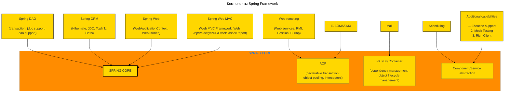
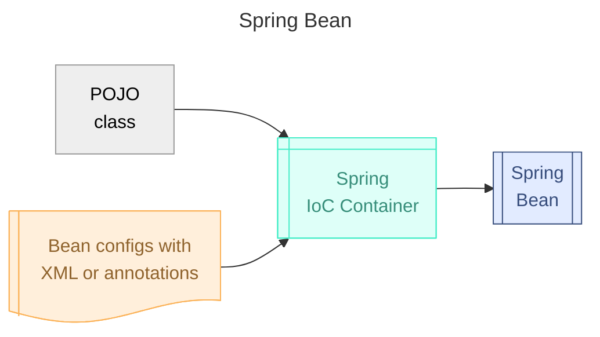
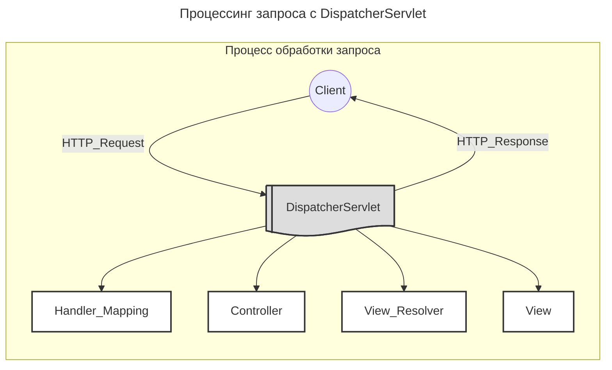
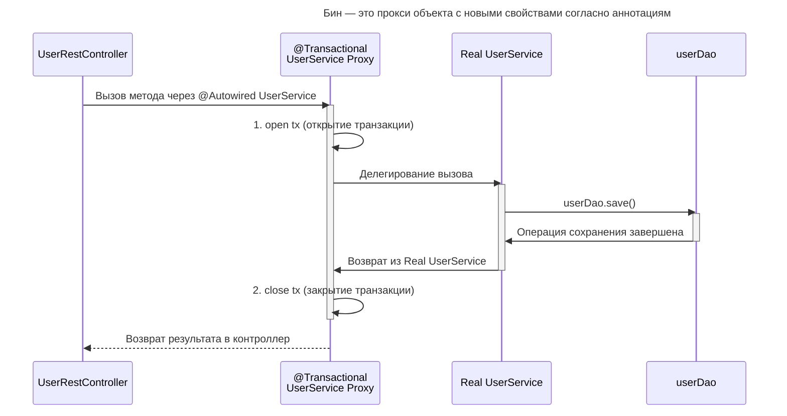

---
aliases:
  - AOP
  - ApplicationContext
  - Autowired
  - Bean
  - Bean scope
  - BeanFactory
  - BeanPostProcessor
  - Beans
  - ComponentScan
  - Configuration
  - ControllerAdvice
  - CrudRepository
  - Dependency Injection
  - DispatcherServlet
  - EnableAutoConfiguration
  - FactoryBean
  - HandlerMapping
  - Hibernate
  - Inversion of Control
  - IoC
  - IoC container
  - Isolation
  - JDBC
  - JPA
  - JpaRepository
  - Lazy
  - MongoDB
  - MVC
  - Neo4j
  - PagingAndSortingRepository
  - PostConstruct
  - PreDestroy
  - Propagation
  - Qualifier
  - RequestMapping
  - REQUIRED
  - ResponseEntity
  - RestController
  - Scope
  - SecurityContext
  - Spring
  - Spring Bean
  - Spring Beans
  - Spring Boot
  - Spring Core
  - Spring DAO
  - Spring Data
  - Spring Data JPA
  - Spring Data MongoDB
  - Spring Data Neo4j
  - Spring Framework
  - Spring MVC
  - Spring ORM
  - Spring Security
  - SpringBootApplication
  - Thymeleaf
  - Transaction
  - Transactional
  - ViewResolver
  - Аспектно-ориентированное программирование
  - Внедрение зависимостей
  - Ленивая инициализация
  - Область видимости бина
  - Транзакции
  - Транзакция
  - Уровни изоляции
---

## Spring Framework

Spring Framework (или коротко Spring) — универсальный фреймворк с открытым исходным кодом для Java-платформы. Существует также форк для платформы .NET Framework. Фреймворк (от англ. «каркас, рама; структура») — программная платформа, определяющая структуру программной системы; программное обеспечение, облегчающее разработку и объединение разных компонентов большого программного проекта.

Ключевой элемент Spring — поддержка инфраструктуры на уровне приложения: основное внимание уделяется «водопроводу» бизнес-приложений, поэтому разработчики могут сосредоточиться на бизнес-логике без лишних настроек в зависимости от среды исполнения.

Spring Framework — это набор разных мини-фреймворков. Каждый из них нужен для работы над определёнными приложениями или их частями.

![[Untitled 6 3.png|Untitled 6 3.png]]



**Состав**

- Inversion of Control container — конфигурирование компонентов приложений и управление жизненным циклом Java-объектов.
- Spring AOP — фреймворк аспектно-ориентированного программирования: работает с функциональностью, которая не может быть реализована возможностями объектно-ориентированного программирования на Java без потерь.
- Spring Data — фреймворк доступа к данным: работает с системами управления реляционными базами данных на Java-платформе, используя JDBC- и ORM-средства и обеспечивая решения задач, которые повторяются в большом числе Java-based environments.
- Spring MVC — MVC-фреймворк: каркас, основанный на HTTP и сервлетах, предоставляющий множество возможностей для расширения и настройки (customization).
- Другие:
  - Фреймворк управления транзакциями: координация различных API управления транзакциями и инструментарий настраиваемого управления транзакциями для объектов Java.
  - Фреймворк удалённого доступа: конфигурируемая передача Java-объектов через сеть в стиле RPC, поддерживающая RMI, CORBA, HTTP-based протоколы, включая web-сервисы (SOAP).
  - Фреймворк аутентификации и авторизации: конфигурируемый инструментарий процессов аутентификации и авторизации через дочерний проект Spring Security (ранее известный как Acegi).
  - Фреймворк удалённого управления: конфигурируемое представление и управление Java-объектами для локальной или удалённой конфигурации с помощью JMX.
  - Фреймворк работы с сообщениями: конфигурируемая регистрация объектов-слушателей для прозрачной обработки сообщений из очередей с помощью JMS.
  - Тестирование: каркас, поддерживающий классы для модульных и интеграционных тестов.

### Особенности

- Легкий — `Light weight jar libraries`: весит мало, разделён на компоненты, которые можно не использовать, когда они не нужны.
- `Container`: управляет жизненным циклом объектов.
- `Framework`: много утилитарных классов для конкретных задач — работа с почтой, веб-сервисами и т. п.
- Инъекция зависимостей — реализация принципа Inversion of Control.
- `AOP` — аспектно-ориентированное программирование.

### Лучшие практики

1. Spring IoC Container and Beans — реализация принципа Inversion of Control (IoC).
2. Все конфигурации во внешних легко редактируемых файлах.
3. Разделение на интерфейсы, чтобы внешние клиенты не зависели от реализации, а только от интерфейса. Частный случай — внедрение зависимостей (dependency injection).

### Основные модули Spring

**Core container** — основа фреймворка: IoC-контейнер, внедрение зависимостей.

**AOP** — Aspect Oriented Programming: поддержка библиотеки AspectJ.

**Instrumentation** — инструментирование классов.

**Data access and integrations**

- JDBC — Java Database Connectivity: платформенно независимый промышленный стандарт взаимодействия Java-приложений с различными СУБД.
- JMS — Java Message Service: стандарт промежуточного ПО для рассылки сообщений, позволяющий приложениям, выполненным на платформе Java EE, создавать, посылать, получать и читать сообщения.
- ORM — объектно-реляционное отображение, например библиотека Hibernate.

**Transaction** — управление транзакциями.

**Web & Remoting** — Web, Servlet, Struts, Testing.

---

## Spring Core

Spring Core решает задачи:

- управление контекстом;
- управление бинами;
- внедрение зависимостей.

Хорошая практика — стремиться к тому, чтобы вообще не создавать объекты вручную, кроме модельных объектов. Мы лишь конфигурируем классы (аннотации, XML, YAML), чтобы «объяснить» фреймворку Spring, какие именно объекты он должен создать за нас.



### Inversion of Control container

Spring управляет созданием объектов, поэтому его контейнер называется IoC-контейнером. Задачи, для которых нужен Spring Container:

- `Beans` — управление «бобами» — объектами в контейнере;
- `Core` — внедрение зависимостей;
- `Context` — управление контекстом: знает, где хранятся бины, и обеспечивает доступ к ним;
- `Expression` — специальный язык выражений, который может использоваться для поиска, доступа и модификации бинов.

Есть 2 типа контейнеров:

1. `BeanFactory` — простой контейнер для внедрения зависимостей.
2. `ApplicationContext` — внедрение зависимостей + framework services:
   - `AnnotationConfigApplicationContext`
   - `ClassPathXmlApplicationContext`
   - `FileSystemXmlApplicationContext`
   - другие `...ApplicationContext`

### ApplicationContext

Чтобы инициализировать контейнер и создать в нём бины, нужно создать экземпляр класса ApplicationContext.

```java
// ApplicationContext ctx = new ClassPathXmlApplicationContext("config.xml");
ConfigurableApplicationContext ctx = new AnnotationConfigApplicationContext(AppConfig.class);
// получить нужный бин
App app = ctx.getBean(App.class);
```

### Бин и `@Bean`

Объекты, которые создаются Spring-ом и находятся под его управлением, называются бинами.

### Dependency Injection — внедрение зависимостей

Мы объявляем тип сущности, чаще интерфейс, под который Spring сам подставит нужный объект — бин.

### `@Configuration` — класс конфигурации

Класс конфигурации приложения аннотируется `@Configuration`. В нём перечислены бины и их конфигурация для инъекций зависимостей.

**Пример на Java**

```java
package com.yet.spring;

import org.springframework.beans.factory.annotation.Autowired;
import org.springframework.beans.factory.annotation.Value;
import org.springframework.boot.context.properties.ConfigurationProperties;
import org.springframework.context.annotation.*;

import java.text.DateFormat;
import java.util.Date;
import java.util.HashMap;
import java.util.Map;

@Configuration
@Import(LoggerConfig.class)
@PropertySource("classpath:app.properties")
public class AppConfig {
    @Autowired
    private EventLogger consoleEventLogger;
    @Value("${client.full-name}")
    private String cliName;

    @Bean
    @ConfigurationProperties(prefix = "client")
    public Client client() {
        Client cli = new Client(cliID, cliName);
        cli.setGreeting(cliGreeting);
        return cli;
    }

    @Bean
    @Scope(value="prototype")
    public Event event() {
        return new Event(new Date(), DateFormat.getDateTimeInstance());
    }

    @Bean
    public App app() {
        Map<EventType, EventLogger> loggers = new HashMap<>() {{
            put(EventType.ERROR, combinedEventLogger);
            put(EventType.INFO, consoleEventLogger);
        }};
        return new App(client(), сacheFileEventLogger, loggers);
    }
}
```

**Основные аннотации**

- `@Autowired` — вставить значение поля из контекста; может использоваться над полем, конструктором, сеттером.
- `@Qualifier("bean name")` — подставить бин в поле по имени.
- `@Resource(name="...")` — JSR-аннотация.
- `@PostConstruct`, `@PreDestroy` — методы выполняются при конструкции либо перед уничтожением экземпляра.
- `@Value` — подстановка значений, например `@Value("${client.id}")`.
- `@Component`, `@Service`, `@Repository`, `@Controller` — маркируют классы, чтобы они попали в контейнер и стали бинами.
- `@Scope(singleton | prototype | request | session | application | websocket | myUserScope)` — область видимости бина.

**`@Autowired` — подставить бин по типу**

Если бин объявлен через `@Autowired`, при создании экземпляра Spring создаст объект, а потом через сеттер подставит `@Autowired`-бин в поле.

**`@Qualifier("bean name")` — подставить бин по имени**

**`@Component` — бин**

Аннотация `@Component` говорит фреймворку превратить класс в бин. При запуске Spring создаст экземпляр класса Engine. Этот экземпляр будет синглтоном в нашем случае.

**`@Service`, `@Repository`, `@Controller` — бин**

Являются синонимами к `@Component`, но улучшают читабельность кода, показывая, к какой бизнес-логике относится бин.

**`@PostConstruct`, `@PreDestroy` — постконструкторы**

Методы с данной аннотацией будут выполнены при конструкции либо перед уничтожением экземпляра объекта.

**`@Value` — подстановка значений**

`@Value("${client.id}")` — подстановка значений.

**`@Scope` — область видимости**

`@Scope(singleton | prototype | request | session | application | websocket | myUserScope)` — прототипирование бина.

---

## Spring Boot

[[spring-boot-config|Spring Boot]] — отдельный модуль, который упрощает настройку фреймворка Spring и ускоряет запуск проектов. Он автоматически конфигурирует приложение и создаёт веб-сервер для его запуска. Spring Boot связывает другие Spring-фреймворки: framework that makes Spring ready to work inside your app, but without much code or configuration required. Spring Boot makes it easy to create stand-alone, production-grade Spring based Applications that you can "just run".

```java
@SpringBootApplication
public class Application {
    public static void main(String[] args) {
        SpringApplication.run(Application.class, args);
    }
}
```

### `@SpringBootApplication`

`@SpringBootApplication` — аннотация, которая применяется к классу, являющемуся Spring Boot-приложением. Это композиция аннотаций:

- `@ComponentScan` — найти все бины в пакете и подгрузить в контекст;
- `@Configuration` — прочитать все бины и подгрузить в контекст;
- `@EnableAutoConfiguration` — композиция аннотаций, суть которых сводится к тому, чтобы протащить все слои запуска приложения: boot starter, web starter,... — starter.

### `@EnableAutoConfiguration`

Включает автоматическую настройку Spring ApplicationContext путём сканирования компонентов пути к классам и регистрации бинов, соответствующих различным условиям.

### `@ComponentScan`

В `@ComponentScan` указываются пакеты, которые должны сканироваться. Spring будет искать бины не только в пакетах для сканирования, но и в их подпакетах.

### spring.factories

`META-INF/spring.factories` — файл, в котором прописано соответствие интерфейса реализации. Позволяет инициировать стартеры, не зная, как они называются.

### Аннотация `@Conditional`

Умеет ссылаться на метод, который возвращает boolean, в зависимости от чего принимается решение подгружать бин или нет.

```java
@ConditionalOnBean
@ConditionalOnClass
@ConditionalOnCloudPlatform
@ConditionalOnExpression
@ConditionalOnJava
@ConditionalOnJndi
@ConditionalOnMissingBean
@ConditionalOnMissingClass
@ConditionalOnNotWebApplication
@ConditionalOnProperty
@ConditionalOnResource
@ConditionalOnSingleCandidate
@ConditionalOnWebApplication
...
```

---

## Spring MVC

**Spring MVC** — веб-фреймворк Spring. Он позволяет создавать веб-сайты или RESTful сервисы (например, JSON/XML) и хорошо интегрируется со Spring.



Ниже приведена последовательность событий, соответствующая входящему HTTP-запросу:

- После получения HTTP-запроса `DispatcherServlet` обращается к интерфейсу `HandlerMapping`, который определяет, какой контроллер должен быть вызван, после чего отправляет запрос в нужный контроллер.
- Контроллер принимает запрос и вызывает соответствующий служебный метод, основанный на GET или POST. Вызванный метод определяет данные модели на основе бизнес-логики и возвращает в `DispatcherServlet` имя вида (`View`).
- При помощи интерфейса `ViewResolver` `DispatcherServlet` определяет, какой вид использовать на основании полученного имени.
- После того как вид (`View`) создан, `DispatcherServlet` отправляет данные модели в виде атрибутов в вид, который в конечном итоге отображается в браузере.

Все вышеупомянутые компоненты (`HandlerMapping`, `Controller`, `ViewResolver`) являются частями интерфейса `WebApplicationContext`, `extends` `ApplicationContext`, с некоторыми дополнительными особенностями, необходимыми для создания web-приложений.

### Паттерн MVC

Паттерн MVC — вариант многоуровневой архитектуры приложения.

- Model (Модель) инкапсулирует (объединяет) данные приложения, в целом они будут состоять из POJO или бинов.
- View (Представление) отвечает за отображение данных Модели, как правило, генерируя HTML, которые мы видим в своём браузере.
- Controller (Контроллер) обрабатывает запрос пользователя, создаёт соответствующую Модель и передаёт её для отображения в вид.

### DispatcherServlet

Диспетчер сервлетов — фронт-контроллер, обрабатывающий HTTP-запросы. `DispatcherServlet` отправляет запрос контроллерам для выполнения определённых функций.

### Контроллер — `@Controller`

Компонент, который получает запросы от диспетчера и вызывает методы сервисного слоя для выполнения. Аннотация `@Controller` указывает, что конкретный класс является контроллером.

```java
@RestController
@RequestMapping("/clients")
@AllArgsConstructor
@Controller
public class ClientsController {

    private final ClientService clientService;

    @GetMapping
    public List<ClientDto> getClients() {
        return clientService.findAll();
    }

    @GetMapping("/{id}")
    public ClientDto getClientByID(@PathVariable Long id) {
        return clientService.findById(id);
    }

    @GetMapping("/email:{email}")
    public ClientDto getClientByEmail(@PathVariable(value = "email", required = false) String email) {
        return clientService.findByEmail(email);
    }

    @PostMapping
    public ClientDto createClient(@RequestBody ClientDto client) {
        return clientService.save(client);
    }

    @PutMapping("/email:{email}")
    public ClientDto updateClient(@PathVariable String email, @RequestBody ClientDto client) {
        return clientService.update(client, email);
    }

    @DeleteMapping("/email:{email}")
    public Boolean deleteClientByEmail(@PathVariable String email) {
        return clientService.deleteByEmail(email);
    }

    @DeleteMapping("/{id}")
    public Boolean deleteClientByID(@PathVariable Long id) {
        return clientService.deleteById(id);
    }
}
```

### `@RequestMapping`

`@RequestMapping` используется для маппинга (связывания) с URL для всего класса или для конкретного метода обработчика. Применяется к классу контроллера, служит для обозначения эндпоинта, где будет обрабатываться запрос.

```java
@Controller
public class HelloController {
   @RequestMapping(value = "/hello", method = RequestMethod.GET)
   public String printHello(ModelMap model) {
      model.addAttribute("message", "Hello Spring MVC Framework!");
      return "hello";
   }
}
```

maps `/` to the `index()` method. When invoked from a browser or by using curl on the command line, the method returns pure text.

Паттерны путей:

- `/resources/ima?e.png` — match one character in a path segment
- `/resources/*.png` — match zero or more characters in a path segment
- `/resources/**` — match multiple path segments
- `/projects/{project}/versions` — match a path segment and capture it as a variable
- `/projects/{project:[a-z]+}/versions` — match and capture a variable with a regex

### `@GetMapping`, `@PostMapping`, `@PutMapping`, `@DeleteMapping`, `@PatchMapping`

maps HTTP GET/POST/PUT/DELETE/PATCH requests to a specific handler method in Spring controllers.

### `@PathVariable`

Аннотация, указывающая, что параметр метода должен быть привязан к переменной шаблона URI.

### `@ControllerAdvice` — обработка исключений

`@ControllerAdvice` — способ обработки исключений: позволяет изменить как код, так и тело стандартного ответа при ошибке.

### `@RestController`

Аннотация `@RestController` говорит о том, что все сущности будут автоматически отображаться в JSON-формате. `@RestController` combines `@Controller` and `@ResponseBody`, two annotations that results in web requests returning data rather than a view.

### Представление

Существует несколько различных библиотек шаблонов, которые хорошо интегрируются с Spring MVC: `Thymeleaf`, `Velocity`, `Freemarker`, `Mustache` и даже `JSP` (хотя это не библиотека шаблонов).

### Spring ViewResolver

Класс, который пытается найти ваш шаблон, называется **ViewResolver**. Всякий раз, когда запрос поступает в контроллер, Spring проверяет настроенные ViewResolvers и запрашивает их, чтобы найти шаблон с заданным именем. Если нет настроенных ViewResolvers, это не сработает.

### ResponseEntity

Можно вручную регулировать тело и заголовок ответа при помощи типа `ResponseEntity`.

```java
@GetMapping("/hello")
ResponseEntity<String> hello() {
    return new ResponseEntity<>("Hello World!", HttpStatus.OK);
}

@GetMapping("/age")
ResponseEntity<String> age(@RequestParam("yearOfBirth") int yearOfBirth) {
    if (isInFuture(yearOfBirth)) {
        return ResponseEntity.badRequest()
            .body("Year of birth cannot be in the future");
    }

    return ResponseEntity.status(HttpStatus.OK)
        .body("Your age is " + calculateAge(yearOfBirth));
}
```

### Thymeleaf

Thymeleaf — современный серверный Java-шаблонизатор для web и standalone-сред.

```html
<table>
  <thead>
    <tr>
      <th th:text="#{msgs.headers.name}">Name</th>
      <th th:text="#{msgs.headers.price}">Price</th>
    </tr>
  </thead>
  <tbody>
    <tr th:each="prod: ${allProducts}">
      <td th:text="${prod.name}">Oranges</td>
      <td th:text="${\#numbers.formatDecimal(prod.price, 1, 2)}">0.99</td>
    </tr>
  </tbody>
</table>
```

Поддержка Thymeleaf встроена в Spring MVC. Для того чтобы Spring мог генерировать HTML-страницы на шаблонах Thymeleaf, нужно в файле конфигурации подключить и настроить `ServletContextTemplateResolver`, `SpringTemplateEngine`, `ThymeleafViewResolver`, `ResourceBundleMessageSource`.

### Модель — `@Repository`

Модель — это слой доступа к данным. Обычно аннотируется `@Repository`, строится на базе `JpaRepository`. Типично подключение к базе данных и запросы описываются при помощи внешнего файла конфигурации JDBC, компоненты автоматически подгружаются из Spring Data.

```java
@Repository
public interface ClientRepository extends JpaRepository<Client, Long> {
    Client findByEmailEquals(String email);
}
```

---

## Конфигурация контекста через XML

### Включение поддержки аннотаций в XML

```xml
<beans xmlns="http://www.springframework.org/schema/beans"
    xmlns:xsi="http://www.w3.org/2001/XMLSchema-instance"
    xmlns:context="http://www.springframework.org/schema/context"
    xsi:schemaLocation="
        http://www.springframework.org/schema/beans
        http://www.springframework.org/schema/beans/spring-beans-3.2.xsd
        http://www.springframework.org/schema/context
        http://www.springframework.org/schema/context/spring-util-3.2.xsd">
    <context:annotation-config/>
</beans>
```

- Каркас берётся из официальной конфигурации.
- Можно делать импорты.
- Можно подгружать данные из текстовых файлов, например из `classpath`, после чего брать переменные оттуда через `${id}`.

### Пример конфигурации

```xml
<?xml version="1.0" encoding="UTF-8"?>
<beans xmlns="http://www.springframework.org/schema/beans"
       xmlns:xsi="http://www.w3.org/2001/XMLSchema-instance"
       xsi:schemaLocation="http://www.springframework.org/schema/beans
        https://www.springframework.org/schema/beans/spring-beans.xsd"
>
    <import resource="loggers.xml"/>
    <bean class="org.springframework.beans.factory.config.PropertyPlaceholderConfigurer">
        <property name="locations">
            <list>
                <value>classpath:client.properties</value>
            </list>
        </property>
        <property name="ignoreResourceNotFound" value="true"/>
        <property name="systemPropertiesModeName" value="SYSTEM_PROPERTIES_MODE_OVERRIDE"/>
    </bean>
    <bean id="client" class="com.yet.spring.Client">
        <constructor-arg value="${id}"/>
        <constructor-arg value="${name}"/>
        <property name="greeting" value="${greeting}"/>
    </bean>
    <bean id="event" class="com.yet.spring.Event" scope="prototype">
        <constructor-arg>
            <bean id="Date" class="java.util.Date"/>
        </constructor-arg>
        <constructor-arg>
            <bean id="DateFormat" class="java.text.DateFormat" factory-method="getDateTimeInstance"/>
        </constructor-arg>
    </bean>
    <bean id="app" class="com.yet.spring.App">
        <constructor-arg ref="client"/>
        <constructor-arg ref="сacheFileEventLogger"/>
        <constructor-arg>
            <map>
                <entry key="INFO" value-ref="consoleEventLogger"/>
                <entry key="ERROR" value-ref="combinedEventLogger"/>
            </map>
        </constructor-arg>
    </bean>
</beans>
```

### Bean property injection

В бин можно инжектить сеты, массивы, мапы, листы.

```xml
<map>
  <entry key="INFO" value-ref="consoleEventLogger"/>
  <entry key="ERROR" value-ref="combinedEventLogger"/>
</map>
<bean id="combinedEventLogger" class="com.yet.spring.CombinedEventLogger">
  <constructor-arg>
    <list>
      <ref bean="consoleEventLogger"/>
      <ref bean="fileEventLogger"/>
    </list>
  </constructor-arg>
</bean>
```

Наряду с `constructor-arg` можно использовать тег `property`. Разница в том, что первый задаётся в конструкторе, второй — через сеттер.

### Bean scope

Бывают бины типов: `singleton`, `prototype`, `request`, `session`, `application`, `websocket`, пользовательский тип.

- `singleton` — тип бина по умолчанию.
- Скоупы `prototype`/`singleton` влияют на цикл жизни объекта. Различие: `context.getBean()` будет создавать новый объект или использовать имеющийся.

```xml
<bean id="..." class="..." scope="singleton" />
<bean id="..." class="..." scope="prototype" />
```

```java
Event event = context.getBean("event", Event.class);
```

### Bean inheritance

Есть возможность задать наследование бинов. Наследование бинов не связано с наследованием классов и говорит лишь о том, что параметры родительского бина надо подставить в параметры наследника.

```xml
<bean id="FileEventLogger" class="com.yet.spring.FileEventLogger" init-method="init">
  <constructor-arg value="1.txt"/>
</bean>
<bean id="eventLogger" class="com.yet.spring.CacheFileEventLogger" init-method="init" destroy-method="destroy"
      parent="FileEventLogger">
  <constructor-arg value="3"/>
</bean>
```

### Очередность инициализации бинов

- Поле `depends-on` говорит о том, что конструктор бина запустится не раньше, чем будет инициализирован бин, заданный в `depends-on`.
- Поле `lazy-init` логического типа говорит о том, что бин не будет инициализирован, пока не будет вызван.
- Поле `default-lazy-init` применяется к `<beans>` и говорит о том, что все бины будут с поздней инициализацией.

### Spring Context `autowire` — автоматическое связывание

Автосвязывание объектов Java с бинами. Бывает 3 типа связывания:

- `byName` — by property name;
- `byType` — by class in property;
- `constructor` — bean class in constructor.

Если значения не уникальны, Spring запутается. Лучше не использовать, чтобы не множить риски.

### Бины и конфигурация Spring-контекста без XML

Можно описывать бины и конфигурацию контекста без XML при помощи `Configuration`, `Bean`, после чего создать контекст и зарегистрировать в нём конфигурации.

```java
@Configuration
@Import(LoggerConfig.class) // можно импортировать другие конфигурации
public class AppConfig{
  @Bean
  public Client client(){
    return new Client();
  }
}
//...
public static void main(String[] args){
    ApplicationContext ctx = new AnnotationConfigApplicationContext(
        AppConfig.class /*[, все другие классы конфигов через запятую]*/);
    // добавить контекст вручную
    ctx.register(SomeConfig.class /*[, OtherConfig.class]*/);
    ctx.refresh(); // обязательно обновить контекст
    // если конфигурация отмечена аннотациями Component, Service, Repository, Controller, то
    ctx.scan("my.package.name");
    ctx.refresh();
}
```

---

## Spring Data

Spring Data — механизм для взаимодействия с сущностями базы данных, организации их в репозитории, извлечения и изменения данных. В некоторых случаях для этого достаточно объявить интерфейс и метод в нём без имплементации.

Включает разделы: Spring Data JPA, Spring Data MongoDB (NoSQL), Spring Data Neo4j, Spring Data Redis, Spring Data Solr, Spring Data Hadoop, Spring Data Gemfire, Spring Data Rest, Spring Data JDBC Extensions.

Суть в том, что класс работы с БД надо унаследовать от специального Spring-интерфейса, который даст сразу методы для работы с БД. Примеры интерфейсов: `CrudRepository`, `PagingAndSortingRepository`, `JpaRepository`, `MongoRepository`, `Neo4jRepository`.

В классе, который управляет БД и наследуется от Spring Repository, можно создавать пустые «магические» методы, которые автоматически генерируются Spring Data пакетом. Это работает по волшебным ключевым словам в названии метода:

| Keyword | Sample | JPQL snippet |
| --------------- | ---------------------------- | -------------------------------------------- |
| $And$ | `findByLastnameAndFirstname` | `where x.lastname = ?1 and x.firstname = ?2` |
| $Or$ | `findByLastnameOrFirstname` | `where x.lastname = ?1 or x.firstname = ?2` |
| $Between$ | `findByStartDateBetween` | `where x.startDate between ?1 and ?2` |
| $LessThan$ | `findByAgeLessThan` | `where x.age < ?1` |
| $LessThanEqual$ | `findByAgeLessThanEqual` | `where x.age <= ?1` |
| $GreaterThan$ | `findByAgeGreaterThan` | `where x.age > ?1` |
| $After$ | `findByStartDateAfter` | `where x.startDate > ?1` |
| $Before$ | `findByStartDateBefore` | `where x.startDate < ?1` |

### `@Transactional`

`@Transactional` — декларативное управление транзакциями.

Любой публичный метод бина, который вы сопровождаете аннотацией `@Transactional`, будет выполняться внутри транзакции базы данных.

- Для того чтобы работало, надо в конфигурации приложения указать `@EnableTransactionManagement`.
- `@Transactional()` вешается на класс (интерфейс) DAO (репозитория) либо на его методы.

**Обычный способ управления транзакцией**

```java
// ВАРИАНТ-1
import java.sql.Connection;
Connection connection = dataSource.getConnection(); // (1)
try (connection) {
    connection.setAutoCommit(false); // (2)
    // выполнить несколько SQL-запросов...
    connection.commit(); // (3)

} catch (SQLException e) {
    connection.rollback(); // (4)
}

// ВАРИАНТ-2
import java.sql.Connection;
// isolation=TransactionDefinition.ISOLATION_READ_UNCOMMITTED
connection.setTransactionIsolation(Connection.TRANSACTION_READ_UNCOMMITTED); // (1)

// propagation=TransactionDefinition.NESTED
Savepoint savePoint = connection.setSavepoint(); // (2)
...
connection.rollback(savePoint);
```

Как будет выглядеть этот же код с помощью `@Transactional`:

```java
@Transactional(
        readOnly=true,
        propagation=Propagation.REQUIRED,
        isolation=Isolation.READ_COMMITTED
)
```

Так как Spring не умеет переписывать код, в рантайме транзакционный бин будет подменён на прокси.



### Transaction Propagation

Параметр `propagation` отвечает за стратегию распространения транзакций. Это свойство определяет, что происходит, когда внутри транзакции вызывается другой метод, также помеченный как `@Transactional`. В Spring существует семь стратегий распространения, которые определяют, будет ли создана новая транзакция, будет ли использована текущая или вообще не будет транзакции.

- **REQUIRED** — если метод запускается вне транзакции, для него транзакция создаётся. Если внутри транзакции, он к ней присоединяется. Используется по умолчанию.
- **REQUIRED_NEW** — если метод запущен внутри транзакции, внешняя транзакция будет остановлена, будет создана новая транзакция, и работа внешней транзакции будет продолжена после того, как завершится выполнение `REQUIRED_NEW`-метода.
- **SUPPORTS** — использует транзакцию во внешнем методе, если она есть. Если нет, транзакция для внутреннего метода не создаётся, запросы внутреннего метода выполняются в режиме автофиксации (`AUTOCOMMIT`). `AUTOCOMMIT` — когда rollback транзакции не происходит, даже если не все запросы были выполнены.
- **NOT_SUPPORTED** — даже если внешний метод находится в транзакции, внутренний метод будет обработан без транзакции и не вернётся к начальному состоянию, даже если внешняя транзакция закончится rollback-ом.
- **NEVER** — метод выбрасывает исключение, если был вызван внутри транзакционного метода, и откатывает транзакции внешнего метода.
- **MANDATORY** — требует внешнюю транзакцию, иначе выбрасывается исключение.
- **NESTED** — uses a single physical transaction with multiple savepoints that it can roll back to. Such partial rollbacks let an inner transaction scope trigger a rollback for its scope, with the outer transaction being able to continue the physical transaction despite some operations having been rolled back. This setting is typically mapped onto JDBC savepoints, so it works only with JDBC resource transactions (см. `DataSourceTransactionManager`).

### Transaction Isolation

- **Read uncommitted** — чтение незафиксированных данных. Защита от `Lost Update`. Реализация — последовательное выполнение всех операций обновления.
- **Read committed** — чтение зафиксированных данных. Защита от `Dirty Read`, `Lost Update`. В большинстве СУБД используется по умолчанию. Реализация: блокировка, версирование.
- **Repeatable read** — повторяющееся чтение. Защита от `Non-Repeatable Read`, `Dirty Read`, `Lost Update`. Транзакция, которая изменила данные, не видит своих же обновлённых данных; другие транзакции не могут менять данные, пока не будет завершена первая.
- **Serializable** — упорядоченность. Защита от `Phantom Reads`, `Non-Repeatable Read`, `Dirty Read`, `Lost Update`. Самый высокий уровень изолированности. Результат выполнения параллельных транзакций такой, будто они выполнялись последовательно.

### `JpaRepository<T, ID>`

`extends ListCrudRepository<T,ID>, ListPagingAndSortingRepository<T,ID>, QueryByExampleExecutor<T>`

Интерфейс, от которого следует наследовать свой репозиторий, чтобы получать реализацию многих методов при помощи волшебных слов. Также включает уже реализованные методы:

- findAll, findAllById, saveAll — inherited from `ListCrudRepository`;
- count, delete, deleteAll, deleteAllById, deleteById, existsById, findById, save — inherited from `CrudRepository`.

### JDBC API

```java
Connection con = DriverManager.getConnection(url, user, passwd);
...
```

### Spring Data JPA

#### JPA — Java Persistence API

`Hibernate` основан на JPA Entities.

**JPA Entity** — объекты Java, хранящиеся в базе данных с использованием Java Persistence API. Сущности JPA хранятся в реляционной базе данных, подключённой в качестве основного или дополнительного хранилища данных.

```java
@Entity
@Table(name = "CUSTOMER")
public class Customer {

    @GeneratedValue
    @Id
    @Column(name = "ID", nullable = false)
    private UUID id;

    @Version
    @Column(name = "VERSION")
    private Integer version;

    @InstanceName
    @NotNull
    @Column(name = "NAME", nullable = false)
    private String name;

    @Email
    @Column(name = "EMAIL", unique = true)
    private String email;

    public UUID getId() {
        return id;
    }

    public void setId(UUID id) {
        this.id = id;
    }

    // other getters and setters
```

#### Spring Data MongoDB

Пакет для работы с MongoDB — СУБД, основанной на JSON-документах, вложенных друг в друга.

#### Spring Data Neo4j

Пакет для работы с Neo4j — СУБД, основанной на графах, с возможностью циклических связей между узлами.

### Spring DAO — Data Access Object

Data Access Object (DAO) — паттерн доступа к данным.

---

## Spring Security

Фреймворк аутентификации и авторизации (ранее известный как Acegi): конфигурируемый инструментарий процессов аутентификации и авторизации, поддерживающий много популярных и ставших индустриальными стандартами протоколов, инструментов и практик.

### SecurityContext

`SecurityContext` — хранилище объекта `Authentication`.

---

## FAQ

### Подключение Spring Boot в Maven

Spring Boot [[maven|Maven]] Plugin добавляет поддержку Spring Boot в Apache Maven.

```xml
<project>
    <modelVersion>4.0.0</modelVersion>
    <artifactId>getting-started</artifactId>
    <!-- ... -->
    <build>
        <plugins>
            <plugin>
                <groupId>org.springframework.boot</groupId>
                <artifactId>spring-boot-maven-plugin</artifactId>
            </plugin>
        </plugins>
    </build>
</project>
```

**Запуск**

```bash
mvn spring-boot:run
```

---

## Spring Initializr

Генератор сборок проектов — start.spring.io.

---

## Интересные подходы в Spring

### Второй конструктор (Second face constructor)

Инициализация, которая происходит после конструктора. Имеет место в мире инверсии контроля.

- Есть конвенция в форме `@PostConstruct`, есть аналогичная конвенция перед деструкцией — `@PreDestroy`.

### Трёхфазный конструктор Spring

1. Java constructor
2. Spring `@PostConstruct` by BPP — `BeanPostProcessor`
3. Spring `@AfterProxy` — `ApplicationListener`, Context Listener

В `PostConstruct`-метод отправляется то, что должно случиться строго после того, когда все поля инициализированы. `AfterProxy`-методы применяются тогда, когда надо часть работы делать до инита, часть после, и управлять этим процессом, например для профилирования.

### Bean Definition Reader

`BeanDefinition` — объекты, которые хранят в себе информацию про бины.

### BPP — `BeanPostProcessor`

- `BeanPostProcessor` позволяет настраивать все бины до того, как они попали в контейнер (паттерн Chain of Responsibility).
- Позволяет настроить бины по кастомной аннотации при помощи 2 методов:
  - `postProcessorBeforeInitialization(...)`
  - `postProcessorAfterInitialization(...)`

### ApplicationListener

- ContextStartedEvent
- ContextStoppedEvent
- ContextRefreshedEvent
- ContextClosedEvent

### BeanFactory

Например `ConfigurableListableBeanFactory factory`.

### BeanFactoryPostProcessor

Позволяет настраивать `BeanDefinition` до того, как создались бины.

---

## cglib — Code generation library

Включён в Spring.
