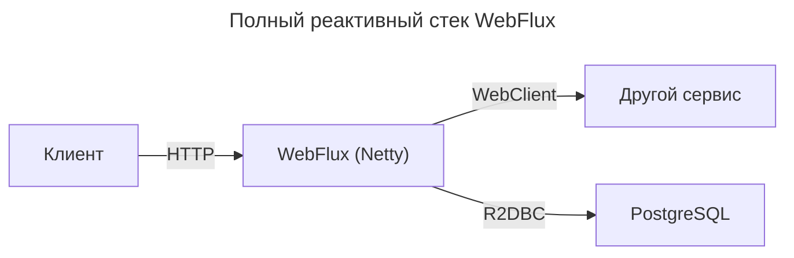

---
aliases:
  - Backpressure
  - Cold Publisher
  - Event loop
  - Flux
  - Functional Endpoint
  - Hot Publisher
  - Mono
  - Mono.fromCallable
  - Mono.just
  - Netty
  - Project Reactor
  - Publisher
  - R2DBC
  - Reactive Streams
  - RestTemplate
  - Spring WebFlux
  - Subscriber
  - Subscription
  - WebClient
  - WebFlux
  - Обратное давление
  - Реактивные потоки
---

## Spring WebFlux

**Суть**
Spring WebFlux — это современный реактивный веб-фреймворк в экосистеме Spring, предназначенный для построения асинхронных, неблокирующих и масштабируемых веб-приложений.

## Зачем нужен WebFlux

### Проблема традиционного подхода (Spring MVC)

Spring MVC использует блокирующую модель с потоками (thread-per-request). При высокой нагрузке (тысячи одновременных запросов) создаётся много потоков → высокое потребление памяти и переключение контекста → низкая масштабируемость.

### Реактивная модель

- Один поток может обслуживать тысячи запросов, потому что он не ждёт завершения I/O (база, сеть, файлы), а переключается на другие задачи.
- Используется неблокирующая асинхронная модель на основе событий.

WebFlux позволяет эффективно использовать ресурсы сервера при высокой нагрузке и долгих I/O-операциях (например, чаты, стриминг, микросервисы с вызовами API).

## Основные понятия

### Reactive Streams

- Стандарт асинхронной обработки данных с обратным давлением (backpressure).
- Ключевые интерфейсы: `Publisher<T>`, `Subscriber<T>`, `Subscription`.
- В Spring это реализовано через Project Reactor.

### Project Reactor

- Реализация Reactive Streams от Pivotal (теперь VMware).
- Основные типы:
  - `Mono<T>` — 0 или 1 элемент (например, один пользователь по ID)
  - `Flux<T>` — 0..N элементов (например, список заказов, стрим событий)

```java
// Примеры
Mono<User> findById(String id);
Flux<Order> findAllOrders();
```

## Два стиля программирования в WebFlux

### Annotated Controller

Знакомый стиль с аннотациями `@RestController`, `@GetMapping` и т. д. — но возвращает `Mono`/`Flux`:

```java
@RestController
public class UserController {

    @GetMapping("/users/{id}")
    public Mono<User> getUser(@PathVariable String id) {
        return userService.findById(id);
    }

    @GetMapping("/users")
    public Flux<User> getAllUsers() {
        return userService.findAll();
    }
}
```

### Functional Endpoint

Использует маршрутизацию через лямбды и `RouterFunction`:

```java
@Configuration
public class UserRouter {

    @Bean
    public RouterFunction<ServerResponse> route(UserHandler handler) {
        return RouterFunctions
            .route(GET("/users/{id}"), handler::getUser)
            .andRoute(GET("/users"), handler::getAllUsers);
    }
}
```

Функциональный стиль ближе к функциональному программированию, в нём меньше магии и он лучше подходит для композиции.

## Как работает WebFlux под капотом

- Не требует [[servlet-api|servlet-api]] (в отличие от Spring MVC).
- Может работать на:
  - реактивных серверах: Netty (по умолчанию), Undertow, Tomcat (в неблокирующем режиме)
  - Servlet-контейнерах (Tomcat, Jetty) — но тогда теряется часть преимуществ
- [[event-loop|event-loop]] архитектура (как в Node.js) → меньше потоков, выше эффективность

Netty + WebFlux — идеальный стек для высоконагруженных реактивных сервисов.

## Когда использовать WebFlux

| Сценарий | Рекомендация |
|---------|---------------|
| Высокая нагрузка, много одновременных подключений (чат, IoT, стриминг) | WebFlux |
| Микросервисы с вызовами других сервисов (через WebClient) | WebFlux |
| Использование реактивных баз данных (R2DBC, MongoDB Reactive) | WebFlux |
| Обычное CRUD-приложение с PostgreSQL/MySQL (JDBC) | Spring MVC (JDBC — блокирующий!) |
| Команда не знакома с реактивным программированием | Подумать дважды |

Важно: если используется JDBC (PostgreSQL, MySQL), WebFlux не даёт преимуществ, потому что JDBC — блокирующий. Нужны реактивные драйверы: R2DBC, Reactive MongoDB, Cassandra и т. д.

## WebClient — реактивный HTTP-клиент

Замена `RestTemplate` (устаревшему):

```java
@Service
public class ExternalService {

    private final WebClient client = WebClient.create("https://api.example.com");

    public Mono<User> fetchUser(String id) {
        return client.get()
            .uri("/users/{id}", id)
            .retrieve()
            .bodyToMono(User.class);
    }
}
```

Полностью неблокирующий, поддерживает backpressure.

## Пример полного реактивного стека



Весь стек — реактивный и неблокирующий.

## Когда не стоит использовать WebFlux

- Есть блокирующие зависимости (JDBC, старые библиотеки).
- Приложение CPU-intensive (математика, обработка видео) — реактивность не помогает.
- Команда не готова учить реактивное программирование (ошибки с `subscribe()`, backpressure — часты).
- Простое приложение с низкой нагрузкой — избыточно.

Reactive ≠ быстрее. Reactive = лучше масштабируется при I/O-нагрузке.

## Итог

Spring WebFlux — это не замена Spring MVC, а альтернатива для специфических сценариев. Он нужен, когда строятся:
- высоконагруженные I/O-bound приложения
- реактивный микросервисный стек
- системы реального времени (чаты, события, стримы)

**Основы использования**
1. Используйте `Mono`/`Flux` вместо обычных объектов.
2. Выбирайте реактивные зависимости (R2DBC, WebClient).
3. Запускайте на Netty (по умолчанию в WebFlux).
4. Избегайте блокирующего кода (`.block()`, `Thread.sleep()`).

## Mono vs Flux

Разделение на `Mono` и `Flux` в Project Reactor (основе Spring WebFlux) — не избыточность, а осознанное архитектурное решение, направленное на повышение ясности кода, оптимизацию производительности и лучшую обработку ошибок и семантики.

### Семантика: 0..1 vs 0..N

| Тип | Семантика | Аналог в Java |
|-----|-----------|---------------|
| `Mono<T>` | 0 или 1 элемент | `Optional<T>`, [[Future|CompletableFuture]]<T> |
| `Flux<T>` | 0, 1 или много элементов | `Stream<T>`, `List<T>` |

`Mono` чётко говорит: «Ожидаю один результат или ничего». `Flux` говорит: «Ожидаю поток данных — возможно, пустой, один или бесконечный».

```java
// Очевидно: один пользователь или ошибка
Mono<User> findUserById(String id);

// Очевидно: список заказов
Flux<Order> findOrdersByUserId(String userId);
```

Если бы использовался только `Flux`, нельзя было бы отличить:
- «Ожидаю один результат, но получил 2» — это ошибка?
- «Ожидаю много результатов, но получил 1» — это норма?

### Производительность и оптимизация

`Mono` — специализированная, облегчённая версия `Flux` для случая «один элемент»:
- меньше накладных расходов: `Mono` не тратит ресурсы на управление потоком из многих элементов
- быстрее: меньше проверок, меньше состояний
- лучше работает с backpressure: алгоритмы проще, так как максимум — 1 элемент

В бенчмарках `Mono.just(1)` быстрее, чем `Flux.just(1)`, особенно при цепочках операторов.

### Безопасность и предотвращение ошибок

Если ожидается один результат, а по ошибке приходят два — `Mono` обнаруживает проблему:

```java
Mono<User> user = userRepository.findById("123");
// Если в БД 2 записи с id=123 → Mono выкинет ошибку!
```

`Mono` гарантирует: максимум один элемент. Если источник пытается эмитить второй — выбрасывается `IllegalStateException`.

```java
Flux<User> users = userRepository.findByIdAsFlux("123");
// Может вернуть 0, 1, 2, 100 элементов → вы не узнаете, что что-то пошло не так.
```

Можно случайно обработать только первый элемент и проигнорировать остальные — скрытый баг.

### Удобство API и композиция

Многие операторы и методы имеют специфичные версии для `Mono`:

| Оператор | В `Mono` | В `Flux` |
|---------|--------|--------|
| Ожидание одного значения | `block()` | `blockFirst()`, `blockLast()` |
| Обработка пустого результата | `defaultIfEmpty()` | `defaultIfEmpty()` |
| Преобразование | `map()`, `flatMap()` | `map()`, `flatMap()` |
| Специфичные для Mono | `zipWith()`, `then()`, `switchIfEmpty()` | - |

```java
// Mono: легко выразить "сделать A, потом B, результат не нужен"
Mono<Void> saveAndNotify = userRepo.save(user)
    .then(emailService.sendWelcomeEmail(user)); // then() — только в Mono!

// В Flux это было бы громоздко
```

### Интеграция с внешними системами

Многие API возвращают один результат:
- HTTP-запрос → один ответ
- База данных → одна запись по PK
- Кэш (Redis) → одно значение по ключу

Использовать `Flux` здесь — избыточно и неестественно. `WebClient.get().retrieve().bodyToMono(User.class)` логично, а `bodyToFlux(User.class)` странно, если ожидается ровно один объект.

### А что если использовать только Flux

Технически — можно. Но:

| Проблема | Последствие |
|--------|-------------|
| Потеря семантики | Код становится неочевидным: сколько данных ожидать? |
| Риск ошибок | Дубликаты в «единственном» результате не вызовут ошибку |
| Лишняя сложность | Придётся писать `.take(1)` везде |
| Хуже производительность | Больше overhead для простых случаев |

Это как использовать `List<T>` везде, даже когда нужна только одна переменная — технически возможно, но нецелесообразно.

**Аналогия**
- Конверт (`Mono`) — в нём может быть 0 или 1 письмо.
- Коробка (`Flux`) — в ней может быть любое количество писем.

Класть одно письмо в коробку неудобно, тяжело и непонятно: сколько писем внутри? Точно так же использовать `Flux` для одного значения избыточно.

### Итог

| Причина | Объяснение |
|--------|------------|
| **Семантика** | Чётко различать «один» и «много» |
| **Безопасность** | Автоматическая проверка на дубликаты в `Mono` |
| **Производительность** | `Mono` оптимизирован под один элемент |
| **Удобство** | Специальные операторы (`then()`, `zipWith()`) |
| **Совместимость** | Естественное отображение на внешние API (HTTP, DB) |

`Mono` и `Flux` — это не дублирование, а специализация. Они делают реактивный код более выразительным, безопасным и эффективным.

## Publisher, Subscriber, Subscription

Интерфейсы `Publisher<T>`, `Subscriber<T>`, `Subscription` — это основа всей реактивной модели в WebFlux. Они приходят не из Spring, а из международного стандарта Reactive Streams. WebFlux (через Project Reactor) реализует этот стандарт, чтобы обеспечить совместимость, предсказуемость и управление backpressure между компонентами.

### Что такое Reactive Streams

[[reactor|Reactive Streams]] — это спецификация (набор интерфейсов), принятая в 2015 году компаниями Netflix, Pivotal (Spring), Lightbend (Akka), Oracle и др.

Цель: обеспечить асинхронную потоковую обработку данных с обратным давлением (backpressure) между различными библиотеками и средами выполнения.

Без этого стандарта каждая библиотека (RxJava, Reactor, Akka Streams) имела бы свой формат — и они не могли бы работать вместе.

### Четыре ключевых интерфейса

В спецификации всего 4 интерфейса (в пакете `org.reactivestreams`):

| Интерфейс | Роль |
|----------|------|
| `Publisher<T>` | Источник данных — может отправлять элементы подписчикам |
| `Subscriber<T>` | Потребитель данных — получает элементы от издателя |
| `Subscription` | Связь между ними — управляет подпиской и запросом данных |
| `Processor<T, R>` | (не обязателен) — и `Publisher`, и `Subscriber` одновременно |

WebFlux (через Project Reactor) реализует их в виде `Flux<T>` и `Mono<T>` (оба — `Publisher<T>`).

### Единый контракт для асинхронной передачи данных

Любой компонент, реализующий `Publisher<T>`, может быть подключён к любому `Subscriber<T>` — даже если они из разных библиотек.

```java
// WebClient возвращает Publisher (Flux)
Flux<User> users = webClient.get().retrieve().bodyToFlux(User.class);

// R2DBC репозиторий принимает Publisher
repository.saveAll(users); // saveAll(Flux<User>) → работает!
```

Это возможно только благодаря общему интерфейсу `Publisher`.

### Backpressure — обратное давление

Без backpressure потребитель может быть затоплен данными (OutOfMemoryError). Как это работает:
- `Subscriber` говорит `Publisher`: «Дай мне N элементов» (через `subscription.request(N)`).
- `Publisher` отправляет не больше N элементов.
- Когда потребитель готов — запрашивает ещё.

```java
// Упрощённо
public class MySubscriber implements Subscriber<String> {
    private Subscription subscription;

    @Override
    public void onSubscribe(Subscription s) {
        this.subscription = s;
        s.request(1); // Запросить 1 элемент
    }

    @Override
    public void onNext(String item) {
        System.out.println("Получил: " + item);
        subscription.request(1); // Запросить следующий
    }

    // ... onError, onComplete
}
```

Это предотвращает переполнение и делает систему устойчивой под нагрузкой.

`Flux` и `Mono` автоматически управляют backpressure, но поведение можно кастомизировать (`onBackpressureBuffer`, `onBackpressureDrop` и т. д.).

### Декларативность и композиция

Благодаря `Publisher` строятся цепочки обработки:

```java
Flux<String> stream = Flux.from(database)
    .filter(s -> s.length() > 5)
    .map(String::toUpperCase)
    .take(10);
```

Каждый оператор (`filter`, `map`) — это новый `Publisher`, обёрнутый вокруг предыдущего. Всё это работает только потому, что все они реализуют единый интерфейс `Publisher<T>`.

### Совместимость с другими реактивными библиотеками

Если есть `RxJava Flowable<T>` (реализует `Publisher<T>`) и `Reactor Flux<T>` (реализует `Publisher<T>`), между ними можно конвертировать:

```java
// RxJava → Reactor
Flux<String> flux = Flux.from(rxFlowable);

// Reactor → RxJava
Flowable<String> flowable = Flowable.fromPublisher(flux);
```

Это возможно только благодаря стандарту Reactive Streams.

### Интеграция с Spring и другими фреймворками

Spring WebFlux, Spring Data R2DBC, WebClient — все они принимают `Publisher<T>` как вход и возвращают `Publisher<T>` как выход.

```java
@GetMapping("/users")
public Flux<User> getUsers() {
    return userService.findAll(); // возвращает Flux = Publisher<User>
}
```

Spring знает, как подписаться, сериализовать в JSON и отправить по HTTP, потому что `Flux` — это `Publisher`.

**Аналогия: USB**

Любой производитель делает флешку с USB-разъёмом (реализует стандарт), любой компьютер имеет USB-порт (поддерживает стандарт) — они работают вместе, даже если от разных компаний. `Publisher`/`Subscriber` — это «USB для реактивных данных».

**Как это выглядит в коде (упрощённо)**

```java
// Project Reactor использует эти интерфейсы под капотом
public abstract class Flux<T> implements Publisher<T> { ... }
public abstract class Mono<T> implements Publisher<T> { ... }

// WebClient, R2DBC, Kafka и др. — всё через Publisher
public interface ReactiveCrudRepository<T, ID> {
    <S extends T> Mono<S> save(S entity);
    Flux<T> findAll();
}
```

**Как часто эти интерфейсы реализуются вручную**

В большинстве случаев не пишутся свои `Publisher` или `Subscriber` — используются:
- `Flux.just()`, `Flux.fromIterable()`
- `Mono.fromCallable()`
- операторы: `map`, `filter`, `flatMap`

Но знать интерфейсы важно, чтобы понимать, как работает backpressure, почему `Flux` и `Mono` совместимы с другими библиотеками и как устроена реактивная модель «под капотом».

**Итог**

Интерфейсы `Publisher`, `Subscriber`, `Subscription` — это основа стандарта Reactive Streams, который обеспечивает:
1. Совместимость между библиотеками
2. Безопасную асинхронную передачу данных
3. Управление backpressure (защиту от перегрузки)
4. Декларативную композицию потоков

## Когда Publisher выдаёт результат: ленивость

Publisher ничего не делает, пока на него не подпишутся. Это называется ленивая (lazy) инициализация.

**Жизненный цикл**
1. Создаётся `Publisher` (например, `Flux` или `Mono`) — код внутри ещё не выполнялся:
   ```java
   Mono<String> mono = Mono.fromCallable(() -> {
       System.out.println("Выполняюсь!");
       return "результат";
   });
   ```
   В этот момент ничего не печатается.
2. Кто-то подписывается (например, WebFlux при HTTP-запросе):
   ```java
   mono.subscribe(System.out::println);
   ```
   Только сейчас выполняется лямбда → печатается `"Выполняюсь!"` → приходит результат.

В контексте WebFlux: когда клиент делает HTTP-запрос, Spring подписывается на `Mono`/`Flux`, возвращённый контроллером. Только в этот момент запускается цепочка: `WebClient → R2DBC → логика → сериализация в JSON`.

Это позволяет избежать лишней работы: если клиент отменил запрос — подписка отменяется → данные не запрашиваются.

## Виды издателей: Cold vs Hot

Все `Publisher` делятся на три категории по поведению при подписке:

| Тип | Описание | Примеры |
|-----|---------|--------|
| **Cold Publisher** | При каждой подписке выполняет логику заново. Данные уникальны для каждого подписчика | `Mono.fromCallable()`, `Flux.range()`, `WebClient.get().bodyToMono()` |
| **Hot Publisher** | Выполняет логику один раз, рассылает данные всем подписчикам. Новые подписчики могут пропустить начало | `Flux.create()`, `Flux.publish()`, `Flux.replay()`, `Flux.interval()` |
| **Hybrid** | Может вести себя и как cold, и как hot в зависимости от настройки | `Flux.cache()`, `ReplayProcessor` |

```java
// Cold: каждый подписчик получает своё значение
Mono<Long> cold = Mono.fromCallable(System::nanoTime);
cold.subscribe(System.out::println); // 123456789
cold.subscribe(System.out::println); // 123456795 ← другое!

// Hot: все получают одно и то же
ConnectableFlux<Long> hot = Flux.just(System.nanoTime()).publish();
hot.subscribe(System.out::println);
hot.subscribe(System.out::println);
hot.connect(); // 123456789\n123456789 ← одинаково!
```

В WebFlux почти все Publishers — Cold, потому что каждый HTTP-запрос должен обрабатываться независимо.

## Mono.just vs Mono.fromCallable

| Характеристика | `Mono.just(value)` | `Mono.fromCallable(supplier)` |
|----------------|--------------------|-------------------------------|
| **Вычисление значения** | Сразу (в момент вызова `just()`) | Лениво (только при подписке) |
| **Тип значения** | Уже готовый объект | Код, который создаёт объект |
| **Исключения** | Если `value == null` → `NullPointerException` сразу | Исключение выбрасывается при подписке |
| **Использование** | Для констант, уже имеющихся данных | Для логики, которая может бросить исключение или быть дорогостоящей |

**Mono.just — значение уже есть**

```java
String data = "готовый результат";
Mono<String> mono = Mono.just(data); // data вычислена ДО just()
```

**Mono.fromCallable — логика при подписке**

```java
Mono<String> mono = Mono.fromCallable(() -> {
    // Дорогостоящая операция (HTTP, БД)
    return externalService.fetchData();
});
// Никакого вызова externalService НЕТ до подписки!
```

**Опасность `just()` с побочными эффектами**

```java
// ПЛОХО: externalService вызовется сразу, даже если никто не подпишется!
Mono<String> bad = Mono.just(externalService.fetchData());

// ХОРОШО: вызовется только при подписке
Mono<String> good = Mono.fromCallable(externalService::fetchData);
```

**Как WebFlux использует эти различия**

Сценарий: контроллер с `Mono.just()`:

```java
@GetMapping("/fast")
public Mono<String> fast() {
    return Mono.just("OK"); // Значение уже есть → подписка мгновенная
}
```

Spring сразу получает `"OK"` → сериализует в JSON → отправляет.

Сценарий: контроллер с `Mono.fromCallable()`:

```java
@GetMapping("/slow")
public Mono<User> slow() {
    return Mono.fromCallable(() -> db.loadUser()); // БД вызовется ПРИ ПОДПИСКЕ
}
```

При HTTP-запросе:
1. Spring подписывается на `Mono`.
2. Вызывается `db.loadUser()`.
3. Результат отправляется клиенту.

Это позволяет WebFlux быть неблокирующим: пока ожидается ответ от БД, event loop обрабатывает другие запросы.

**Итог**

| Вопрос | Ответ |
|--------|-------|
| **Когда Publisher выдаёт результат?** | Только при подписке (ленивая инициализация) |
| **Какие виды Publishers?** | Cold (на каждый запрос — новая логика), Hot (одна логика на всех), Hybrid |
| **`just()` vs `fromCallable()`** | `just()` — значение уже вычислено, `fromCallable()` — вычисляется при подписке |

В WebFlux почти всегда используются `fromCallable()`, `defer()`, `create()` для I/O-операций — чтобы не блокировать инициализацию и уважать ленивую семантику реактивности.
