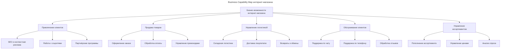

---
aliases:
  - APQC
  - ArchiMate
  - BCM
  - BPMN
  - Business Capability
  - Business Capability Map
  - Capability
  - TOGAF
  - Бизнес-возможность
  - Бизнес-карта возможностей
  - Возможность
---

## Business Capability Map

**Business Capability Map (Бизнес-карта возможностей)** — это **стратегический инструмент**, который **визуализирует ключевые способности (возможности) бизнеса**, необходимые для достижения его целей. Он показывает **«что» компания может делать**, а не «как» она это делает (это уже процессы и системы).

## Что такое Business Capability Map

**Определение**

**Business Capability Map (BCM)** — это **иерархическая схема**, которая **структурирует и классифицирует все ключевые способности (capabilities) бизнеса**, необходимые для выполнения его стратегии, миссии и достижения целей.

**Capability (возможность)** — это **способность организации выполнять определённую функцию или достигать определённого результата**, независимо от того, *как* это делается (через какие процессы, технологии или люди).

**Простыми словами**

- «Что наша компания умеет делать, чтобы быть успешной?»
- Это не про IT-системы, а про **бизнес-сущности**: *«Уметь продавать»*, *«Уметь управлять рисками»*, *«Уметь привлекать клиентов»*.

## Почему это важно

| Проблема | Как BCM решает |
| -------- | -------------- |
| Компания говорит: «Нам нужен новый CRM» | BCM показывает: «Нам нужна **способность управлять отношениями с клиентами**» — CRM лишь один из способов её реализации |
| IT-команда разрабатывает систему, которую не используют | BCM связывает IT с бизнес-целями — система создаётся только если она поддерживает **ключевую способность** |
| Нет понимания, какие области бизнеса критичны | BCM выявляет **ядро бизнеса** (core capabilities) и **второстепенные** (non-core) |
| При реорганизации — хаос | BCM помогает понять, **какие способности нужно сохранить, развить или упразднить** |
| Стратегия — это текст в презентации | BCM делает стратегию **визуальной, измеримой и управляемой** |

## Capability vs Process vs System

| Термин | Что описывает | Пример |
| ------ | ------------- | ------ |
| **Business Capability** | **Что** компания может делать? (цель) | *«Управлять клиентскими отношениями»* |
| **Business Process** | **Как** это делается? (шаги) | *«Обработка заявки клиента → проверка кредитной истории → отправка предложения»* |
| **IT System / Application** | **Средство**, с помощью чего это делается | *«CRM-система Salesforce»* |

BCM — это уровень стратегии. Процессы и системы — это **операционный уровень**. BCM связывает стратегию с операциями.

## Пример: Business Capability Map для банка

```mermaid
---
title: Business Capability Map банка
---
graph TD
    A[Бизнес-возможности банка] --> B[Привлечение клиентов]
    A --> C[Управление продуктами]
    A --> D[Управление рисками]
    A --> E[Обработка транзакций]
    A --> F[Управление финансами]
    A --> G[Поддержка клиентов]

    B --> B1[Привлечение физических лиц]
    B --> B2[Привлечение юридических лиц]
    B --> B3[Маркетинг и продвижение]

    C --> C1[Разработка кредитных продуктов]
    C --> C2[Разработка депозитных продуктов]
    C --> C3[Управление ценовой политикой]

    D --> D1[Оценка кредитного риска]
    D --> D2[Мониторинг мошенничества]
    D --> D3[Соответствие регуляторным требованиям]

    E --> E1[Обработка платежей]
    E --> E2[Обработка переводов]
    E --> E3[Обработка валютных операций]

    F --> F1[Управление капитализацией]
    F --> F2[Финансовая отчётность]
    F --> F3[Управление ликвидностью]

    G --> G1[Техническая поддержка]
    G --> G2[Обслуживание клиентов по телефону]
    G --> G3[Обслуживание в офисах]
```

**Что здесь показано**

- **Верхний уровень:** 6 ключевых **бизнес-возможностей**, которые определяют успех банка.
- **Нижний уровень:** конкретные **подвозможности** (например, «Оценка кредитного риска» — это не процесс, а способность).
- **Ничего про IT!** — нет упоминания о системах (Core Banking, CRM, BI и т.д.). Это **не техническая карта**, а **бизнес-карта**.

## Зачем нужна Business Capability Map

| Преимущество | Объяснение |
| ------------ | ---------- |
| **Связывает стратегию с операциями** | Не просто «нам надо больше продаж», а «нам нужно улучшить способность «Привлечение клиентов»» |
| **Помогает принимать решения о IT-инвестициях** | Не «купим CRM», а «улучшим способность «Управление клиентами»» — для этого подойдут CRM, AI, аналитика |
| **Упрощает коммуникацию между бизнесом и IT** | Обе стороны говорят на одном языке: «возможности» |
| **Позволяет измерять прогресс** | «Мы улучшили способность «Обработка заказов» с 3 до 5 по шкале 1–5» |
| **Подходит для любой отрасли** | От банка до школы — любая организация имеет возможности |

## Построение Business Capability Map

### Определение бизнес-цели

«Что мы хотим достичь через 3–5 лет?» Например: *«Стать лидером по выдаче кредитов для малого бизнеса в регионе»*.

### Ключевые бизнес-возможности

Ключевой вопрос: *«Что нам нужно уметь делать, чтобы достичь этой цели?»*

Пример для банка:

- Привлечение клиентов
- Оценка кредитного риска
- Разработка продуктов
- Обработка транзакций
- Поддержка клиентов

Используются **стандартные модели** (например, **TOGAF**, **ArchiMate**, **APQC**) — они содержат готовые шаблоны для разных отраслей.

### Декомпозиция на подвозможности

Каждая возможность разбивается на более мелкие компоненты:

| Возможность | Подвозможности |
|------------|----------------|
| **Привлечение клиентов** | Привлечение физлиц, привлечение юрлиц, маркетинг, партнёрские программы |
| **Управление рисками** | Оценка кредитного риска, мониторинг мошенничества |

### Иерархия

Создаётся дерево:

- Бизнес-возможности
  - Привлечение клиентов
    - Привлечение физлиц
    - Привлечение юрлиц
    - Маркетинг
  - Управление рисками
    - Оценка кредитного риска
    - Мониторинг мошенничества

### Связь со стратегическими инициативами

К каждой возможности добавляются:

- **Текущее состояние** («Плохо» / «Средне» / «Хорошо»)
- **Желаемое состояние** («Хорошо» / «Отлично»)
- **Инициатива** («Внедрить AI-скоринг»)

| Возможность | Текущее состояние | Желаемое | Инициатива |
|------------|------------------|----------|-----------|
| Оценка кредитного риска | Средне | Отлично | Внедрить ML-модель скоринга |

### Интеграция с другими моделями

- **Связь с BPMN:** какие процессы поддерживают каждую возможность?
- **Связь с IT-архитектурой:** какие системы поддерживают каждую возможность?
- **Связь с Roadmap:** какие инициативы реализуются и в каком году?

## Пример: Business Capability Map для онлайн-магазина

**Что показывает эта карта**

- Инвестиции в CRM → улучшение **обслуживания клиентов**
- Внедрение WMS → улучшение **логистики**
- Найм аналитика → улучшение **управления ассортиментом**

## Где используется

| Отрасль | Пример применения |
|--------|-------------------|
| **Банки** | Определение, какие возможности нужно цифровизировать (кредитный скоринг, KYC) |
| **Ритейл** | Понимание, как улучшить «управление запасами» или «предложение персонализированных акций» |
| **Медицина** | Карта возможностей: «Приём пациентов», «Выписка рецептов», «Контроль лекарств» |
| **Логистика** | «Управление маршрутами», «Трекинг грузов», «Оптимизация складов» |
| **Корпорации** | При слиянии компаний — сравнение их возможностей и выявление дублирования |
| **Госуслуги** | Карта: «Выдача паспорта», «Регистрация ИП», «Налоговая отчётность» |
