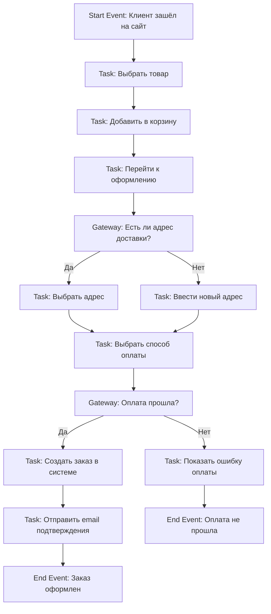
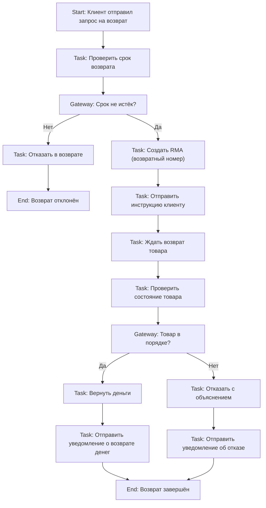
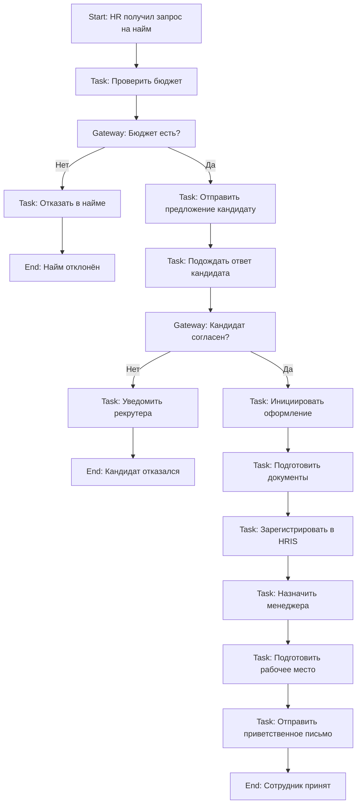

**BPMN (Business Process Model and Notation)** — это **международный стандарт** для **визуального моделирования бизнес-процессов**. Он позволяет **наглядно, точно и однозначно** описывать, как работают бизнес-процессы — от заказа до доставки, от оформления кредита до обработки возврата.

---

## ✅ Что такое **BPMN (Business Process Model and Notation)**?

### 🔹 Определение:
> **BPMN** — это **стандартная графическая нотация** (набор символов и правил), разработанная **OMG (Object Management Group)**, для **моделирования бизнес-процессов** таким образом, чтобы их могли понять:
- **Бизнес-аналитики**
- **Разработчики**
- **Тестировщики**
- **Руководители**
- **Клиенты**

> 💡 **BPMN — это «язык» для рисования процессов.**  
> Как UML — для систем, так BPMN — для процессов.

---

## ✅ Зачем нужен BPMN?

| Проблема | Как BPMN решает |
|----------|------------------|
| ❌ Бизнес говорит: «Нужно ускорить обработку заказов» | ✅ Рисуем текущий процесс → видим, где задержки |
| ❌ Разработчики не понимают, что от них хотят | ✅ BPMN-диаграмма — точный «технический» рецепт для разработки |
| ❌ Процессы описаны в Word-документах — никто не читает | ✅ Диаграмма — визуальная, понятна даже менеджеру без технического бэкграунда |
| ❌ При изменении процесса — всё ломается | ✅ BPMN-диаграмму можно **сгенерировать в код** (BPMN 2.0) → автоматизировать в системах (Camunda, Activiti, Flowable) |
| ❌ Нет единого представления процесса | ✅ BPMN — единый язык для всех участников проекта |

> ✅ **BPMN — это мост между бизнесом и IT.**

---

## ✅ Основные элементы BPMN (5 ключевых групп)

| Группа                    | Символ                                                                                         | Назначение                               | Пример                                                                 |
| ------------------------- | ---------------------------------------------------------------------------------------------- | ---------------------------------------- | ---------------------------------------------------------------------- |
| **1. Flow Objects**       |              | Основные «строительные блоки» процесса   | **События, Действия, Шлюзы**                                           |
| **2. Connecting Objects** |  | Связывают элементы                       | **Потоки (Sequence Flow), Сообщения (Message Flow)**                   |
| **3. Swimlanes**          |                    | Показывают, **кто** отвечает за действия | **Пул (Pool)** — система/организация **Полоса (Lane)** — роль/отдел |
| **4. Artifacts**          |                    | Дополнительная информация                | **Данные, Заметки, Группы**                                            |
| **5. Data**               |                              | Управление данными в процессе            | **Вход/выход данных, данные-объекты**                                  |

---

## 🧩 Ключевые символы (на практике)

| Символ | Название | Значение |
|--------|----------|----------|
| 🟢 **Круг** | **Event (Событие)** | Что **начинает** или **заканчивает** процесс • `Start Event` — начало • `End Event` — окончание • `Intermediate Event` — промежуточное событие (например, «таймаут», «получено сообщение») |
| 🔲 **Прямоугольник с закруглёнными углами** | **Activity (Действие)** | Работа, которую нужно выполнить • `Task` — простая задача • `Sub-Process` — вложенный процесс (например, «Проверка клиента») |
| 🔷 **Ромб** | **Gateway (Шлюз)** | Решение: **какой путь выбрать?** • `Exclusive Gateway` — один из путей (XOR) • `Inclusive Gateway` — один или несколько (OR) • `Parallel Gateway` — все пути одновременно (AND) |
| ➡️ **Стрелка** | **Sequence Flow** | Порядок выполнения действий внутри одного пула |
| ↔️ **Пунктирная стрелка** | **Message Flow** | Обмен сообщениями **между разными участниками** (пулами) |
| 🏊 **Пул (Pool)** | Участник процесса | Например: «Клиент», «Сайт», «Бухгалтерия» |
| 🚦 **Полоса (Lane)** | Роль внутри пула | Например: в пуле «Сайт» — полосы: «Frontend», «API», «База данных» |

---

## ✅ Пример 1: **Оформление заказа в интернет-магазине**

### 🎯 Цель:  
Показать, как клиент оформляет заказ, а система обрабатывает его.

### 📊 BPMN-диаграмма (текстовое описание):

### 🔍 Что здесь происходит?

| Элемент | Роль |
|--------|------|
| **Пул** | `Клиент` + `Сайт` (два участника) |
| **Полосы** | В пуле «Сайт»: `Frontend`, `Backend`, `База данных` |
| **События** | Начало (клиент зашёл), конец (заказ оформлен) |
| **Задачи** | «Добавить в корзину», «Отправить email» |
| **Шлюзы** | Решения: «Есть адрес?», «Оплата прошла?» |
| **Сообщения** | Сайт → Клиент: «Подтверждение заказа» |

> ✅ **Это не просто схема — это точная спецификация**, которую можно автоматизировать в Camunda, Flowable, SAP или другом BPMN-движке.

---

## ✅ Пример 2: **Обработка возврата товара в компании**

### 🎯 Цель:  
Как клиент возвращает товар, и как компания обрабатывает возврат.

### 📊 BPMN-диаграмма (кратко):

### ✅ Почему это полезно?

| Преимущество | Объяснение |
|--------------|------------|
| ✅ **Видно, где задержки** | Например, «Ждать возврат товара» — может занимать 7 дней |
| ✅ **Видно, кто отвечает** | Клиент — отправляет, отдел возвратов — проверяет, бухгалтерия — возвращает деньги |
| ✅ **Можно автоматизировать** | Система может:   • Автоматически генерировать RMA при условии «срок не истёк»   • Отправлять email через шаблон |
| ✅ **Можно тестировать** | Можно проверить все ветки: «возврат с браком», «срок истёк», «оплата не прошла» |
| ✅ **Можно обучать сотрудников** | Новая сотрудница смотрит на диаграмму — и сразу понимает, как обрабатывать возврат |

---

## ✅ Пример 3: **Создание нового сотрудника (HR-процесс)**

> ✅ Этот процесс можно **автоматизировать в HR-системе** (например, SAP SuccessFactors), чтобы:
> - При получении запроса — автоматически проверялся бюджет
> - При согласии кандидата — генерировались документы
> - При оформлении — создавался аккаунт в Active Directory

---

## ✅ Преимущества BPMN

| Преимущество | Объяснение |
|--------------|------------|
| ✅ **Универсальный язык** | Понятен бизнесу, IT, тестировщикам, руководству |
| ✅ **Визуальный** | Диаграмма — быстрее понять, чем 20 страниц Word |
| ✅ **Точность** | Каждый символ имеет строгое значение — нет двусмысленности |
| ✅ **Автоматизация** | BPMN 2.0 — это **не только схема, а исполняемый XML-код** |
| ✅ **Поддержка инструментов** | Camunda, Activiti, Flowable, Signavio, Bizagi, ARIS, Lucidchart |
| ✅ **Соответствие стандартам** | ISO 19510 — международный стандарт моделирования процессов |

---

## ✅ Где используется BPMN?

| Отрасль | Пример применения |
|--------|-------------------|
| 🏦 **Банки** | Выдача кредита, проверка клиента, обработка заявки |
| 🏥 **Медицина** | Приём пациента, назначение диагноза, выписка |
| 🛒 **E-commerce** | Оформление заказа, обработка возврата, доставка |
| 🏢 **HR** | Приём на работу, увольнение, обучение |
| 🚚 **Логистика** | Отгрузка, таможня, доставка |
| 🏭 **Производство** | Запуск линии, контроль качества, обслуживание оборудования |
| 🏛️ **Госуслуги** | Получение паспорта, регистрация ИП, подача налоговой декларации |

---

## ✅ Как создать BPMN-диаграмму?

### 🔧 Инструменты:
| Инструмент | Особенности |
|-----------|-------------|
| **Camunda Modeler** | Бесплатный, профессиональный, поддерживает BPMN 2.0 + автоматизация |
| **Lucidchart** | Онлайн, дружелюбный, шаблоны, интеграция с Confluence |
| **Draw.io / diagrams.net** | Бесплатно, легко, можно экспортировать в PNG/PDF |
| **Signavio** | Корпоративный, мощный, для больших процессов |
| **Bizagi Modeler** | Для бизнес-аналитиков, с визуальным дизайном |
| **Visual Paradigm** | Поддерживает BPMN + UML + ERD |

> ✅ **Рекомендация для новичков**: начните с **draw.io** — бесплатно, без регистрации.

---

## ✅ Лучшие практики

| Правило | Объяснение |
|--------|-----------|
| ✅ **Начинайте с цели** | Не рисуйте «всё сразу» — сначала определите: «Что мы хотим улучшить?» |
| ✅ **Используйте пул и полосы** | Показывайте, **кто** делает **что** — это ключ к пониманию |
| ✅ **Не перегружайте диаграмму** | Если больше 15–20 элементов — разбейте на подпроцессы |
| ✅ **Используйте имена** | Называйте задачи глаголами: «Отправить письмо», а не «Письмо» |
| ✅ **Согласуйте с бизнесом** | Покажите диаграмму менеджеру — если он не понимает — перерисуйте |
| ✅ **Создавайте версии** | `v1.0`, `v1.1` — процессы меняются! |

---

## ✅ Финальный вывод: Когда использовать BPMN?

| Ситуация | Рекомендация |
|----------|--------------|
| ✅ Вы описываете **сложный бизнес-процесс** | → **Используйте BPMN** |
| ✅ Вы **автоматизируете процесс** (BPM-система) | → **Используйте BPMN 2.0** |
| ✅ Вы **обучаете сотрудников** | → **Используйте BPMN** — нагляднее, чем инструкции |
| ✅ Вы **договариваетесь с IT** | → **BPMN — ваш общий язык** |
| ✅ Вам нужно **документировать процесс** | → **BPMN — стандартный формат** |
| ✅ У вас простой процесс в 3 шага | → Можно и без BPMN — просто список |

---

## 💬 Цитата от эксперта

> _«BPMN — это не про то, как рисовать красивые схемы.  
> Это про то, чтобы **бизнес и IT перестали говорить на разных языках**.»_  
> — **BPMN Specification Group, OMG**

---

## ✅ Итог: Что вы получаете с BPMN?

| Что было | Что стало |
|----------|------------|
| Размытые требования: «Сделайте, чтобы заказы быстрее обрабатывались» | ✅ Чёткая диаграмма: «Почему заказы медленно обрабатываются — вот где задержка» |
| Споры: «А как это работает?» | ✅ Диаграмма — **единственный источник правды** |
| Ручная работа | ✅ Возможность **автоматизировать** процесс |
| Непонимание между отделами | ✅ **Один язык для всех** — бизнес, IT, QA, руководство |

---

✅ **BPMN — это не просто схема. Это инструмент управления бизнесом.**  
Используйте его — и вы перестанете слышать:  
> _«А я думал, ты имел в виду другое»_  
> _«А почему мы это делаем именно так?»_  
> _«А где в системе это реализовано?»_

**BPMN — ваша гарантия, что все понимают одно и то же.**