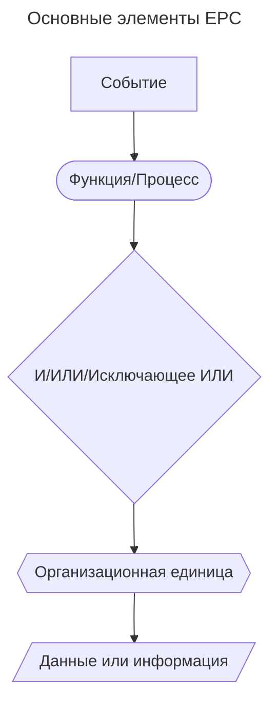

---
aliases:
  - EPC
  - Event-Driven Process Chain
  - Событийная цепочка процессов
---
## EPC — Event-Driven Process Chain

EPC-диаграммы подходят для моделирования бизнес-процессов, где важно показать причинно-следственные связи между событиями и функциями.

**Структурные единицы схемы**

1. **События** — всегда начинают или завершают процесс.
2. **Функции** — преобразуют входы в выходы.
3. **Операторы** — показывают логику ветвления.
4. **Организационные единицы** — указывают ответственность.
5. **Данные** — показывают информационные потоки.

**Основные элементы**



**Пример: логистическая цепочка**

```mermaid
---
title: Пример: логистическая цепочка
---
flowchart LR
    %% Логистический процесс
    A[Заказ размещен] --> B{Проверить склад}

    B --> C[Товар на основном складе]
    B --> D[Товар на региональном складе]
    B --> E[Товара нет в наличии]

    C --> F[Подготовить к отправке]
    D --> G[Переместить между складами]
    E --> H[Заказать производство]

    F --> I[Готов к отправке]
    G --> J[Товар перемещен]
    H --> K[Товар произведен]

    I --> L{ }
    J --> L
    K --> L

    L --> M[Организовать доставку]
    M --> N[Доставка назначена]
    N --> O[Товар в пути]
    O --> P[Товар доставлен]
```

**Пример: процесс найма сотрудника**

```mermaid
---
title: Пример: процесс найма сотрудника
---
flowchart TD
    %% Инициация процесса
    A[Открыта вакансия] --> B{Определить требования}
    B --> C[Требования определены]

    C --> D[Разместить вакансию]
    D --> E[Кандидаты откликнулись]

    E --> F{Отбор кандидатов}
    F --> G[Кандидаты отобраны]
    F --> H[Нет подходящих кандидатов]

    H --> D

    G --> I[Провести собеседования]
    I --> J[Собеседования завершены]

    J --> K{Принять решение}
    K --> L[Кандидат выбран]
    K --> M[Отклонить всех кандидатов]

    M --> D
    L --> N[Выставить оффер]
    N --> O[Оффер принят]

    O --> P[Подготовить документы]
    P --> Q[Сотрудник принят на работу]
```

**Базовый пример: обработка заказа**

```mermaid
---
title: Базовый пример: обработка заказа
---
flowchart
    %% Events (События)
    A[Заказ получен] --> B{Проверить доступность товара}

    %% Functions (Функции/Процессы)
    B --> C[Товар доступен]
    B --> D[Товара нет в наличии]

    C --> E[Собрать заказ]
    D --> F[Заказать у поставщика]

    E --> G[Заказ собран]
    F --> H[Товар получен от поставщика]

    G --> I[Упаковать заказ]
    H --> I

    I --> J[Заказ упакован]
    J --> K[Отправить заказ]
    K --> L[Заказ доставлен]

    %% Logical Operators
    C --> |И| M{ }
    D --> |ИЛИ| M
    M --> N[Обновить инвентарь]
```
