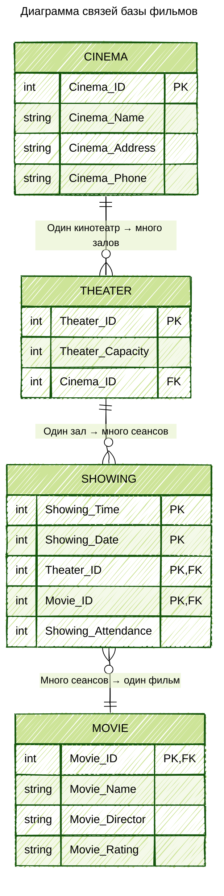

---
aliases:
  - Entity-Relationship diagram
  - erd
  - ER-diagram
  - ER diagram
  - Диаграмма связей
---
**ER-диаграмма (Entity-Relationship diagram)** — это визуальное представление структуры базы данных, которое показывает сущности, их атрибуты и связи между ними. Она используется для проектирования и документирования структуры данных.

**Основные компоненты ER-диаграммы**
1. **Сущности (Entities)** — прямоугольники
	- Представляют таблицы в БД
	- Пример: `Пользователь`, `Заказ`, `Товар`
2. **Атрибуты (Attributes)** — овалы
	- Поля таблиц
	- Пример: `id`, `имя`, `email`, `дата_создания`
 3. **Связи (Relationships)** — ромбы
	- Отношения между сущностями    
	- Пример: "один-ко-многим", "многие-ко-многим"
4. **Ключи**
	- **Первичный ключ (PK)** — уникальный идентификатор
	- **Внешний ключ (FK)** — ссылка на первичный ключ другой таблицы

