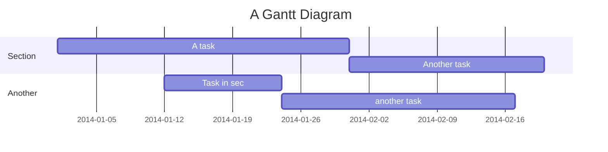
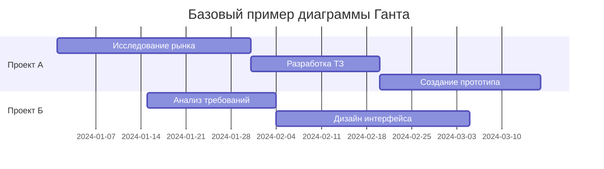
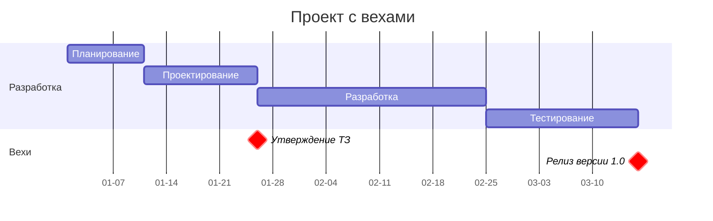
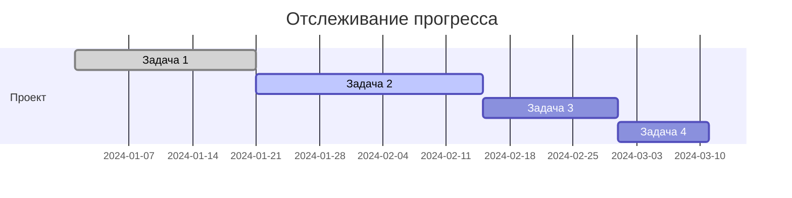

---
aliases:
  - диаграмма Ганта
  - Gantt
  - Gantt diagram
---
## Что такое диаграмма Ганта?

**Диаграмма Ганта** — это популярный тип столбчатых диаграмм, который используется для иллюстрации плана, графика работ по проекту. Названа в честь американского инженера Генри Ганта, который разработал этот метод в 1910-х годах. #👨 

## Основные компоненты диаграммы Ганта

**Ключевые элементы**
- **Задачи/работы** - горизонтальные строки
- **Временные интервалы** - горизонтальные полосы
- **Вехи (Milestones)** - ключевые точки контроля
- **Зависимости** - связи между задачами
- **Прогресс выполнения** - заполнение полос
- **Критический путь** - последовательность зависимых задач

**Практические выгоды**
- 📊 **Наглядность** - весь проект в одном представлении
- ⏱️ **Точное планирование** - визуализация сроков
- 🔗 **Учет зависимостей** - видно связи между задачами
- 📈 **Отслеживание прогресса** - текущий статус выполнения
- 🎯 **Выявление проблем** - перекрытия, задержки, ресурсные конфликты

## Типы диаграмм Ганта

### **1. Базовая диаграмма Ганта**

### **2. Диаграмма с вехами**

### **3. Диаграмма с прогрессом**

**Используйте диаграммы Ганта**, когда вам нужно:
- Планировать сложные проекты с множеством зависимостей
- Визуализировать временные линии для стейкхолдеров
- Отслеживать прогресс и выявлять потенциальные задержки
- Оптимизировать использование ресурсов команды