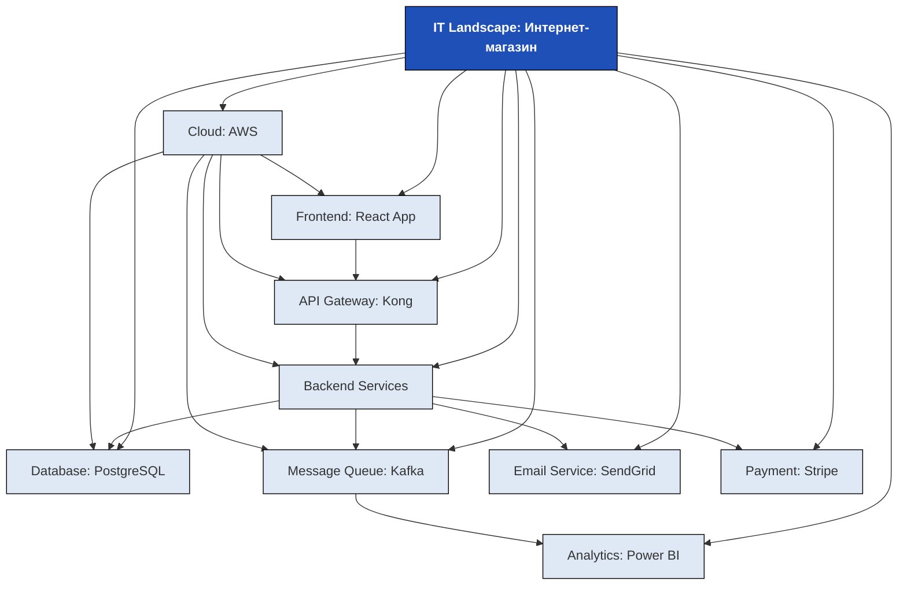

**IT Landscape Map (Карта IT-ландшафта)** — это **визуальная, структурированная картина всех IT-систем, технологий, данных и инфраструктуры**, которые используются в организации. Она показывает **«что есть»** в IT-среде — не как оно *должно быть*, а как оно **реально работает сегодня**.

---

## ✅ Что такое **IT Landscape Map**?

### 🔹 Определение:
> **IT Landscape Map** — это **карта, которая отображает все IT-активы компании** (приложения, базы данных, серверы, API, интеграции, облачные сервисы, лицензии, владельцы и т.д.) и их **взаимосвязи**.

> 💡 Это **не диаграмма процессов** (как BPMN) и **не стратегия** (как Business Capability Map).  
> Это **фотография текущего состояния IT-инфраструктуры** — как «карта местности» для IT-архитектора.

---

## ✅ Что входит в IT Landscape Map?

Карта включает **три уровня** информации:

| Уровень                       | Что описывает    | Примеры                                                                                    |
| ----------------------------- | ---------------- | ------------------------------------------------------------------------------------------ |
| **1. Инвентаризация активов** | Что у нас есть?  | Приложения, базы данных, серверы, API, облака, лицензии, устройства                        |
| **2. Взаимосвязи**            | Как они связаны? | Какие системы обмениваются данными? Через какие API/интеграции?                            |
| **3. Метаданные**             | Кто, когда, как? | Владелец, срок поддержки, версия, технология, статус (legacy/active/cloud), SLA, стоимость |

### 🔍 Пример элементов карты:

| Элемент | Описание |
|--------|----------|
| **Система** | ERP (SAP), CRM (Salesforce), BI (Power BI), БД (PostgreSQL) |
| **Тип** | Корпоративная, SaaS, on-premise, облачная (AWS/Azure) |
| **Владелец** | Отдел: «Продажи», «IT», «Финансы» |
| **Интеграции** | `CRM → ERP` через REST API, `ERP → BI` через ETL |
| **Технология** | Java, .NET, Python, Kafka, Docker, Kubernetes |
| **Статус** | Legacy (устаревшая), Active, Planned for replacement |
| **Дата внедрения** | 2018 |
| **Срок поддержки** | 2025 (после — больше не поддерживается) |
| **Стоимость** | $50K/год (лицензии + поддержка) |
| **Зависимости** | Используется 12 отделами, 300 пользователями |

---

## ✅ Пример: IT Landscape Map для интернет-магазина

### 🔍 Что здесь показано?
- **Frontend** (React) → **API Gateway** → **Backend Services** → **База данных (PostgreSQL)**  
- **Кafka** — передаёт события в **Power BI** для аналитики  
- Всё размещено в **AWS**  
- **SendGrid** — устаревший сервис (помечен как legacy)  
- **Stripe** — внешний SaaS-сервис (интегрирован через API)

> ✅ **Вы видите:**
> - Где **дублирование**? (нет — всё логично)
> - Где **риски**? (SendGrid — legacy, может перестать работать)
> - Где **возможности для оптимизации**? (перенести всё в облако — уже сделано!)
> - Кто **отвечает за что**? (по названию систем — можно назначить владельцев)

---

## ✅ Как создать IT Landscape Map? (Пошагово)

### ✅ Шаг 1: **Определите цель**
> _«Зачем нам карта?»_  
> — Для миграции в облако?  
> — Для слияния с другой компанией?  
> — Для снижения затрат на IT?  
> — Для устранения дублирования?

### ✅ Шаг 2: **Соберите инвентаризацию**
Создайте таблицу (в Excel, Notion, Confluence) с полями:

| Название системы | Тип (SaaS/on-prem) | Владелец | Технология | Статус | Дата внедрения | Срок поддержки | Стоимость | Интеграции |
|------------------|--------------------|----------|------------|--------|----------------|----------------|-----------|-------------|
| CRM Salesforce   | SaaS               | Продажи  | REST API   | Active | 2020           | 2027           | $40K/год  | ERP, Email  |
| Бухгалтерия 1С   | on-prem            | Финансы  | .NET       | Legacy | 2015           | 2024           | $15K/год  | ERP, BI     |
| Kafka            | Cloud (AWS)        | IT       | Java       | Active | 2022           | —              | $8K/год   | CRM, BI     |

### ✅ Шаг 3: **Определите связи (интеграции)**
Используйте:
- Техническую документацию
- Архитектурные схемы
- Диаграммы API (Postman, Swagger)
- Логи систем
- Интервью с разработчиками

> ✅ **Важно:** Не просто «CRM → ERP», а:  
> _«CRM (REST API v2) → ERP (SOAP через мост) — передаётся заказ, клиент, платеж»_

### ✅ Шаг 4: **Визуализируйте**
Используйте инструменты:

| Инструмент | Плюсы |
|------------|-------|
| **Lucidchart** | Простой, шаблоны, легко делиться |
| **Draw.io / diagrams.net** | Бесплатно, экспортирует в PNG/PDF |
| **Miro** | Коллаборация в реальном времени |
| **Enterprise Architect** | Профессионально, для больших компаний |
| **ServiceNow / LeanIX / Apptio** | Коммерческие платформы для IT-архитектуры |

> 💡 Используйте **цвета**:
> - 🟢 **Active** — зелёный  
> - 🟡 **Legacy** — жёлтый  
> - 🔴 **Planned for retirement** — красный  
> - 🔵 **Cloud** — синий  
> - 🟠 **On-prem** — серый

### ✅ Шаг 5: **Свяжите с бизнесом**
Добавьте **связи с Business Capability Map**:
> _«CRM поддерживает способность “Управление отношениями с клиентами”»_  
> _«Kafka поддерживает способность “Аналитика событий в реальном времени”»_

### ✅ Шаг 6: **Обновляйте регулярно**
- Обновляйте **каждые 3–6 месяцев**  
- Добавляйте новые системы  
- Удаляйте устаревшие  
- Отмечайте, когда система выходит из поддержки

---

## ✅ Как IT Landscape Map связана с другими картами?

| Карта                                      | Что показывает                            | Как связана с IT Landscape Map                                                  |
| ------------------------------------------ | ----------------------------------------- | ------------------------------------------------------------------------------- |
| **Business Capability Map**                | Что бизнес умеет делать                   | IT Landscape Map показывает, **какие системы поддерживают каждую способность**  |
| **BPMN (Процессы)**                        | Как работают бизнес-процессы              | IT Landscape Map показывает, **какие системы участвуют в каждом шаге процесса** |
| **Application Portfolio Management (APM)** | Какие приложения есть и сколько они стоят | IT Landscape Map — **визуализация APM**                                         |
| **Enterprise Architecture (TOGAF)**        | Общая архитектура компании                | IT Landscape Map — **основной инструмент для реализации TOGAF**                 |

> ✅ **IT Landscape Map — это «мост» между бизнесом и IT.**

---

## ✅ Пример: Как IT Landscape Map помогает при миграции в облако

**Цель:** Перенести 3 legacy-системы в AWS за 6 месяцев.

**Без карты:**  
> «Мы перенесём CRM — а потом вдруг выясняем, что она связана с 5 другими системами, и одна из них — устаревший Excel-файл с ручным обновлением...»

**С картой:**  
> 1. Видим, что CRM → ERP → BI → Excel  
> 2. Выявляем: Excel — **наибольший риск**  
> 3. Планируем:  
>    - Сначала заменить Excel → на Power BI  
>    - Потом перенести CRM  
>    - Потом ERP  
> 4. Оцениваем стоимость и риски  
> 5. Получаем **реальный, обоснованный план**

---

## ✅ Преимущества IT Landscape Map

| Преимущество | Объяснение |
|--------------|------------|
| ✅ **Устраняет "черные ящики"** | Больше нет «А эта система вообще кто-то использует?» |
| ✅ **Помогает сократить затраты** | Выявляет дублирующие системы (например, 3 CRM) |
| ✅ **Ускоряет цифровую трансформацию** | Знаете, что переносить, что заменять, что оставить |
| ✅ **Повышает безопасность** | Видите, какие системы не обновлялись 5 лет — и где уязвимости |
| ✅ **Упрощает аудит** | Легко показать регулятору: «Вот все системы, которые работают с персональными данными» |
| ✅ **Улучшает коммуникацию** | Бизнес и IT говорят на одном языке: «Эта система — она поддерживает продажи» |

---

## ✅ Частые ошибки

| Ошибка | Последствия | Как исправить |
|--------|-------------|----------------|
| ❌ Создавать карту только в IT | Бизнес не понимает её | ✅ Вовлекайте бизнес-аналитиков, владельцев систем |
| ❌ Слишком много деталей | Карта становится нечитаемой | ✅ Ограничьтесь 10–30 системами — фокус на критичных |
| ❌ Не обновлять | Карта — музейная экспозиция | ✅ Обновляйте **каждые 3 месяца** |
| ❌ Использовать только как презентацию | Карта не используется в работе | ✅ Интегрируйте в **Jira, Confluence, ServiceNow** — пусть живёт |
| ❌ Не связывать с бизнес-возможностями | Карта — просто список систем | ✅ Добавьте колонку: «Поддерживает capability: Управление клиентами» |

---

## ✅ Итог: Что вы получаете?

| До | После |
|----|-------|
| «У нас 40 систем, но никто не знает, как они работают» | ✅ **Полная карта: что есть, как связано, кто владеет, сколько стоит, когда умрёт** |
| «Мы не можем перейти в облако — боимся сломать» | ✅ **Мы знаем, что переносить первым, что можно убрать, что нужно заменить** |
| «Кто ответственный за эту систему?» | ✅ **Владелец: Иванов И.И., отдел продаж, срок поддержки: 2025** |
| «Почему мы платим за 3 CRM?» | ✅ **Одна — активная, две — legacy — будем убирать в этом квартале** |

---

## 💬 Цитата от эксперта

> _«IT Landscape — это не диаграмма. Это ваша память.  
> Без неё — вы каждый раз начинаете с нуля.  
> С ней — вы знаете, откуда пришли, и куда идти.»_  
> — **Gartner, Enterprise Architecture**

---

## ✅ Рекомендация: Начните прямо сейчас

1. **Выберите 3 ключевые системы** (CRM, ERP, BI)
2. **Найдите их владельцев**
3. **Запишите, как они связаны**
4. **Нарисуйте простую схему в Draw.io**
5. **Покажите руководителю — и спросите: «А вы знали, что так работает?»**

> 💡 **Это — первый шаг к зрелой IT-архитектуре.**

---

✅ **IT Landscape Map — это не «нужно», это — «обязательно»**.  
Если вы не знаете, **что у вас есть в IT**, — вы не можете его **управлять, оптимизировать или развивать**.  
**Карта — это ваша основа для любого IT-проекта.**