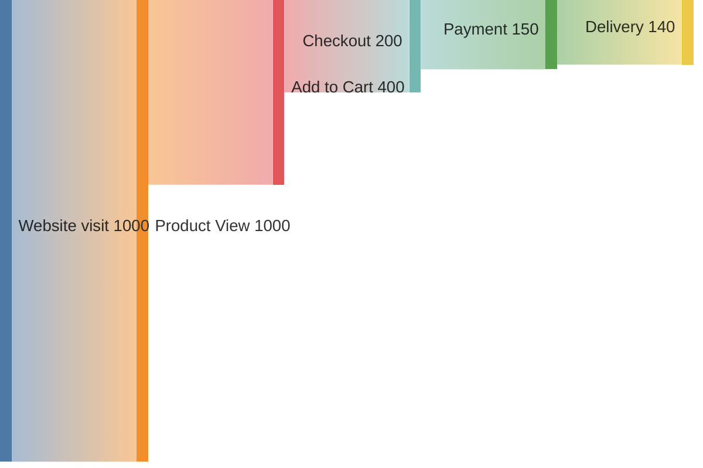

**Sankey-диаграмма (Sankey Diagram)** — это **специальный тип визуализации**, который показывает **потоки данных, энергии, денег или пользователей** между этапами системы.  
Особенность: **ширина стрелки пропорциональна объёму потока**.

---

## ✅ Что такое Sankey-диаграмма?

> **Sankey-диаграмма** — это граф, где:
- Каждая стрелка = поток
- Ширина стрелки = величина потока
- Цель: показать, **куда уходит больше всего**

### 💡 Названа в честь капитана Санки, который в 1898 году нарисовал:
> «Энергетическая схема парового двигателя»  
> → Стрелки показывали потерю тепла #👨 

---

## 🔧 Основные элементы

| Элемент | Объяснение |
|--------|------------|
| **Узлы (nodes)** | Источники и приёмники: `Вход`, `Корзина`, `Оплата` |
| **Связи (links)** | Потоки между узлами |
| **Ширина стрелки** | Пропорциональна количеству |

---

## 📊 Пример: Воронка интернет-магазина



→ Вы видите:  
- Больше всего теряется после "оформления"
- Оплата — критический момент
- Нужно работать над UX

---

## ✅ Где используется Sankey-диаграмма?

| Отрасль | Пример |
|--------|--------|
| **E-commerce** | Воронка продаж: кто дошёл до оплаты? |
| **Машинное обучение** | Переходы между классами (например, лояльность) |
| **Финансы** | Распределение бюджета: от департамента → проекты |
| **Energy** | Потребление электроэнергии |
| **IT / DevOps** | Трафик между сервисами |
| **BI / Аналитика** | Пользовательские пути |

---

## 🎯 Преимущества

| Плюс | Объяснение |
|------|------------|
| ✅ **Наглядность потерь** | Где самый большой разрыв? |
| ✅ **Пропорции видны сразу** | По ширине стрелки |
| ✅ **Поддержка нескольких направлений** | Можно делать сложные цепочки |
| ✅ **Идеально для воронок** | Конверсия, утечки |
| ✅ **Работает с большими данными** | До 100+ узлов |

---

## ❌ Ограничения

| Минус | Решение |
|-------|---------|
| ❌ Сложно читать при > 10 узлов | Упрощайте, группируйте |
| ❌ Не поддерживает время | Делайте по дням/неделям |
| ❌ Мало инструментов | Grafana, Kibana, Power BI, D3.js |

---

## ✅ Инструменты для создания

| Инструмент | Поддержка |
|-----------|-----------|
| **Mermaid (beta)** | `sankey-beta` |
| **Grafana + Sankey plugin** | Да |
| **Power BI** | Visuals → Sankey |
| **Kibana Canvas** | Custom |
| **D3.js** | Полная свобода |
| **Google Charts** | Built-in Sankey |
| **Python (Plotly, Matplotlib)** | Через библиотеки |

---

## ✅ Пример: Python + Plotly

```python
import plotly.graph_objects as go

fig = go.Figure(data=[go.Sankey(
    node=dict(
        label=["Визит", "Товар", "Корзина", "Оплата", "Заказ"],
        color=["blue", "green", "yellow", "orange", "red"]
    ),
    link=dict(
        source=[0, 1, 2, 3],
        target=[1, 2, 3, 4],
        value=[1000, 600, 300, 250]
    )
)])

fig.show()
```

---

## ✅ Финальный вывод

| Sankey-диаграмма — это... | Это не... |
|--------------------------|-----------|
| ✅ **Визуализация потоков** | ❌ Обычная диаграмма |
| ✅ **Показывает утечки** | ❌ Только статистика |
| ✅ **Ширина = объём** | ❌ Все стрелки одинаковые |
| ✅ **Идеально для анализа** | ❌ Для презентаций без данных |

> 💬 _“If you can't see where the money flows — fix your Sankey.”_

---

## 📚 Где учиться дальше?

- [Mermaid Sankey](https://mermaid.js.org/syntax/sankey.html)
- [Plotly Sankey Docs](https://plotly.com/python/sankey-diagram/)
- YouTube: *“Sankey Diagram Explained”* — Data Professor

---

✅ **Sankey-диаграмма — ваш детектор утечек.**  
Используйте её — и вы перестанете гадать, где теряются пользователи, деньги или энергия.

📌 Сохраните этот код — он станет основой вашей аналитики.