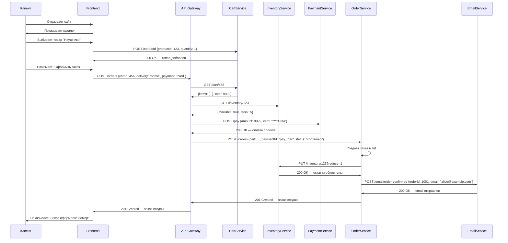
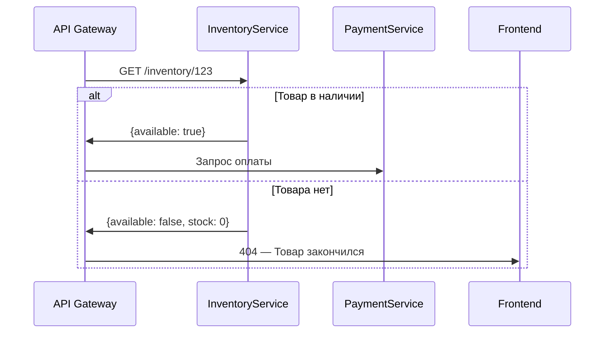
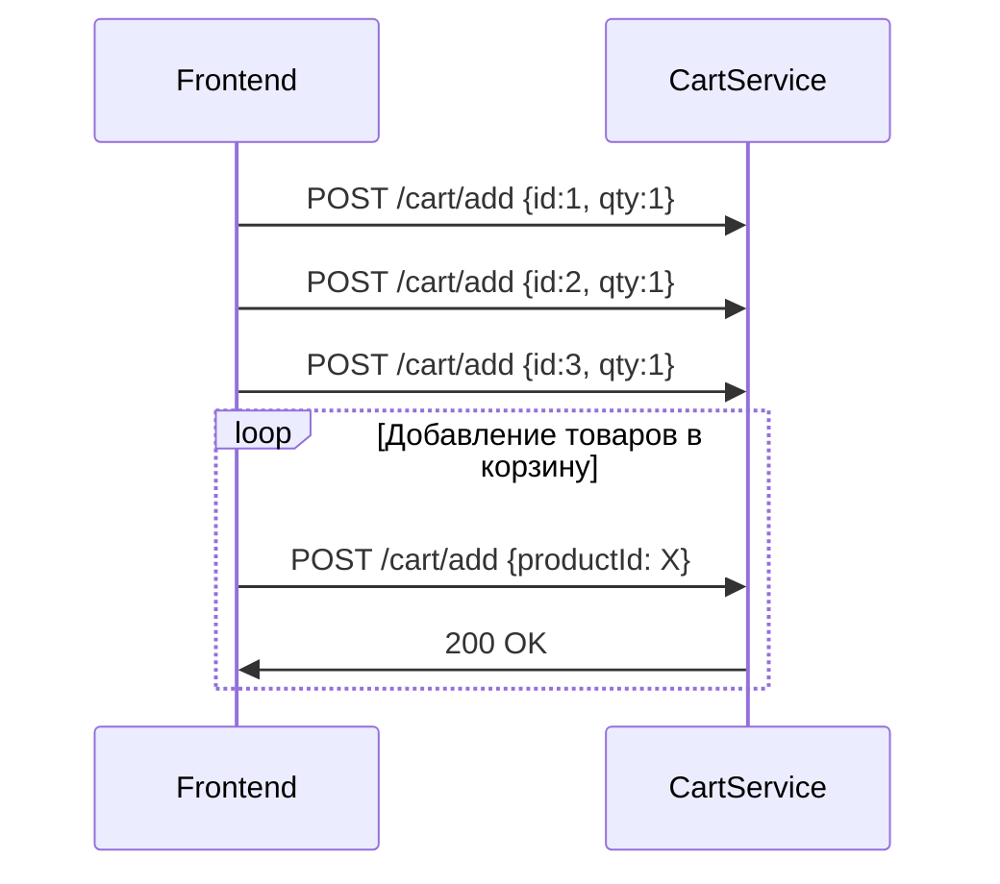
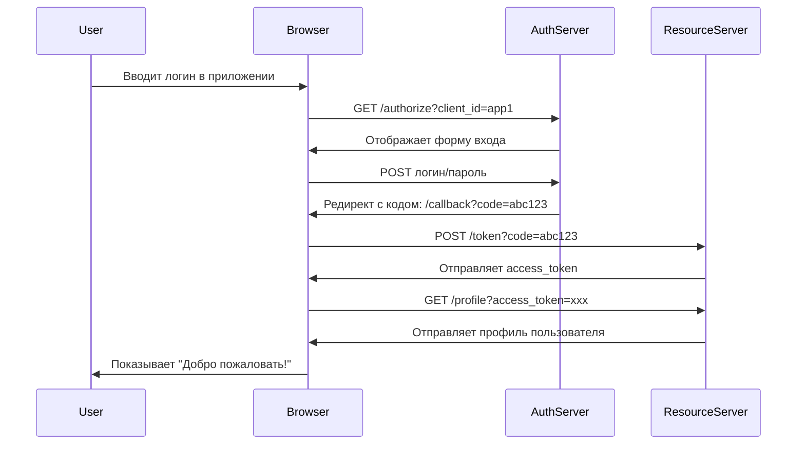

Визуальная диаграмма последовательности) — это **стандартный инструмент UML**, который показывает, **как объекты (или компоненты системы) взаимодействуют между собой во времени** — в порядке выполнения.

Он идеален для:
- Детализации **Use Case** или **User Story**
- Объяснения **логики сложного сценария** (например, «Оформление заказа»)
- Документирования **API-взаимодействий**
- Обсуждения архитектуры между **разработчиками, тестировщиками, аналитиками**

---

## ✅ Пример: **Sequence Diagram — Оформление заказа в интернет-магазине**

### 🎯 Сценарий:
> *Клиент оформляет заказ: выбирает товар → добавляет в корзину → оформляет заказ → система проверяет наличие → обрабатывает оплату → отправляет подтверждение.*

### 🧩 Участники (объекты):
| Объект | Роль |
|--------|------|
| `Клиент` | Внешний актор (не система) |
| `Frontend` | Веб-интерфейс (браузер) |
| `API Gateway` | Точка входа в микросервисы |
| `CartService` | Сервис корзины |
| `InventoryService` | Сервис остатков |
| `PaymentService` | Сервис оплаты |
| `OrderService` | Сервис заказов |
| `EmailService` | Сервис уведомлений |

---

## ✅ Sequence Diagram в **Mermaid.js** (копируйте и вставляйте в Obsidian, Notion, VS Code, Mermaid Live Editor)

---

## ✅ Что показывает эта диаграмма?

| Элемент | Что он означает |
|--------|------------------|
| `participant` | Участники (объекты, сервисы, пользователи) |
| `->>` | **Синхронный вызов** (клиент ждёт ответа) |
| `->` | **Асинхронное сообщение** (например, уведомление) |
| `alt / else` | **Условные ветки** (если/иначе) — можно добавить |
| `loop` | **Цикл** — например, проверка нескольких товаров |
| `rect` | **Группировка** — можно выделить блоки (например, "Проверка оплаты") |

---

## ✅ Почему это полезно?

| Преимущество | Объяснение |
|--------------|------------|
| ✅ **Понятно даже не-технарю** | Видно: кто, когда, что делает — без кода |
| ✅ **Помогает найти ошибки** | Например: «Почему InventoryService вызывается дважды?» |
| ✅ **Основа для тестирования** | Каждый вызов — это тест-кейс |
| ✅ **Документация для API** | Видно, какие эндпоинты вызываются и в каком порядке |
| ✅ **Помогает при рефакторинге** | Если вы меняете OrderService — видите, кто ещё зависит от него |
| ✅ **Используется в Agile** | На спринт-планировании: «Как работает этот User Story?» |

---

## ✅ Дополнение: Как добавить **условия** (например, если товара нет?)

> ✅ `alt` — если условие выполняется  
> ✅ `else` — если нет  
> ✅ `opt` — опциональный блок (необязательный шаг)

---

## ✅ Дополнение: **Цикл** — если клиент добавил 3 товара

---

## ✅ Пример из реальной жизни: **Авторизация через OAuth2**

> ✅ Эта диаграмма — **идеальный документ для разработчиков**, которые реализуют OAuth2.

---

## ✅ Как читать Sequence Diagram?

| Направление | Значение |
|-------------|----------|
| **Сверху вниз** | **Время** — чем ниже, тем позже |
| **Слева направо** | **Участники** — кто с кем взаимодействует |
| **Сплошная стрелка `->>`** | Синхронный вызов (ожидание ответа) |
| **Пунктирная стрелка `->`** | Асинхронное сообщение (например, email, уведомление) |
| **Прямоугольник `rect`** | Группировка по времени или логике |
| **`alt/else`** | Условия (если/иначе) |
| **`loop`** | Цикл (повторение) |

---

## ✅ Где использовать?

| Ситуация | Используйте Sequence Diagram |
|----------|------------------------------|
| ✅ Обсуждаете сложный сценарий с командой | ✅ Да — визуально понятнее, чем текст |
| ✅ Пишете техническое задание | ✅ Да — приложите диаграмму к Use Case |
| ✅ Документируете API | ✅ Да — показываете последовательность вызовов |
| ✅ Готовитесь к ревью кода | ✅ Да — помогает понять, почему код написан так, а не иначе |
| ✅ Обучаете новичков | ✅ Да — нагляднее, чем Javadoc или Java-код |

---

## ✅ Лучшие практики

| Правило | Объяснение |
|--------|-----------|
| ✅ **Не перегружайте диаграмму** | Максимум 5–7 участников — иначе станет нечитаемой |
| ✅ **Используйте понятные имена** | `PaymentService`, а не `PS` |
| ✅ **Добавляйте версии** | `Sequence Diagram v1.2 — Оформление заказа` |
| ✅ **Согласуйте с командой** | Диаграмма должна быть **источником правды**, а не «как я думал» |
| ✅ **Храните в Git** | Как часть документации (`docs/sequence-diagrams/`) |

---

## ✅ Финальный вывод

> **Sequence Diagram — это "фильм" вашего процесса.**  
> Он показывает **не "что" делает система**, а **"как" она это делает — шаг за шагом, по времени, между участниками.**

> 💬 *«Один Sequence Diagram стоит тысячи слов в документе».*

---

✅ **Теперь вы можете создавать Sequence Diagram для любого сценария — от регистрации до платежа.**  
Используйте **Mermaid** — быстро, бесплатно, везде.  
**Сделайте диаграммы — и ваши команды перестанут спорить: «А как это работает?»**