---
aliases:
  - Activity Diagram
  - Class Diagram
  - Component Diagram
  - Deployment Diagram
  - State Machine
  - UML
  - Unified Modeling Language
  - Use Case
  - Диаграмма деятельности
  - Диаграмма классов
  - Диаграмма последовательности
  - Диаграмма состояний
---

## UML (Unified Modeling Language)

**UML (Unified Modeling Language, унифицированный язык моделирования)** — это стандартизированный язык для визуального описания объектно-ориентированных систем: классов, объектов, взаимодействий, процессов и архитектуры.

UML описывает систему **на разных уровнях**: от бизнес-процессов до классов конкретной реализации.

## Откуда появился UML

- Создан в 1990-е годы (основа — работы Грэди Буча, Джеймса Рамбо, Ивара Якобсона).
- Объединил конкурирующие нотации (Booch, OMT, OOSE).
- Стал стандартом OMG (Object Management Group).
- Обновлённая версия — UML 2.x — поддерживает новые виды диаграмм.

## Зачем нужен UML

- **Проектирование архитектуры** — схема до написания кода.
- **Документация** — единый язык для команды.
- **Анализ требований** — Use Case и диаграммы деятельности.
- **Генерация кода** — из диаграмм классов можно генерировать каркас (wireframes).
- **Коммуникация** — схема понятнее тысячи слов.

## Виды диаграмм

**Структурные** (как система устроена):

- Диаграмма классов (Class Diagram)
- Диаграмма объектов (Object Diagram)
- Диаграмма компонентов (Component Diagram)
- Диаграмма развёртывания (Deployment Diagram)

**Поведенческие** (что система делает):

- Диаграмма последовательности (Sequence Diagram)
- Диаграмма деятельности (Activity Diagram)
- Диаграмма состояний (State Machine Diagram)
- Диаграмма вариантов использования (Use Case Diagram)

| Категория | Диаграммы |
|-----------|-----------|
| **Структурные** | Классы, объекты, компоненты, развёртывание |
| **Поведенческие** | Последовательность, деятельность, состояния, Use Case |

## Диаграмма классов

Показывает классы системы, их атрибуты, методы и связи (ассоциация, наследование, композиция).

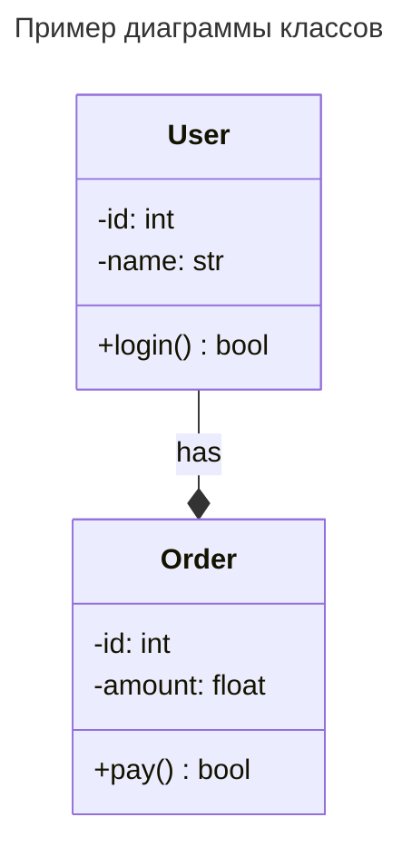

## Диаграмма последовательности

Показывает порядок обмена сообщениями между объектами во времени. Подробное описание — в файле [Sequence Diagram](Sequence Diagram).

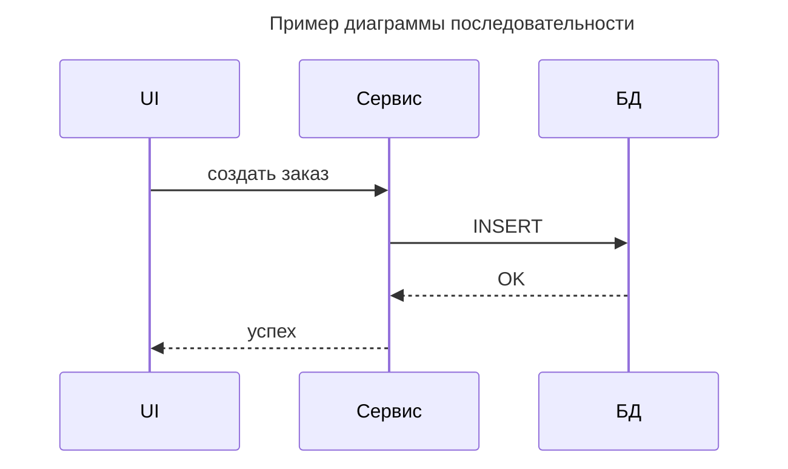

## Диаграмма вариантов использования (Use Case)

Показывает функции системы с точки зрения акторов и связей между ними.

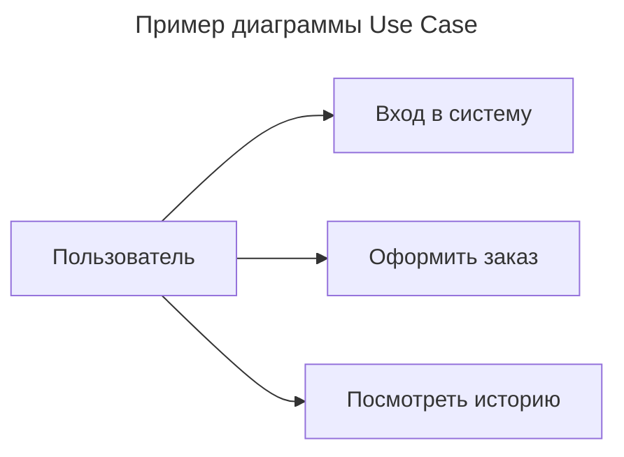

## Диаграмма деятельности (Activity)

Показывает последовательность действий и ветвления в процессе.

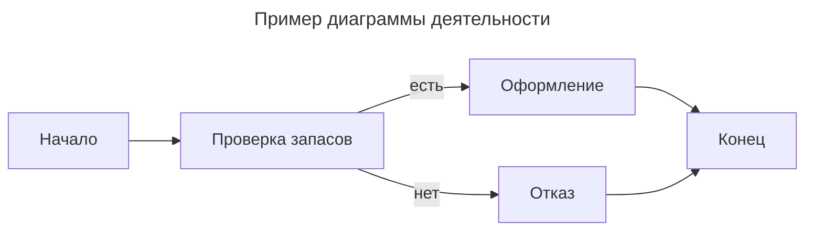

## Диаграмма состояний (State Machine)

Показывает состояния объекта и переходы между ними.

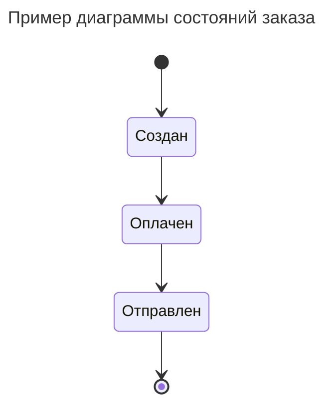

## Диаграмма компонентов и развёртывания

Показывает логическую и физическую структуру системы.

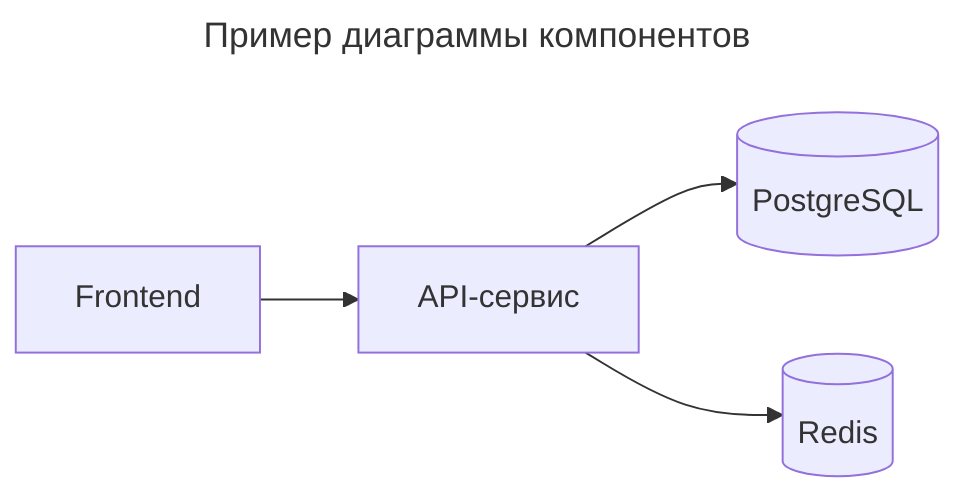

## Правила построения диаграмм

1. Начинать с выбора типа диаграммы под задачу (классы — структура, sequence — взаимодействие).
2. Сначала — бизнес-процессы (Use Case), потом — технические диаграммы.
3. Классы проектировать до диаграммы объектов (объекты — экземпляры классов).
4. Держать диаграммы согласованными: имена классов, методов и связей не должны расходиться между диаграммами.

## Особенности

- ✅ Стандартизированный язык, понятный командам.
- ✅ Покрывает структуру и поведение системы.
- ✅ Интегрируется с моделированием кода (генерация каркасов).
- ✅ Практичный для архитектуры и документации.
- ❌ Может быть избыточным для небольших проектов.
- ❌ Легко перегружается деталями.
- ❌ Статичный для быстро меняющихся систем.

> **UML** — стандартный язык описания архитектуры: структурные диаграммы показывают «как устроено», поведенческие — «что происходит». Для веб-разработки достаточно диаграмм классов, последовательности, состояний и деятельности.

## Типы связей в UML Class Diagram

В UML существует 6 основных типов связей между классами. Они различаются по **силе связи** (от слабой зависимости до жесткого владения) и **направлению**.

---

### 1. Association (Ассоциация)

**Символ:** сплошная линия со стрелкой (или без)

**Семантика:** "Знает о" / "Использует". Один класс знает о существовании другого и может обращаться к нему. Это слабая структурная связь.

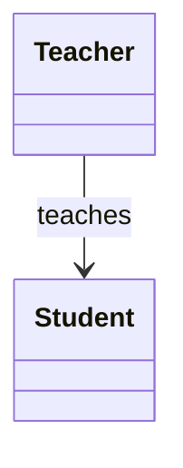

*Учитель знает о студентах, которых обучает.*

---

### 2. Dependency (Зависимость)

**Символ:** пунктирная стрелка `..>`

**Семантика:** "Использует временно". Один класс использует другой локально (например, как параметр метода или локальную переменную). Связь временная и слабая.

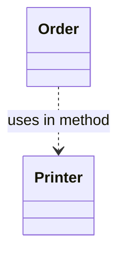

*Order использует Printer только внутри какого-то метода (например, `printReceipt(Printer p)`).*

---

### 3. Aggregation (Агрегация)

**Символ:** линия с **пустым ромбом** `o--`

**Семантика:** "Has-a" / "Состоит из". Отношение "часть-целое", где часть **может существовать независимо** от целого.

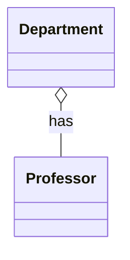

*Департамент состоит из профессоров, но если департамент закроют, профессора продолжат существовать (перейдут в другой департамент).*

---

### 4. Composition (Композиция)

**Символ:** линия с **заполненным ромбом** `*--`

**Семантика:** "Owns-a" / "Владеет". Жесткое отношение "часть-целое", где часть **не может существовать без целого**. Уничтожение целого уничтожает части.

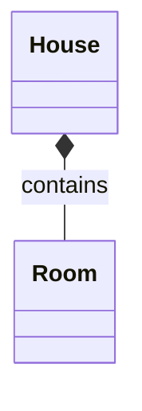

*Дом состоит из комнат. Если дом сносят, комнаты тоже перестают существовать.*

---

### 5. Generalization / Inheritance (Наследование)

**Символ:** сплошная линия с **пустым треугольником** `<|--`

**Семантика:** "Is-a". Отношение между родительским классом (суперклассом) и дочерним (подклассом). Дочерний класс наследует поведение родителя.

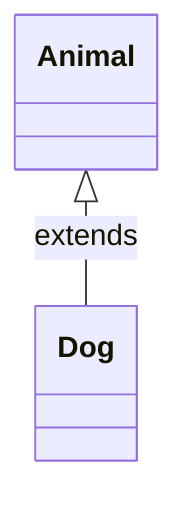

*Собака является животным (Dog extends Animal).*

---

### 6. Realization / Implementation (Реализация)

**Символ:** пунктирная линия с **пустым треугольником** `..|>`

**Семантика:** "Implements". Класс реализует интерфейс или абстрактный контракт.

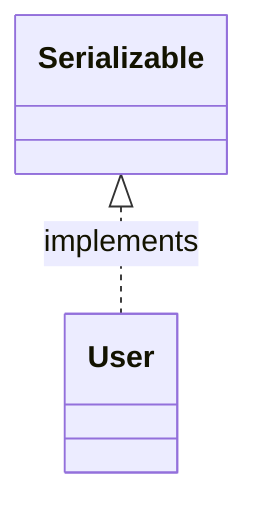

*Класс User реализует интерфейс Serializable.*

---

### Сводная таблица

| Тип связи | Символ Mermaid | Сила связи | Семантика | Жизненный цикл |
|-----------|----------------|------------|-----------|----------------|
| **Dependency** | `..>` | Очень слабая | "Использует" | Независимый |
| **Association** | `-->` | Слабая | "Знает о" | Независимый |
| **Aggregation** | `o--` | Средняя | "Has-a" (часть) | Часть живёт отдельно |
| **Composition** | `*--` | Сильная | "Owns-a" (часть) | Часть умирает с целым |
| **Inheritance** | `<|--` | Очень сильная | "Is-a" | Наследование |
| **Realization** | `..|>` | Очень сильная | "Implements" | Контракт |

---

### Пример комплексной диаграммы

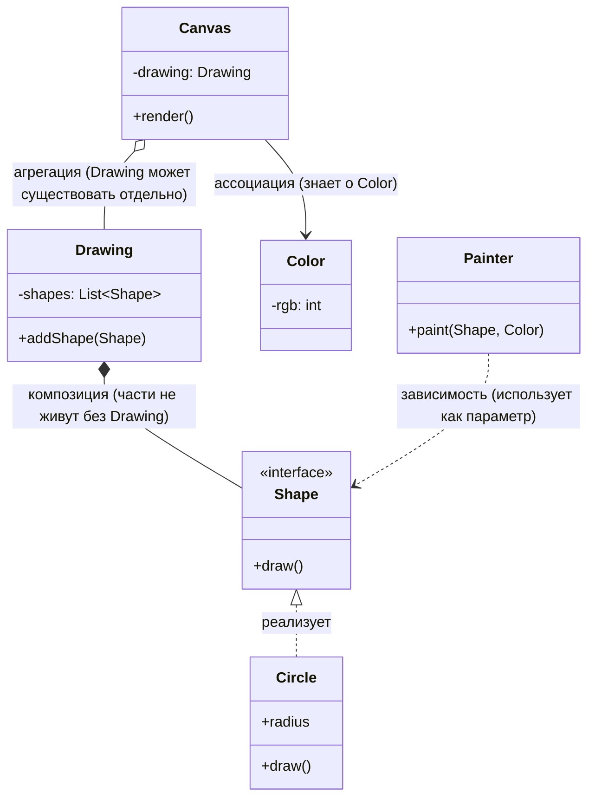

---

### Краткое правило выбора

- Если класс **наследуется** → `Inheritance`
- Если класс **реализует интерфейс** → `Realization`
- Если объект **владеет** другим и уничтожает его → `Composition`
- Если объект **содержит** другой, но тот может жить отдельно → `Aggregation`
- Если объект **хранит ссылку** на другой как поле → `Association`
- Если объект **временно использует** другой (параметр метода) → `Dependency`
