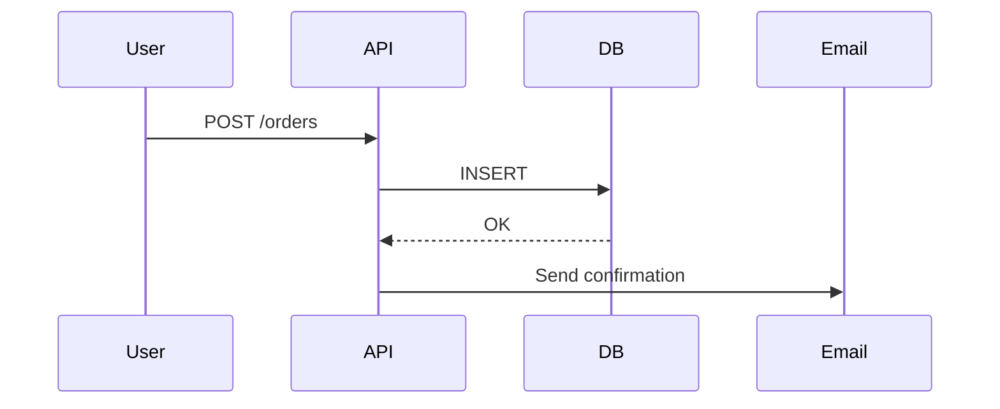
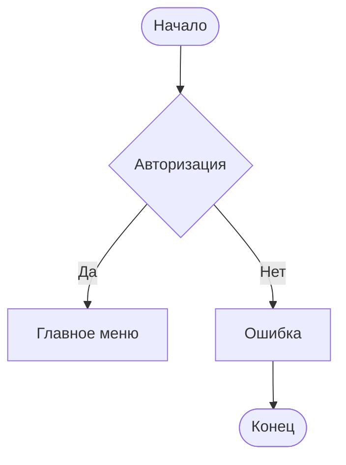
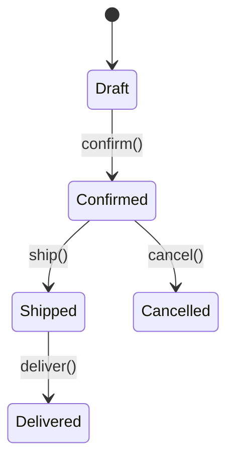
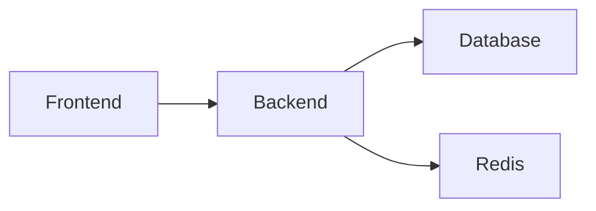
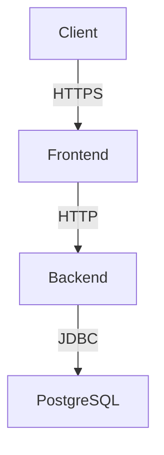

---
aliases:
  - Unified Modeling Language
  - uml
---


## ✅ Основные типы UML-диаграмм

UML (Unified Modeling Language) — это стандарт для визуализации программного обеспечения.  

Диаграммы делятся на **2 группы**:

1. Диаграммы структуры (Static)
> Показывают **структуру системы**: классы, объекты, компоненты

2. Диаграммы поведения (Dynamic)
> Показывают **взаимодействие**: что происходит во времени

---

## 📚 Таблица: Все 14 типов UML-диаграмм

| №   | Тип диаграммы                    | Категория     | Назначение                                                     | Пример                                           |
| --- | -------------------------------- | ------------- | -------------------------------------------------------------- | ------------------------------------------------ |
| 1   | **Class Diagram**                | Структурная   | Показывает классы и их связи                                   | `User`, `Order`, `Payment` → связи между ними    |
| 2   | **Object Diagram**               | Структурная   | Конкретные экземпляры в определённый момент                    | `user1: User { name="Alice" }`                   |
| 3   | **Component Diagram**            | Структурная   | Архитектура приложений/библиотек                               | `frontend`, `backend`, `database`                |
| 4   | **Deployment Diagram**           | Структурная   | Как компоненты развернуты на серверах                          | `Pod A → AWS EC2`, `DB → RDS`                    |
| 5   | **Package Diagram**              | Структурная   | Группировка классов/компонентов                                | `com.company.auth`, `com.company.order`          |
| 6   | **Profile Diagram**              | Структурная   | Расширения UML (редко используется)                            | Свои стереотипы                                  |
| 7   | **Use Case Diagram**             | Поведенческая | Что делает система с участием акторов                          | "Пользователь создаёт заказ"                     |
| 8   | **Sequence Diagram**             | Поведенческая | Последовательность вызовов                                     | `Client → API → DB → Email`                      |
| 9   | **Communication Diagram**        | Поведенческая | Обмен сообщениями между объектами (устаревшая версия Sequence) | Как в старых проектах                            |
| 10  | **Interaction Overview Diagram** | Поведенческая | Упрощённый вид последовательностей                             | Flowchart из Sequence                            |
| 11  | **Activity Diagram**             | Поведенческая | Бизнес-процесс, поток работ                                    | "Оформление заказа"                              |
| 12  | **State Machine Diagram**        | Поведенческая | Жизненный цикл объекта                                         | `Order`: Draft → Confirmed → Shipped → Cancelled |
| 13  | **Timing Diagram**               | Поведенческая | Временные ограничения                                          | Задержки, SLA                                    |
| 14  | **Composite Structure Diagram**  | Структурная   | Внутренняя структура класса                                    | `Car` содержит `Engine`, `Wheel`                 |

---
## 1. **Class Diagram** — Диаграмма классов
```mermaid
---
title: Диаграмма классов
config:
  layout: elk
  look: handDrawn
  theme: forest
---
 classDiagram
    class Client {
        +request() void
    }

    class Service {
        +process() void
    }

    class Person {
        +name: string
        +age: int
    }

    class Address {
        +street: string
        +city: string
    }

    class Car {
        +model: string
        +start() void
    }

    class Engine {
        +start() void
        +stop() void
    }

    class Animal {
        +eat() void
    }

    class Dog {
        +bark() void
    }

    class Shape {
        +draw() void
    }

    class Circle {
        +draw() void
    }

    %% Отношения
    Client ..> Service : dependency<br>"uses"
    Person --> Address : association<br>"has"
    Car *-- Engine : composition<br>"owns, controls lifecycle"
    Person o-- Address : aggregation<br>"part-of, shared"
    <<interface>> Shape
    Circle ..|> Shape : realization<br>"implements"
    Dog --|> Animal : inheritance<br>"is-a"
 ```
> ✅ Для [[ООП]], DDD, проектирования домена

---

## 2. **Use Case Diagram** — Диаграмма прецедентов
```mermaid
graph TD
    A[Пользователь] --> B[Создать заказ]
    A --> C[Просмотреть историю]
    A --> D[Оплатить]
```

> ✅ Для сбора требований, бизнес-аналитики

---

## 3. **Sequence Diagram** — Диаграмма последовательности


> ✅ Для понимания взаимодействия между сервисами

---

## 4. **Activity Diagram** — Диаграмма активности


> ✅ Как flowchart для бизнес-процессов

---

## 5. **State Machine Diagram** — Диаграмма состояний


> ✅ Для отслеживания жизненного цикла

---

## 6. **Component Diagram** — Компонентная диаграмма


> ✅ Для микросервисов, IT Landscape

---

## 7. **Deployment Diagram** — Развертывание


> ✅ Для DevOps, CI/CD

---

## ✅ Когда какую использовать?

| Цель | Рекомендованная диаграмма |
|------|----------------------------|
| Проектируете классы | ➤ **Class Diagram**
| Пишете требования | ➤ **Use Case**
| Анализируете производительность | ➤ **Sequence Diagram**
| Описываете процесс | ➤ **Activity Diagram**
| Управление жизненным циклом | ➤ **State Machine**
| Микросервисы | ➤ **Component + Deployment**
| Админка, релиз | ➤ **Deployment Diagram**

---

💡 Лучшие практики

| Правило                          | Объяснение                         |
| -------------------------------- | ---------------------------------- |
| ✅ Не рисуйте всё сразу           | Выберите одну цель                 |
| ✅ Используйте Mermaid / PlantUML | Автоматически генерируется из кода |
| ✅ Храните в Git                  | Документация = код                 |
| ✅ Обновляйте                     | Иначе она лжёт                     |
| ✅ Объясняйте команде             | Без контекста — никто не поймёт    |


---

✅ **Теперь вы знаете все 14 типов UML-диаграмм** — и когда использовать каждую.

📌 Сохраните этот список как шпаргалку.

> 💬 _“A good diagram is worth a thousand lines of code.”_

## Unified Modeling Language
UML (англ. Unified Modeling Language — унифицированный язык моделирования) — язык графического описания для объектного моделирования в области разработки программного обеспечения, для моделирования бизнес-процессов, системного проектирования и отображения организационных структур.