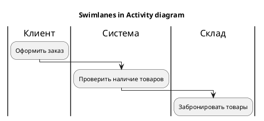
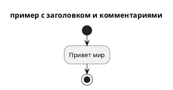
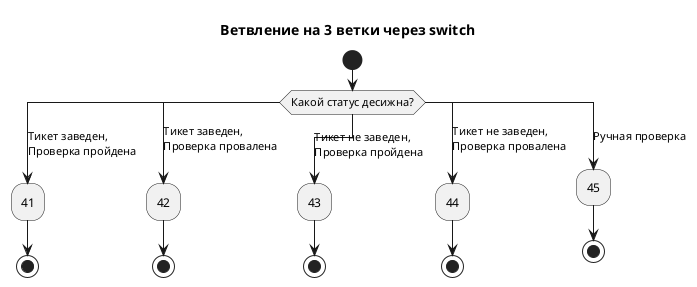
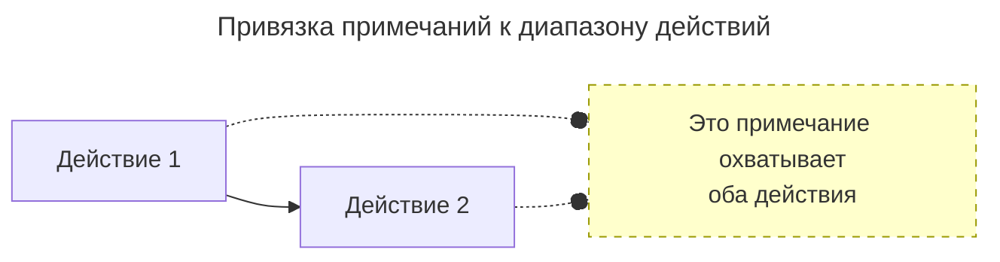
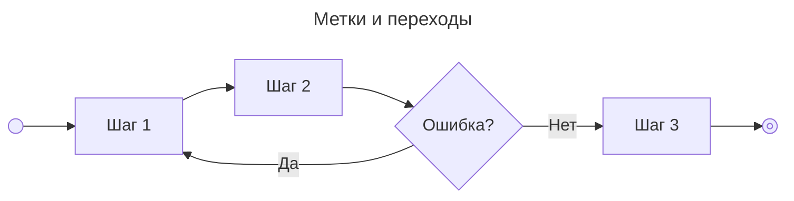

---
aliases:
  - activity
  - activity diagram
  - Activity Diagram
  - UML
  - диаграмма деятельности
  - Диаграммы деятельности
  - поведенческая диаграмма
  - поведенческая диаграмма UML
---
## Диаграмма деятельности (Activity Diagram) в UML

**Activity Diagram (диаграмма деятельности)** — это поведенческая диаграмма UML, описывающая **поток управления** (workflow) между действиями в системе или бизнес-процессе. По сути, это «продвинутая блок-схема» с поддержкой параллелизма, сигналов и ролей.

### Назначение

- Визуализация **алгоритмов** и **бизнес-процессов**.
- Моделирование **параллельных** и **асинхронных** операций.
- Описание **workflow** с участием нескольких ролей/систем.
- Документирование **[[use-case|use case]]** на уровне шагов.

**Важно:** Activity Diagram — это **не** [[sequence-diagram|Sequence Diagram]] (нет обмена сообщениями между объектами) и **не** State Diagram (не показывает состояния объекта, а показывает поток работ).

## Основные элементы

### Узлы действий (Action Nodes)

| Элемент | Символ | Назначение |
| :--- | :--- | :--- |
| **Initial Node** | ● (чёрный круг) | Точка входа в процесс. Всегда один на диаграмму |
| **Activity Final** | ◉ (круг с точкой) | Завершение всего процесса |
| **Flow Final** | ⊗ (круг с крестом) | Завершение только одной ветки (другие продолжаются) |
| **Action** | ▭ (прямоугольник со скруглёнными углами) | Атомарное действие (шаг процесса) |
| **Activity** | ▭ (прямоугольник с «граблями» слева) | Составное действие, которое можно раскрыть |
| **CallBehavior** | ▭ с меткой | Вызов другой activity/операции |

### Узлы управления (Control Nodes)

| Элемент | Символ | Назначение |
| :--- | :--- | :--- |
| **Decision** | ◇ (ромб с 1 входом, N выходами) | Ветвление по условию (if/else) |
| **Merge** | ◇ (ромб с N входами, 1 выходом) | Слияние веток после решения |
| **Fork** | ═ (толстая горизонтальная черта, 1 вход, N выходов) | Разделение на **параллельные** потоки |
| **Join** | ═ (толстая черта, N входов, 1 выход) | Синхронизация параллельных потоков |

### Объектные узлы (Object Nodes)

| Элемент | Назначение |
| :--- | :--- |
| **Object Node** | Прямоугольник с именем класса. Показывает данные, передаваемые между действиями |
| **Pin** | Маленький прямоугольник на action — входной/выходной параметр |
| **Data Store** | Цилиндр (как БД). Хранилище данных между действиями |

### Потоки (Edges)

| Тип | Описание |
| :--- | :--- |
| **Control Flow** | Стрелка без подписи. Передаёт только управление |
| **Object Flow** | Стрелка с подписью объекта. Передаёт данные между действиями |
| **Guard** | Условие в `[квадратных скобках]` на стрелке. Активирует переход только при истинности |

### Группировка (Swimlanes / Partitions)

| Элемент | Назначение |
| :--- | :--- |
| **Partition (Swimlane)** | Вертикальная или горизонтальная полоса, показывающая **ответственного** за действие (роль, отдел, систему) |
| **Interruptible Activity Region** | Прямоугольник с пунктиром. Действия внутри могут быть прерваны сигналом |

### Сигналы и события

| Элемент | Символ | Назначение |
| :--- | :--- | :--- |
| **Send Signal** | Выпуклый пятиугольник | Отправка асинхронного сообщения |
| **Accept Event** | Вогнутый пятиугольник | Ожидание события/сигнала |
| **Time Event** | `t = ...` или `after ...` | Срабатывание по времени |

## Swimlanes: сила диаграммы

**Swimlanes (дорожки)** — ключевая особенность Activity Diagram. Они показывают **КТО** выполняет действие.

Пример диаграммы с дорожками и заголовком:



**Когда использовать swimlanes:**

- В процессе участвуют несколько ролей/систем.
- Нужно показать передачу ответственности.
- Документируете бизнес-процесс (BPMN-подобно).

**Когда НЕ использовать:**

- Все действия выполняет одна сущность (проще сделать Sequence).
- Описываете внутренний алгоритм одного класса.

## Fork/Join vs Decision/Merge — частая путаница

| Критерий | Fork/Join | Decision/Merge |
| :--- | :--- | :--- |
| **Суть** | Параллелизм (AND) | Условие (OR) |
| **Символ** | Толстая черта | Ромб |
| **Время выполнения** | Ветки выполняются **одновременно** | Выполняется **только одна** ветка |
| **Синхронизация** | Join ждёт ВСЕ ветки | Merge просто соединяет |

**Правило:** Каждому Fork должен соответствовать Join. Каждому Decision — Merge. Иначе — семантическая ошибка.

## Правила хорошего тона

### Делайте:

- **Одно имя — одно действие.** Глагол + существительное: «Проверить оплату», а не «Оплата».
- **Подписывайте guard-условия** `[balance > 0]` на стрелках из Decision.
- **Используйте swimlanes** для бизнес-процессов с 2+ участниками.
- **Разбивайте сложные activity** на вложенные (call behavior).
- **Нумеруйте шаги** в больших диаграммах для удобства обсуждения.

### Избегайте:

- **Бесконечных циклов** без условия выхода.
- **Смешения уровней детализации** (в одном блоке «выбрать товар» и «SQL-запрос»).
- **Более 7 исходящих стрелок** из одного Decision — делайте иерархию.
- **Замены Sequence Diagram** — Activity не показывает обмен сообщениями между объектами.
- **«Спагетти»** — пересечения стрелок, возвраты назад через всю диаграмму.

## Синтаксис PlantUML

Есть старый синтаксис со стрелочками. Рассмотрим только актуальный.

Официальная документация: https://plantuml.com/ru/activity-diagram-beta

PlantUML Activity Diagram (New Syntax / Beta) — это мощный и гибкий синтаксис, который позволяет создавать сложные диаграммы потоков управления. Ниже — подробное руководство по всем основным элементам.

### Базовая структура

Диаграмма всегда начинается с `@startuml` и заканчивается `@enduml`. Для активации нового синтаксиса обычно достаточно использовать ключевые слова `start`, `stop`, `if`, `while` и т.д. внутри блока.

Пример базовой структуры с заголовком и комментариями:



### Основные элементы управления потоком

#### Start и Stop

- `start` — начальная точка диаграммы (чёрный круг).
- `stop` — конечная точка потока (чёрный круг). Можно использовать несколько раз для разных веток завершения.
- `end` — альтернатива `stop`, часто используется в конце циклов или подпроцессов.

#### Действия (Actions)

Действия обозначаются текстом, заключённым в двоеточия `:`.

```plantuml
:Действие 1;
:Действие 2;
```

#### Условный оператор

##### If/Then/Else

Используется конструкция `if ... then ... else ... endif`.

```plantuml
if (Условие?) then (Да)
  :Действие при истине;
else (Нет)
  :Действие при лжи;
endif
```

Можно вкладывать условия друг в друга.

##### switch

Пример ветвления на 4 ветки через switch:



#### Циклы (While/Repeat)

**While loop:**

```plantuml
while (Проверка условия?) is (true)
  :Тело цикла;
endwhile
```

**Repeat loop:**

```plantuml
repeat
  :Действие в цикле;
repeat while (Условие продолжения?) is (true)
```

#### Параллельные потоки (Split/Fork)

Для отображения параллельного выполнения используется `split`, `fork` и `join`.

**Split (разделение на потоки):**

```plantuml
split
  :Поток 1;
split again
  :Поток 2;
split again
  :Поток 3;
endsplit
```

**Fork/Join (более явное указание синхронизации):**

```plantuml
fork
  :Задача A;
fork again
  :Задача B;
end fork
```

`end fork` действует как точка синхронизации (join), ожидая завершения всех веток.

### Примечания (Notes)

Примечания добавляются с помощью ключевого слова `note`. Их можно размещать слева (`left`), справа (`right`), сверху (`top`) или снизу (`bottom`) от действия.

Используйте `note` с последующими строками и завершайте `end note`.

Пример примечаний:

```plantuml
floating note left: Это отсоединенная заметка
:Действие;
note right: Это примечание справа.

:Сложное действие;
note left
  Это многострочное
  примечание.
  Оно может содержать **жирный текст**
  и *курсив*.
  ====
  Ноты поддерживают сепарацию
end note
```

#### Привязка к нескольким элементам

Можно привязать примечание к диапазону действий, используя метки (labels).



### Метки и переходы (Labels and GoTo)

Хотя структурное программирование предпочтительнее, иногда нужны явные переходы.



### Группировка и разделители

#### Partition (Разделы)

Группирует действия в визуальные блоки (часто используется для отображения дорожек/swimlanes).

```plantuml
partition "Клиент" {
  :Заказ товара;
}
partition "Сервер" {
  :Обработка заказа;
}
```

#### Separator (Разделитель)

Добавляет горизонтальную линию-разделитель.

```plantuml
|Дорожка1|
:Действие 1;
:Действие 2;
|Дорожка2|
:Действие 3;
```
