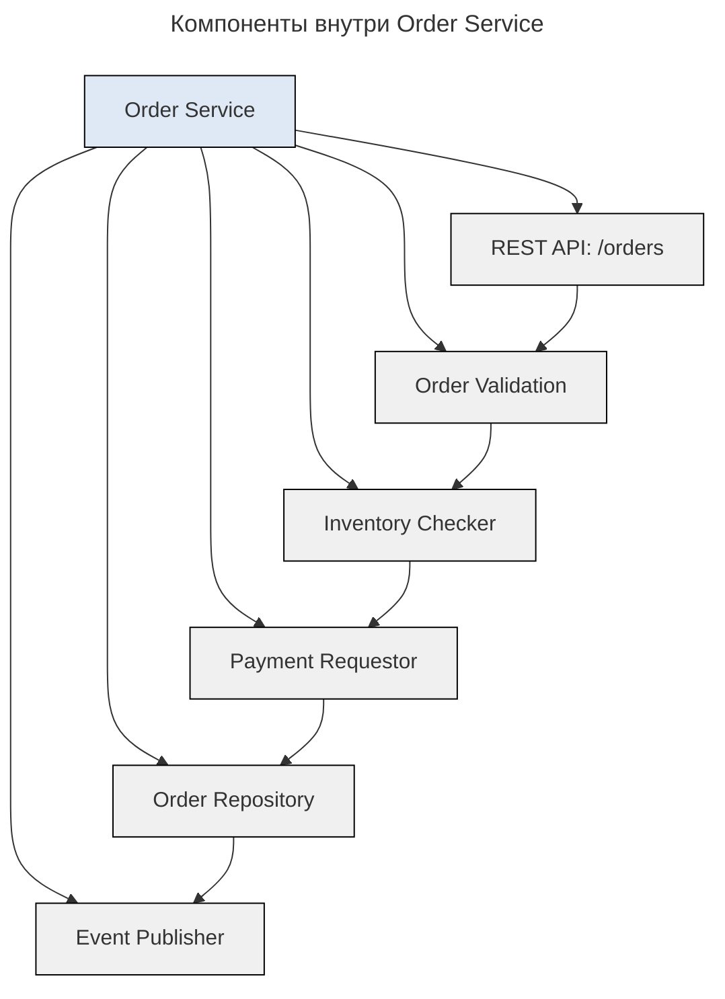
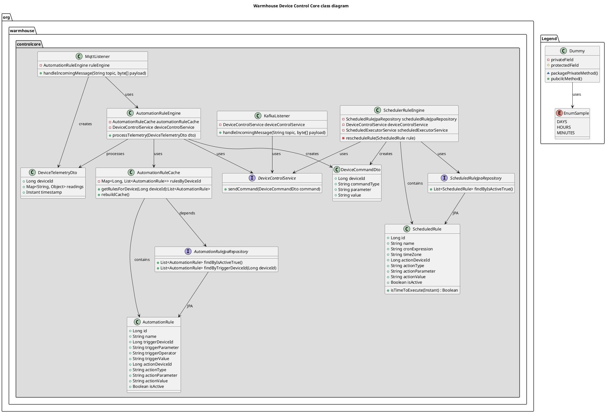

---
aliases:
  - 4C
  - 4C diagram
  - C4
  - C4 diagram
  - C4 Model
  - C4Model
  - Code diagram
  - Component diagram
  - Components
  - Container diagram
  - Containers
  - Context
  - PlantUML
  - Simon Brown
  - Structurizr
  - System context diagram
  - Код
  - Компоненты
  - Контейнеры
  - Контекст
  - Саймон Браун
---

## 4C diagram

**Суть**

4C диаграмма (4C diagram) — это визуальный инструмент в методологии C4Model для проектирования и документирования архитектуры программных систем. Она помогает описать систему на разных уровнях абстракции, делая сложную архитектуру понятной для разных аудиторий.

**Расшифровка 4C**

1. **Context** (Контекст) — высокоуровневое описание системы и её взаимодействия с внешним миром.
2. **Containers** (Контейнеры) — основные компоненты системы (приложения, базы данных, сервисы).
   - Диаграмма контейнеров показывает крупные технические компоненты и их взаимосвязи.
3. **Components** (Компоненты) — ключевые модули внутри контейнеров.
   - Диаграмма компонентов углубляется в один из контейнеров, показывая, из каких компонентов он состоит и как они взаимодействуют друг с другом.
4. **Code** (Код) — детали реализации на уровне классов и функций (обычно опускается в диаграммах высшего уровня).
   - Диаграмма кода отображает структуру кода в рамках одного из компонентов: классы или файлы и их взаимодействие.

В итоге C4 помогает составить многоуровневую карту кода: можно охватить взглядом всю систему или увеличить масштаб интересующей области, чтобы рассмотреть детали.

**Для чего нужна 4C диаграмма**

1. Упрощение сложности — разбивает архитектуру на уровни, чтобы избежать информационной перегрузки.
2. Коммуникация между командами — разработчики, архитекторы, менеджеры и заказчики видят систему с нужным уровнем детализации.
3. Документирование архитектуры — создаёт единый источник истины о структуре системы.
4. Обнаружение слабых мест — помогает выявить проблемы: избыточные зависимости, недостаточную масштабируемость.
5. Onboarding новых сотрудников — новички быстро понимают архитектуру системы.

Система диаграмм C4 позволяет просматривать объект в разной степени детализации, от общего к более детальному:

- System context diagram
- Container diagram
- Component diagram
- Code diagram

## Уровни C4

C4 — это иерархическая система из четырёх уровней детализации, позволяющая показать архитектуру системы разными «кадрами», в зависимости от аудитории. Каждый уровень — это «кадр», как в кино: общий план, вид города, вид здания, внутренности комнаты.

| Уровень | Название | Кто смотрит? | Что показывает? | Пример |
| ------- | -------- | ------------ | --------------- | ------ |
| **1** | **Context (Контекст)** | Бизнес, руководство, новые сотрудники | Система в контексте мира — кто её использует и с чем взаимодействует | Карта системы и её пользователей |
| **2** | **Containers (Контейнеры)** | Архитекторы, разработчики, DevOps | Технологии и компоненты высокого уровня — как система разбита на части | Web-приложение, БД, микросервис, API, мобильное приложение |
| **3** | **Components (Компоненты)** | Разработчики, технические лидеры | Внутри одного контейнера — какие модули/библиотеки/сервисы внутри | Сервис авторизации, API-шлюз, репозиторий заказов |
| **4** | **Code (Код)** | Разработчики | Конкретные классы, методы, функции — как реализовано внутри | Класс `OrderService`, метод `createOrder()` |

C4 — это не 4 диаграммы, а 4 уровня, которые используются по необходимости.

### Уровень 1: Context (Контекст)

«Кто использует систему и как она взаимодействует с внешним миром?»

Что включает:

- систему, которая проектируется (в центре)
- пользователей (акторов)
- другие системы (внешние сервисы, API, базы данных)

Пример: онлайн-магазин:

```mermaid
---
title: Пример System Context: онлайн-магазин
---
graph TD
    A[Клиент] -->|Просматривает, оформляет заказ| B[Онлайн-магазин]
    C[Платёжная система Stripe] -->|Принимает платежи| B
    D[Система логистики FedEx] -->|Получает данные о доставке| B
    B -->|Отправляет уведомления| E[Email-сервис SendGrid]
    F[Бухгалтерия] -->|Получает отчёты| B
    style B fill:#1e50b7,stroke:#000,color:#fff,font-weight:bold
    style A fill:#dfe9f5,stroke:#000
    style C fill:#dfe9f5,stroke:#000
    style D fill:#dfe9f5,stroke:#000
    style E fill:#dfe9f5,stroke:#000
    style F fill:#dfe9f5,stroke:#000
```

Цель уровня: показать границы системы и внешние зависимости. Аудитория — бизнес, менеджеры, новые сотрудники. Технические детали не нужны — только кто и с чем взаимодействует.

### Уровень 2: Containers (Контейнеры)

«Как система разбита на крупные технические компоненты?»

Контейнеры — это независимые исполняемые единицы:

- веб-приложение (React, Spring Boot)
- мобильное приложение (iOS/Android)
- база данных (PostgreSQL, [[mongo-db]])
- API-шлюз (Kong, API Gateway)
- микросервис (Java, Node.js)
- Queue (Kafka, RabbitMQ)
- облачный сервис (AWS Lambda)

Пример: онлайн-магазин (уровень 2):

```mermaid
---
title: Пример Containers: онлайн-магазин
---
graph TD
    A[Клиент] --> B[Frontend: React App]
    B --> C[API Gateway: Kong]
    C --> D[Auth Service: Java/Spring]
    C --> E[Order Service: Node.js]
    C --> F[Inventory Service: Java/Spring]
    C --> G[Payment Service: .NET]
    D --> H[DB: PostgreSQL - Users]
    E --> I[DB: PostgreSQL - Orders]
    F --> J[DB: PostgreSQL - Inventory]
    E --> K[Queue: Kafka]
    K --> L[Email Service: Python]
    G --> M[External: Stripe API]
    style A fill:#dfe9f5,stroke:#000
    style B fill:#dfe9f5,stroke:#000
    style C fill:#dfe9f5,stroke:#000
    style D fill:#dfe9f5,stroke:#000
    style E fill:#dfe9f5,stroke:#000
    style F fill:#dfe9f5,stroke:#000
    style G fill:#dfe9f5,stroke:#000
    style H fill:#e6f7ff,stroke:#0099cc
    style I fill:#e6f7ff,stroke:#0099cc
    style J fill:#e6f7ff,stroke:#0099cc
    style K fill:#ffe6cc,stroke:#cc6600
    style L fill:#dfe9f5,stroke:#000
    style M fill:#ffcccc,stroke:#cc0000
    classDef db fill:#e6f7ff,stroke:#0099cc
    classDef queue fill:#ffe6cc,stroke:#cc6600
    classDef external fill:#ffcccc,stroke:#cc0000
    class H,I,J db
    class K queue
    class M external
```

Цель уровня: показать архитектурные компоненты системы и их взаимосвязи. Аудитория — архитекторы, разработчики, DevOps. Технологии видны, но не код.

### Уровень 3: Components (Компоненты)

«Что внутри одного контейнера?»

Компоненты — это логические части одного контейнера: сервисы, библиотеки, модули, API-эндпоинты, DAO, репозитории.

Пример: компоненты внутри Order Service (Node.js):



Цель уровня: показать внутреннюю структуру одного микросервиса. Аудитория — разработчики, ведущие разработчики. Здесь уже видны бизнес-логика и зависимости внутри компонента.

Это аналог UML Component Diagram, но проще и понятнее.

### Уровень 4: Code (Код)

«Как именно реализован один компонент?»

Что включает:

- классы, методы, функции, интерфейсы — реальный код
- не диаграмма UML, а пример кода (или схема класса)

Пример: класс `OrderService` в Java:

```java
@Service
public class OrderService {

    @Autowired
    private OrderRepository orderRepository;

    @Autowired
    private InventoryService inventoryService;

    @Autowired
    private PaymentService paymentService;

    @Transactional
    public Order createOrder(CreateOrderRequest request) {
        // 1. Валидация
        validate(request);

        // 2. Проверка наличия
        inventoryService.reserve(request.getProductId(), request.getQuantity());

        // 3. Оплата
        PaymentResult payment = paymentService.charge(request.getCard(), request.getAmount());

        // 4. Сохранение
        Order order = new Order(request, payment);
        orderRepository.save(order);

        // 5. Отправка события
        eventPublisher.publish(new OrderCreatedEvent(order.getId()));

        return order;
    }
}
```

Цель уровня: показать реальную реализацию, чтобы разработчик понял, как работает компонент. Аудитория — только разработчики, работающие с этим кодом.

C4 не требует делать UML-диаграммы для кода. Достаточно показать ключевой метод, написать псевдокод или дать ссылку на Git.

## Почему C4 — подход к архитектурной документации

| Проблема традиционных диаграмм | Как C4 решает |
|-------------------------------|----------------|
| UML-диаграммы слишком сложны, непонятны для бизнеса | C4 начинается с простого Context — понятен даже CEO |
| Архитектурные схемы устаревают, никто не обновляет | C4 — жизненный документ: каждый уровень обновляется отдельно |
| Один размер под всех — или слишком абстрактно, или слишком детально | C4 масштабируемый: выбирается нужный уровень |
| Нет понимания, кто смотрит — документ пишется «для архитекторов» | C4 создан для аудитории: каждый уровень — для своей роли |
| Нет связи с кодом — диаграмма не соответствует реальности | C4 позволяет связать диаграмму с кодом через ссылки и комментарии |

## Когда что использовать

| Кто смотрит | Какой уровень C4 использовать |
|------------|-------------------------------|
| Руководитель / Бизнес | Level 1 — Context: «Что делает система? Кто пользуется?» |
| Product Owner / Бизнес-аналитик | Level 1–2: «Какие технологии используются?» |
| Архитектор / Технический лидер | Level 2–3: «Как система устроена? Какие компоненты?» |
| Разработчик | Level 3–4: «Как работает этот сервис? Какой код?» |
| DevOps / Инженер | Level 2–3: «Какие контейнеры? Как они связаны?» |
| Новый сотрудник | Level 1 → 2 → 3: «Пойми систему постепенно» |

**Правило**

- Уровень 4 не показывается руководителю.
- Уровень 1 не показывается разработчику, который пишет код в этом сервисе.

## Инструменты для C4-диаграмм

| Инструмент | Плюсы |
|-----------|-------|
| **Draw.io / diagrams.net** | Бесплатно, легко, экспортирует в PNG/PDF — лучший выбор для начала |
| **PlantUML** | Код-ориентированный: пишется код → получается диаграмма |
| **Structurizr** | Специализированный инструмент для C4 от создателя Саймона Брауна; поддерживает автоматическую генерацию и хранение |
| **Lucidchart / Miro** | Коллаборация, шаблоны — хорошо для команд |

**Пример: C4 в Draw.io**

1. Создаются 4 отдельных листа: `Context`, `Containers`, `Components`, `Code`.
   - На каждом листе рисуется только нужный уровень.
2. Используются цвета и названия уровней:
   - Контекст: люди, системы
   - Контейнеры: приложение, БД, API
   - Компоненты: сервис, репозиторий
   - Код: класс, метод — со ссылкой на Git

**Пример: C4 для Netflix (упрощённо)**

| Уровень | Описание |
|--------|----------|
| **Context** | Пользователь → Netflix → Платформа AWS → Платёж PayPal → Телевизор |
| **Containers** | Web App (React), Mobile App, API Gateway, Recommendation Engine (Java), Catalog DB (Cassandra), Billing Service (.NET), Kafka |
| **Components** | В `Recommendation Engine`: User Profile Service, Content Metadata Service, ML Model Service, Event Logger |
| **Code** | Класс `RecommendationService.java` с методом `getTopRecommendations(userId)` — на Spark + TensorFlow |

## Лучшие практики

| Правило | Объяснение |
|--------|-----------|
| Начинайте с Context | Всегда с самого высокого уровня — это основа понимания |
| Не перегружайте | На одном уровне — не больше 5–7 элементов |
| Используйте цвета | Контейнеры — зелёные, БД — синие, внешние — красные |
| Добавляйте подписи | Не просто «API Gateway», а «API Gateway (Kong, v3.2, owner: DevOps)» |
| Связывайте с кодом | В компоненте: `→ [GitHub: /src/order-service/OrderService.java]` |
| Обновляйте регулярно | C4 — живой документ. Обновляется при каждом релизе |
| Храните в одном месте | Confluence, Notion, Git — чтобы все видели актуальную версию |

**Заключение**

C4 — это не про диаграммы, технологии или красоту. Это про коммуникацию, людей и понимание.

> «Самая плохая архитектурная диаграмма — та, которую никто не читает. Самая хорошая — та, которую читают и понимают.» — Simon Brown #👨, автор C4

Финальный вывод:

| Задача | Уровень C4 |
|--------|-----------|
| Понять, что делает система | Level 1: Context |
| Понять, как она устроена | Level 2: Containers |
| Понять, как работает сервис | Level 3: Components |
| Понять, как написан код | Level 4: Code |

## Примеры диаграмм PlantUML

[[PlantUML]] можно использовать для создания диаграмм на каждом уровне C4. Это автоматизирует процесс документирования и интегрирует его с системой контроля версий.

### Пример диаграммы контекста

```plantuml
@startuml

!include https://raw.githubusercontent.com/plantuml-stdlib/C4-PlantUML/master/C4_Context.puml

SHOW_PERSON_OUTLINE()
LAYOUT_WITH_LEGEND()

title Контекст, Автоматизированная система управления отоплением «Теплый дом»

Person(user, "Пользователь", "Пользователь АСУ «Теплый дом»")
System(acs, "АСУ «Теплый дом»", "Сообщает пользователю статус, управляет системой отопления")
System_Ext(heater, "Система отопления", "Аппаратный контроллер системы отопления")
System_Ext(sensor, "Датчик температуры", "Сообщает телеметрию в АСУ «Теплый дом»")

Rel(user, acs, "использует")
Rel(acs, heater, "команды")
Rel_Back(acs, sensor, "телеметрия")

@enduml
```

### Пример диаграммы контейнеров

```plantuml
@startuml

!include https://raw.githubusercontent.com/plantuml-stdlib/C4-PlantUML/master/C4_Container.puml

SHOW_PERSON_OUTLINE()

title "Диаграмма контейнеров АСУ «Теплый дом»"

Person(user, "User", "Пользователь системы")

System_Boundary(acs, "АСУ «Теплый дом»") {
  Container(ui, "UI АСУ Теплый дом", "TypeScript, React", "Интерфейс пользователя для управления системой")
  Container(api_gateaway, "API Gateway", "Java, Spring Cloud Gateway", "Единая точка входа (entry point) для всех клиентских запросов")
  Container(control_core, "Device Control Core", "Java, Spring MVC", "Получает данные от устройств и применяет логику управления")
  Container(devicemgmt, "Device Management", "Java, Spring MVC", "Регистрация, мониторинг и управление устройствами")
  Container(rbac, "User & Access Management", "Java, Spring MVC", "Регистрация, аутентификация пользователей и авторизация запросов")
  ContainerDb(rbac_db, "User DB", "PostgresSQL", "Хранение пользователей, ролей и прав")
  ContainerDb(devicemgmt_db, "Device Management DB", "PostgresSQL", "Хранение данных об устройствах и режимах работы")
  Container(device_event_message_bus, "Device event Message Bus", "EMQX cluster with Bootstrap server", "Транспорт событий аппаратной части системы")
  Container(container_event_message_bus, "Container Event Message Bus", "Kafka cluster with Bootstrap server", "Лог событий, взаимодействие контейнеров, хореография")

  Rel(user, ui, "uses", "https")
  Rel(ui, api_gateaway, "OpenApi", "sync, json, https")
  Rel_Neighbor(api_gateaway, rbac, "OpenApi/auth", "sync, json/jwt, https")
  Rel(api_gateaway, devicemgmt, "OpenApi", "sync, json, https")
  Rel(control_core, devicemgmt_db, "socket", "sync, JDBC")
  Rel(devicemgmt, devicemgmt_db, "socket", "sync, JDBC")
  Rel(rbac, rbac_db, "socket", "sync, JDBC")
  Rel(device_event_message_bus, devicemgmt, "управление", "ayncApi, MQTT")
  Rel_Neighbor(control_core, container_event_message_bus, "хореография, логи", "kafka native protocol")
  Rel_Neighbor(devicemgmt, container_event_message_bus, "хореография, логи", "kafka native protocol")
  Rel_Neighbor(rbac, container_event_message_bus, "логи", "ayncApi, MQTT")
}

System_Ext(heater, "Система отопления", "Аппаратный контроллер системы отопления")
System_Ext(sensor, "Датчик температуры", "Сообщает телеметрию в АСУ «Теплый дом»")

Rel(sensor, device_event_message_bus, "телеметрия", "ayncApi, MQTT")
Rel_Back(heater, device_event_message_bus, "управление", "ayncApi, MQTT")

SHOW_LEGEND()

@enduml
```

### Пример диаграммы компонентов

```plantuml
@startuml
!include https://raw.githubusercontent.com/plantuml-stdlib/C4-PlantUML/master/C4_Component.puml

LAYOUT_WITH_LEGEND()

title Диаграмма компонентов АСУ Теплый дом

Container(ui, "UI АСУ Теплый дом", "TypeScript, React", "Интерфейс пользователя для управления системой")
ContainerDb(rbac_db, "User DB", "PostgresSQL", "Хранение учётных записей пользователей, ролей и прав")
ContainerDb(devicemgmt_db, "Device Management DB", "PostgresSQL", "Хранение данных об устройствах и их режимах работы")
Container(device_event_message_bus, "Device event Message Bus", "EMQX cluster with Bootstrap server", "Транспорт событий аппаратной части системы")
Container(container_event_message_bus, "Container Event Message Bus", "Kafka cluster with Bootstrap server", "Лог и взаимодействие контейнеров, в т.ч. discovery через хореография")

Container_Boundary(devicemgmt, "Device Management") {
  Component(devicemgmt_rest, "Device Management Controller", "Rest Controller", "обработка запросов с UI")
  Component(devicemgmt_mqtt, "Device Management Pub-Sub", "MQTT Provider", "обработка данных с устройств и управление устройствами")
  Component(devicemgmt_service, "Device Management Service", "Service", "служба регистрации, изменения устройств")
  Component(devicemgmt_kafka, "Device Management Siblings Pub-Sub", "Kafka Provider", "обмен сообщениями другими микросервисами")
  Component(devicemgmt_dao, "DAO", "Repository")

  Rel(devicemgmt_rest, devicemgmt_service, "Uses")
  Rel(devicemgmt_mqtt, devicemgmt_service, "Uses")
  Rel(devicemgmt_kafka, devicemgmt_service, "Uses")
  Rel(devicemgmt_service, devicemgmt_dao, "Uses")
  Rel(devicemgmt_dao, devicemgmt_db, "CRUD", "JDBC")
  Rel(device_event_message_bus, devicemgmt_mqtt, "сообщения от устройств", "MQTT")
  Rel_Back(device_event_message_bus, devicemgmt_mqtt, "команды устройствам", "MQTT")
  Rel(devicemgmt_kafka, container_event_message_bus, "хореография, лог", "kafka native protocol")
}

Container_Boundary(control_core, "Device Control Core") {
  Component(control_core_mqtt, "Control Core Devices Pub-Sub", "MQTT Provider", "обработка данных с устройств и управление устройствами")
  Component(control_core_kafka, "Control Core Siblings Pub-Sub", "Kafka Provider", "обмен сообщениями другими микросервисами")
  Component(control_core_service, "Control Core Service", "Service", "служба управления устройствами")
  Component(control_core_dao, "DAO", "Repository")

  Rel(control_core_service, control_core_dao, "Uses")
  Rel(control_core_service, control_core_mqtt, "Uses")
  Rel(control_core_service, control_core_kafka, "Uses")
  Rel(control_core_dao, devicemgmt_db, "CRUD", "JDBC")
  Rel(control_core_kafka, container_event_message_bus, "хореография, лог", "kafka native protocol")
}

Container_Boundary(rbac, "User & Access Management") {
  Component(rbac_rest, "User Controller", "Rest Controller", "обработка запросов с UI")
  Component(rbac_user, "User Service", "Service", "управление пользователями")
  Component(rbac_access, "Access Service", "Service", "управление доступом")
  Component(rbac_dao, "DAO", "Repository")
  Component(rbac_kafka, "Kafka Pub", "Kafka Producer", "обмен сообщениями другими микросервисами")

  Rel(rbac_rest, rbac_user, "Uses")
  Rel(rbac_rest, rbac_access, "Uses")
  Rel(rbac_user, rbac_dao, "Uses")
  Rel(rbac_access, rbac_dao, "Uses")
  Rel(rbac_dao, rbac_db, "CRUD", "JDBC")
  Rel(rbac_kafka, container_event_message_bus, "регистрация в системе, лог", "kafka native protocol")
}

SHOW_PERSON_OUTLINE()
Person(user, "User", "Пользователь системы")

Container(api_gateaway, "API Gateway", "Java, Spring Cloud Gateway", "Единая точка входа (entry point) для всех клиентских запросов")
Rel(ui, api_gateaway, "запросы UI", "sync, rest, https")
Rel(api_gateaway, rbac_rest, "запросы UI", "sync, rest, https")
Rel(api_gateaway, devicemgmt_rest, "запросы UI", "sync, rest, https")
Rel(user, ui, "запросы UI", "sync, rest, https")

System_Ext(heater, "Система отопления", "Аппаратный контроллер системы отопления")
System_Ext(sensor, "Датчик температуры", "Сообщает телеметрию в АСУ «Теплый дом»")
Rel(sensor, device_event_message_bus, "телеметрия", "ayncApi, MQTT")
Rel_Back(heater, device_event_message_bus, "управление", "ayncApi, MQTT")

@enduml
```

### Пример диаграммы кода



## Ресурсы

- [C4 model](https://c4model.com/) — официальный сайт методологии
- [Structurizr](https://structurizr.com/) — тул и язык для моделирования
- Книга: «Software Architecture for Developers» — Simon Brown #📘
- YouTube: «C4 Model Explained» — Simon Brown (15 мин)

## История

> Главная проблема архитектурных диаграмм: «Все диаграммы либо слишком абстрактны, либо слишком детализированы — и никто их не понимает». — Simon Brown #👨

Саймон Браун #👨 разработал модель C4.
