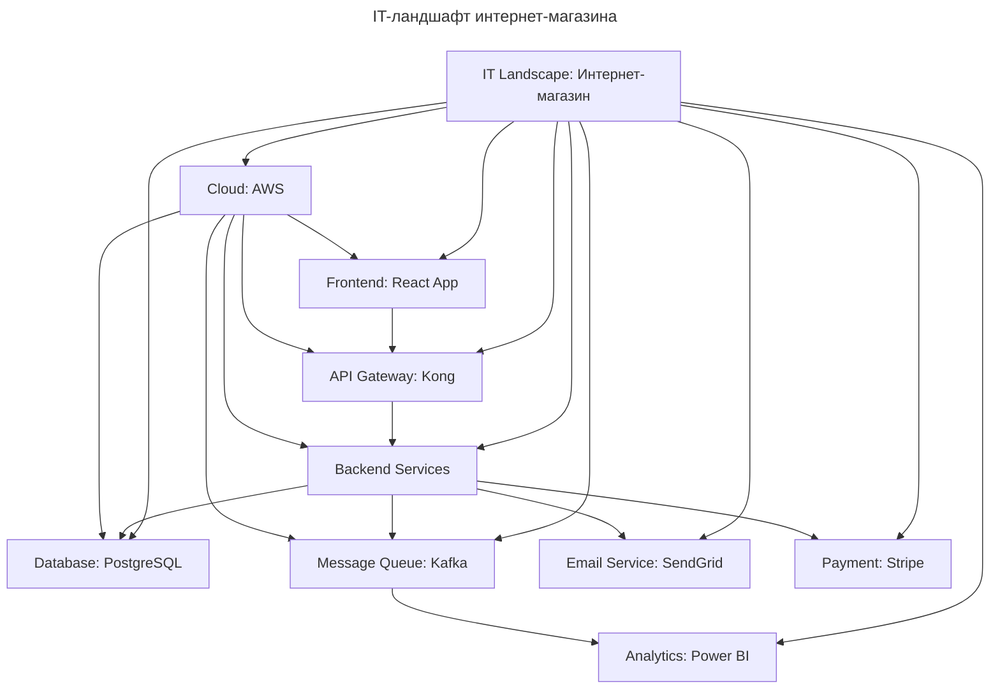

---
aliases:
  - APM
  - Application Portfolio Management
  - Business Capability Map
  - Enterprise Architecture
  - IT Landscape Map
  - IT-ландшафт
  - TOGAF
  - карта IT-ландшафта
  - Карта бизнес-возможностей
  - Корпоративная архитектура
  - ландшафт IT
  - Управление портфелем приложений
---

## Что такое IT Landscape Map

IT Landscape Map (карта IT-ландшафта) — это визуальная, структурированная картина всех IT-систем, технологий, данных и инфраструктуры, которые используются в организации. Она показывает «что есть» в IT-среде — не как должно быть, а как это реально работает сегодня.

**Определение**

IT Landscape Map — это карта, которая отображает все IT-активы компании (приложения, базы данных, серверы, API, интеграции, облачные сервисы, лицензии, владельцы и т.д.) и их взаимосвязи.

> Это не диаграмма процессов (как BPMN) и не стратегия (как Business Capability Map). Это фотография текущего состояния IT-инфраструктуры — как карта местности для IT-архитектора.

---

## Что входит в IT Landscape Map

Карта включает три уровня информации:

| Уровень | Что описывает | Примеры |
| --- | --- | --- |
| 1. Инвентаризация активов | Что есть | Приложения, базы данных, серверы, API, облака, лицензии, устройства |
| 2. Взаимосвязи | Как связаны | Какие системы обмениваются данными, через какие API/интеграции |
| 3. Метаданные | Кто, когда, как | Владелец, срок поддержки, версия, технология, статус (legacy/active/cloud), SLA, стоимость |

**Примеры элементов карты**

| Элемент | Описание |
| --- | --- |
| Система | ERP (SAP), CRM (Salesforce), BI (Power BI), БД (PostgreSQL) |
| Тип | Корпоративная, SaaS, on-premise, облачная (AWS/Azure) |
| Владелец | Отдел: «Продажи», «IT», «Финансы» |
| Интеграции | CRM → ERP через REST API, ERP → BI через ETL |
| Технология | Java, .NET, Python, Kafka, Docker, Kubernetes |
| Статус | Legacy (устаревшая), Active, Planned for replacement |
| Дата внедрения | 2018 |
| Срок поддержки | 2025 (после — не поддерживается) |
| Стоимость | $50K/год (лицензии + поддержка) |
| Зависимости | Используется 12 отделами, 300 пользователями |

---

## Пример: IT Landscape Map для интернет-магазина

**Что здесь показано**

- Frontend (React) → API Gateway → Backend Services → База данных (PostgreSQL)
- Kafka передаёт события в Power BI для аналитики
- Всё размещено в AWS
- SendGrid — устаревший сервис (помечен как legacy)
- Stripe — внешний SaaS-сервис (интегрирован через API)

---

## Как создать IT Landscape Map

### Шаг 1: Определите цель

Зачем нужна карта: миграция в облако, слияние с другой компанией, снижение затрат на IT, устранение дублирования.

### Шаг 2: Соберите инвентаризацию

Создайте таблицу (в Excel, Notion, Confluence) с полями:

| Название системы | Тип (SaaS/on-prem) | Владелец | Технология | Статус | Дата внедрения | Срок поддержки | Стоимость | Интеграции |
| --- | --- | --- | --- | --- | --- | --- | --- | --- |
| CRM Salesforce | SaaS | Продажи | REST API | Active | 2020 | 2027 | $40K/год | ERP, Email |
| Бухгалтерия 1С | on-prem | Финансы | .NET | Legacy | 2015 | 2024 | $15K/год | ERP, BI |
| Kafka | Cloud (AWS) | IT | Java | Active | 2022 | — | $8K/год | CRM, BI |

### Шаг 3: Определите связи (интеграции)

Используйте:

- техническую документацию
- архитектурные схемы
- диаграммы API (Postman, Swagger)
- логи систем
- интервью с разработчиками

> Важно: указывать не просто «CRM → ERP», а «CRM (REST API v2) → ERP (SOAP через мост) — передаётся заказ, клиент, платеж».

### Шаг 4: Визуализируйте

| Инструмент | Плюсы |
| --- | --- |
| Lucidchart | Простой, шаблоны, легко делиться |
| Draw.io / diagrams.net | Бесплатно, экспортирует в PNG/PDF |
| Miro | Коллаборация в реальном времени |
| Enterprise Architect | Профессионально, для больших компаний |
| ServiceNow / LeanIX / Apptio | Коммерческие платформы для IT-архитектуры |

Используйте цвета: 🟢 Active — зелёный, 🟡 Legacy — жёлтый, 🔴 Planned for retirement — красный, 🔵 Cloud — синий, 🟠 On-prem — серый.

### Шаг 5: Свяжите с бизнесом

Добавьте связи с Business Capability Map: «CRM поддерживает способность "Управление отношениями с клиентами"», «Kafka поддерживает способность "Аналитика событий в реальном времени"».

### Шаг 6: Обновляйте регулярно

- Обновляйте каждые 3–6 месяцев
- Добавляйте новые системы
- Удаляйте устаревшие
- Отмечайте, когда система выходит из поддержки

---

## Как IT Landscape Map связана с другими картами

| Карта | Что показывает | Как связана с IT Landscape Map |
| --- | --- | --- |
| Business Capability Map | Что бизнес умеет делать | Показывает, какие системы поддерживают каждую способность |
| BPMN (Процессы) | Как работают бизнес-процессы | Показывает, какие системы участвуют в каждом шаге процесса |
| Application Portfolio Management (APM) | Какие приложения есть и сколько они стоят | IT Landscape Map — визуализация APM |
| Enterprise Architecture (TOGAF) | Общая архитектура компании | IT Landscape Map — основной инструмент для реализации TOGAF |

> IT Landscape Map — это «мост» между бизнесом и IT.

---

## Пример: миграция в облако

Задача: перенести 3 legacy-системы в AWS за 6 месяцев.

Без карты: «Мы перенесём CRM — а потом вдруг выясняем, что она связана с 5 другими системами, и одна из них — устаревший Excel-файл с ручным обновлением».

С картой:

1. Видно, что CRM → ERP → BI → Excel.
2. Выявляется, что Excel — наибольший риск.
3. Планируется: сначала заменить Excel на Power BI, потом перенести CRM, потом ERP.
4. Оцениваются стоимость и риски.
5. Получается реальный, обоснованный план.

---

## Преимущества IT Landscape Map

| Преимущество | Объяснение |
| --- | --- |
| Устраняет «черные ящики» | Больше нет систем, о которых никто ничего не знает |
| Помогает сократить затраты | Выявляет дублирующие системы (например, 3 CRM) |
| Ускоряет цифровую трансформацию | Понятно, что переносить, что заменять, что оставить |
| Повышает безопасность | Видны системы, которые не обновлялись 5 лет, и уязвимости |
| Упрощает аудит | Легко показать регулятору все системы, работающие с персональными данными |
| Улучшает коммуникацию | Бизнес и IT говорят на одном языке |

---

## Частые ошибки

| Ошибка | Последствия | Как исправить |
| --- | --- | --- |
| Создавать карту только в IT | Бизнес не понимает её | Вовлекайте бизнес-аналитиков, владельцев систем |
| Слишком много деталей | Карта становится нечитаемой | Ограничьтесь 10–30 системами — фокус на критичных |
| Не обновлять | Карта — музейная экспозиция | Обновляйте каждые 3 месяца |
| Использовать только как презентацию | Карта не используется в работе | Интегрируйте в Jira, Confluence, ServiceNow |
| Не связывать с бизнес-возможностями | Карта — просто список систем | Добавьте колонку: «Поддерживает capability: Управление клиентами» |

---

## Итог

| До | После |
| --- | --- |
| 40 систем, но никто не знает, как они работают | Полная карта: что есть, как связано, кто владеет, сколько стоит |
| Нельзя перейти в облако — страх что-то сломать | Понятно, что переносить первым, что убрать, что заменить |
| Нет ответственного за систему | Владелец, отдел, срок поддержки |
| Непонятно, почему платим за 3 CRM | Одна активная, две legacy — выводятся в этом квартале |

> Хорошо управлять, оптимизировать и развивать можно только то, что известно. Карта — основа для любого IT-проекта.
