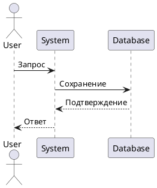
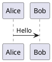
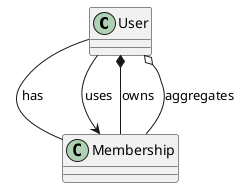

---
aliases:
  - MkDocs
  - PlantUML
  - puml
---

## PlantUML

**PlantUML** — это инструмент для создания диаграмм и визуализаций на основе текстового описания. Вместо рисования мышью пишется код, который автоматически преобразуется в диаграммы. PlantUML одновременно является **языком описания диаграмм** и **инструментом их генерации**.

**Пример кода:**



**Результат:** генерация диаграммы последовательности.



**Типы связей:**



**Документация как код**

Используется подход «Документация как код»: изменения в коде и документации происходят синхронно. Инструменты PlantUML и MkDocs применяются для создания и поддержания документации, которая всегда остаётся актуальной и синхронизированной с проектом.

> [!tip] в Obsidian требуется плагин PlantUML

**Пример структуры проекта:**

```text
FitLife/
├── .gitignore
├── README.md
├── docs/
│   └── ...
├── diagrams/
│   ├── context/
│   │   └── FitLife_Context.puml
│   ├── container/
│   │   └── FitLife_Container.puml
│   ├── component/
│   │   └── FitLife_Component_WebApp.puml
│   └── code/
│       └── FitLife_Code_Membership.puml
└── src/
    ├── main/
    │   └── ...
    └── test/
        └── ...
```

---

## Как пользоваться

1. Найти утилиту `puml`.
2. Создать файл разметки диаграммы `myDiagram.puml`.
3. Выполнить команду `puml myDiagram.puml` — в этой же папке появится `myDiagram.png`.
