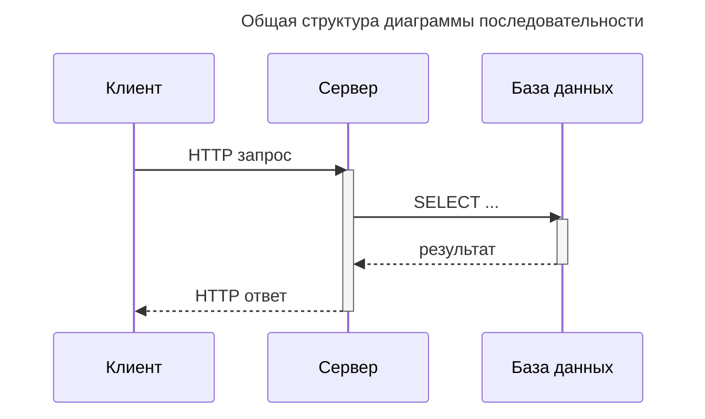
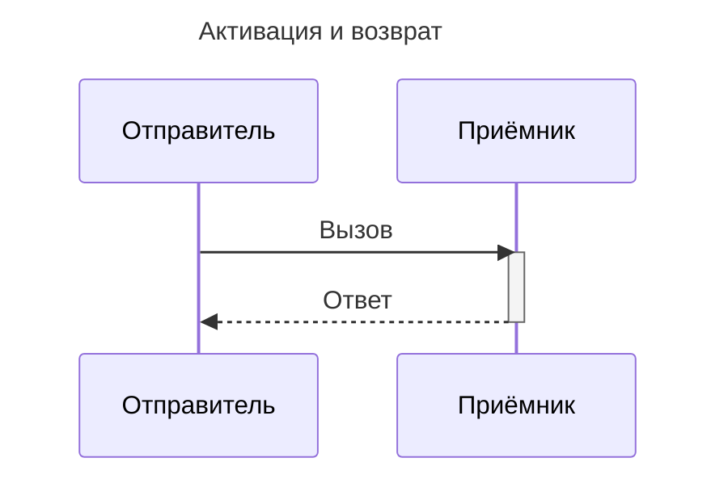
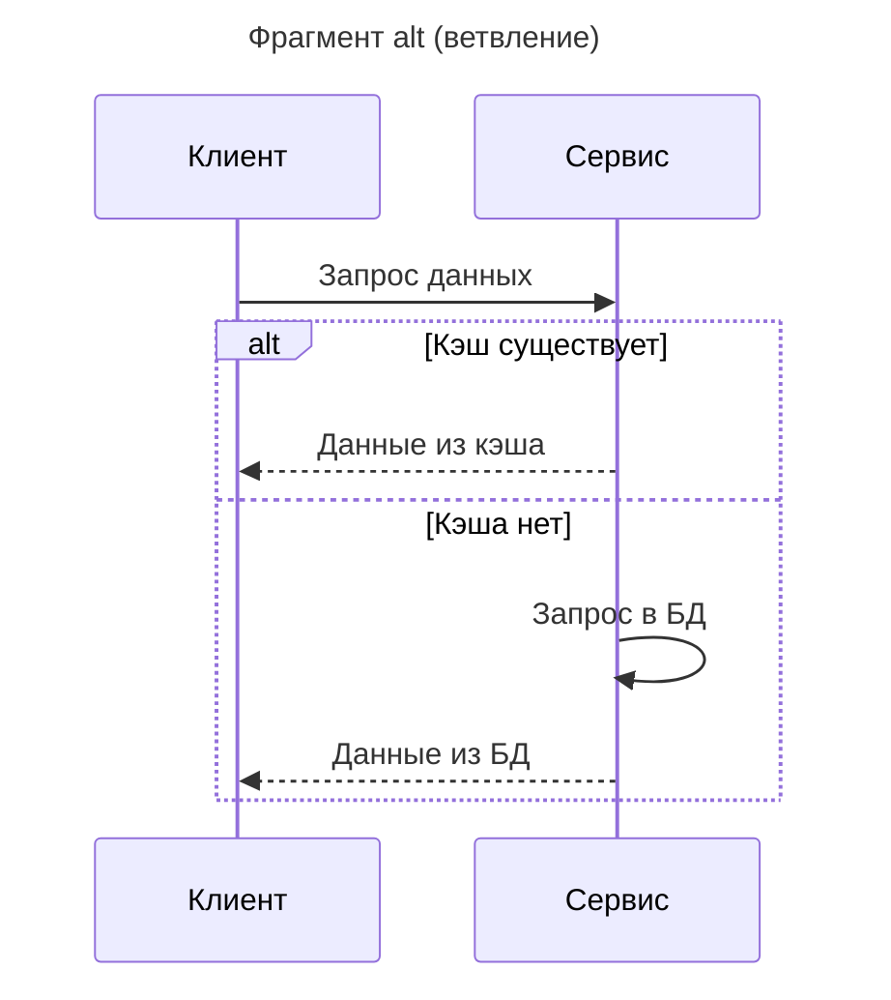
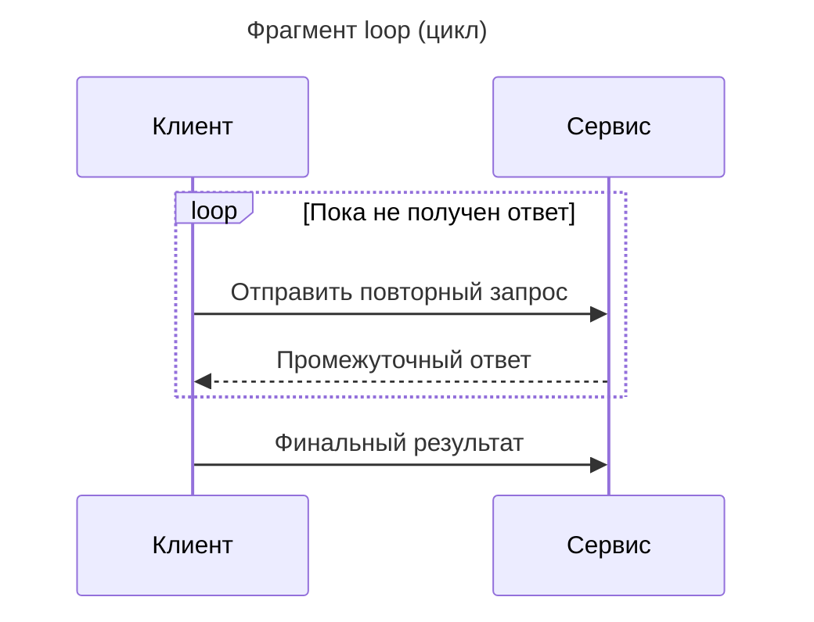
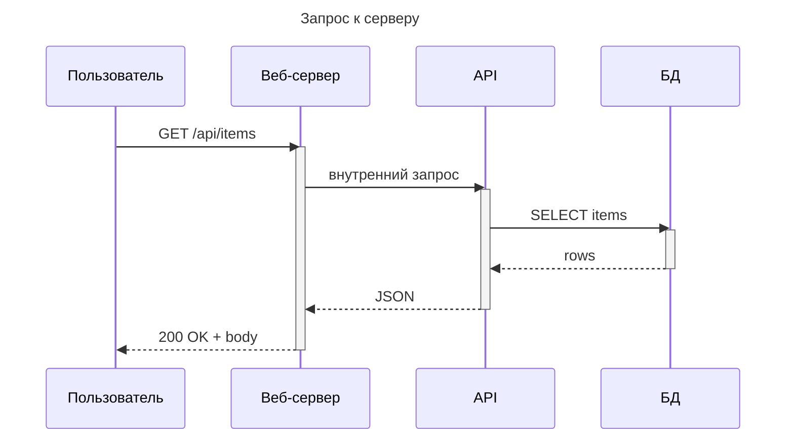
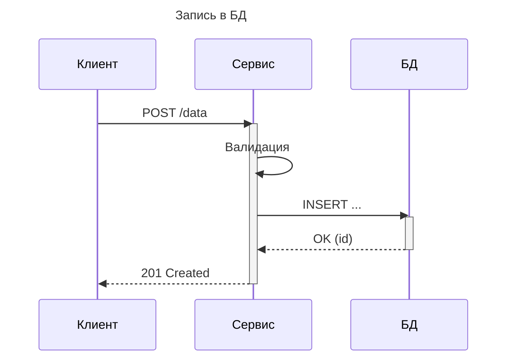
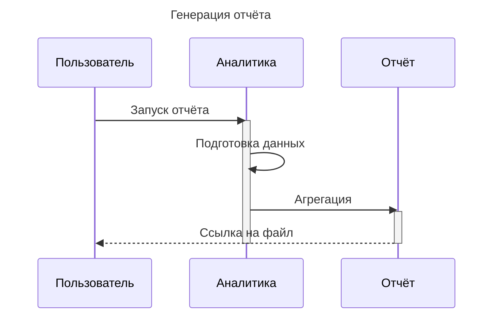

---
aliases:
  - UML Sequence Diagram
  - Диаграмма взаимодействия
  - Диаграмма последовательности
---

## Диаграмма последовательности (Sequence Diagram)

**Sequence Diagram** — это диаграмма взаимодействия, показывающая **порядок обмена сообщениями** между объектами системы во времени. Она отвечает на вопрос «**в каком порядке** компоненты обмениваются вызовами», а не «какие классы существуют» (это решает [диаграмма классов](uml.md)).

## Когда она нужна

- Показать **последовательность вызовов** между модулями, сервисами, акторами.
- Описать **сценарий** выполнения операции: запрос → обработка → ответ.
- Зафиксировать **изменение состояния** участников.
- Показать **параллельные** или **условные** ветви (alt, opt, loop).

## Основные элементы

| Элемент | Описание |
|---------|----------|
| **Actor / Participant** | Участник: пользователь, сервис, модуль, БД |
| **Lifeline** | Пунктирная вертикальная линия участника, время |
| **Activation** | Прямоугольник активности на оси времени |
| **Message** | Стрелка вызова / сообщения |
| **Reply** | Ответное сообщение |
| **Self-call** | Рекурсивный вызов |
| **Fragment** | Блок alt / opt / loop для условной логики |

## Структура диаграммы

- **Клиент** отправляет запрос → **Сервер** активируется.
- **Сервер** обращается к **БД** и получает результат.
- **Сервер** возвращает ответ клиенту.

## Как строить диаграмму

1. Определить **участников** (акторы, сервисы, системы).
2. Определить **сценарий**: что должно произойти.
3. Разложить на **события и сообщения** в хронологическом порядке.
4. Продумать условные ветви и циклы (fragments).
5. Проверить: каждый вызов имеет ответ или распределённую обработку.

## Элементы взаимодействия

- **Активация (activation)** — блок над линией жизни, показывающий занятость компонента.
- **Возврат (reply)** — пунктирная стрелка назад.
- **Self-call** — возврат к самому себе (повторная обработка внутри компонента).

## Условные фрагменты

## Синтаксис Mermaid

| Символ | Значение |
|--------|----------|
| `->>` | Синхронный вызов |
| `-->>` | Ответ / возврат |
| `-x` | Потеря сообщения (message loss) |
| `activate / deactivate` | Начало / конец активации |
| `alt / else` | Ветвление |
| `loop` | Цикл |
| `opt` | Опциональный блок |

## Пример: запрос к серверу

## Пример: запись в базу данных

## Пример: генерация отчёта

## Особенности

- ✅ Наглядно показывает порядок вызовов и зависимости.
- ✅ Отражает тайминг и активацию участников.
- ✅ Поддерживает ветвления и циклы через фрагменты.
- ✅ Подходит для документации микросервисных сценариев.
- ❌ Не описывает внутреннюю структуру классов (это диаграмма классов).
- ❌ Не описывает инструкции с ветвлениями на уровне кода.
- ❌ Быстро перегружается при большом числе участников.

## Когда использовать

| Ситуация | Использовать? |
|----------|---------------|
| Документация API-сценария | ✅ Да |
| Разбор микросервисного взаимодействия | ✅ Да |
| Описание бизнес-процесса (пошагово) | ✅ Да |
| Объяснение жизненного цикла сущности | ✅ Да |
| Диаграмма классов (статическая структура) | ❌ Другая диаграмма ([uml](uml.md)) |
| ER-диаграмма БД | ❌ Другая диаграмма ([ER-диаграмма](ER-диаграмма)) |

## Связанные диаграммы

- [Диаграмма классов](uml.md) — структура объектов.
- [Диаграмма состояний](uml.md) — жизненный цикл объекта.
- [Диаграмма потоков](Event-Driven Architecture) — потоки данных и событий.
