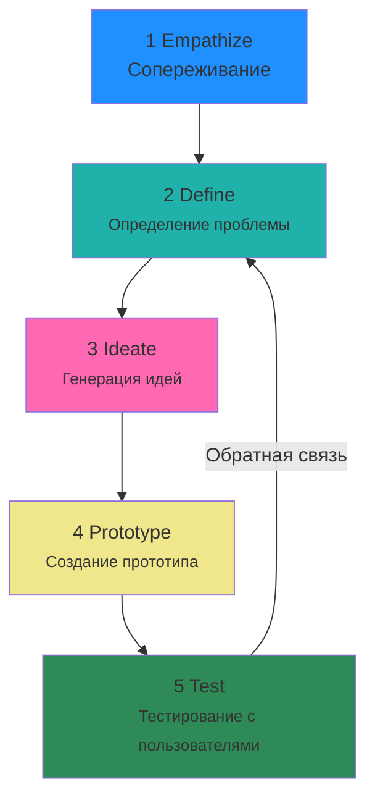

---
aliases:
  - Описание архитектуры
  - Architecture Design Record
  - Architecture Decision Log
  - Дизайн-мышление
---

# проектирование архитектуры

Под **архитектурой решения (solution architecture)** понимается результат планирования структуры и взаимодействия компонентов программного обеспечения для достижения целей и соответствия требованиям. Это решение можно оформить в концептуальный документ с описанием, схемами, допущениями и ограничениями, чтобы далее определить конкретный план изменений. Такой концепт часто называют **архитектурным видением (architecture vision)**.
* Architecture Design Record (ADR).
* Architecture vision

## Architecture Design Record и Architecture Decision Log

**Architecture decision record (ADR)** — это явное описание принятых и непринятых в ходе разработки ПО решений, которые затрагивают архитектуру, выбранные технологии и отвечают определённым функциональным или нефункциональным требованиям. Вместе с решением фиксируется его контекст, последствия и альтернативы, из которых делался выбор. Каждая запись ADR фиксируется в журнале **Architecture decision log (ADL)**. Ведение ADL позволяет отслеживать значимые архитектурные изменения внутри проекта или продукта, их историю и накапливать знания для всех участников. Это особенно полезно на долгой дистанции, когда продукт развивается годами: начальная команда может расформироваться, а знания и культура ведения ADL останутся и помогут в развитии продукта.

MADR (Markdown Architectural Decision Records), он также позволяет вести ADR в формате кода и пушить решения в git.

минимально необходимые элементы ADR:
- Контекст — то, при каких условиях принимается решение;
- Решение — в чём суть принятого решения;
- Последствия — к чему приведёт решение.

Y-statement форма ADR записей
1. Контекст (context) — на что решение влияет и в каких условиях принято. Это могут требования или условия работы конкретного компонента.
2. Причина (facing) — проблема, которую нужно решить, или определённые нефункциональные требования.
3. Принято (we decided for) — принятое решение, аргументация и причины.
4. Отклонено (neglected) — альтернативы, которые рассмотрели, но не стали выбирать.
5. Чтобы достичь (to achieve) — преимущества решения и ожидаемый результат.
6. Нужно учесть (accepting that) — недостатки или то, как решение повлияет на другие элементы.

# Дизайн-мышление

Дизайн-мышление — это нелинейная методология создания решений, в основе которой лежит необходимость осознать проблему клиента и предложить, возможно нестандартное, решение. Так создаются удобные и адаптивные системы, эффективно решающие задачи благодаря ориентации на реальный пользовательский опыт.

Метод дизайн-мышления не является линейным, ничего не мешает возвращаться на прошлые шаги, менять исходную проблему и предлагать другие варианты решения.

Так можно посмотреть на задачу через дизайн-мышление и, возможно, найти вариант решения проблемы.
1. **Эмпатия.** Здесь участники встречи пытаются определить источник проблемы клиента, встать на его место. Для начала нужно задать вопрос: «Зачем это нужно реализовать и какую проблему мы решаем?».
2. **Анализ и синтез.** После сбора информации о возникающих проблемах нужно проанализировать, систематизировать информацию и убрать всё лишнее. С одной стороны, проблему выявили, но стоит ещё раз убедиться, что эта проблема — верная.
3. **Генерация идей.** Теперь нужно рассмотреть разные варианты решения проблемы, даже неожиданные.
4. **Прототипирование.** Здесь нужно смоделировать решение проблемы любым способом (например, нарисовать на доске).
5. **Тестирование.** Когда прототип готов, и кажется, что он может решить задачу, надо попытаться его проверить и устранить недостатки.
6. **Сторителлинг.** На последнем этапе нужно обобщить информацию об итоговом решении и сформировать итоговую историю, чтобы точно убедиться, что проблема будет решена.