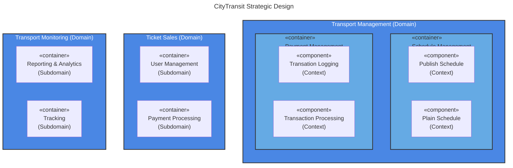

---
aliases:
  - DDD
  - Domain Driven Design
  - Domain-Driven Design
  - Ubiquitous Language
---
Domain-Driven Design = предметно-ориентированном проектировании

Без чёткого разделения на домены и контексты разработчики будут теряться в огромном количестве взаимосвязанных функций и данных. Это приведёт к увеличению времени разработки, снижению качества кода и трудностям в поддержке системы.

Подход DDD подразумевает, что для проектирования микросервисной архитектуры совместно с бизнес-экспертами определяются области:
- домены, которые представляют собой основную часть работы компании.
- поддомены — выделенные части домена с определённой функцией или конкретной задачей.
- контексты — границы, очерчивающие правила и значения использования терминов.

**Основные понятия DDD**
* **Домен** — в контексте DDD домен охватывает все понятия, связанные с бизнес-логикой, описывает её поведение и правила.
* **Поддомен** — это логически выделенная часть домена, которая выполняет определённую функцию или решает конкретную задачу. В домене может быть несколько поддоменов.
* **Контекст** — это область, внутри которой определённые термины и правила имеют чёткое значение. В DDD контексты помогают избежать путаницы, определяя границы использования понятий.

Domain-Driven Design разделяется на два уровня проектирования — стратегическое и тактическое. 

Понимание этих уровней помогает более эффективно организовать разработку и управление системой, облегчить взаимодействие между командами и улучшить масштабируемость и гибкость архитектуры. Так можно избежать проблем с путаницей в терминологии и ролях, сложностей в координации между командами, недостаточной масштабируемости и затруднений в управлении сложными системами.

Стратегическое проектирование позволяет определить высокоуровневую структуру системы, а тактическое проектирование — детализировать каждый контекст, обеспечивая реализацию бизнес-логики.
### **Стратегическое проектирование**

На этом уровне определяется общая структура системы и взаимодействие между различными частями домена. Основная задача — разделить систему на поддомены и очертить границы контекстов.

**Основные элементы**

- **Bounded Context:** определяет границы, в пределах которых терминология и правила имеют чёткое значение.
	- Пример Bounded Context-а
		- **Домен: продажа билетов**
		    - поддомен обработки платежей
		    - поддомен управления пользователями
		- **Домен: мониторинг транспорта**
		    - поддомен отслеживания транспорта
		    - поддомен отчётности и аналитики

- **Context Map:** диаграмма, показывающая взаимодействие между различными контекстами.

### **Тактическое проектирование**

На этом уровне определяются детали реализации внутри каждого контекста. Основная задача — создать модель, которая точно отражает бизнес-логику и поведение домена.

**Основные элементы:**
- **Entities:** объекты, которые имеют уникальный идентификатор и состояние, изменяющееся со временем.
- **Value Objects:** объекты, которые не имеют уникального идентификатора и полностью определяются своими атрибутами.
- **Aggregates:** группы связанных сущностей и объектов-значений, которые обрабатываются как единое целое.
- **Repositories:** интерфейсы для доступа к агрегатам из хранилища данных.
- **Services:** операции, которые не относятся к какой-либо сущности, но важны для домена.

## Ubiquitous Language
**Ubiquitous Language (Единый/Универсальный Язык)** — это ключевое понятие в Domain-Driven Design (DDD), которое означает **общий язык, совместно используемый всеми участниками проекта** (разработчиками, экспертами предметной области, тестировщиками, менеджерами и т.д.) для описания работы и элементов этого домена.

Это не просто словарь терминов. Это живой, постоянно развивающийся язык, на котором говорят все, кто связан с проектом, чтобы избежать недопонимания и искажения смысла.

**Основные идеи Ubiquitous Language**
1. **Общий язык для всех:** И разработчики, и эксперты (например, инженеры-теплотехники, специалисты по безопасности) используют одни и те же термины для описания одних и тех же понятий, процессов и данных.
2. **Основа для модели:** Язык напрямую отражается в коде. Имена классов, методов, модулей и переменных берутся непосредственно из этого языка.
3. **Постоянное уточнение:** Язык не создаётся один раз и навсегда. Он развивается и refine-ится в процессе collaboration-а (сотрудничества) между командой разработки и экспертами домена.

**Как его построить и поддерживать?**

4. **Тесное взаимодействие:** Постоянные встречи и диалоги между разработчиками и экспертами.
    
5. **Моделирование:** Использование диаграмм, карточек, досок (как цифровых, так и физических), где все рисуют и описывают процессы _вместе_.
    
6. **Немедленное отражение в коде:** Если на встрече придумали новый точный термин, его нужно сразу начать использовать в коде, заменив им старые, неточные названия.
    
7. **Документирование:** Ведение глоссария (в вики, в документации к коду), где записываются определения терминов. Но важно, чтобы этот глоссарий _следовал_ за языком, а не диктовал его.
    

**Итог:** Ubiquitous Language — это **краеугольный камень DDD**. Он устраняет разрыв между предметной областью и кодом, делая программное обеспечение более точным отражением реальных бизнес-процессов и drastically уменьшая количество ошибок на почве недопонимания.

**Domain-Driven Design (DDD)** — методология разработки ПО, основанная на тесном взаимодействии бизнеса и разработчиков. Основной принцип этой техники — разделение приложения на домены, которые представляют собой ограниченный контекст бизнес-проблем и целей.

Каждый такой ограниченный контекст — бизнес-домен — может рассматриваться для выделения в качестве независимого микросервиса. Команда разработчиков вместе с бизнес-аналитиками определяет компоненты, которые имеют наибольшую ценность для бизнеса, и затем соответствующие границы в рамках монолитного приложения.

**В каких случаях применяется Domain-Driven Design?**

Domain-Driven Design полезен, когда монолитное приложение содержит сложную бизнес-логику и поддерживается крупными командами. Чтобы вести и развивать такой проект, требуется чёткое разделение обязанностей. Этот подход помогает структурировать код так, чтобы он лучше отражал бизнес-процессы и был проще в сопровождении и развитии.
## история

#👨 Эрик Эванс, представил концепцию DDD в своей книге «Domain-Driven Design: Tackling Complexity in the Heart of Software» #📘 в 2003 году.
