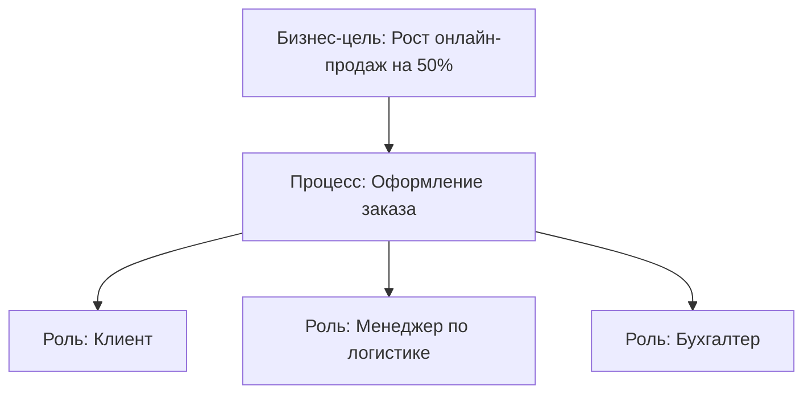
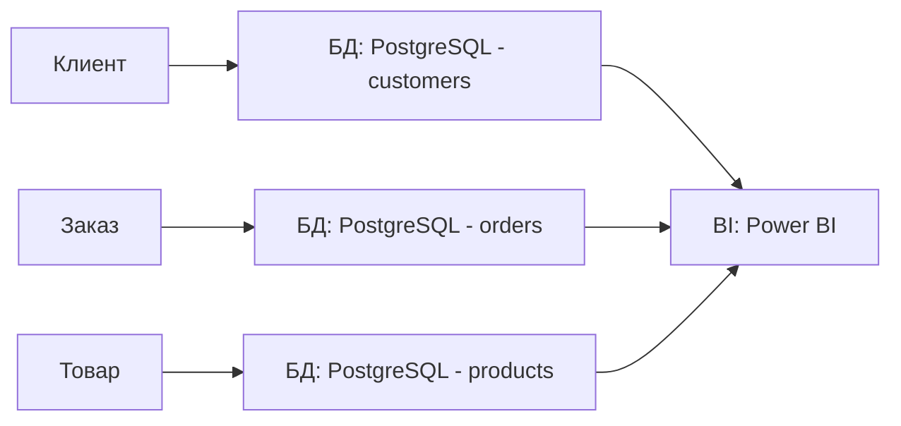
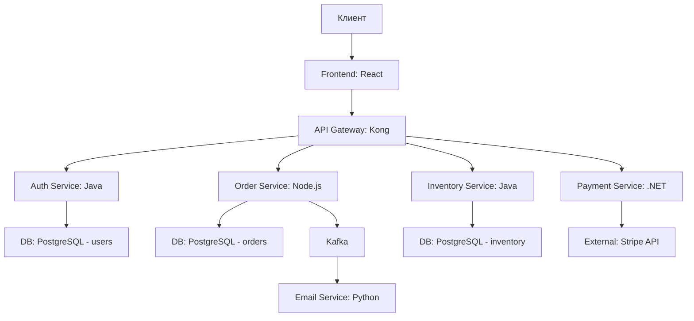
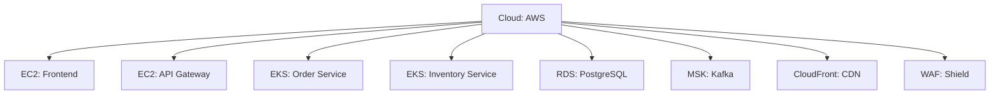

---
aliases:
  - Архитектура предприятия
  - AE
  - Enterprise Architecture
---
**Enterprise Architecture (EA) — Архитектура предприятия** — это **системный, стратегический подход к проектированию и управлению всей IT- и бизнес-инфраструктурой компании**, чтобы она **эффективно поддерживала бизнес-цели**.

---

## ✅ Что такое **Enterprise Architecture (EA)**?

> **Enterprise Architecture (EA)** — это **дисциплина**, которая **описывает, как бизнес, процессы, данные, приложения и технологии взаимосвязаны** в организации, и **как они должны быть устроены**, чтобы достигать стратегических целей.

> 💡 Это **не просто диаграммы** — это **система управления сложностью**, которая позволяет:
> - Не строить "островки" систем
> - Избежать дублирования
> - Связать IT с бизнесом
> - Управлять изменениями
> - Снижать риски и затраты

> ✅ **EA — это "карта" всей компании: кто, что, как и зачем делает.**

---

## ✅ Почему EA нужна? Проблемы без неё

| Проблема | Последствия |
|----------|-------------|
| ❌ **"Островки систем"** | 10 разных CRM, 5 ERP, 3 BI — все не связаны, данные дублируются |
| ❌ **IT не связан с бизнесом** | Руководство говорит: "Хочу увеличить продажи", а IT делает "новый экран в бухгалтерии" |
| ❌ **Нет понимания зависимостей** | Изменили API — сломался 7 сервисов, никто не знал, что они зависят |
| ❌ **Дублирование расходов** | Купили 3 одинаковых системы — потому что не знали, что одна уже есть |
| ❌ **Сложно масштабировать** | Нельзя добавить новый сервис — всё слишком запутано |
| ❌ **Нет контроля изменений** | Каждое изменение — авария, потому что никто не знает, что затронет |
| ❌ **Нет отчётности перед советом директоров** | Как доказать, что ИТ-инвестиции оправданы? |

> 💬 *«Без EA — IT — это как город без плана: улицы идут в разные стороны, трубы пересекаются, и никто не знает, где водопровод.»*

---

## ✅ Основные компоненты Enterprise Architecture (4 слоя)

EA описывает компоненты компании на **четырёх уровнях** — как архитектор строит дом: фундамент, стены, крыша, интерьер.

| Уровень | Что описывает | Примеры |
|--------|---------------|---------|
| **1. Business Architecture** | **Что делает компания?** Бизнес-цели, процессы, структура, роли | Цель: "Стать лидером по онлайн-продажам" Процессы: "Оформление заказа", "Обработка возврата" Роли: "Менеджер по продажам", "Клиент" |
| **2. Data Architecture** | **Какие данные есть? Где они хранятся? Как связаны?** | Сущности: "Клиент", "Заказ", "Товар" Базы данных: PostgreSQL, MongoDB Потоки данных: "Заказ → БД → BI" |
| **3. Application Architecture** | **Какие приложения используются? Как они взаимодействуют?** | CRM (Salesforce), ERP (SAP), BI (Power BI), API Gateway, Kafka Интеграции: "CRM → ERP через REST API" |
| **4. Technology Architecture** | **Какая инфраструктура поддерживает приложения?** | Облако (AWS), серверы, сеть, контейнеры (Docker/K8s), мониторинг (Prometheus), безопасность (WAF) |

> ✅ **EA — это не про технологии. Это про то, как технологии служат бизнесу.**

---

## ✅ Ключевые фреймворки EA

| Фреймворк                   | Описание                                                             | Когда использовать                                                              |
| --------------------------- | -------------------------------------------------------------------- | ------------------------------------------------------------------------------- |
| **[[TOGAF]]**               | Самый популярный стандарт (The Open Group) — методология создания EA | **Крупные компании, регулируемые отрасли** (банки, госструктуры)                |
| **Zachman Framework**       | Матричный подход — "Кто? Что? Когда? Где? Почему? Как?"              | **Для глубокого анализа и аудита**                                              |
| **FEAF (Federal EA)**       | Для **государственных организаций США**                              | Только для госсектора                                                           |
| **ArchiMate**               | Язык моделирования — как UML для архитектуры                         | **Для визуализации** диаграмм (часто используется вместе с TOGAF)               |
| **[[COBIT]]**               | Управление ИТ-услугами, контроль, соответствие                       | **Для аудита, управления рисками, SLA** — часто используется **вместе с TOGAF** |
| **[[BPMN]] / [[4C]] / UML** | Инструменты для визуализации процессов и систем                      | **Для описания** бизнес-процессов, IT-ландшафта, компонентов                    |

> ✅ **TOGAF + ArchiMate + COBIT + BPMN = полный набор для профессиональной EA**

---

## ✅ Как выглядит EA на практике? Пример: Онлайн-магазин

### 🎯 Цель бизнеса:  
> *«Стать лидером по онлайн-продажам в регионе за 3 года»*

### 📊 EA-диаграммы (уровни):

#### 1. **Business Architecture**

#### 2. **Data Architecture**

#### 3. **Application Architecture**

#### 4. **Technology Architecture**

> ✅ **Это и есть Enterprise Architecture** — **единая карта**, которая показывает:  
> - Что делает бизнес  
> - Какие данные нужны  
> - Какие приложения работают  
> - Какая инфраструктура поддерживает всё это

---

## ✅ Зачем нужна Enterprise Architecture?

| Цель | Как EA помогает |
|------|-----------------|
| ✅ **Связать IT с бизнесом** | Показывает, как каждый сервис поддерживает бизнес-цель |
| ✅ **Уменьшить стоимость ИТ** | Выявляет дублирование — например, 3 CRM → оставляем один |
| ✅ **Управление изменениями** | Зная зависимости — можно предсказать, что сломается при изменении |
| ✅ **Поддержка цифровой трансформации** | Показывает, куда двигаться — например, "перейти на облако" |
| ✅ **Снижение рисков** | Зная, что зависит от чего — можно защитить критичные компоненты |
| ✅ **Отчётность перед советом директоров** | Можно сказать: "Мы сократили затраты на 20% за счёт унификации систем" |
| ✅ **Ускорение внедрения новых проектов** | Новый сервис легко интегрируется — потому что всё описано и стандартизировано |

---

## ✅ Кто работает с EA?

| Роль | Ответственность |
|------|------------------|
| **Enterprise Architect (EA)** | Главный архитектор — разрабатывает и поддерживает архитектуру |
| **Solution Architect** | Архитектор конкретного решения (например, CRM) — работает в рамках EA |
| **Business Architect** | Описывает бизнес-процессы и цели |
| **Data Architect** | Описывает структуру данных |
| **Application Architect** | Описывает приложения и их интеграции |
| **Infrastructure Architect** | Описывает серверы, сеть, облако |
| **CIO / CTO** | Отвечает за стратегию — должен понимать и поддерживать EA |
| **Аудитор / COBIT-специалист** | Проверяет соответствие EA стандартам |

> ✅ **EA — это не работа одного человека. Это работа команды.**

---

## ✅ Когда использовать Enterprise Architecture?

| Ситуация                                                                | Рекомендация                                                    |
| ----------------------------------------------------------------------- | --------------------------------------------------------------- |
| ✅ У вас **более 20 ИТ-систем**                                          | ✅ **Обязательно** — без EA — хаос                               |
| ✅ У вас **больше 5 команд разработки**                                  | ✅ **Обязательно** — иначе будут конфликты, дублирование         |
| ✅ Вы в **регулируемой отрасли** (банк, медицина, госструктура)          | ✅ **Обязательно** — аудит требует документированной архитектуры |
| ✅ Вы делаете **цифровую трансформацию**                                 | ✅ **Обязательно** — без EA вы не поймёте, куда двигаться        |
| ✅ Вы хотите **снизить ИТ-расходы**                                      | ✅ **Обязательно** — EA выявляет дубли и устаревшие системы      |
| ✅ Вы — стартап с 5 разработчиками                                       | ❌ **Не нужно** — используйте Agile + DevOps                     |
| ✅ Вы используете **[[software-engineer/технологии/kubernetes/Kubernetes]], [[microservice]], [[CI-CD\|CI/CD]]** | ✅ **Обязательно** — без EA вы не сможете управлять сложностью   |

---

## ✅ [[Enterprise Architecture|Enterprise Architecture]] vs [[TOGAF]] vs [[COBIT]] vs [[ITIL]] — как они связаны?

| Фреймворк                   | Роль в EA                                                                |
| --------------------------- | ------------------------------------------------------------------------ |
| **Enterprise Architecture** | **Общая дисциплина** — "Как устроить компанию"                           |
| **TOGAF**                   | **Методология** для создания и управления EA — "Как делать"              |
| **COBIT**                   | **Управление ИТ-контролем, рисками, соответствием** — "Почему это важно" |
| **ITIL**                    | **Управление ИТ-услугами** — "Как доставлять сервисы"                    |
| **ArchiMate**               | **Язык моделирования** — "Как рисовать" (диаграммы)                      |
| **BPMN / C4**               | **Инструменты визуализации** — "Как показать процессы и компоненты"      |

> ✅ **EA — это цель. TOGAF — маршрут. COBIT — контроль. ITIL — доставка. ArchiMate — карта.**

> 💬 *«TOGAF — это как инструкция по сборке IKEA.  
> COBIT — как проверка, что вы не забыли болты.  
> ITIL — как инструкция, как пользоваться мебелью.  
> EA — это весь дом, который вы строите.»*

---

## ✅ Пример: Как EA спасает компанию

### 🏢 Ситуация:
Компания — крупный ритейлер.  
**Проблема:**  
- 8 разных систем для управления заказами  
- Клиенты жалуются: "У меня 3 заказа в разных системах"  
- Нельзя сделать аналитику — данные в разных базах  
- Каждое обновление — авария  

### ✅ Решение: Внедрение EA (с TOGAF + ArchiMate)

1. **Создали Business Architecture**:  
   → Цель: "Единый клиентский опыт"  
   → Процесс: "Один заказ — один статус"

2. **Создали Application Architecture**:  
   → Убрали 7 систем → оставили **одну ERP-систему**  
   → Подключили к ней все каналы: сайт, мобильное приложение, магазины

3. **Создали Data Architecture**:  
   → Единая база данных — "клиент, заказ, товар"

4. **Создали Technology Architecture**:  
   → Перешли на **AWS** + **Kubernetes**  
   → Внедрили **API Gateway** и **Kafka**

### ✅ Результат:
- Уменьшили ИТ-затраты на **35%**  
- Сократили время оформления заказа с **3 мин до 30 сек**  
- Увеличили продажи на **22%**  
- Прошли аудит ISO 27001  
- Совет директоров одобрил инвестиции в AI для персонализации

---

## ✅ Когда EA — **не нужна**?

| Ситуация | Почему не нужна |
|----------|------------------|
| ✅ Стартап с 1–5 разработчиками | Слишком много бюрократии — используйте Agile |
| ✅ Маленький проект, который умрёт через 6 месяцев | Не вкладывайте усилия в архитектуру |
| ✅ Вы — инженер, который пишет код | Вам нужен **решение-архитектор**, а не EA-директор |
| ✅ У вас нет руководства, которое понимает ИТ | Без поддержки CEO — EA не пройдёт |

---

## ✅ Где учиться и получить сертификацию?

| Ресурс | Ссылка |
|--------|--------|
| **TOGAF 10 — официальный стандарт** | https://www.opengroup.org/togaf |
| **Книга: "TOGAF 10 Foundation"** | Обязательно для чтения |
| **Сертификация TOGAF** | Стоит $300–$500 — **очень ценится в корпорациях** |
| **COBIT 2019** | https://www.isaca.org/resources/cobit |
| **ArchiMate** | https://pubs.opengroup.org/architecture/archimate31-doc/ |
| **Курс на Udemy** | *“Enterprise Architecture: TOGAF & ArchiMate”* — 15+ часов |

---

## ✅ Финальный вывод: EA — это **не про технологии. Это про стратегию.**

| EA — это... | Это не... |
|------------|-----------|
| ✅ **Карта, которая показывает, как компания работает** | ❌ Список серверов и IP-адресов |
| ✅ **Инструмент для снижения рисков и затрат** | ❌ Бюрократия ради бюрократии |
| ✅ **Связь между бизнесом и IT** | ❌ Только для IT-отдела |
| ✅ **Фундамент для цифровой трансформации** | ❌ Для маленьких команд |
| ✅ **Язык совета директоров** | ❌ Для разработчиков, которые хотят просто писать код |

> ✅ **Если вы управляете ИТ в компании с 50+ сотрудниками — EA — ваша обязанность.**  
> ✅ **Если вы хотите, чтобы ИТ не был "счётчиком", а был "стратегическим активом" — EA — ваш выбор.**

---

## 💬 Цитата от эксперта

> _"Бизнес не интересует, какой у вас сервер. Он интересует, почему вы не можете дать ему отчёт о продажах за вчера.  
> EA — это то, что превращает 'технический хаос' в 'бизнес-ответ'."_  
> — **CIO крупной компании**

---

✅ **Enterprise Architecture — это когда IT перестаёт быть "поддержкой" и становится "двигателем бизнеса".**  
Используйте её — и вы перестанете слышать:  
> _«А почему мы не знали, что это зависит от этого?»_  
> _«А почему это так дорого?»_  
> _«А почему вы не предупредили?»_  

> 💡 **EA — это не про "что делать". Это про "почему это важно".**