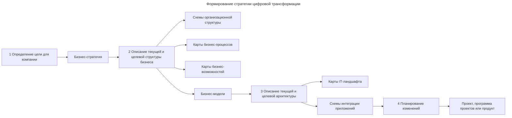

---
aliases:
  - ARPPU
  - ARPU
  - Average Revenue per Paying User
  - Average Revenue per User
  - BCM
  - Business Model Canvas
  - CAPEX
  - Capital Expenditure
  - CJM
  - Conversion
  - Cost per Lead
  - CPL
  - CustDev
  - Customer Development
  - Customer Journey Map
  - DAU
  - Digital Transformation
  - Digital Transformation Roadmap
  - Gross Profit
  - Internal Development Platform
  - Leads
  - Lean Canvas
  - Lifetime Value
  - LTV
  - MAU
  - Minimal Valuable Product
  - Minimum Viable Product
  - MVP
  - Net Profit
  - Operational Expenditure
  - OPEX
  - PMBOK
  - PRINCE2
  - Product Manager
  - Profit
  - Project Manager
  - Revenue
  - TOGAF
  - UML
  - value stream
  - WAU
  - Автоматизация
  - Бизнес-возможности
  - Бизнес-процессы
  - Выручка
  - Дорожная карта
  - Жизненный цикл продукта
  - Заинтересованные стороны
  - Карта бизнес-возможностей
  - Карта клиентского пути
  - Конверсия
  - Лиды
  - Менеджер продукта
  - Менеджер проекта
  - Платформа разработки
  - Поток создания ценности
  - Прибыль
  - Продуктовые исследования
  - Продуктовый подход
  - Проект
  - Проектное управление
  - Проектный офис
  - Проектный подход
  - работа с требованиями
  - Роадмап
  - Стейкхолдеры
  - Стратегия цифровой трансформации
  - Финансовые метрики
  - Цифровая трансформация
  - Цифровизация
---
## Цифровая трансформация

Цифровая трансформация — это комплексное внедрение цифровых технологий в деятельность компании: не просто обновление оборудования или программного обеспечения, а глубокое изменение процессов, взаимодействия с клиентами и всей бизнес-модели.

Автоматизация и цифровизация — этапы в жизни компании, которые могут привести к цифровой трансформации. При цифровой трансформации компания напрямую зарабатывает на цифровых продуктах.

**Стратегия цифровой трансформации** — системный, долгосрочный план, который описывает, как организация использует цифровые технологии для фундаментального изменения бизнес-моделей, процессов, культуры и клиентского опыта с целью достижения устойчивого конкурентного преимущества.

Концепцию развивают аналитические компании McKinsey, Gartner, Deloitte.

### Формирование стратегии цифровой трансформации

Шаги трансформации:

1. Определить цели трансформации.
2. Описать текущую и целевую бизнес-модель.
3. Описать текущую и целевую архитектуру.
4. Спланировать изменения.

Для визуализации изменений можно создать дорожную карту — роадмап, карту цифровой трансформации (Digital Transformation Roadmap). На ней указывают общие шаги и сроки реализации без детализации работ. Реализовать план можно с помощью проектного или продуктового подхода.

### Текущее и целевое состояние бизнеса

Под **бизнес-архитектурой компании** подразумевается связь между структурой бизнеса, стратегией развития и архитектурой информационных систем.

**Бизнес-возможности** — способность бизнеса осуществлять определённые действия. Они описывают, что делает или может делать бизнес. Этим они отличаются от бизнес-процессов, в которых описаны шаги по достижению целей.

Понятие активно применяется во фреймворке корпоративной архитектуры [[TOGAF]].

Бизнес-возможности полезно собирать в отдельный артефакт — **карту бизнес-возможностей** ([[BCM]]). Она описывает все возможности, которые уже есть в компании, и те, которые будут в её целевом состоянии.

**Поток создания ценности** (англ. value stream) — последовательность действий или этапов создания ценности, которые организация выполняет для удовлетворения потребности клиента. Клиентом может быть как внешний, так и внутренний заинтересованный субъект, отвечающий за поддержку создания ценности в организации.

### Текущая и целевая архитектура

Для обобщения понимания ландшафта информационных систем стоит понимать [[software-engineer/standard/КИС|классификацию информационных систем]].

Используется **карта ландшафта** информационных систем компании — существующая и целевая.

**Платформа разработки** — организационно-технический компонент в структуре компании, который позволяет быстрее и проще реализовывать типовые изменения. Актуально внедрение внутренних платформ разработки (Internal Development Platform): общие правила разработки, языки программирования, базы данных. Такая платформа предоставляет инфраструктуру для развёртывания приложений, репозитории с кодом и средства CI/CD — в комплексе позволяет разрабатывать приложения быстрее и по стандартным правилам.

**Диаграмма интеграции приложений**

- Для такой схемы можно использовать любую нотацию, например C4 или UML, но на стратегическом уровне достаточно обобщённой схемы без детализации всех потоков данных.
- Диаграмму интеграции можно построить, анализируя карту IT-ландшафта по пересечениям систем.
- Стоит составить текущую и целевую диаграмму интеграции приложений.

### Планирование стратегических изменений

Для планирования изменений подходит дорожная карта — roadmap, роадмап. Она формализует общие направления реализации.

Продуктовый подход рассчитан на улучшение продукта в течение всего жизненного цикла. Проектный подход сосредоточен на бюджете и выполнении проекта в установленные сроки — с фиксированными целями и результатами. В продуктовом подходе важна адаптивность и постоянное развитие, в проектном — завершение конкретной задачи.

**Проектный подход**

Проект — временное предприятие, предназначенное для создания уникальных продуктов, услуг или результатов. IT-проект — проект в сфере создания, внедрения или применения информационных технологий.

Проектное управление и проектный подход отвечают на вопрос: «Как реализовать заданный результат к определённой дате в рамках доступного бюджета и ресурсов?».

Проектом управляет **менеджер проекта** (Project Manager, PM). Он отвечает за достижение результатов проекта. Кроме PM обычно есть другие ключевые участники:

- Команда проекта — люди, которые будут реализовывать проект.
- Спонсор — подразделение или человек, которые предоставляют ресурсы для проекта.
- Заказчик — подразделение или человек, которые будут использовать результат проекта.
- Заинтересованные стороны — люди и организации, прямо или косвенно влияющие на ход проекта и его результаты. Их часто называют стейкхолдерами.

Подразделение компании — **проектный офис** — вырабатывает единые правила по управлению проектами и отвечает за их реализацию.

Для управления проектами есть стандарты, например:

- PRINCE2
- PmBook

**Продуктовый подход**

Продукт — результат деятельности компании, предназначенный для удовлетворения потребностей пользователей или рынка. Он может быть материальным или нематериальным и имеет свой жизненный цикл.

Продуктовый подход предполагает создание в компании структуры, которая сможет относительно автономно развивать продукт, например команда. Она развивается параллельно с продуктом и зависит от его жизненного цикла — с организационной точки зрения команда равнозначна самому продукту.

За управление продуктом отвечает **менеджер продукта** (Product Manager, PM). Основные функции PM:

- Определение видения продукта.
- Анализ рынка и пользователей.
- Разработка стратегии.
- Работа с командами развития продукта — маркетингом, разработкой, поддержкой и другими.
- Определение приоритетов работы над продуктом.
- Анализ результатов и обратной связи.
- Управление бюджетом продукта — не всегда.

**Продуктовые исследования**

Чтобы понять, нужен ли продукт клиенту, нужны продуктовые исследования — анализ рынка или продуктов конкурентов. Методологии:

- CustDev (Customer Development) — процесс выявления потребностей с помощью интервью у потенциальных пользователей приложения.
- Customer Journey Map (CJM) — карта клиентского пути.
- Lean-модель (Lean Canvas).
- Business Model Canvas.

Для тестирования гипотезы о востребованности продукта выпускается **MVP** — Minimal Valuable Product.

**Метрики бизнеса и продуктов**

1. Инвестиционные метрики — целесообразность проекта:
   - CAPEX — Capital Expenditure — капитальные затраты.
   - OPEX — Operational Expenditure — операционные расходы.
2. Бизнес-метрики — целесообразность каждого продукта в отдельности:
   - Финансовые метрики:
     - Выручка — Revenue.
     - Прибыль — Profit (чистая — Net Profit, валовая — Gross Profit).
   - Метрики продаж:
     - Количество лидов — Leads (лид — факт заинтересованности потенциального клиента в продукте или услуге).
     - CPL — Cost per Lead.
     - Конверсия — Conversion (число клиентов, совершивших целевое действие).
   - Продуктовые метрики:
     - Метрики активности пользователей — User Activity: DAU (Daily Activity Users), WAU (Weekly Activity Users), MAU (Mouthly Activity Users).
     - Метрики выручки на пользователя: ARPU (Average Revenue per User), ARPPU (Average Revenue per Paying User), LTV (Lifetime Value).

Стремление бизнеса улучшить метрики приводит к изменениям, которые могут повлиять на архитектуру компании и потребовать доработок у команд продуктов или систем.

См. также: [[change-management]]
