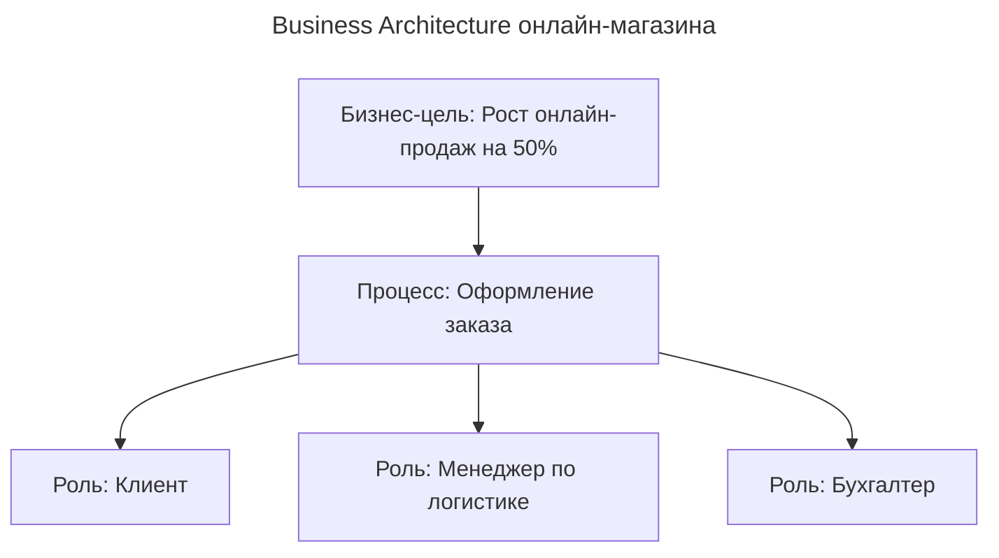
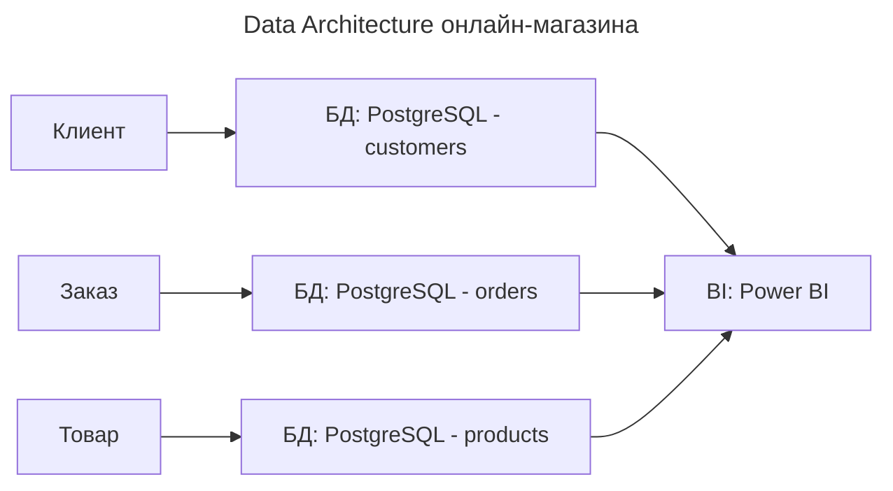
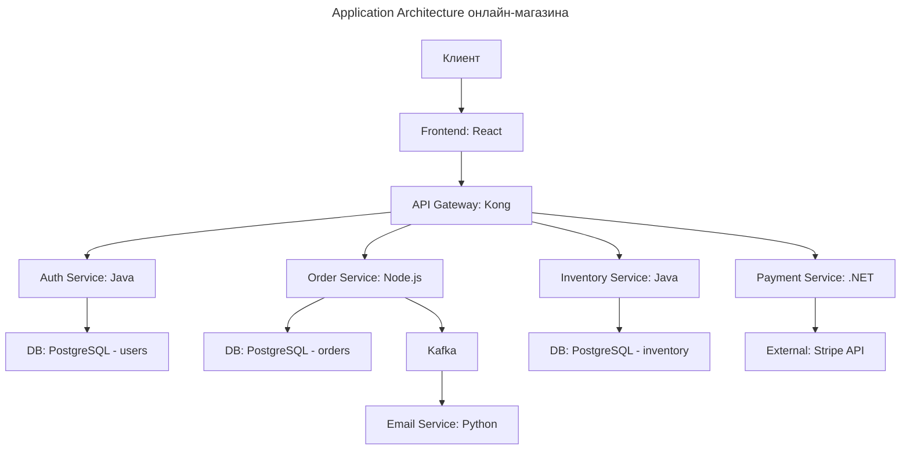
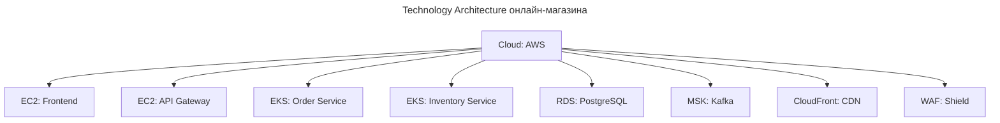

---
aliases:
  - 4C
  - AE
  - Application Architecture
  - ArchiMate
  - BPMN
  - Business Architecture
  - C4
  - COBIT
  - Data Architecture
  - Digital Transformation
  - EA
  - Enterprise Architect
  - Enterprise Architecture
  - FEAF
  - ITIL
  - Solution Architect
  - Technology Architecture
  - TOGAF
  - UML
  - Zachman Framework
  - Архитектура предприятия
  - Цифровая трансформация
---

# Enterprise Architecture (EA)

**Enterprise Architecture (EA) — Архитектура предприятия** — это **системный, стратегический подход к проектированию и управлению всей IT- и бизнес-инфраструктурой компании**, чтобы она **эффективно поддерживала бизнес-цели**.

---

## Определение Enterprise Architecture

**Enterprise Architecture (EA)** — дисциплина, которая **описывает, как бизнес, процессы, данные, приложения и технологии взаимосвязаны** в организации и **как они должны быть устроены**, чтобы достигать стратегических целей.

**EA — это система управления сложностью**, а не просто диаграммы. Она позволяет:

- Не строить «островки» систем.
- Избегать дублирования.
- Связывать IT с бизнесом.
- Управлять изменениями.
- Снижать риски и затраты.

**EA — это «карта» всей компании: кто, что, как и зачем делает.**

---

## Проблемы без Enterprise Architecture

| Проблема | Последствия |
|----------|-------------|
| «Островки систем» | 10 разных CRM, 5 ERP, 3 BI — всё не связано, данные дублируются |
| IT не связан с бизнесом | Руководство говорит: «Хочу увеличить продажи», а IT делает «новый экран в бухгалтерии» |
| Нет понимания зависимостей | Изменили API — сломался 7 сервисов, никто не знал, что они зависят |
| Дублирование расходов | Купили 3 одинаковых системы — потому что не знали, что одна уже есть |
| Сложно масштабировать | Нельзя добавить новый сервис — всё слишком запутано |
| Нет контроля изменений | Каждое изменение — авария, потому что никто не знает, что затронет |
| Нет отчётности перед советом директоров | Как доказать, что ИТ-инвестиции оправданы? |

> «Без EA IT — как город без плана: улицы идут в разные стороны, трубы пересекаются, и никто не знает, где водопровод.»

---

## Компоненты Enterprise Architecture (4 слоя)

EA описывает компоненты компании на **четырёх уровнях** — как архитектор строит дом: фундамент, стены, крыша, интерьер.

| Уровень | Что описывает | Примеры |
|--------|---------------|---------|
| **1. Business Architecture** | **Что делает компания?** Бизнес-цели, процессы, структура, роли | Цель: «Стать лидером по онлайн-продажам»; процессы: «Оформление заказа», «Обработка возврата»; роли: «Менеджер по продажам», «Клиент» |
| **2. Data Architecture** | **Какие данные есть? Где они хранятся? Как связаны?** | Сущности: «Клиент», «Заказ», «Товар»; базы данных: PostgreSQL, MongoDB; потоки данных: «Заказ → БД → BI» |
| **3. Application Architecture** | **Какие приложения используются? Как они взаимодействуют?** | CRM (Salesforce), ERP (SAP), BI (Power BI), API Gateway, Kafka; интеграции: «CRM → ERP через REST API» |
| **4. Technology Architecture** | **Какая инфраструктура поддерживает приложения?** | Облако (AWS), серверы, сеть, контейнеры (Docker/K8s), мониторинг (Prometheus), безопасность (WAF) |

**EA — это не про технологии. Это про то, как технологии служат бизнесу.**

---

## Фреймворки Enterprise Architecture

| Фреймворк | Описание | Когда использовать |
|-----------|----------|--------------------|
| **[[TOGAF]]** | Самый популярный стандарт (The Open Group) — методология создания EA | Крупные компании, регулируемые отрасли (банки, госструктуры) |
| **Zachman Framework** | Матричный подход — «Кто? Что? Когда? Где? Почему? Как?» | Для глубокого анализа и аудита |
| **FEAF (Federal EA)** | Для государственных организаций США | Только для госсектора |
| **ArchiMate** | Язык моделирования — как UML для архитектуры | Для визуализации диаграмм (часто используется вместе с TOGAF) |
| **[[COBIT]]** | Управление ИТ-услугами, контроль, соответствие | Для аудита, управления рисками, SLA — часто используется вместе с TOGAF |
| **[[BPMN]] / [[c4]] / UML** | Инструменты для визуализации процессов и систем | Для описания бизнес-процессов, IT-ландшафта, компонентов |

**TOGAF + ArchiMate + COBIT + BPMN — полный набор для профессиональной EA.**

---

## Пример: онлайн-магазин

### Цель бизнеса

**Цель:** «Стать лидером по онлайн-продажам в регионе за 3 года».

### Business Architecture

### Data Architecture

### Application Architecture

### Technology Architecture

**Это и есть Enterprise Architecture** — единая карта, которая показывает, что делает бизнес, какие данные нужны, какие приложения работают и какая инфраструктура поддерживает всё это.

---

## Зачем нужна Enterprise Architecture?

| Цель | Как EA помогает |
|------|-----------------|
| Связать IT с бизнесом | Показывает, как каждый сервис поддерживает бизнес-цель |
| Уменьшить стоимость ИТ | Выявляет дублирование — например, 3 CRM → оставляем одну |
| Управление изменениями | Зная зависимости, можно предсказать, что сломается при изменении |
| Поддержка цифровой трансформации | Показывает, куда двигаться — например, «перейти на облако» |
| Снижение рисков | Зная, что от чего зависит, можно защитить критичные компоненты |
| Отчётность перед советом директоров | Можно сказать: «Мы сократили затраты на 20% за счёт унификации систем» |
| Ускорение внедрения новых проектов | Новый сервис легко интегрируется, потому что всё описано и стандартизировано |

---

## Роли в Enterprise Architecture

| Роль | Ответственность |
|------|-----------------|
| **Enterprise Architect (EA)** | Главный архитектор — разрабатывает и поддерживает архитектуру |
| **Solution Architect** | Архитектор конкретного решения (например, CRM) — работает в рамках EA |
| **Business Architect** | Описывает бизнес-процессы и цели |
| **Data Architect** | Описывает структуру данных |
| **Application Architect** | Описывает приложения и их интеграции |
| **Infrastructure Architect** | Описывает серверы, сеть, облако |
| **CIO / CTO** | Отвечает за стратегию — должен понимать и поддерживать EA |
| **Аудитор / COBIT-специалист** | Проверяет соответствие EA стандартам |

**EA — это не работа одного человека. Это работа команды.**

---

## Когда использовать Enterprise Architecture?

| Ситуация | Рекомендация |
|----------|--------------|
| Более 20 ИТ-систем | **Обязательно** — без EA — хаос |
| Больше 5 команд разработки | **Обязательно** — иначе будут конфликты, дублирование |
| Регулируемая отрасль (банк, медицина, госструктура) | **Обязательно** — аудит требует документированной архитектуры |
| Цифровая трансформация | **Обязательно** — без EA не понять, куда двигаться |
| Снижение ИТ-расходов | **Обязательно** — EA выявляет дубли и устаревшие системы |
| Стартап с 5 разработчиками | **Не нужно** — используйте Agile + DevOps |
| Используются [[kubernetes]], [[microservice]], [[ci-cd\|CI/CD]] | **Обязательно** — без EA не управлять сложностью |

---

## EA, TOGAF, COBIT, ITIL: как связаны

| Фреймворк | Роль в EA |
|-----------|-----------|
| **Enterprise Architecture** | Общая дисциплина — «как устроить компанию» |
| **TOGAF** | Методология для создания и управления EA — «как делать» |
| **COBIT** | Управление ИТ-контролем, рисками, соответствием — «почему это важно» |
| **ITIL** | Управление ИТ-услугами — «как доставлять сервисы» |
| **ArchiMate** | Язык моделирования — «как рисовать» диаграммы |
| **BPMN / C4** | Инструменты визуализации — «как показать процессы и компоненты» |

**EA — это цель. TOGAF — маршрут. COBIT — контроль. ITIL — доставка. ArchiMate — карта.**

---

## Пример внедрения: ритейлер

Компания — крупный ритейлер.

**Проблема:**

- 8 разных систем для управления заказами.
- Клиенты жалуются: «У меня 3 заказа в разных системах».
- Нельзя сделать аналитику — данные в разных базах.
- Каждое обновление — авария.

**Решение: внедрение EA (с TOGAF + ArchiMate)**

1. **Создали Business Architecture:** цель — единый клиентский опыт; процесс — один заказ, один статус.
2. **Создали Application Architecture:** убрали 7 систем → оставили одну ERP-систему; подключили к ней все каналы: сайт, мобильное приложение, магазины.
3. **Создали Data Architecture:** единая база данных — «клиент, заказ, товар».
4. **Создали Technology Architecture:** перешли на AWS + Kubernetes; внедрили API Gateway и Kafka.

**Результат:**

- Уменьшили ИТ-затраты на 35%.
- Сократили время оформления заказа с 3 мин до 30 сек.
- Увеличили продажи на 22%.
- Прошли аудит ISO 27001.
- Совет директоров одобрил инвестиции в AI для персонализации.

---

## Когда Enterprise Architecture не нужна?

| Ситуация | Почему не нужна |
|----------|-----------------|
| Стартап с 1–5 разработчиками | Слишком много бюрократии — используйте Agile |
| Маленький проект, который умрёт через 6 месяцев | Не вкладывайте усилия в архитектуру |
| Инженер, который пишет код | Нужен **solution architect**, а не EA-директор |
| Нет руководства, которое понимает ИТ | Без поддержки CEO — EA не пройдёт |

---

## Финальный вывод

| EA — это... | Это не... |
|-------------|-----------|
| Карта, которая показывает, как компания работает | Список серверов и IP-адресов |
| Инструмент для снижения рисков и затрат | Бюрократия ради бюрократии |
| Связь между бизнесом и IT | Только для IT-отдела |
| Фундамент для цифровой трансформации | Для маленьких команд |
| Язык совета директоров | Для разработчиков, которые хотят просто писать код |

**Если компания управляет ИТ с 50+ сотрудниками — EA — это обязанность.** EA превращает IT из «поддержки» в «двигатель бизнеса»: с ней уходят вопросы «а почему мы не знали, что это зависит от этого?», «а почему это так дорого?», «а почему не предупредили?».

**EA — это не про «что делать». Это про «почему это важно».**
