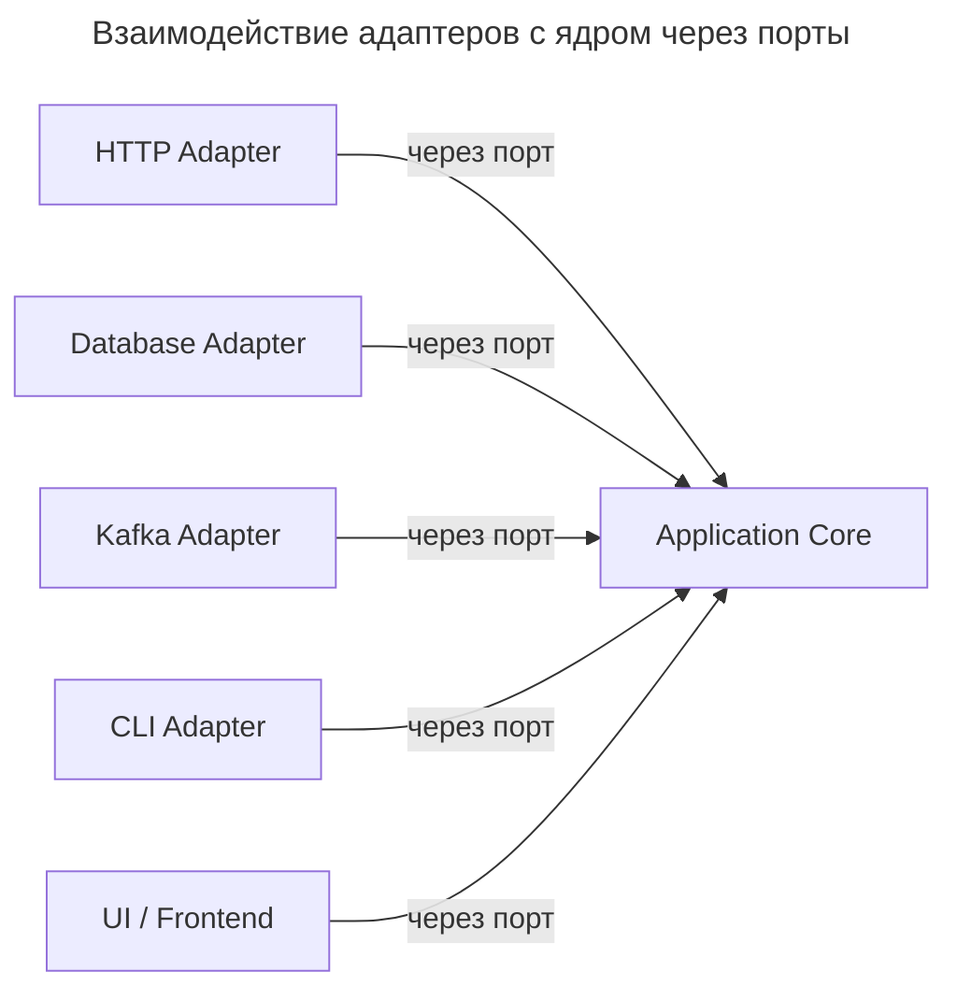
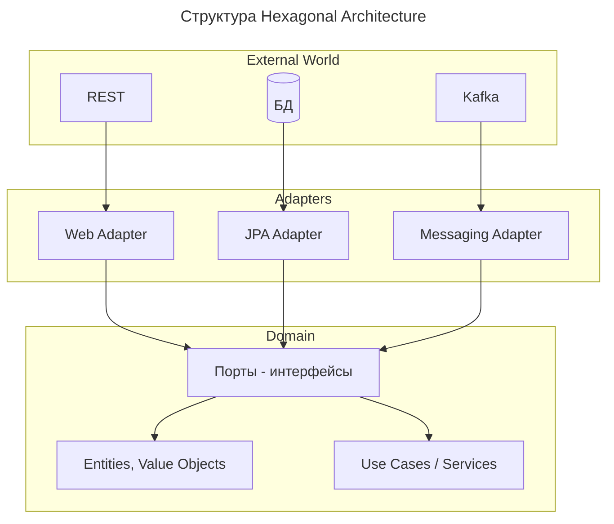
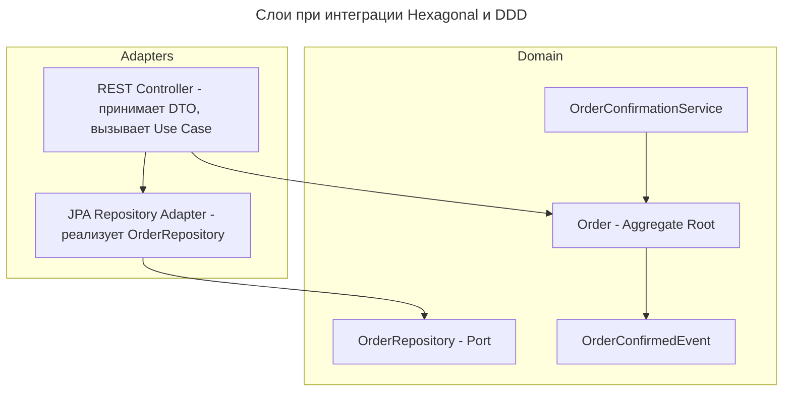

---
aliases:
  - Adapter
  - Aggregate Root
  - Alistair Cockburn
  - Application Core
  - Bounded Context
  - Clean Architecture
  - DDD
  - Domain Event
  - Domain Service
  - Domain-Driven Design
  - Entity
  - Hexagonal Architecture
  - Inbound Adapter
  - Onion Architecture
  - Outbound Adapter
  - Port
  - Ports and Adapters
  - Repository
  - Ubiquitous Language
  - Use Case
  - Value Object
  - Агрегат
  - Адаптер
  - Архитектура портов и адаптеров
  - Входной адаптер
  - Выходной адаптер
  - Гексагональная архитектура
  - Доменное событие
  - Доменный сервис
  - Объект-значение
  - Порт
  - Предметно-ориентированное проектирование
  - Репозиторий
  - Сущность
  - Шестиугольная архитектура
  - Ядро
---

## Hexagonal Architecture

**Hexagonal Architecture (Шестиугольная архитектура)**, также известная как **Ports and Adapters**, — это паттерн проектирования, при котором **бизнес-логика (ядро) не зависит от внешних систем** — таких как базы данных, веб-фреймворки, очереди или UI.

---

## Определение Hexagonal Architecture

**Hexagonal Architecture** — это архитектурный стиль, разработанный **Алистером Кокберном** #👨 (Alistair Cockburn), при котором:

- **Ядро бизнес-логики** находится в центре
- **Все взаимодействия с внешним миром** происходят через **порты (ports)** и **адаптеры (adapters)**
- **Фреймворки, БД, HTTP, Kafka — всё это адаптеры**

**Главная идея**

Бизнес-логика не должна зависеть от Spring, Django, PostgreSQL или [[REST|REST API]]. Она должна работать вне зависимости от того, как её вызывают: через веб, CLI, тесты или сообщения.

---

## Основные компоненты



### Application Core (Ядро)

- Содержит **всю бизнес-логику**: правила, доменные объекты, сервисы
- **Не использует** `@SpringBootApplication`, `@RestController`, `JPARepository`
- Не знает, что он работает в Spring, Django или Node.js

### Port (Порт)

- Это **интерфейс**, который определяет, **что может делать ядро**.
- Пример:

```java
public interface OrderService {
    Order createOrder(CreateOrderCommand cmd);
    Order getOrder(String id);
}
```

### Adapter (Адаптер)

- Реализует **порт** для конкретной технологии.
- Может быть **входным** (inbound) или **выходным** (outbound).

#### Входные адаптеры (Inbound)

- `WebAdapter`: принимает HTTP-запросы → передаёт в ядро
- `CLIAdapter`: команда в терминале → вызывает ядро
- `KafkaListener`: слушает события → запускает бизнес-логику

#### Выходные адаптеры (Outbound)

- `DatabaseAdapter`: сохраняет данные в PostgreSQL
- `EmailAdapter`: отправляет email через SendGrid
- `NotificationAdapter`: посылает push-уведомление

---

## Происхождение названия

Название отражает форму: **ядро** — в центре, а вокруг него **стороны (порты)** — как у шестиугольника. На практике их может быть больше или меньше шести, но концепция та же: к ядру можно подключиться с любой стороны.

**Схема: ядро в центре, порты и адаптеры вокруг**

```mermaid
---
title: Схема шестиугольника: ядро, порты и адаптеры
---
graph TB
    HTTP[HTTP] --> Inbound
    CLI[CLI] --> Inbound
    KafkaIn[Kafka] --> Inbound
    Inbound[Порты: вход] --> Core[Application Core]
    Core --> Outbound[Порты: выход]
    Outbound --> DB[(БД)]
    Outbound --> KafkaOut[Kafka]
```

---

## Пример: Интернет-магазин

### Ядро (Core)

```java
public class OrderService {
    private final PaymentGateway paymentGateway;
    private final InventoryRepository inventoryRepo;

    public Order createOrder(CreateOrderCommand cmd) {
        if (!inventoryRepo.hasStock(cmd.productId(), cmd.quantity())) {
            throw new InsufficientStockException();
        }

        PaymentResult result = paymentGateway.charge(cmd.payment());
        if (!result.success()) {
            throw new PaymentFailedException();
        }

        return orderRepository.save(new Order(cmd));
    }
}
```

Обратите внимание: нет `@Autowired`, `@Component`, `@PostMapping` — только чистая логика.

### Порты (Ports)

```java
public interface PaymentGateway {
    PaymentResult charge(PaymentDetails details);
}

public interface InventoryRepository {
    boolean hasStock(String productId, int quantity);
}
```

### Адаптеры (Adapters)

#### Веб-адаптер (Inbound)

```java
@RestController
public class OrderController {
    private final OrderService orderService;

    @PostMapping("/orders")
    public ResponseEntity<Order> create(@RequestBody CreateOrderRequest req) {
        var cmd = new CreateOrderCommand(req);
        var order = orderService.createOrder(cmd);
        return ResponseEntity.ok(order);
    }
}
```

Это **адаптер**, который связывает HTTP с ядром.

#### База данных (Outbound Adapter)

```java
@Repository
public class JpaInventoryRepository implements InventoryRepository {
    // реализация через JPA
}
```

Подключается к ядру через интерфейс `InventoryRepository`.

#### Email-адаптер (Outbound)

```java
@Service
public class SmtpPaymentNotifier implements PaymentNotifier {
    // отправляет email через JavaMailSender
}
```

---

## Преимущества Hexagonal Architecture

| Плюс                               | Объяснение                                                                     |
| ---------------------------------- | ------------------------------------------------------------------------------ |
| ✅ **Независимость от фреймворков** | Ядро не знает, что оно в Spring                                                |
| ✅ **Лёгкое тестирование**          | Можно тестировать ядро без запуска сервера                                     |
| ✅ **Гибкость**                     | Можно заменить Spring на Quarkus, PostgreSQL на [[mongo-db\|MongoDB]] — без изменения ядра |
| ✅ **Чёткие границы**               | Кто может использовать ядро? Только через порты                                |
| ✅ **Поддержка [[microservice\|микросервисов]]**      | Легко выделить часть ядра в отдельный сервис                                   |
| ✅ **Интеграция с DDD**             | Идеально сочетается с Domain Model, [[aggregate-root|aggregate-root]], Repository             |

---

## Когда архитектура избыточна

| Сценарий                                                          | Рекомендация                                   |
| ----------------------------------------------------------------- | ---------------------------------------------- |
| MVP, маленький проект                                             | ❌ Не нужна — слишком много абстракций         |
| Простой CRUD-сервис                                               | ❌ Достаточно [[layered-architecture|Layered Architecture]]             |
| Одна команда, один стек                                           | ⚠️ Можно обойтись без неё                     |
| Сложная система (банки, медицина, SaaS)                           | ✅ Обязательно используйте                     |
| Планируется смена технологий                                      | ✅ Да — Hexagonal идеален                      |
| Модуль, который будет переиспользоваться                          | ✅ Да — например, библиотека для расчёта налогов |

---

## Сравнение: Hexagonal vs Традиционный подход

| Критерий                                 | Традиционный (MVC)                         | Hexagonal                          |
| ---------------------------------------- | ------------------------------------------ | ---------------------------------- |
| **Зависимость от Spring/Django**         | ✅ Да (`@Autowired`, `@Entity`)            | ❌ Нет — ядро чистое                |
| **Тестирование ядра**                    | ❌ Нужен контекст Spring                   | ✅ Простые unit-тесты               |
| **Смена ORM**                            | ❌ Много изменений                         | ✅ Заменяем только адаптер          |
| **Смена API (REST → gRPC)**              | ❌ Переписываем контроллеры                | ✅ Добавляем новый входной адаптер  |
| **Сложность**                            | ❌ Низкая                                   | ✅ Выше — больше кода, больше интерфейсов |
| **Масштабируемость**                     | ❌ Ограниченная                            | ✅ Отличная — особенно в enterprise |

---

## Пример: добавление gRPC-адаптера

### Без Hexagonal

- Нужно переписывать `@RestController` → `@GrpcService`
- Загрязнять ядро зависимостями от gRPC

### С Hexagonal

1. Ядро уже есть: `OrderService`
2. Создаём новый **gRPC-адаптер**:

```java
@GrpcService
public class GrpcOrderService extends OrderServiceGrpc.OrderServiceImplBase {
    private final OrderService core;

    @Override
    public void createOrder(CreateOrderRequest req, StreamObserver<CreateOrderResponse> response) {
        core.createOrder(...); // через порт
    }
}
```

1. Готово! Ядро **не изменилось**.

---

## Похожие архитектуры

| Архитектура                              | Аналогия                                                            |
| ---------------------------------------- | ------------------------------------------------------------------- |
| **Hexagonal**                            | Ядро + адаптеры (порт/адаптер)                                      |
| **Clean Architecture** (Uncle Bob)       | Очень похоже: Entities → Use Cases → Interface Adapters → Frameworks |
| **Onion Architecture**                   | То же, что Clean — слои, как лук                                    |
| **[[CQRS|CQRS]] + [[event-sourcing|event-sourcing]]**        | Часто используются вместе с Hexagonal                               |

Все эти архитектуры — разные названия одной идеи: **ядро бизнеса должно быть независимым**.

---

## Когда использовать

| Ситуация                                                            | Рекомендация                          |
| ------------------------------------------------------------------- | ------------------------------------- |
| Сложный бизнес-процесс (банки, финтех, медицина)                    | ✅ Да — обязательно                   |
| Много способов взаимодействия (API, CLI, Kafka, Webhooks)           | ✅ Да — легко добавлять новые адаптеры |
| Нужно легко тестировать ядро                                        | ✅ Да — никакого SpringBootTest       |
| Планируется миграция (например, Oracle → PostgreSQL)                | ✅ Да — меняется только адаптер       |
| MVP, прототип                                                       | ❌ Нет — избыточно                    |
| Простой CRUD                                                        | ❌ Нет — хватит MVC                   |

---

## Как начать внедрение

1. **Выделите ядро**: где живёт бизнес-логика?
2. **Определите порты**: какие операции оно должно выполнять?
3. **Реализуйте адаптеры**: HTTP, DB, [[message-queueing|Message Queue]]
4. **Уберите аннотации** из ядра: нет `@Autowired`, `@Entity`, `@Transactional`
5. **Тестируйте ядро отдельно**

---

## Итог: ключевые принципы

| Принцип                                | Объяснение                                                  |
| -------------------------------------- | ----------------------------------------------------------- |
| **Ядро бизнеса — в центре**            | Без зависимостей от Spring, JPA, Kafka                      |
| **Все внешние системы — адаптеры**     | Они могут меняться без влияния на ядро                      |
| **Все взаимодействия — через порты**   | Интерфейсы, которые ядро предоставляет                      |
| **Легко заменить технический стек**    | Сегодня Spring Boot, завтра Quarkus — ядро остаётся прежним |
| **Простое тестирование**               | Ядро тестируется без запуска сервера                        |

Главный принцип: когда технологии меняются — бизнес-код остаётся рабочим, потому что не привязан к ним.

---

## Hexagonal Architecture vs Domain-Driven Design

Это **не конкурирующие подходы**, а **дополняющие друг друга концепции**.

**Краткий ответ**

| Аспект           | **Hexagonal Architecture**                                   | **[[domain-driven-design|Domain-Driven Design]]**                                          |
| ---------------- | ------------------------------------------------------------ | --------------------------------------------------------------------- |
| **Что это**      | Архитектурный **паттерн** (структура кода)                   | Методология **проектирования** (подход к моделированию)               |
| **Фокус**        | Разделение слоёв, изоляция домена                            | Язык, границы контекстов, стратегический дизайн                       |
| **Уровень**      | Тактический (код, зависимости)                               | Стратегический + тактический                                          |
| **Главная цель** | Тестируемость, заменяемость инфраструктуры                   | Понимание бизнеса, эволюция модели                                    |

Их можно и нужно использовать вместе.

---

### Hexagonal Architecture (Ports and Adapters)

**Цель**

Изолировать бизнес-логику от внешних зависимостей (БД, API, UI).

**Структура**



**Пример кода**

```java
// PORT (интерфейс в домене)
public interface OrderRepository {
    Order findById(OrderId id);
    void save(Order order);
}

// DOMAIN (бизнес-логика)
public class OrderService {
    private final OrderRepository repository; // зависимость от порта

    public OrderService(OrderRepository repository) {
        this.repository = repository;
    }

    public void processOrder(OrderId id) {
        Order order = repository.findById(id);
        order.confirm(); // бизнес-правило
        repository.save(order);
    }
}

// ADAPTER (инфраструктура)
@Repository
public class JpaOrderRepository implements OrderRepository {
    @Autowired private OrderJpaRepository jpaRepo;

    @Override
    public Order findById(OrderId id) {
        return jpaRepo.findById(id.value()).map(this::toDomain).orElse(null);
    }

    @Override
    public void save(Order order) {
        jpaRepo.save(toEntity(order));
    }
}
```

---

### Domain-Driven Design (DDD)

**Цель**

Создать программную модель, которая точно отражает бизнес-домен.

**Стратегические паттерны**

| Паттерн                 | Описание                             | Пример                             |
| ----------------------- | ------------------------------------ | ---------------------------------- |
| **Bounded Context**     | Границы модели (контекста)           | `OrderContext`, `PaymentContext`   |
| **Ubiquitous Language** | Единый язык для бизнеса и разработки | «Заказ», «Подтверждение», «Отмена» |
| **Context Mapping**     | Связи между контекстами              | `OrderContext → PaymentContext`    |

**Тактические паттерны**

| Паттерн             | Описание                               | Пример                               |
| ------------------- | -------------------------------------- | ------------------------------------ |
| **Entity**          | Объект с идентичностью                 | `Order`, `Customer`                  |
| **Value Object**    | Объект по значению                     | `Money`, `Address`                   |
| **Aggregate**       | Корень кластера объектов               | `Order` + `OrderLine[]`              |
| **Repository**      | Абстракция доступа к агрегатам         | `OrderRepository`                    |
| **Domain Service**  | Логика, не принадлежащая одному объекту | `OrderConfirmationService`           |
| **Domain Event**    | Факт, произошедший в домене            | `OrderConfirmedEvent`                |

---

### Как они работают вместе

#### Hexagonal + DDD



**Пример интеграции**

```java
// USE CASE (Application Service) — связующее звено
@Service
@RequiredArgsConstructor
public class ConfirmOrderUseCase {

    private final OrderRepository orderRepository; // PORT
    private final PaymentService paymentService;   // PORT
    private final ApplicationEventPublisher events;

    @Transactional
    public void execute(ConfirmOrderCommand cmd) {
        // 1. Загрузка агрегата
        Order order = orderRepository.findById(cmd.orderId())
            .orElseThrow(() -> new OrderNotFoundException(cmd.orderId()));

        // 2. Выполнение бизнес-логики (домен)
        order.confirm();

        // 3. Сохранение
        orderRepository.save(order);

        // 4. Публикация события
        order.getDomainEvents().forEach(events::publishEvent);
    }
}

// ADAPTER: REST Controller
@RestController
@RequestMapping("/orders")
@RequiredArgsConstructor
public class OrderController {

    private final ConfirmOrderUseCase confirmOrder;

    @PostMapping("/{id}/confirm")
    public ResponseEntity<Void> confirm(@PathVariable String id) {
        confirmOrder.execute(new ConfirmOrderCommand(OrderId.of(id)));
        return ResponseEntity.noContent().build();
    }
}
```

---

### Сравнительная таблица

| Критерий              | Hexagonal                             | DDD                                   | Вместе                                |
| --------------------- | ------------------------------------- | ------------------------------------- | ------------------------------------- |
| **Изоляция домена**   | ✅ Через порты                        | ⚠️ Через агрегаты                    | ✅✅ Максимальная                     |
| **Тестируемость**     | ✅ Легко мокать порты                 | ✅ Домен без инфраструктуры          | ✅✅ Идеально                         |
| **Эволюция кода**     | ✅ Меняй адаптеры                     | ✅ Меняй модель                      | ✅✅ Гибко                            |
| **Сложность**         | ⚠️ Много интерфейсов                  | ⚠️ Требует экспертизы               | ⚠️⚠️ Высокая                         |
| **Обучение команды**  | ⚠️ Новый паттерн                      | ⚠️ Новый язык                       | ⚠️⚠️ Долго                           |
| **Для малого проекта**| ❌ Overkill                            | ❌ Overkill                           | ❌ Не нужно                           |

---

### Когда использовать что

#### Только Hexagonal

- Нужно протестировать бизнес-логику в изоляции
- Планируется замена инфраструктуры (БД, API)
- Проект средний, домен простой

#### Только DDD

- Сложный бизнес-домен с богатыми правилами
- Нужно выстроить общий язык с бизнесом
- Проект будет расти и эволюционировать

#### Оба вместе (рекомендуется для сложных систем)

- **Крупный корпоративный проект**
- **Микросервисная архитектура**
- **Долгосрочная поддержка и развитие**

---

### Распространённые ошибки

| Ошибка                 | Почему плохо                          | Как исправить                                               |
| ---------------------- | ------------------------------------- | ----------------------------------------------------------- |
| **DDD без изоляции**   | Домен зависит от JPA/Hibernate        | Используй Hexagonal: порты + адаптеры                       |
| **Hexagonal без домена** | Много интерфейсов, но нет бизнес-модели | Добавь агрегаты, value objects, domain events             |
| **Анемичная модель**   | Entities = DTO с геттерами/сеттерами  | Перенеси логику в методы доменных объектов                  |
| **Слишком рано**       | Применил на старте малого проекта     | Начни с модульной архитектуры, рефактори по мере роста      |

---

### Структура проекта (Spring Boot + Maven)

```text
myapp/
├── pom.xml
├── application/
│   ├── pom.xml
│   └── src/main/java/com/example/app/
│       ├── order/
│       │   ├── application/          # Use Cases
│       │   │   ├── ConfirmOrderUseCase.java
│       │   │   └── dto/
│       │   ├── domain/               # DDD: домен
│       │   │   ├── model/
│       │   │   │   ├── Order.java          # Aggregate Root
│       │   │   │   ├── OrderLine.java      # Entity
│       │   │   │   ├── Money.java          # Value Object
│       │   │   │   └── OrderStatus.java    # Value Object
│       │   │   ├── event/
│       │   │   │   └── OrderConfirmedEvent.java
│       │   │   └── port/
│       │   │       ├── OrderRepository.java    # PORT
│       │   │       └── PaymentService.java     # PORT
│       │   └── infrastructure/       # Адаптеры
│       │       ├── adapter/
│       │       │   ├── web/
│       │       │   │   └── OrderController.java
│       │       │   ├── persistence/
│       │       │   │   └── JpaOrderRepository.java  # ADAPTER
│       │       │   └── payment/
│       │       │       └── StripePaymentAdapter.java
│       │       └── config/
│       └── Application.java
└── shared/
    └── kernel/                       # Shared Kernel (DDD)
        ├── validation/
        └── exception/
```

---

**Вывод**

| Вопрос                 | Ответ                                                        |
| ---------------------- | ------------------------------------------------------------ |
| **Что выбрать?**       | Используй **оба**: Hexagonal для структуры, DDD для модели   |
| **С чего начать?**     | Начни с выделения домена (DDD), затем добавь порты (Hexagonal) |
| **Когда не нужно?**    | Для простых CRUD-приложений — излишне                        |
| **Главный принцип**    | **Домен не должен знать об инфраструктуре**                  |

**Памятка**

- **Hexagonal** — это **как** организовать код.
- **DDD** — это **что** моделировать и **почему**.
- **Вместе** — это **как строить масштабируемые, поддерживаемые системы**.
