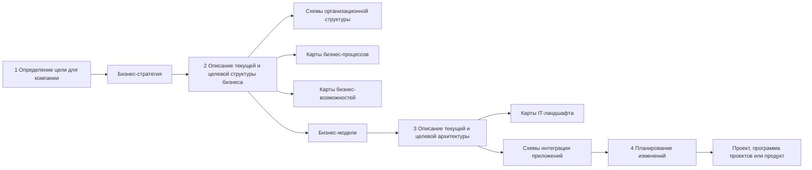

---
aliases:
  - цифровая трансформация
  - работа с требованиями
---

# цифровая трансформация

Цифровая трансформация — это комплексное внедрение цифровых технологий в деятельность компании. Это не просто обновление оборудования или программного обеспечения, а глубокое изменение процессов, взаимодействия с клиентами и в результате всей бизнес-модели.

Автоматизация и цифровизация — это этапы в жизни компании, которые могут привести к цифровой трансформации.

При **цифровой трансформации** компания напрямую зарабатывает на цифровых продуктах.

**Стратегия цифровой трансформации** — это системный, долгосрочный план, который описывает, как организация использует цифровые технологии для фундаментального изменения своих бизнес-моделей, процессов, культуры и клиентского опыта с целью достижения устойчивого конкурентного преимущества.
> #👨  McKinsey, Gartner, Deloitte – авторы концепции

Формирования стратегии цифровой трансформации

Шаг 1. Определить цели трансформации
Шаг 2. Описать текущую и целевую бизнес-модель
Шаг 3. Описать текущую и целевую архитектуру
Шаг 4. Спланировать изменения

Для визуализации изменений можно создать дорожную роадмап — карту цифровой трансформации. На ней указывают общие шаги и сроки реализации — без детализации работ. Реализовать план можно с помощью проектного или продуктового подхода.
## Текущее и целевое состояние бизнеса

Под **бизнес-архитектурой компании** подразумевается связь между структурой бизнеса, стратегией развития и архитектурой информационных систем.

**Бизнес-возможности** — это способность бизнеса осуществлять определённые действия. Бизнес-возможности описывают, что делает или может делать бизнес. Этим они отличаются от бизнес-процессов, в которых описаны именно шаги по достижению целей.

Это понятие активно применяется во фреймворке корпоративной архитектуры [[TOGAF]].

Бизнес-возможности полезно собирать в отдельный артефакт — **карту бизнес-возможностей ([[BCM]])**. Она описывает все возможности, которые уже есть в компании, и те, которые будут в её целевом состоянии.

**Поток создания ценности** (англ. value stream) — это последовательность действий, или этапов создания ценности, которые организация выполняет для удовлетворения потребности клиента. Клиентом может быть как внешний, так и внутренний заинтересованный субъект, отвечающий за поддержку создания ценности в организации.

## Текущая и целевая архитектура

Для обобщения понимания ландшафта информационных систем стоит понимать  [[software-engineer/стандарты/КИС|классификацию информационных систем]]

Используй **карту ландшафта** информационных систем компании:
* существующую
* целевую

**платформа разработки** – в организации часто подразумевается некоторый организационно-технический компонент в структуре компании, который позволяет быстрее и проще реализовывать типовые изменения.
* Например, сейчас очень актуально внедрение внутренних платформ разработки (Internal Development Platform). Такая платформа объединяет общие правила разработки, языки программирования, базы данных и другие технологии. Она предоставляет инфраструктуру для развёртывания приложений, репозитории с кодом и средства CI/CD. Всё это в комплексе позволяет разрабатывать приложения быстрее и по стандартным правилам.

**Диаграмма интеграции приложений**
* Для такой схемы можно использовать любую нотацию, например C4 или UML, но на стратегическом уровне достаточно обобщённой схемы без детализации всех потоков данных.
* Диаграмму интеграции можно построить, анализируя карту IT-ландшафта по пересечениям систем
* Стоит составить текущую и целевую диаграмму интеграции приложений

## Планирование стратегических изменений

Для планирования изменений подходит дорожная карта — roadmap, или роадмап. Дорожная карта формализует общие направления реализации.

Да, для визуализации изменений можно создать **дорожную карту цифровой трансформации — Digital Transformation Roadmap**.

Для реализации плана стратегического роадмапа можно использовать, например, проектный или продуктовый подходы.

Продуктовый подход рассчитан на улучшение продукта в течение всего жизненного цикла. Проектный подход сосредоточен на бюджете и выполнении проекта в установленные сроки — с фиксированными целями и результатами. В продуктовом подходе важна адаптивность и постоянное развитие, в проектном — завершение конкретной задачи.

**Проектный подход**

>[!info] **Проект** — это временное предприятие, предназначенное для создания уникальных продуктов, услуг или результатов. В частности, **IT-проект** — это проект в сфере создания, внедрения или применения информационных технологий.

**Проектное управление и проектный подход** отвечают на вопрос: «Как реализовать заданный результат к определённой дате в рамках доступного бюджета и ресурсов?».

Проектом управляет **менеджер проекта — Project Manager, PM**. Он отвечает за достижение результатов проекта. Кроме PM обычно есть другие ключевые участники:
- Команда проекта. Люди, которые будут реализовывать проект.
- Спонсор. Подразделение или человек, которые предоставляют ресурсы для проекта.
- Заказчик. Подразделение или человек, которые будут использовать результат проекта.
- Заинтересованные стороны. Люди и организации, прямо или косвенно оказывающие влияние на ход проекта и его результаты. Их часто называют **стейкхолдерами**.

Подразделение компании, **проектный офис** вырабатывает единые правила по управлению проектами и отвечает за их реализацию.

Для управления проектами есть стандарты — например:
* PRINCE2
* PmBook.

**Продуктовый подход**

>[!tip] **Продукт** — это результат деятельности компании, который предназначен для удовлетворения потребностей пользователей или рынка. Он может быть материальным или нематериальным и имеет свой жизненный цикл.

У продукта есть **жизненный цикл**

Продуктовый подход предполагает создание в компании структуры, которая сможет относительно автономно развивать продукт, — например, команда. Она развивается параллельно с продуктом и зависит от его жизненного цикла — с организационной точки зрения команда равнозначна самому продукту.

За управление продуктом отвечает **менеджер продукта — Product Manager, PM**. Это специалист, который отвечает за стратегию, планирование и развитие продукта в компании. Основные функции PM:
- Определение видения продукта.
- Анализ рынка и пользователей.
- Разработка стратегии.
- Работа с командами развития продукта — маркетингом, разработкой, поддержкой и другими.
- Определение приоритетов работы над продуктом.
- Анализ результатов и обратной связи.
- Управление бюджетом продукта — не всегда.

**Нужен ли продукт клиенту?**

Чтобы ответить на эти вопросы, нужны **продуктовые исследования**. Это может быть анализ рынка или продуктов конкурентов. Есть методологии
* CustDev
* Customer Development
	* процесс выявления потребностей с помощью интервью у потенциальных пользователей приложения. Подробнее об этом — в дополнительных материалах.
* **Customer Journey Map, CJM**
	* карта клиентского пути
* Lean-модель
* Lean Canvas
* Business Model Canvas

Для того, чтобы протестировать гипотезу о востребованности продукта придется выпустить **MVP — Minimal Valuable Product.**

**Метрики бизнеса и продуктов**
1. инвестиционные метрики
	* определения целесообразности проекта
	1. CAPEX – Capital Expenditure – капитальные затраты
	2. OPEX – Operational Expenditure – операционные расходы
2. **бизнес-метрики**
	* определения целесообразности каждого продукта в отдельности
	1. **финансовые метрики**
		1. Выручка — Revenue
		2. Прибыль — Profit
			1. Прибыль делится на чистую и валовую — Net Profit и Gross Profit
	2. **Метрики продаж**
		1. Количество лидов, или Leads
			* Лид — это факт заинтересованности потенциального клиента в продукте или услуге
		2. CPL — Cost per Lead.
		3. Конверсия — Conversion. 
			* Это число клиентов, совершивших целевое действие
3. **продуктовые метрики**
	* важны для управления продуктом
		* В конечном итоге стремление бизнеса улучшить метрики приводит к изменениям, которые могут повлиять на архитектуру компании и потребовать доработок у команд продуктов или систем.
	1. Метрики активности пользователей — User Activity.
		1. DAU, или Daily Activity Users
		2. WAU, или Weekly Activity Users
		3. MAU, или Mouthly Activity Users
	2. Метрики выручки на пользователя
		1. ARPU, или Average Revenue per User
		2. ARPPU, или Average Revenue per Paying User
		3. LTV, или Lifetime Value
## [[управление изменениями]]
