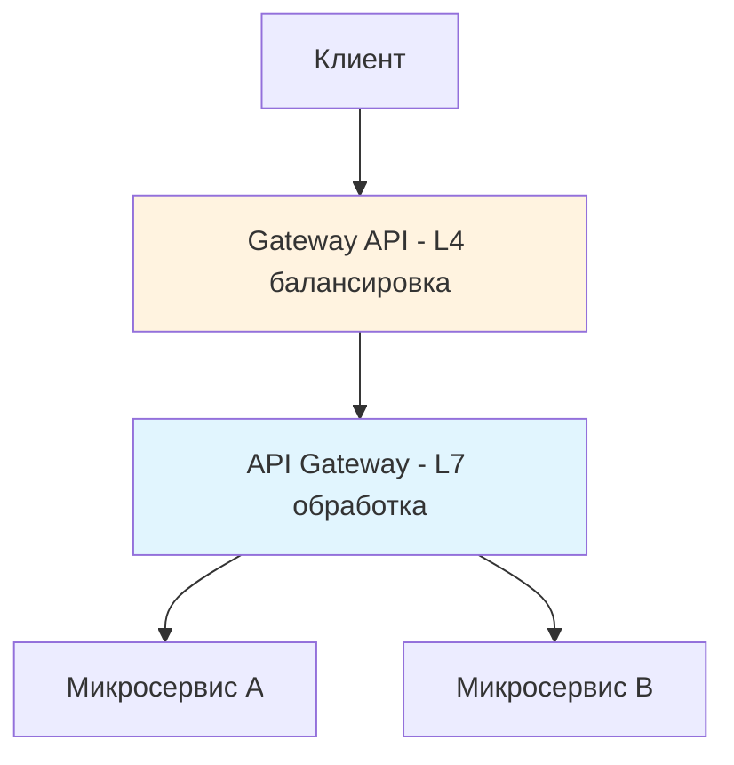

## API Gateway — Kong

📎[Kong](https://konghq.com/) — это популярный API Gateway с открытым исходным кодом, который поддерживает множество плагинов для управления трафиком, аутентификации, авторизации и мониторинга. Компании используют этот паттерн для надёжного и безопасного взаимодействия между микросервисами.

Для работы нужно выполнить 4 шага:
- Шаг 1. Установка API Gateway Kong
- Шаг 2. Базовая конфигурация и настройка окружения
- Шаг 3. Настройка маршрутизации запросов
- Шаг 4. Настройка балансировки нагрузки
	- балансировки нагрузки
		- **Round-robin** распределяет запросы по кругу между всеми доступными серверами.
		- **IP hash** направляет запросы к серверу на основе хеша IP-адреса клиента.
	- Настройка защиты от DDoS-атак
		- Rate Limiting
			- API Gateway может обеспечить защиту от DDoS-атак путём лимитирования запросов (Rate Limiting) и блокировки подозрительного трафика для предотвращения перегрузки сервиса.
		- **блокировка подозрительного трафика**
			- серия плагинов

Один из популярных API Gateway с открытым исходным кодом — Kong. Он поддерживает множество плагинов для управления трафиком, аутентификации, авторизации и мониторинга. Kong используется в различных компаниях для обеспечения надёжного и безопасного взаимодействия между микросервисами.
## API Gateway

По сути API-шлюз  `API Gateway` — это продвинутая и многофункциональная альтернатива обратному [[reverse-proxy|прокси-серверу]].
* можно определить конфигурацию шлюза. Тогда вы сможете управлять эндпоинтами, применять политики безопасности и преобразовывать запросы или ответы

>[!info] 🔹 API Gateway выполняет функции прокси-сервера, принимая все клиентские запросы и маршрутизируя их к соответствующим микросервисам. Позволяет скрыть внутреннюю структуру микросервисов от клиентов, предоставляет единый интерфейс для взаимодействия с системой. API Gateway также может выполнять множество дополнительных задач, таких как трансформация запросов и ответов, кеширование, мониторинг, логирование, управление сессиями, аутентификация и авторизация.

К популярным API-шлюзам относятся Kong, Apigee, AWS API Gateway и Zuul.

У API-шлюзов такие преимущества:

- **Унифицированная точка входа.** Шлюз обеспечивает единую, согласованную точку входа для всех сервисов. Это упрощает взаимодействие с клиентами.
- **Безопасность и аутентификация.** Он централизованно управляет системами безопасности, аутентификации и авторизации. Так будет проще обеспечить последовательное применение политик.
- **Ограничение скорости и дробление.** Шлюз контролирует скорость входящих запросов, чтобы защитить внутренние службы от перегрузки.
- **Аналитика и мониторинг.** У этой технологии есть встроенные возможности аналитики и мониторинга для отслеживания шаблонов запросов, производительности и ошибок.

API Gateway выполняет в микросервисной архитектуре:
- **Централизация маршрутизации запросов** API Gateway принимает все клиентские запросы и маршрутизирует их к соответствующим микросервисам. Это упрощает управление маршрутами и позволяет легко изменять конфигурацию маршрутизации без необходимости вносить изменения в каждый отдельный микросервис.
- **Управление аутентификацией и авторизацией** API Gateway может управлять аутентификацией и авторизацией, проверяя учётные данные клиентов и контролируя доступ к различным микросервисам на основе ролей и прав доступа.
- **Балансировка нагрузки и распределение трафика** API Gateway распределяет входящий трафик между несколькими экземплярами микросервисов, обеспечивая равномерную нагрузку и высокую доступность системы.
- **Обеспечение безопасности** API Gateway может применять политики безопасности — шифрование данных, защиту от DDoS-атак и ограничение скорости запросов (англ. rate limiting) — для защиты системы от угроз и атак.
- **Кеширование запросов** API Gateway может кешировать ответы на часто запрашиваемые ресурсы, уменьшая нагрузку на микросервисы и повышая производительность системы.

Обычно команды выбирают между обратным прокси и шлюзом API, но оба варианта можно скомбинировать. Третья техника маршрутизации — [[Service Mesh]] — представляет собой объединение двух техник в среде Kubernetes. Однако этот вариант самый сложный для реализации.

**Pros/cons API Gateway**
+ ✔️ **Единая точка входа.** Клиенты взаимодействуют с системой через единый интерфейс, что упрощает управление и мониторинг.
- ✔️ **Безопасность.** API Gateway обеспечивает централизованную аутентификацию и авторизацию запросов.
- ✔️ **Маршрутизация и балансировка нагрузки.** API Gateway маршрутизирует запросы к соответствующим микросервисам и балансирует нагрузку между ними.
- ✔️ **Мониторинг и логирование.** API Gateway собирает и анализирует метрики и логи запросов, что помогает отслеживать производительность и обнаруживать проблемы.
- ❌ **Единая точка отказа.** API Gateway может стать единой точкой отказа, если не обеспечены механизмы высокой доступности.
- ❌ **Сложность.** Управление и настройка API Gateway могут быть сложными и требовать дополнительных ресурсов.

Существует несколько подходов к использованию API Gateway в микросервисной архитектуре, каждый из которых имеет свои преимущества и недостатки.

### Монолитный API Gateway

- **Плюсы:** единая точка управления всеми API запросами, централизованное управление безопасностью и логированием.
- **Минусы:** единая точка отказа, возможная сложность управления при масштабировании системы.

### Распределённый API Gateway

- **Плюсы:** уменьшение единой точки отказа, улучшенная масштабируемость и производительность.
- **Минусы:** повышенная сложность управления и настройки, возможные проблемы с согласованностью данных.

### Многослойный API Gateway

- **Плюсы:** улучшенная безопасность, улучшенная масштабируемость, упрощенное управление и мониторинг, повышенная производительность.
- **Минусы: п**овышенная сложность, трудности настройки, увеличение времени отклика, затраты на инфраструктуру.

### Serverless API Gateway

- **Плюсы:** высокая масштабируемость, отсутствие необходимости управления инфраструктурой, уменьшение затрат на ресурсы.
- **Минусы:** возможные ограничения в функциональности и производительности, зависимость от облачного провайдера.

## API Gateway vs Gateway API

**[[API Gateway]]** и **[[Gateway API]]** — это совершенно разные концепции, хотя их названия похожи. Давайте разберем различия.
- **API Gateway** = **Продукт/Паттерн** для управления API (бизнес-уровень)
- **Gateway API** = **Стандарт/Ресурс** для сетевой маршрутизации (инфраструктурный уровень)

**Сравнительная таблица**

| Критерий            | **API Gateway**                 | **Gateway API**                     |
| ------------------- | ------------------------------- | ----------------------------------- |
| **Уровень**         | Приложение (L7)                 | Инфраструктура (L4-L7)              |
| **Назначение**      | Единая точка входа для клиентов | Стандарт для маршрутизации в K8s    |
| **Объем**           | Бизнес-логика, агрегация        | Сетевая маршрутизация, балансировка |
| **Примеры**         | Spring Cloud Gateway, Kong      | GKE Gateway, Istio Gateway          |
| **Где работает**    | Над/вне кластера                | Внутри Kubernetes кластера          |
| **Основная задача** | API management                  | Traffic management                  |

