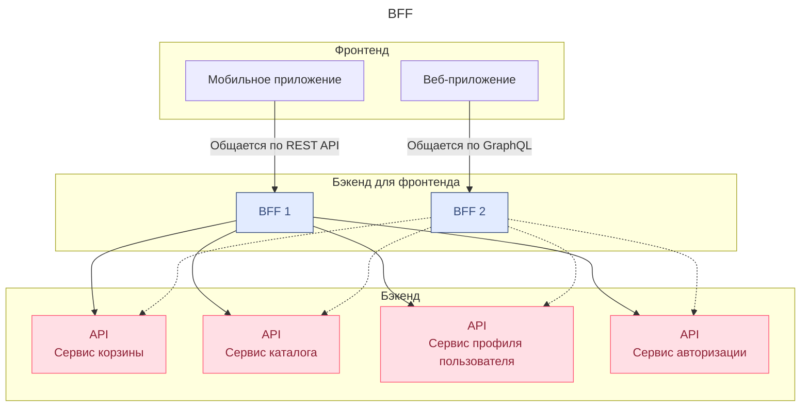

# Паттерн Backend for Frontend – BFF

Backend for Frontend (бэкенд для фронтенда, BFF) — это подход к проектированию, при котором каждый фронтенд обслуживает специальный бэкенд.

Для того, чтобы избежать проблем при крос микрофронтенд api запросов при эволюции API ==cоздается промежуточный слой, который обрабатывает запросы конкретного фронтенда, — BFF==




Мобильное приложение может вызывать методы BFF по протоколу REST API, а веб-приложение — по протоколу [[GraphQL]].

В свою очередь BFF вызовет методы API на нужном сервере или серверах, извлечёт данные и выполнит все необходимые операции перед отправкой этих данных клиенту. Фронтенд получит готовую картинку.

# Backend for Frontend (BFF) vs API Gateway 

**API Gateway** — это **единая точка входа** для всех клиентов, focusing on **общие** concerns (безопасность, маршрутизация, кэширование).

**Backend for Frontend (BFF)** — это **специализированный бэкенд** для конкретного типа клиента (Web, Mobile, TV), focusing on **специфические** needs (агрегация данных, преобразование формата).

**Сравнительная таблица**

| Критерий                 | API Gateway                              | Backend for Frontend (BFF)                                   |
| ------------------------ | ---------------------------------------- | ------------------------------------------------------------ |
| **Основная цель**        | Единая точка входа, общие concerns       | Специализированный API под нужды **конкретного клиента**     |
| **Кто им пользуется**    | **Все** клиенты (Web, Mobile, 3rd-party) | **Один тип** клиента (только Web, только Mobile App)         |
| **Агрегация данных**     | Минимальная или общая                    | **Глубокая** и специфичная для UX клиента                    |
| **Трансформация данных** | Минимальная (формат заголовков)          | **Интенсивная** (преобразование форматов, упрощение моделей) |
| **Пример**               | `api.company.com`                        | `web-bff.company.com`, `mobile-bff.company.com`              |

## Архитектура на диаграмме

**С API Gateway**
```text
[Web App]   [Mobile App]   [3rd-Party]
      \         |         /
       \        |        /
      [ API Gateway (единый для всех) ]
           /    |    \
          /     |     \
   [Service A] [Service B] [Service C]
```

**С Backend for Frontend (BFF)**
```text
[Web App] --> [Web BFF] --\ 
                          |
[Mobile App] -> [Mobile BFF] --|--> [Service A] [Service B] [Service C]
                          |
[Smart TV] --> [TV BFF] --/
```

 **Комбинированный подход (наиболее распространенный)**
```text
[Web App]   [Mobile App]   [3rd-Party]
       \         |         /
        \        |        /
       [ API Gateway (аутентификация, балансировщик, кэш) ]
            /         \                  \
           /           \                  \
   [Web BFF]       [Mobile BFF]   [3rd-Party BFF?]
      / \             / \               / \
[Service A][B]   [Service A][B]    [Service A][B]
```


# Что важно учесть при дизайне BFF

- **Подберите оптимальный технологический стек.** Выберите технологический стек так, чтобы он был совместим с технологией фронтенда и легко обрабатывал необходимые взаимодействия с бэкендом.
- ==**Внедрите стратегии кеширования.**== Чтобы улучшить время отклика и снизить нагрузку на внутренние сервисы, нужно внедрить механизмы кеширования.
- **Разработайте систему обработки ошибок.** BFF нужна надёжная система обработки ошибок. Иначе ошибки, которые возникли в BFF при работе с бэкенд-сервисами, повлияют на работу фронтенда.
- **Внедрите мониторинг и ведение логов.** BFF — это критически важный компонент архитектуры. Чтобы быстро обнаружить и устранить проблемы, нужно внедрить комплексный мониторинг и протоколирование.