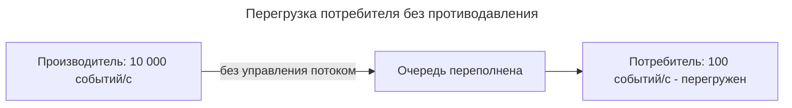

---
aliases:
  - Backpressure
  - Buffer
  - Flow Control
  - Pull Model
  - Push Model
  - Reactive Streams
  - Буфер
  - Противодавление
  - Управление потоком
---

## Паттерн Backpressure

**Backpressure (противодавление, управление потоком)** — это механизм согласования скоростей **производителя** и **потребителя** данных: потребитель сигнализирует производителю о своей готовности принимать данные, и производитель замедляет или приостанавливает отправку.

## Зачем нужен Backpressure

При большой разнице скоростей:

- **Быстрый производитель, медленный потребитель:** потребитель захлёбывается — очередь растёт, память исчерпывается, время отклика падает.
- **Медленный производитель, быстрый потребитель:** потребитель простаивает — снижается пропускная способность.

**Сценарий с перегрузкой:**

## Принцип работы

| Модель | Описание | Плюсы | Минусы |
|--------|----------|-------|--------|
| **Push (проталкивание)** | Производитель сам отправляет данные потребителю | Простая передача | Нет учёта возможностей потребителя |
| **Pull (вытягивание)** | Потребитель запрашивает данные по мере готовности | Гибкость, контроля скорости | Сложнее, требует механизмов запроса |
| **Смешанная (backpressure)** | Потребитель «тормозит» производителя при перегрузке | Баланс скорости и затрат | Сложная реализация |

## Механизмы противодавления

**Буферизация и согласование**

1. Потребитель принимает данные в буфер.
2. При заполнении буфера потребитель сигнализирует производителю.
3. Производитель приостанавливает отправку (или снижает интенсивность).
4. Когда буфер освобождается — отправка возобновляется.

Это не «блокировка» канала, а **протокол управления потоком**.

## Где применяется

| Область | Как реализовано |
|---------|-----------------|
| **Reactive Streams** | Контракт `Publisher` / `Subscriber` с требованием `request(n)` |
| **[[kafka|Kafka]]** | Партиции, группа потребителей, `max.poll.records` |
| **[[rabbit-mq|RabbitMQ]]** | `prefetch` (QoS) — сколько сообщений выдавать потребителю |
| **Очереди в коде** | Ограниченные буферы + семантика отказа (drop / retry) |
| **Стриминг (HTTP/2, TCP)** | Оконное управление потоком, TCP receive window |

## Примеры инструментов

| Инструмент | Поддержка backpressure |
|-----------|------------------------|
| **RxJS** | `Observable` с операторами `bufferCount`, `throttle` |
| **[[reactor|Reactor]] (Spring)** | `Flux`/`Mono` с поддержкой `request(n)` |
| **Akka Streams** | Встроенный backpressure по умолчанию |
| **Kafka Consumer** | Настройка размера выборки и обработки |
| **Go channels** | Встроенная блокировка при полном буфере |

## Стратегии при перегрузке

| Стратегия | Поведение |
|-----------|-----------|
| **Блокировка** | Производитель ждёт, пока освободится место |
| **Отказ (drop)** | Лишние события отбрасываются или возвращается ошибка |
| **Агрегация** | Сообщения объединяются (batch) |
| **Уменьшение нагрузки** | Потребитель запрашивает меньшими порциями |
| **Масштабирование** | Добавление потребителей (партиции) |

## Сравнение: нет backpressure vs с backpressure

| Критерий | Без backpressure | С backpressure |
|----------|------------------|----------------|
| Очередь | Растёт неограниченно | Ограничена протоколом |
| Память | Риск переполнения (OOM) | Контролируемый буфер |
| Задержка | Деградирует при перегрузке | Стабильная или отказ |
| Сложность | Простая реализация | Требует контракта |
| Надёжность | Потери при сбоях | Предсказуемое поведение |

## Особенности

- ✅ Защищает от перегрузки и утечек памяти.
- ✅ Гарантирует стабильное поведение системы при пиках.
- ✅ Позволяет контролируемо масштабировать потребителей.
- ✅ Стандартизирован в Reactive Streams (`Publisher`/`Subscriber`).
- ❌ Реализация сложнее простого push-обмена.
- ❌ Плохо спроектированный backpressure может снизить пропускную способность.
- ❌ Требует настройки порогов буфера под конкретную систему.

## Итог

Backpressure нужен везде, где данные движутся потоком: стриминг, очереди, реактивные системы. Ключевое — дать потребителю **право управлять скоростью** поступления данных и определить стратегию поведения при переполнении буфера.
