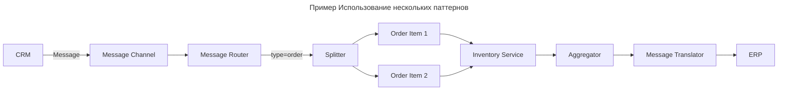
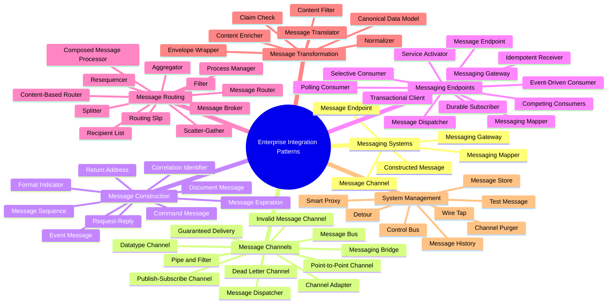
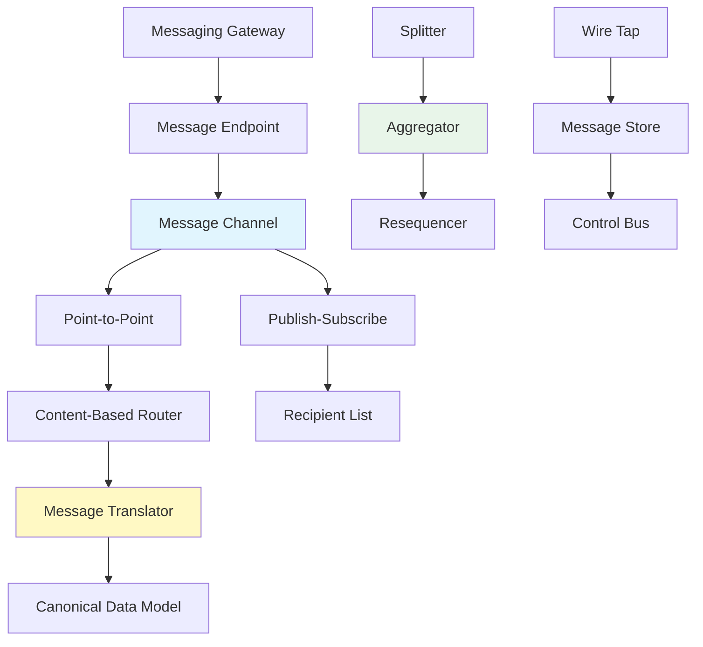

---
aliases:
  - Enterprise Integration Patterns
  - EIP
---
# Enterprise Integration Patterns

**Enterprise Integration Patterns (EIP)** — это **фундаментальный набор паттернов**, описанный в книге:
* #📘  *Enterprise Integration Patterns: Designing, Building, and Deploying Messaging Solutions – #👨 Грегор Хёпхе, Боб Вульф

Основная идея EIP
**Как связать разрозненные системы** (например: CRM → ERP → BI)  через **асинхронные, надёжные, гибкие** каналы?

EIP даёт **универсальный язык и каталог решений** для таких задач.

**Enterprise Integration Patterns List**

1. Messaging Systems (системы обмена сообщениями)
	1. **Message** — атомарный пакет данных, передаваемый между приложениями.
	2. **Message Channel** — путь передачи сообщений.
	3. **Pipes and Filters** — цепочка компонентов, обрабатывающих сообщения последовательно.
	4. **Message Router** — направляет сообщения по разным каналам в зависимости от правил.
	5. **Message Translator** — преобразует формат сообщения из одного вида в другой.
	6. **Message Endpoint** — компонент, подключающий приложение к системе обмена сообщениями.

2. Messaging Channels (каналы обмена сообщениями)
	1. **Point‑to‑Point Channel** — канал «один‑к‑одному»: сообщение получает только один потребитель.
	2. **Publish‑Subscribe Channel** — канал «один‑ко‑многим»: сообщение получают все подписчики.
	3. **Dead Letter Channel** — специальный канал для сообщений, которые не удалось доставить.
	4. **Guaranteed Delivery** — гарантия доставки сообщения, даже при сбоях.
	5. **Channel Adapter** — адаптер, подключающий приложение без поддержки сообщений к каналу.
	6. **Messaging Bridge** — соединяет две системы обмена сообщениями.
	7. **Message Bus** — централизованная шина обмена сообщениями для всей организации.

3. Message Construction (построение сообщений)
	1. **Command Message** — сообщение, передающее команду для выполнения действия.
	2. **Document Message** — сообщение, содержащее документ или данные.
	3. **Event Message** — сообщение, уведомляющее о произошедшем событии.
	4. **Request‑Reply** — шаблон «запрос‑ответ»: отправитель ожидает ответа на сообщение.
	5. **Return Address** — поле в сообщении, указывающее, куда отправить ответ.

4. Message Routing (маршрутизация сообщений)
	1. **Content‑Based Router** — маршрутизирует сообщения на основе их содержимого.
	2. **Message Filter** — отфильтровывает сообщения по условию.
	3. **Dynamic Router** — динамически определяет маршрут на основе бизнес‑логики.
	4. **Recipient List** — отправляет сообщение нескольким получателям по списку.
	5. **Splitter** — разбивает одно сообщение на несколько частей.
	6. **Aggregator** — объединяет несколько сообщений в одно.
	7. **Resequencer** — переупорядочивает сообщения, если они пришли не по порядку.
	8. **Composed Message Processor** — обрабатывает составное сообщение, разбивая его на части, обрабатывая и собирая обратно.
	9. **Scatter‑Gather** — рассылает запросы нескольким сервисам, собирает ответы и объединяет их.
	
5. Message Transformation (преобразование сообщений)
	1. **Content Enricher** — дополняет сообщение данными из внешнего источника.
	2. **Content Filter** — удаляет из сообщения ненужные поля.
	3. **Claim Check** — заменяет содержимое сообщения ссылкой на данные, хранящиеся вне канала.
	4. **Normalizer** — приводит разные форматы сообщений к единому виду.
	5. **Canonical Data Model** — единая модель данных для всех интеграций, минимизирующая зависимости.

6. Messaging Endpoints (конечные точки обмена сообщениями)
	1. **Polling Consumer** — потребитель, который периодически опрашивает канал на наличие сообщений.
	2. **Event‑Driven Consumer** — потребитель, автоматически уведомляемый о новых сообщениях.
	3. **Competing Consumers** — несколько потребителей, конкурирующих за сообщения в канале.
	4. **Message Dispatcher** — распределяет сообщения между несколькими потребителями.
	5. **Selective Consumer** — выбирает сообщения по критериям, игнорируя остальные.
	6. **Durable Subscriber** — подписчик, который получает сообщения даже после перезапуска.
	7. **Idempotent Receiver** — компонент, способный обрабатывать дублирующиеся сообщения без побочных эффектов.
	8. **Service Activator** — активирует сервис в ответ на полученное сообщение.

7. System Management (управление системой)
	1. **Control Bus** — канал для управления компонентами системы (старт, стоп, мониторинг).
	2. **Detour** — *«объезд»* временно перенаправляет сообщения для диагностики или обслуживания.
	3. **Wire Tap** — копирует сообщения для мониторинга без влияния на основной поток.
	4. **Message History** — отслеживает путь сообщения через систему.
	5. **Smart Proxy** — прокси‑компонент, добавляющий функциональность (аутентификация, логирование).
	6. **Test Message** — тестовое сообщение для проверки работоспособности канала.
	7. **Channel Purger** — очищает канал от застрявших сообщений.

8. Дополнительные паттерны
	1. **Process Manager** — координирует сложные бизнес‑процессы, состоящие из нескольких шагов.
	2. **Messaging Mapper** — преобразует объекты приложения в сообщения и обратно.
	3. **Transactional Client** — гарантирует, что операции с сообщениями выполняются в рамках транзакции.
	4. **Batch Consumer** — обрабатывает сообщения пакетами для повышения производительности.
	5. **Throttling** — *«заслонка»* ограничивает частоту обработки сообщений для предотвращения перегрузки.
	6. **Priority Queue** — очередь с приоритетами: сообщения с высоким приоритетом обрабатываются первыми.
	7. **Store‑and‑Forward** — сохраняет сообщения локально и пересылает их позже, если получатель недоступен.
	8. **Competing Consumers with Load Balancing** — распределяет нагрузку между потребителями.

---

### Краткий итог

Enterprise Integration Patterns — это **систематизированный каталог решений** для задач интеграции приложений через обмен сообщениями. Паттерны охватывают:
* архитектуру обмена сообщениями;
* маршрутизацию и преобразование данных;
* управление каналами и конечными точками;
* мониторинг и администрирование системы.

Они помогают:
* снизить сложность интеграции;
* повысить надёжность и масштабируемость;
* унифицировать подходы в команде и организации;
* избежать типовых ошибок при проектировании распределённых систем.

Паттерны реализованы во многих технологиях: JMS, MSMQ, Apache Camel, Spring Integration, RabbitMQ, Kafka и др.

Хотите, раскрою какой‑то конкретный паттерн подробнее или приведу пример его реализации?

## 🔧 Категории паттернов

Все 65+ паттернов делятся на **9 групп**:

---

### 📦 1. **Messaging Systems** — Системы обмена сообщениями

| Паттерн                       | Объяснение                                               |
| ----------------------------- | -------------------------------------------------------- |
| **Message**                   | Независимая единица данных, передаваемая между системами |
| **Message Channel**           | "Труба", по которой проходит сообщение (очередь, топик)  |
| **Point-to-Point Channel**    | Одно сообщение → один получатель                         |
| **Publish-Subscribe Channel** | Сообщение → несколько подписчиков                        |
| **Dead Letter Channel**       | Очередь для необработанных сообщений (как DLQ)           |
| **Guaranteed Delivery**       | Гарантия доставки (через ретрай или persistent queue)    |

> 💡 Это **основа**: как, куда и кому вы отправляете сообщения.

---

### 🔄 2. **Messaging Channels** — Каналы

| Паттерн | Объяснение |
|--------|------------|
| **Invalid Message Channel** | Куда слать ошибочные/неправильные сообщения |
| **Control Bus** | Отправка команд управления через канал (например, "перезагрузи сервис") |
| **Wire Tap** | Дублирование сообщений в канал для мониторинга |
| **Message History** | Запись пути сообщения (для отладки) |
| **Return Address** | Указание, куда прислать ответ (как `Reply-To` в email) |

---

### ⚙️ 3. **Message Construction** — Формирование сообщений

| Паттерн | Объяснение |
|--------|------------|
| **Command Message** | Сообщение = команда (`CreateOrder`, `SendEmail`) |
| **Document Message** | Сообщение = документ (PDF, XML, JSON) |
| **Event Message** | Сообщение = факт (`OrderPlaced`, `PaymentFailed`) |
| **Request-Reply** | Запрос → ответ (синхронное) |
| **Return Address** | Как выше — указание, куда прислать ответ |
| **Correlation Identifier** | ID, чтобы сопоставить запрос и ответ (в асинхронных системах) |

---

### 🧩 4. **Routing Messages** — Маршрутизация

| Паттерн | Объяснение |
|--------|------------|
| **Message Router** | Перенаправляет сообщение на основе содержимого |
| **Content-Based Router** | Если поле `type=order` → в очередь `orders`, если `type=email` → `notifications` |
| **Message Filter** | Пропускает только нужные сообщения |
| **Splitter** | Разбивает одно сообщение на несколько (например, заказ → каждому товару) |
| **Aggregator** | Объединяет несколько сообщений в одно (например, результаты расчётов) |
| **Resequencer** | Переставляет сообщения в правильном порядке |
| **Composed Message Processor** | Обрабатывает сложное сообщение, разбивая его на части |

---

### 🔄 5. **Transformation Patterns** — Преобразование сообщений

| Паттерн | Объяснение |
|--------|------------|
| **Message Translator** | Преобразует формат одного сервиса в другой (SOAP → JSON) |
| **Envelope Wrapper** | Добавляет метаданные в сообщение (например, `source`, `timestamp`) |
| **Claim Check** | Сообщение хранит ссылку на данные (например, URL), а не само содержимое |
| **Normalizer** | Унифицирует входящие сообщения в единый формат |

> 💡 Например:
> - `CRM` отправляет `XML`
> - `ERP` принимает `JSON`
> → **Message Translator** делает преобразование

---

### 🛠️ 6. **Endpoint Patterns** — Точки подключения

| Паттерн | Объяснение |
|--------|------------|
| **Messaging Gateway** | Абстракция для взаимодействия с messaging-системой |
| **Service Activator** | Вызывает бизнес-сервис при получении сообщения |
| **Polling Consumer** | Регулярно проверяет очередь на наличие сообщений |
| **Event-Driven Consumer** | Реагирует на сообщение сразу (push-based) |
| **Transactional Client** | Гарантирует, что операции в рамках одной транзакции |
| **Competing Consumers** | Несколько потребителей читают из одной очереди — повышает производительность |

---

### 🔐 7. **System Management & Security**

| Паттерн | Объяснение |
|--------|------------|
| **Channel Adapter** | Подключает систему к messaging-каналу (например, файловая система → Kafka) |
| **Message Store** | Хранит сообщения (например, для повторной обработки) |
| **Smart Proxy** | Прокси, который добавляет логику (например, кэширование, retry) |
| **Wire Tap** | Дублирует сообщения в канал для анализа |
| **Message Expiration** | Сообщение умирает, если не обработано за N секунд |
| **Idempotent Receiver** | Потребитель игнорирует дубли сообщений |

---

### 🎯 8. **Pipes and Filters** — Конвейеры и фильтры

| Паттерн | Объяснение |
|--------|------------|
| **Pipes and Filters** | Сообщение проходит через цепочку обработчиков |
| **Message Broker** | Центральный маршрутизатор — управляет всеми маршрутами |
| **Message Endpoint** | Абстракция точки подключения к шине |
| **Event-Driven Architecture** | Системы реагируют на события, а не вызывают напрямую |

---

### 📊 9. **Advanced Patterns**

| Паттерн | Объяснение |
|--------|------------|
| **Scatter-Gather** | Запрос → рассылается нескольким сервисам → собираются ответы → объединяются |
| **Resequencer** | Восстанавливает порядок сообщений |
| **Claim Check** | Хранит ссылку, а не всё сообщение (например, S3 URL) |
| **Compensating Transaction** | Если транзакция провалилась — выполнить компенсирующие действия (например, вернуть деньги) |
| **Saga Pattern** | Последовательность локальных транзакций с rollback через compensation |

---


---

## ✅ Пример: Использование нескольких паттернов



Паттерны:
- **Message** — сама запись
- **Message Channel** — очередь
- **Message Router** — направляет в Splitter
- **Splitter** — разбивает заказ на строки
- **Aggregator** — собирает результаты
- **Message Translator** — преобразует XML → JSON

---

## ✅ Современные аналоги

| EIP | Современная реализация |
|-----|------------------------|
| **Message Router** | Spring Integration, Apache Camel, Istio VirtualService |
| **Message Translator** | Kafka Connect (SMT), Camel Transformers |
| **Aggregator** | Kafka Streams, Flink, Spark |
| **Saga Pattern** | Axon Framework, Camunda |
| **Message Channel** | RabbitMQ, Kafka, SQS |
| **Message Store** | Kafka Topic, Event Store DB |

---

## ✅ Когда использовать EIP?

| Сценарий | Рекомендация |
|----------|--------------|
| ✅ Интеграция CRM + ERP + BI | ✅ Да — EIP — стандарт |
| ✅ Микросервисы общаются через события | ✅ Да — Splitter, Aggregator, Router |
| ✅ Нужна отказоустойчивость | ✅ Dead Letter Channel, Retry, Compensating Transaction |
| ✅ Вы используете Kafka/RabbitMQ | ✅ Да — знайте паттерны |
| ✅ MVP, простой проект | ❌ Не нужно — слишком много абстракций |

---

## ✅ Лучшие практики

| Практика | Объяснение |
|---------|------------|
| ✅ **Используйте каноническую модель данных** | Чтобы все системы понимали одно сообщение |
| ✅ **Делайте потребителей idempotent** | На случай дублей |
| ✅ **Не бойтесь Dead Letter Queue** | Он спасает при ошибках |
| ✅ **Тестируйте конвейер** | Каждый паттерн должен быть протестирован |
| ✅ **Используйте EIP как язык** | Чтобы говорить: *«Здесь нужен Content-Based Router»*, а не *«Нам надо, чтобы по типу шло в разные места»* |

---

## ✅ Финальный вывод

> **EIP — это не просто паттерны. Это «язык» интеграции.**

> ✅ Без них вы будете:
> - Изобретать колесо
> - Писать хрупкий код
> - Повторять одни и те же ошибки

> 💬 _“Если ты не знаешь EIP — ты просто пишешь скрипт. Если знаешь — ты проектируешь систему.”_

---

## 📚 Где учиться дальше?

- 📘 **"Enterprise Integration Patterns" — Gregor Hohpe, Bobby Woolf**  
  [https://www.enterpriseintegrationpatterns.com](https://www.enterpriseintegrationpatterns.com)

- 🧰 **Spring Integration** — реализация EIP в Java  
  [https://spring.io/projects/spring-integration](https://spring.io/projects/spring-integration)

- 🐫 **Apache Camel** — фреймворк, основанный на EIP  
  [https://camel.apache.org](https://camel.apache.org)

- 🎥 YouTube: *“EIP Explained”* — Nick Tune, TechWorld with Nana

---

✅ **Знание EIP — признак профессионала в enterprise-интеграции.**  
Они используются в **банках, госструктурах, логистике, медицине** — везде, где важно **ничего не потерять**.

---

💡 **Совет:**  
Храните этот список как шпаргалку — и когда услышите:  
> _«Нам нужно разделить заказ на товары»_  
— скажите:  
> _«Нам нужен **Splitter**»_

И все поймут вас.

---

## ✅ Итог: EIP — это **каталог решений для интеграции**

| Проблема | EIP-паттерн |
|----------|-------------|
| Разделить заказ на товары | **Splitter** |
| Собрать ответы от 3 сервисов | **Aggregator** |
| Отправить в зависимости от типа | **Content-Based Router** |
| Обработать ошибки | **Dead Letter Channel** |
| Избежать дублей | **Idempotent Receiver** |
| Сохранить порядок | **Resequencer** |
| Связать старую и новую систему | **Anti-Corruption Layer** (из DDD) |

---

📌 **Теперь вы можете говорить на языке профессионалов.**  
Вы не просто "делаете интеграцию".  
**Вы применяете Enterprise Integration Patterns.**


## ✅ Чек-лист: Как применять EIP в проекте

```markdown
- [ ] Определить границы контекстов (Bounded Contexts)
- [ ] Выбрать стиль взаимодействия: синхронный / асинхронный
- [ ] Спроектировать каналы: P2P или Pub/Sub
- [ ] Определить форматы сообщений и каноническую модель
- [ ] Выбрать паттерны маршрутизации (Router, Splitter, Aggregator)
- [ ] Реализовать обработку ошибок (Dead Letter, Invalid Message)
- [ ] Добавить мониторинг (Wire Tap, Control Bus, Message History)
- [ ] Протестировать с помощью Test Message и Channel Purger
```

---

## 🎯 Итог

> **Enterprise Integration Patterns** — это не просто каталог, а **язык общения** для архитекторов интеграционных решений.

| Для чего | Какие паттерны использовать |
|----------|-----------------------------|
| **Асинхронная коммуникация** | Message Channel, P2P, Pub/Sub |
| **Надёжная доставка** | Guaranteed Delivery, Dead Letter, Idempotent Receiver |
| **Обработка сложных потоков** | Splitter, Aggregator, Resequencer, Process Manager |
| **Интеграция разнородных систем** | Channel Adapter, Message Translator, Canonical Data Model |
| **Масштабирование** | Competing Consumers, Content-Based Router |
| **Отладка и аудит** | Wire Tap, Message History, Control Bus |
| **Управление состоянием** | Correlation Identifier, Message Sequence, Saga |

💡 **Совет:** Не применяйте все паттерны сразу. Начинайте с базовых (Channel, Gateway, P2P), и добавляйте сложные (Aggregator, Process Manager) по мере роста требований к системе.

---
# tree

## 📊 Визуализация связей паттернов



# 🗂️ Enterprise Integration Patterns

Каталог из **65 паттернов** для интеграции корпоративных приложений, описанный Грегором Хопе и Бобби Вулфом #👨  в книге *«Enterprise Integration Patterns»* (2003). #📘 

> 📌 **Источник:** [enterpriseintegrationpatterns.com](https://www.enterpriseintegrationpatterns.com)

---

**🗂️ Enterprise Integration Patterns**
1. **Messaging Systems**
	1. Message Channel
	2. Constructed Message
	3. Message Endpoint
	4. Messaging Gateway
	5. Messaging Mapper
2. **Message Channels**
	1. Point-to-Point Channel
	2. Publish-Subscribe Channel
	3. Datatype Channel
	4. Invalid Message Channel
	5. Dead Letter Channel
	6. Guaranteed Delivery
	7. Channel Adapter
	8. Messaging Bridge
	9. Message Bus
	10. Pipe and Filter
	11. Message Dispatcher
3. **Message Construction**
	1. Command Message
	2. Document Message
	3. Event Message
	4. Request-Reply
	5. Return Address
	6. Correlation Identifier
	7. Message Sequence
	8. Message Expiration
	9. Format Indicator
4. **Messaging Endpoints**
	1. Transactional Client
	2. Polling Consumer
	3. Event-Driven Consumer
	4. Competing Consumers
	5. Message Dispatcher
	6. Selective Consumer
	7. Durable Subscriber
	8. Idempotent Receiver
	9. Service Activator
	- *повторы из  группы Messaging Systems*
		1. *Messaging Gateway*
		2. *Messaging Mapper*
		3. *Message Endpoint*
5. **Message Routing**
	1. Filter
	2. Content-Based Router
	3. Message Router
	4. Recipient List
	5. Splitter
	6. Aggregator
	7. Resequencer
	8. Composed Message Processor
	9. Scatter-Gather
	10. Routing Slip
	11. Process Manager
	12. Message Broker
6. **Message Transformation**
	1. Message Translator
	2. Envelope Wrapper
	3. Content Enricher
	4. Content Filter
	5. Claim Check
	6. Normalizer
	7. Canonical Data Model
7. **System Management**
	1. Control Bus
	2. Detour
	3. Wire Tap
	4. Message History
	5. Message Store
	6. Smart Proxy
	7. Test Message
	8. Channel Purger