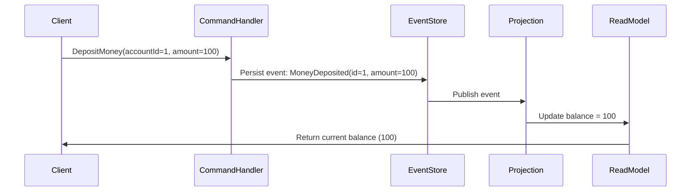
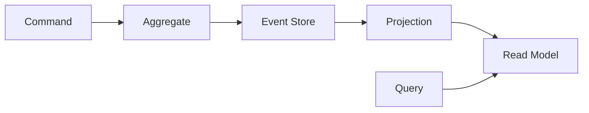

**Event Sourcing (ES)** — это архитектурный подход к хранению состояния системы, который **радикально отличается** от традиционных методов. Вместо того чтобы хранить *текущее состояние*, он хранит **все события**, которые привели к этому состоянию.

---

## ✅ Что такое **Event Sourcing**?

### 🔹 Определение:

> **Event Sourcing** — это паттерн проектирования, при котором **все изменения состояния системы сохраняются как последовательность неизменяемых событий (events)**, а **текущее состояние вычисляется путём воспроизведения этих событий**.

> 💡 Это как вести **журнал событий** (лог) вместо того, чтобы просто обновлять запись в таблице.

---

## 🆚 Традиционный подход vs Event Sourcing

| Аспект | **Традиционный подход** | **Event Sourcing** |
|--------|--------------------------|---------------------|
| **Что хранится?** | Текущее состояние объекта (например, `User` с балансом 1000) | **Список событий**: `UserCreated`, `MoneyDeposited(500)`, `MoneyWithdrawn(200)` |
| **Как обновляется состояние?** | `UPDATE users SET balance = 1000 WHERE id = 123` | `INSERT INTO events (type, payload) VALUES ('MoneyDeposited', {...})` |
| **Как получить текущее состояние?** | Прямой `SELECT` из таблицы | **Воспроизведение всех событий** для этого агрегата (агрегат = сущность с целостностью) |
| **История изменений** | Утрачивается — только последняя версия | **Полная история** доступна всегда |
| **Можно ли откатить?** | Только через резервную копию или обратную транзакцию | ✅ Да — просто "перевоспроизвести" события до нужного момента |
| **Производительность записи** | Быстро — одна запись | Медленнее — много событий, но **дешевле в долгосрочной перспективе** |
| **Производительность чтения** | Очень быстро | Медленнее — нужно воспроизводить события (можно кэшировать) |

---

## 🧩 Пример: Банковский счёт

### ❌ Традиционный подход:
```sql
-- Состояние на момент времени T
users:
id | name   | balance
1  | Alice  | 800
```

→ Вы делаете перевод 200 → баланс становится 600:
```sql
UPDATE users SET balance = 600 WHERE id = 1;
```

👉 **История потеряна**. Никто не знает, что было 800 → 600.  
Нельзя восстановить состояние на прошлую дату.  
Нельзя проверить, кто и когда сделал операцию.

---

### ✅ Event Sourcing:

Вы **не обновляете** баланс — вы **записываете событие**:

```plaintext
events:
id | aggregate_id | type             | payload                     | timestamp
---|--------------|------------------|-----------------------------|-------------------
1  | user:1       | UserCreated      | { "name": "Alice" }         | 2024-01-01T10:00:00Z
2  | user:1       | MoneyDeposited   | { "amount": 500 }           | 2024-01-01T11:00:00Z
3  | user:1       | MoneyWithdrawn   | { "amount": 200 }           | 2024-01-01T12:00:00Z
4  | user:1       | MoneyDeposited   | { "amount": 300 }           | 2024-01-01T13:00:00Z
```

### 🔍 Как получить текущий баланс?
Просто **воспроизведите все события** для `user:1`:

```js
let balance = 0;

events.filter(e => e.aggregate_id === 'user:1').forEach(event => {
  switch(event.type) {
    case 'MoneyDeposited':   balance += event.payload.amount; break;
    case 'MoneyWithdrawn':   balance -= event.payload.amount; break;
  }
});

console.log(balance); // 600
```

> ✅ **Состояние — это производная от истории.**

---

## 🔑 Ключевые понятия в Event Sourcing

| Понятие | Описание |
|--------|----------|
| **Event (Событие)** | Неизменяемый факт о произошедшем действии (`OrderPlaced`, `PaymentApproved`). Должен быть **именован в прошедшем времени**. |
| **Aggregate (Агрегат)** | Группа связанных сущностей, которые обрабатываются как единое целое (например, `Order` со всеми его `OrderLine`). Все события относятся к одному агрегату. |
| **Event Store** | Специальная база данных, предназначенная для хранения событий (например, **EventStoreDB**, Kafka, PostgreSQL с JSON). |
| **Projection (Проекция)** | Представление состояния, созданное на основе событий (например, материализованное представление `current_balance`). Используется для быстрого чтения. |
| **Command (Команда)** | Запрос на изменение состояния (`DepositMoneyToAccount`) — **вызывает** событие. Команда ≠ событие. |
| **Read Model (Модель чтения)** | Оптимизированная копия данных для запросов (например, SQL-таблица с балансами). Обновляется асинхронно через **проекции**. |

> 💡 **Command → Event → Projection → Read Model**

---

## 🔄 Как работает полный цикл?



1. Клиент отправляет **команду** (`DepositMoney`)
2. Сервис проверяет бизнес-правила → если всё ок → генерирует **событие**
3. Событие **сохраняется в Event Store**
4. **Проекция** слушает события и обновляет **Read Model** (например, SQL-таблицу)
5. Для чтения клиент обращается к **Read Model** — быстро и эффективно

> ⚠️ **Event Store — источник правды (Single Source of Truth)**  
> **Read Model — оптимизация для чтения**

---

## ✅ Преимущества Event Sourcing

| Преимущество | Объяснение |
|--------------|------------|
| **Полная история изменений** | Можно восстановить состояние на любой момент в прошлом — идеально для аудита, регуляторных требований (GDPR, FINRA) |
| **Отказоустойчивость** | События неизменяемы — нет конфликтов при обновлении |
| **Лёгкое масштабирование** | События можно обрабатывать асинхронно, параллельно, в очередях (Kafka, RabbitMQ) |
| **Поддержка CQRS** | Естественно сочетается с **CQRS** (Command Query Responsibility Segregation) — разделение чтения и записи |
| **Возможность “пересоздания” систем** | Можно перестроить все read models заново — например, после изменения бизнес-логики |
| **Простота отладки** | Можно точно воспроизвести, что привело к ошибке — просто повторить события |
| **Поддержка временных моделей** | Можно анализировать, как менялось состояние во времени — например, "какой был баланс у пользователя 3 месяца назад?" |

---

## ⚠️ Недостатки Event Sourcing

| Недостаток | Объяснение |
|-----------|------------|
| **Сложность разработки** | Нужно мыслить событиями, а не объектами. Требует переосмысления архитектуры |
| **Сложность чтения** | Получение текущего состояния требует воспроизведения событий — медленно без проекций |
| **Сложность миграций** | Если формат события меняется — нужно писать миграторы для старых событий |
| **Дублирование данных** | Read model — это копия данных из событий → нужно поддерживать согласованность |
| **Отсутствие стандартов** | Нет единого фреймворка — каждый проект реализует по-своему |
| **Ограниченная поддержка ORM** | Hibernate, Entity Framework не работают с ES — нужны специальные библиотеки |

---

## 🏭 Реальные примеры применения

| Отрасль | Пример использования |
|--------|----------------------|
| **Финансы / Банки** | Хранение всех транзакций — для аудита, отчётов, восстановления при сбоях. Пример: PayPal, Stripe |
| **Электронная коммерция** | Лог всех действий заказа: `OrderCreated`, `PaymentCaptured`, `Shipped`, `Delivered`, `Returned`. Подходит для отслеживания статуса и аналитики. |
| **IoT / Мониторинг** | Все показания датчиков — это события: `TemperatureChanged`, `DoorOpened`. Можно восстановить состояние устройства в любой момент. |
| **Логистика** | История перемещения груза: `PickedUp`, `AtWarehouse`, `LoadedOnTruck`, `Delivered` — идеально для трекинга. |
| **Биржи / HFT** | Все сделки — события. Можно полностью воспроизвести рынок за день. |
| **CRM / ERP** | История взаимодействия с клиентом: `Contacted`, `QuoteSent`, `ContractSigned` — для анализа воронки продаж. |

> 💬 **Stripe** использует Event Sourcing для всех платежей — каждая операция — событие. Это позволяет им делать точные отчёты, восстанавливать данные после сбоев и обеспечивать соответствие законам.

---

## 🔄 Event Sourcing + CQRS

Часто Event Sourcing используется вместе с **CQRS** (Command Query Responsibility Segregation):

| CQRS | Описание |
|------|----------|
| **Command Side** | Обработка команд → генерация событий → сохранение в Event Store |
| **Query Side** | Чтение данных из **Read Models** (SQL-таблицы, Elasticsearch, Redis) — оптимизированных для запросов |

> ✅ **CQRS + ES = мощнейшая пара для сложных доменных систем**



---

## 📦 Инструменты для Event Sourcing

| Инструмент | Описание |
|----------|----------|
| **EventStoreDB** | Специализированная БД для Event Sourcing — поддерживает потоки, подписки, транзакции. |
| **Apache Kafka** | Распределённый стриминг-брокер — часто используется как Event Store (особенно в микросервисах). |
| **PostgreSQL + JSONB** | Можно использовать как простой Event Store — особенно в .NET/Java-системах. |
| **Axon Framework** (Java) | Полноценный фреймворк для CQRS+ES. |
| **EventFlow** (.NET) | Лёгкий фреймворк для Event Sourcing. |
| **NEventStore** (.NET) | Популярная библиотека для работы с ES. |

---

## 💡 Когда использовать Event Sourcing?

| ✅ Используйте, если: | ❌ Избегайте, если: |
|----------------------|--------------------|
| Вам нужна **полная история изменений** | Проект маленький, MVP |
| Есть требования **аудита, compliance** (GDPR, SOX, PCI-DSS) | Нет необходимости в истории |
| Вы делаете **сложную доменную логику** (финансы, логистика) | Простые CRUD-операции |
| Вы строите **масштабируемую систему** с CQRS | Вы не готовы к сложности |
| Вы хотите **воспроизводить поведение системы** | Вы не можете позволить себе задержки при чтении |
| Вы работаете с **временными данными** (как было вчера?) | Ваша команда не знакома с паттерном |

---

## 🧠 Философия Event Sourcing

> **"Не храните то, чем вы являетесь — храните то, что вас сформировало."**

— Это как в жизни:  
Вы не «сейчас» — вы результат всех ваших действий, решений, ошибок, побед.  
Event Sourcing — это **биография вашего объекта**.

---

## ✅ Заключение: Event Sourcing — это не просто технология, это **новый способ мышления**

| Традиционный подход | Event Sourcing |
|---------------------|----------------|
| **«Храним состояние»** | **«Храним историю»** |
| `UPDATE balance = 1000` | `Append Event: BalanceChanged(from=800 to=1000)` |
| Текущая версия — правда | История событий — правда |
| Просто, но хрупко | Сложно, но надёжно |
| Работает для 90% систем | Работает для 10% критичных систем |

> 🔥 **Event Sourcing — это выбор для тех, кто не может позволить себе потерять историю.**

Если вы строите систему, где **важно не только "что сейчас", но и "как оно стало таким"** — **Event Sourcing — ваш путь**.

---

## 📚 Где учиться дальше?

- [Martin Fowler: Event Sourcing](https://martinfowler.com/eaaDev/EventSourcing.html) — классическая статья
- [EventStoreDB Documentation](https://eventstore.com/docs/)
- Book: *“Implementing Domain-Driven Design”* by Vaughn Vernon — глава про ES
- Video: *“Event Sourcing Explained”* — YouTube (Channel: Clean Code)

---

💡 **Event Sourcing — это не "лучше". Это "другое".**  
Используйте его, когда **история важнее, чем скорость**.  
И тогда ваша система станет **не просто программой — а живым организмом с памятью.**