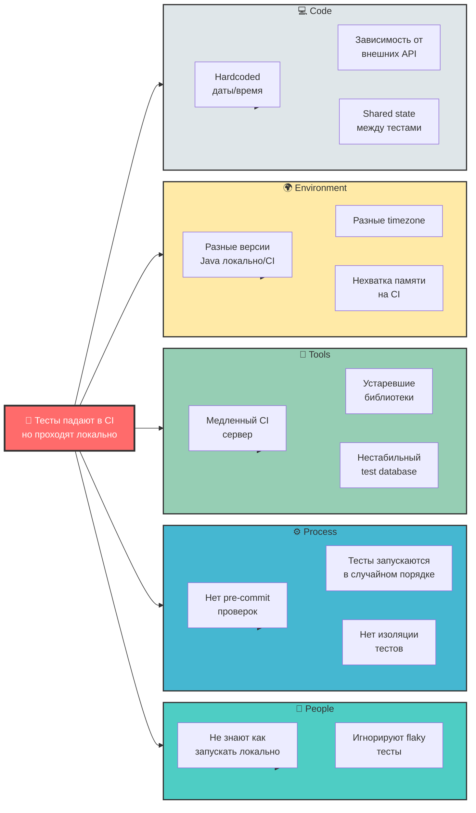
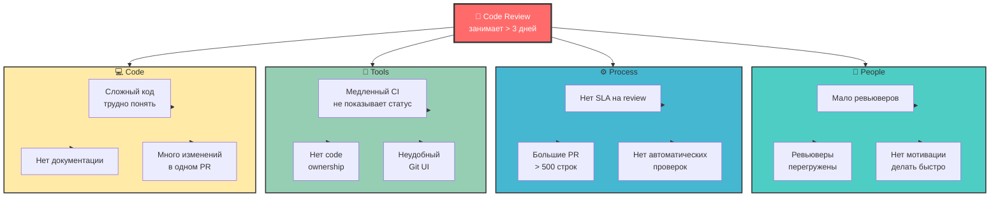
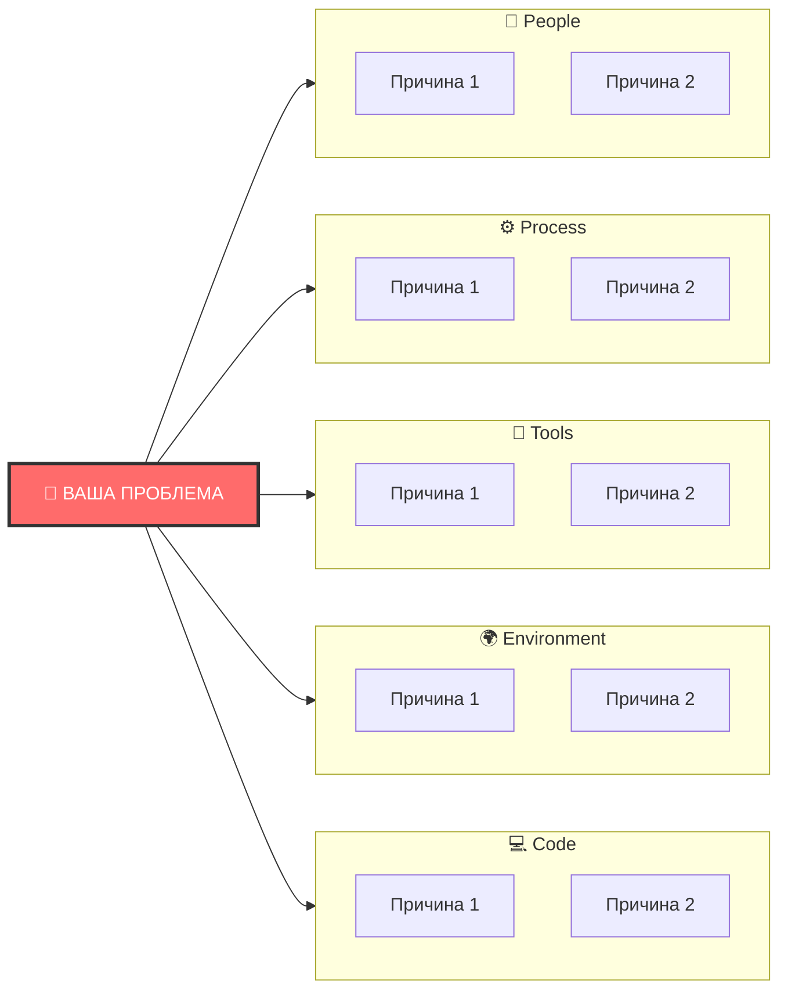

---
aliases:
  - Диаграмм Исикавы
  - Исикава
  - Fishbone Diagram
---
## 🐟 Fishbone Diagram (Диаграмма Исикавы)

### 📌 Что это такое?

**Fishbone Diagram** (диаграмма Исикавы, "рыбья кость", причинно-следственная диаграмма) — это инструмент визуализации для **поиска корневых причин проблем**.

```
Проблема (эффект) ←═══════════════════════════
                         ╱│╲
                    Причины│Причины
                         ╱│╲
```

---

## ✅ Зачем нужна?

| Цель | Описание |
|------|----------|
| **Поиск корневых причин** | Не лечить симптомы, а найти источник проблемы |
| **Структурирование** | Организовать мозговой штурм команды |
| **Визуализация** | Увидеть все факторы на одном экране |
| **Командная работа** | Вовлечь всех участников в анализ |

---

## 🛠️ Как использовать в CI/CD и разработке ПО

### 📊 Категории причин (6M для IT):

| Категория | Примеры в разработке |
|-----------|----------------------|
| **People** (Люди) | Недостаток знаний, усталость, коммуникация |
| **Process** (Процессы) | Отсутствие code review, плохой CI/CD |
| **Tools** (Инструменты) | Устаревшие библиотеки, медленные тесты |
| **Environment** (Окружение) | Различия dev/prod, нестабильный staging |
| **Code** (Код) | Технический долг, слабое покрытие тестами |
| **Requirements** (Требования) | Нечеткие ТЗ, частые изменения |

---

## 🧪 Примеры использования

### Пример 1: **Пайплайн CI/CD часто падает**

```
Проблема: "Сборка падает в 40% случаев"

People:
  - Разработчики не проверяют зависимости
  - Нет владельца пайплайна

Process:
  - Нет pre-commit хуков
  - Отсутствует staging environment

Tools:
  - Медленные тесты (45 мин)
  - Нестабильный Docker registry

Environment:
  - Разные версии Node.js на машинах
  - Нехватка памяти на CI-сервере

Code:
  - Flaky tests (15% ложных срабатываний)
  - Жестко закодированные пути

Requirements:
  - Неясные критерии успешной сборки
```

### Пример 2: **Долгий деплой в production**

```
Проблема: "Деплой занимает 2 часа"

People:
  - Ручное тестирование (3 человека)
  - Нет автоматизации рутинных задач

Process:
  - Последовательный деплой (не параллельный)
  - Ручное одобрение на каждом этапе

Tools:
  - Устаревший Jenkins (нет кэширования)
  - Монолитный артефакт (5 GB)

Environment:
  - Медленная сеть между серверами
  - Ограниченная пропускная способность

Code:
  - Нет инкрементальной сборки
  - Все тесты запускаются всегда

Requirements:
  - Требование 100% покрытия (даже для фиксов)
```

---

## 📐 Mermaid диаграмма

### Пример 1: **Почему падают тесты в CI?**



---

### Пример 2: **Почему долгий Code Review?**



---

## 📋 Пошаговый процесс использования

### Шаг 1: **Определите проблему**
```
❌ "CI работает плохо"
✅ "Сборка падает в 40% случаев из-за таймаутов"
```

### Шаг 2: **Соберите команду**
- Разработчики
- DevOps инженеры
- QA
- Product Owner (если проблема влияет на delivery)

### Шаг 3: **Проведите мозговой штурм**
- Нарисуйте "скелет" диаграммы
- Задавайте вопрос "Почему?" 5 раз (5 Whys)
- Группируйте причины по категориям

### Шаг 4: **Приоритизируйте причины**
| Критерий | Вопрос |
|----------|--------|
| **Влияние** | Насколько сильно это влияет на проблему? |
| **Вероятность** | Насколько часто это происходит? |
| **Сложность** | Насколько сложно это исправить? |

### Шаг 5: **Составьте план действий**
```
Проблема: "Тесты падают в CI"

🔴 Высокий приоритет:
  - Увеличить память на CI-сервере (1 день)
  - Исправить flaky tests (3 дня)

🟡 Средний приоритет:
  - Добавить pre-commit хуки (2 дня)
  - Обновить библиотеки (1 день)

🟢 Низкий приоритет:
  - Обучить команду (1 неделя)
```

---

## 🎯 Реальный кейс: Ускорение деплоя

### Проблема:
> **Деплой в production занимает 4 часа**

### Fishbone анализ:

```
👥 People:
  - 2 человека вручную проверяют чеклист
  - Нет ответственного за автоматизацию

⚙️ Process:
  - Последовательное выполнение (не параллельное)
  - Ручное одобрение после каждого этапа
  - Полный прогон всех тестов (даже smoke)

🔧 Tools:
  - Jenkins без кэширования зависимостей
  - Монолитный Docker image (8 GB)
  - Нет blue-green deployment

💻 Code:
  - Нет feature flags
  - Миграции БД блокируют таблицу
  - Нет инкрементальной сборки

🌍 Environment:
  - Медленная сеть (100 Mbps)
  - Ограниченные ресурсы staging

📋 Requirements:
  - Требование 100% coverage для деплоя
```

### Результат (после оптимизации):

| Было | Стало | Улучшение |
|------|-------|-----------|
| 4 часа | 25 минут | **90% быстрее** |
| 2 человека | 0 (полностью автоматизировано) | |
| 8 GB image | 1.2 GB | **85% меньше** |
| 0% параллелизма | 80% параллельных задач | |

---

## ✅ Шаблон для вашей команды

Скопируйте и адаптируйте:



---

## 📊 Когда использовать Fishbone в разработке?

| Ситуация | Пример |
|----------|--------|
| **Постоянно падают тесты** | Flaky tests,环境问题 |
| **Долгий CI/CD** | Медленная сборка, очереди |
| **Частые инциденты в prod** | Недостаточное тестирование |
| **Низкая скорость разработки** | Блокировки, зависимости |
| **Плохое качество кода** | Нет code review, стандарты |
| **Частые конфликты в Git** | Плохая коммуникация, branching |

---

## ✅ Вывод

| Преимущество | Описание |
|--------------|----------|
| **Визуализация** | Все причины на одном экране |
| **Структура** | Системный подход к анализу |
| **Команда** | Вовлекает всех участников |
| **Фокус** | Помогает найти корневую причину |
| **Действия** | Ведет к конкретным улучшениям |

---

## 📌 Памятка

> **Fishbone — это не про поиск виноватых, а про поиск причин.**  
> **Используйте его регулярно для ретроспектив и улучшения процессов.**

---

Если хочешь — могу помочь:

- Создать диаграмму для вашей конкретной проблемы
- Интегрировать Fishbone в процесс ретроспектив
- Автоматизировать сбор данных для анализа

Пишите — сделаю! 🚀