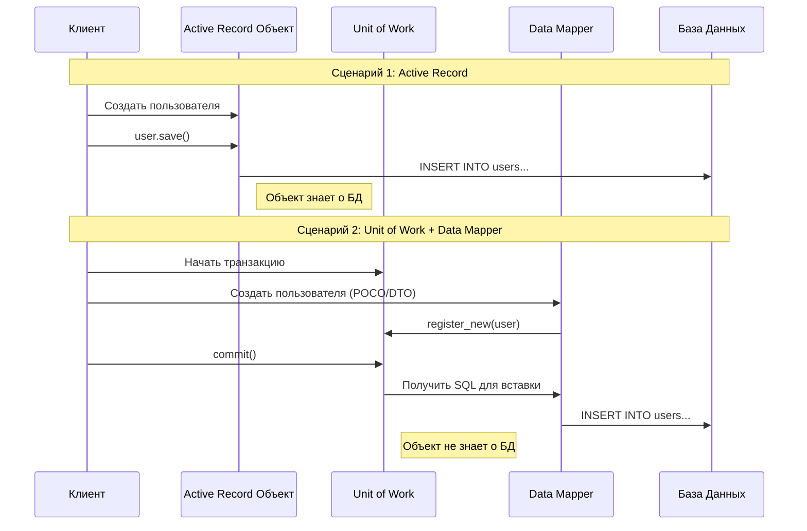

---
aliases:
  - Unit of Work
  - PoEAA
  - Active Record
---
В книге Мартина Фаулера *Patterns of Enterprise Application Architecture* (PoEAA) **Active Record** и **Unit of Work** описываются как разные паттерны, решающие разные задачи, но на практике они часто представляют собой два разных подхода к архитектуре доступа к данным.

Часто выбор стоит не просто между ними, а между двумя архитектурами:
1.  **Active Record** (объект сам себя сохраняет).
2.  **Data Mapper + Unit of Work** (объект чистый, а сохранением управляет внешний механизм).

Ниже подробное объяснение различий, связей и примеров.

---

### 1. Active Record (Активная запись)

**Суть:** Объект, который инкапсулирует строку таблицы базы данных. Он содержит **и данные, и логику доступа к БД**.
*   Класс соответствует таблице.
*   Экземпляр класса соответствует строке.
*   Методы `save()`, `update()`, `delete()` находятся внутри самого объекта.

**Пример (псевдокод):**
```python
class User:
    def __init__(self, id, name):
        self.id = id
        self.name = name

    def save(self):
        # SQL внутри объекта
        db.execute("INSERT INTO users ...")
```

### 2. Unit of Work (Единица работы)

**Суть:** Объект, который поддерживает список объектов, затронутых бизнес-транзакцией, и координирует запись изменений и решение проблем конкурентности.
*   Он **не хранит данные** предметной области.
*   Он **отслеживает изменения** (новые, грязные, удаленные объекты).
*   В конце транзакции метод `commit()` собирает все изменения и отправляет их в БД (часто через *Data Mapper*).

**Пример (псевдокод):**
```python
class UnitOfWork:
    def register_new(self, obj): ...
    def register_dirty(self, obj): ...
    def commit(self):
        # Собирает все SQL и выполняет в одной транзакции
        db.begin_transaction()
        mappers.insert_all(self.new_objects)
        mappers.update_all(self.dirty_objects)
        db.commit()
```

---

### Архитектурное сравнение

Главное различие в том, **кто отвечает за сохранение** и **насколько сильно доменная логика связана с базой данных**.

#### Диаграмма потока (Mermaid Sequence Diagram)



---

### Детальное сравнение

| Характеристика | Active Record | Unit of Work (обычно с Data Mapper) |
| :--- | :--- | :--- |
| **Связь с БД** | **Тесная.** Класс наследует свойства таблицы. | **Слабая.** Доменные объекты "чистые" (POCO/POJO). |
| **Сохранение** | Вызывается явно на объекте (`obj.save()`). | Откладывается до конца транзакции (`uow.commit()`). |
| **Транзакции** | Сложнее управлять границами (каждый `save` может быть автокоммитом). | Естественная поддержка транзакций (все изменения в одном `commit`). |
| **Тестируемость** | Сложнее (нужна БД или мокирование БД внутри модели). | Легче (доменная логика не зависит от БД). |
| **Сложность** | Низкая (меньше кода, меньше классов). | Высокая (нужны Мапперы, UoW, репозитории). |
| **Identity Map** | Обычно отсутствует (риск дублирования объектов в памяти). | Часто встроен в UoW (гарантирует уникальность объектов в памяти). |
| **Примеры** | Ruby on Rails (AR), Laravel (Eloquent), Django ORM. | .NET (Entity Framework Core), Java (Hibernate), Doctrine (PHP). |

---

### Плюсы и Минусы (по Фаулеру)

#### Active Record
**✅ Плюсы:**
*   **Простота:** Очень легко начать работать. Минимум кода для CRUD.
*   **Понятность:** Очевидно, где лежат данные и как их сохранить.
*   **Эффективность для простых приложений:** Если логика близка к CRUD, лишние абстракции не нужны.

**❌ Минусы:**
*   **Нарушение SRP:** Класс отвечает и за бизнес-логику, и за хранение данных.
*   **Сложность рефакторинга:** Изменение схемы БД требует изменения доменных классов.
*   **Проблемы с тестами:** Трудно тестировать логику без поднятия базы данных.
*   **Сложные запросы:** При сложных джойнах паттерн начинает "трещать".

#### Unit of Work (в связке с Data Mapper)
**✅ Плюсы:**
*   **Разделение ответственности:** Доменная модель чистая, логика БД вынесена наружу.
*   **Контроль транзакций:** Вы точно знаете, когда данные уйдут в БД.
*   **Оптимизация:** UoW может группировать запросы (например, сделать один `UPDATE` вместо десяти).
*   **Identity Map:** Гарантирует, что в рамках одной транзакции вы не загрузите одну и ту же сущность дважды под разными объектами.

**❌ Минусы:**
*   **Сложность:** Требует написания большого количества вспомогательного кода (Мапперы, UoW классы).
*   **Накладные расходы:** Для простых скриптов может быть избыточным (Overengineering).

---

### Как они взаимодействуют?

Важно понимать, что **Unit of Work и Active Record не являются взаимоисключающими** в строгом смысле, но они тяготеют к разным архитектурам.

1.  **Чистый Active Record:** Объект сам делает `INSERT/UPDATE`. Unit of Work не используется явно (или скрыт внутри фреймворка на уровне соединений).
2.  **Data Mapper + Unit of Work:** Объекты вообще не имеют методов `save()`. Вы передаете их в Unit of Work, а он через Мапперы сохраняет их.
3.  **Гибрид:** Вы можете использовать объекты в стиле Active Record, но отслеживать их изменения во внешнем Unit of Work (например, в Django или некоторых реализациях Hibernate). Однако Фаулер отмечает, что это часто приводит к путанице: "Кто главный? Объект или Unit of Work?".

### Рекомендация Фаулера

*   Используйте **Active Record**, если:
    *   У вас простое приложение.
    *   Логика предметной области несложная (в основном CRUD).
    *   Вы хотите быстро разработать прототип (Time-to-market).
    *   Схема БД стабильна.

*   Используйте **Unit of Work (с Data Mapper)**, если:
    *   У вас сложная бизнес-логика.
    *   Требуется строгое разделение слоев (Domain Layer не должен знать о Persistence Layer).
    *   Нужен детальный контроль над транзакциями и производительностью SQL-запросов.
    *   Планируется долгосрочная поддержка и рефакторинг.

### Итог
**Active Record** — это паттерн **структуры** (как выглядит объект).
**Unit of Work** — это паттерн **управления состоянием** (как отслеживаются изменения в транзакции).

В современной разработке выбор часто сводится к выбору ORM:
*   **Eloquent / Django ORM** → склоняются к **Active Record**.
*   **Hibernate / Entity Framework** → склоняются к **Unit of Work + Data Mapper**.