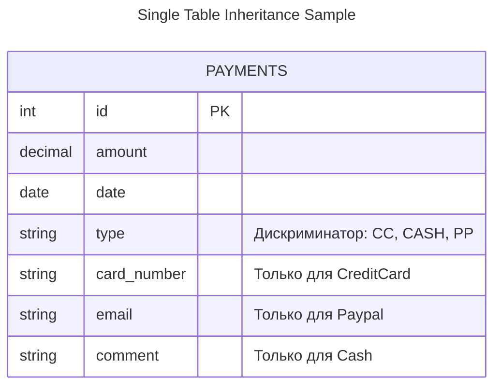
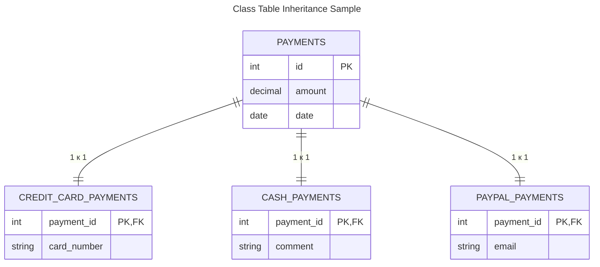
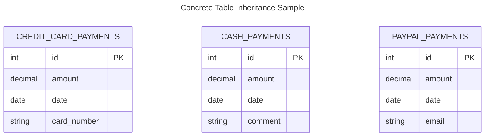

---
aliases:
  - Inheritance Mappers
  - Мапперы наследования
  - Concrete Table Inheritance
  - Class Table Inheritance
  - Single Table Inheritance
---
[[PoEAA|Patterns of Enterprise Application Architecture]]

Паттерн **Inheritance Mappers** (Мапперы наследования) из книги Мартина Фаулера *Patterns of Enterprise Application Architecture* решает фундаментальную проблему: **объектно-реляционное несоответствие (Object-Relational Impedance Mismatch)**.

В объектно-ориентированном программировании (ООП) есть наследование классов, а в реляционных базах данных (РБД) его нет — там есть только плоские таблицы. Задача Inheritance Mappers — сохранить структуру наследования объектов при сохранении их в базу данных.

---

### Сценарий для примеров
Допустим, у нас есть система платежей.
*   Базовый класс: `Payment` (Платеж) -> поля: `id`, `amount` (сумма), `date` (дата).
*   Наследник 1: `CreditCardPayment` (Картой) -> доп. поле: `card_number`.
*   Наследник 2: `CashPayment` (Наличными) -> доп. полей нет (или `comment`).
*   Наследник 3: `PaypalPayment` (Через PayPal) -> доп. поле: `email`.

---

### 1. Single Table Inheritance (Одна таблица на иерархию)
*Также известно как: Table Per Hierarchy (TPH)*

**Суть:** Вся иерархия классов хранится в **одной большой таблице**.
*   Таблица содержит колонки для всех полей всех классов.
*   Добавляется специальная колонка-дискриминатор (например, `type`), чтобы понять, к какому классу относится строка.
*   Поля, не относящиеся к конкретному типу, остаются `NULL`.

**Плюсы:**
*   ✅ Очень просто писать запросы (не нужно делать `JOIN`).
*   ✅ Легко добавить новое поле в базовый класс.
*   ✅ Быстрая полиморфная выборка (все платежи в одном месте).

**Минусы:**
*   ❌ Много `NULL` значений (если у подклассов много уникальных полей).
*   ❌ Нарушение нормализации БД.
*   ❌ Сложно добавить обязательное поле в подкласс (оно станет NULL для других).

---

### 2. Class Table Inheritance (Таблица на класс)
*Также известно как: Table Per Type (TPT)*

**Суть:** Для каждого класса в иерархии создается **отдельная таблица**.
*   Таблица базового класса хранит общие поля.
*   Таблицы подклассов хранят только специфичные поля и внешний ключ (FK) на базовую таблицу.
*   Чтобы получить полный объект, нужно сделать `JOIN`.

**Плюсы:**
*   ✅ Нормализованная база данных (нет NULL-полей).
*   ✅ Четкая структура, отражающая классы.
*   ✅ Легко добавить поля в подкласс, не затрагивая другие.

**Минусы:**
*   ❌ Требуется `JOIN` для загрузки любого объекта (может быть медленно).
*   ❌ Сложнее писать запросы, затрагивающие всю иерархию.
*   ❌ Вставка объекта требует записи в две таблицы (транзакционность).

---

### 3. Concrete Table Inheritance (Таблица на конкретный класс)
*Также известно как: Table Per Concrete Class (TPC)*

**Суть:** Таблицы для абстрактных базовых классов **не создаются**.
*   Создается отдельная таблица для каждого конкретного (неабстрактного) класса.
*   Каждая таблица дублирует поля базового класса.
*   Нет связей между таблицами подклассов.

> Поля amount и date дублируются

**Плюсы:**
*   ✅ Не нужно делать `JOIN` для загрузки конкретного объекта.
*   ✅ Нет `NULL` значений внутри таблицы.
*   ✅ Изолированность данных типов.

**Минусы:**
*   ❌ Дублирование схемы (поля `amount`, `date` повторяются везде).
*   ❌ Сложно изменить поле в базовом классе (нужно менять во всех таблицах).
*   ❌ Очень сложно выбрать "все платежи" (нужен `UNION` всех таблиц).
*   ❌ Проблемы с уникальностью ID (нужно гарантировать, что ID не пересекаются между таблицами).

---

### Сравнительная таблица

| Характеристика | Single Table (TPH) | Class Table (TPT) | Concrete Table (TPC) |
| :--- | :--- | :--- | :--- |
| **Количество таблиц** | 1 | N (по количеству классов) | N (по количеству конкретных классов) |
| **JOIN-ы** | Не нужны | Нужны всегда | Не нужны (для конкретного типа) |
| **NULL значения** | Много | Нет | Нет |
| **Дублирование схемы** | Нет | Нет | Да (поля базового класса) |
| **Полиморфный запрос** | Легко (`SELECT * FROM...`) | Сложно (нужно объединять) | Очень сложно (`UNION`) |
| **Когда использовать** | Иерархия стабильна, мало уникальных полей | Иерархия глубокая, много уникальных полей | Подклассы используются независимо друг от друга |

### Какую стратегию выбрать?

1.  **Single Table** — выбор по умолчанию для большинства случаев (особенно в ORM вроде Hibernate или Entity Framework), если иерархия не слишком сложная. Это самый производительный вариант для чтения.
2.  **Class Table** — если у подклассов очень много уникальных полей и вы не хотите хранить кучу NULL-ов, либо если база данных строго нормализована.
3.  **Concrete Table** — используется редко, обычно когда подклассы настолько разные, что вы почти никогда не обращаетесь к ним полиморфно (как к базовому типу).

В современных фреймворках (Django, Rails, Hibernate) **Single Table Inheritance** часто является настройкой по умолчанию из-за простоты реализации.