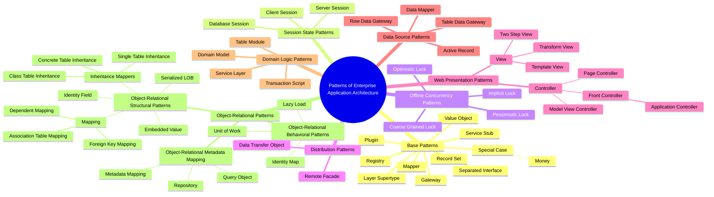

---
aliases:
  - Patterns of Enterprise Application Architecture
  - PoEAA
  - POEA
  - Data Transfer Object
  - DTO
---
# Patterns of Enterprise Application Architecture

#📘  Patterns of Enterprise Application Architecture – #👨 Martin Fowler, 2002
> 💬 *«Если вы не читали PoEAA — вы просто заново изобретаете то, что уже было написано»* — Martin Fowler

**Patterns of Enterprise Application Architecture List**
1. Base Patterns
	1. Service Stub
	2. Gateway
	3. Registry
	4. Value Object
	5. Record Set
	6. Layer Supertype
	7. Special Case
		1. Money
	8. Plugin
	9. [[Data Mapper|Mapper]]
	10. Separated Interface
2. Session State Patterns
	1. Client Session
	2. Server Session
	3. Database Session
3. [[Offline Concurrency]] Patterns
	1. Optimistic Lock
	2. Pessimistic Lock
	3. Coarse Grained Lock
	4. Implicit Lock
4. Distribution Patterns
	1. Remote Facade
	2. Data Transfer Object
5. Web Presentation Patterns
	1. Controller
		1. Model View Controller
		2. [[Page Controller]]
		3. Front Controller
			1. Application Controller
	2. View
		1. Template View
		2. Two Step View
		3. Transform View
6. Data Source Patterns
	1. Table Data Gateway
	2. Row Data Gateway
	3. Active Record
	4. Data Mapper
7. Domain Logic Patterns
	1. Transaction Script
	2. Domain Model
	3. [[Table Module]]
	4. Service Layer
8. Object-Relational Patterns
	1. Object-Relational Structural Patterns
		1. Embedded Value
		2. Serialized [[LOB]]
		3. Identity Field
		4. Mapping
			1. Foreign Key Mapping
			2. Association Table Mapping
			3. Dependent Mapping
		5. [[Inheritance Mappers]]
			1. Single Table Inheritance
			2. Class Table Inheritance
			3. Concrete Table Inheritance
	2. Object-Relational Behavioral Patterns
		1. Lazy Load
		2. Identity Map
		3. [[Unit of Work]]
	3. Object-Relational Metadata Mapping
		1. Metadata Mapping
		2. Query Object
		3. Repository

---

## Base Patterns

1. **Service Stub (Заглушка сервиса)**
	- **Суть:** упрощённая реализация сервиса для тестирования или прототипирования.
	- **Назначение:** заменить реальный сервис (например, платёжный шлюз), который: недоступен; слишком медленный; требует сложной настройки.
	- **Пример:** заглушка для сервиса отправки SMS возвращает всегда `true` вместо реальной отправки сообщения.

2. **Gateway (Шлюз)**
	- **Суть:** объект, инкапсулирующий доступ к внешней системе (БД, веб‑сервису, очереди сообщений).
	- **Назначение:** скрыть сложность взаимодействия с внешним ресурсом за простым интерфейсом.
	- **Пример:** класс `PaymentGateway` с методом `charge(amount, card)`, который скрывает детали протокола платёжной системы.

3. **Registry (Реестр)**
	- **Суть:** глобальный доступ к объектам через централизованное хранилище.
	- **Назначение:** обеспечить единый способ получения сервисов или настроек без передачи зависимостей по цепочке.
	- **Пример:** `ServiceRegistry::getDatabaseConnection()` возвращает соединение с БД; `ConfigRegistry::get('api_key')` — значение настройки.

4. **Value Object (Объект‑значение)**
	- **Суть:** неизменяемый объект, определяемый своими атрибутами (а не идентификатором).
	- **Назначение:** моделировать понятия, где важна целостность данных, а не уникальность (деньги, даты, диапазоны).
	- **Свойства:** неизменяемость (immutability); сравнение по значению (`equals()`), а не по ссылке; отсутствие идентификатора.
	- **Пример:** объект `Money(100, "USD")` или `DateRange(start, end)`.

5. **Record Set (Набор записей)**
	- **Суть:** структура данных, представляющая результат запроса к БД (аналог `DataSet` в .NET или `ResultSet` в Java).
	- **Назначение:** передавать табличные данные между слоями приложения без привязки к ORM.
	- **Особенности:**
		* хранит строки и колонки;
		* поддерживает навигацию (`next()`, `previous()`);
		* может быть заполнена из SQL, CSV, XML.
	- **Пример:** результат запроса `SELECT * FROM users` возвращается как `RecordSet`.

6. **Layer Supertype (Супертип слоя)**
	- **Суть:** базовый класс для всех объектов определённого слоя (домена, доступа к данным и т. д.).
	- **Назначение:** вынести общую функциональность (логирование, валидация, сериализация) на уровень суперкласса.
	- **Пример:** класс `DomainObject` с методом `isValid()` наследуется всеми сущностями (`User`, `Order`, `Product`).

7. **Special Case (Особый случай)**
	- **Суть:** специальный объект, заменяющий `null` и обрабатывающий крайние ситуации.
	- **Назначение:** избежать проверок на `null`, сделать код безопаснее и читаемее.
	- **Примеры:**
		* `NullUser` с методами `getName()` → `"Гость"`, `isLoggedIn()` → `false`;
		* `EmptyOrder` с `getTotal()` → `Money(0, "USD")`.

8. **Money (Деньги)**
	- **Суть:** специализированный Value Object для работы с денежными суммами.
	- **Назначение:** предотвратить ошибки при вычислениях (округление, валюта).
	- **Особенности:**
		* хранит сумму и валюту (`100.50 USD`);
		* реализует арифметические операции (`add()`, `multiply()`);
		* гарантирует корректное округление;
		* запрещает операции с разными валютами.
	- **Пример:** `total = price.multiply(quantity).add(tax)`.

9. **Plugin (Плагин)**
	- **Суть:** модуль, подключаемый к приложению динамически (без перекомпиляции).
	- **Назначение:** расширить функциональность системы сторонними компонентами.
	- **Реализация:**
		* определение интерфейса плагина;
		* механизм обнаружения и загрузки (например, сканирование папок);
		* регистрация в хост‑приложении.
	- **Пример:** плагины для CMS (WordPress), IDE (VS Code), браузеров.

10. **Mapper (Маппер)**
	- **Суть:** объект, преобразующий данные между разными слоями (например, между объектами домена и таблицами БД).
	- **Назначение:** отделить бизнес‑логику от деталей хранения.
	- **Виды:**
		1. **Data Mapper** — двунаправленный, полная изоляция (`User` ↔ `users` table`);
		2. **Transfer Object Assembler** — собирает DTO из нескольких источников.
	- **Пример:** `UserMapper::findById(id)` загружает строку из БД и создаёт объект `User`.

11. **Separated Interface (Раздельный интерфейс)**
	- **Суть:** определение интерфейса в одном модуле, а реализации — в другом.
	- **Назначение:** снизить зависимость компонентов, облегчить тестирование и замену реализаций.
	- **Применение:**
		* разделение API и реализации (например, `PaymentService` vs `StripePaymentService`);
		* использование в Dependency Injection;
		* изоляция модулей (например, ядро приложения не зависит от фреймворка).
	- **Пример:** интерфейс `Logger` в основном коде, реализации `FileLogger`, `DatabaseLogger` — в отдельных модулях.

## Session State Patterns
> паттерны состояния сессии

**Session State:** где хранить состояние сессии (клиент, сервер, БД). Выбор зависит от требований к масштабируемости, безопасности и надёжности.

Определяют, **где и как хранить состояние пользовательской сессии**.

1. **Client Session** — состояние хранится **на стороне клиента** (в cookies, hidden fields, URL, localStorage).
    * **Пример:** JWT‑токены, куки с идентификатором сессии.

2. **Server Session** — состояние хранится **в памяти сервера** (в RAM, например, в ASP.NET Session, PHP `$_SESSION`).
    * **Пример:** сессии в веб‑серверах по умолчанию.

3. **Database Session** — состояние хранится **в базе данных**.
    * **Пример:** таблицы `sessions` в веб‑фреймворках (Django, Laravel).

---

## Offline Concurrency Patterns
> паттерны параллелизма при офлайн‑работе

Решают проблему **конфликтов при одновременном изменении одних данных несколькими пользователями**.

1. **Optimistic Lock** («оптимистическая блокировка») — предполагает, что конфликты редки. Перед сохранением проверяет, не изменились ли данные с момента их чтения.
    * **Как:** добавляет версию (`version`) или timestamp. При обновлении проверяет, что версия не изменилась.
    * **Когда:** частые чтения, редкие обновления, короткие транзакции.
    * **Пример:** Hibernate Optimistic Locking.

2. **Pessimistic Lock** («пессимистическая блокировка») — блокирует данные сразу при чтении, чтобы никто другой не мог их изменить.
    * **Как:** использует блокировки на уровне БД (`SELECT ... FOR UPDATE`).
    * **Когда:** частые конфликты, длинные транзакции, критичность целостности данных.
    * **Минус:** может снижать параллелизм.

3. **Coarse Grained Lock** («крупнозернистая блокировка») — блокирует большой объём данных (например, всю запись или группу связанных записей) вместо отдельных полей.
    * **Плюсы:** проще реализовать, меньше накладных расходов на управление блокировками.
    * **Минусы:** снижает параллелизм (больше пользователей блокируются).
    * **Пример:** блокировка всего заказа при редактировании любого его поля.

4. **Implicit Lock** («неявная блокировка») — блокировка возникает неявно через бизнес‑правила приложения, а не через явные механизмы БД.
    * **Как:** приложение само отслеживает, кто «редактирует» объект, и запрещает другим пользователям его менять.
    * **Пример:** веб‑приложение показывает «Пользователь X редактирует этот документ» и блокирует редактирование для других.

**Offline Concurrency:** как избежать конфликтов при параллельном редактировании (оптимистично, пессимистично, крупнозернисто, неявно). Выбор зависит от частоты конфликтов и критичности данных.

---

## Distribution Patterns
>паттерны распределения

Паттерны для **оптимизации взаимодействия между удалёнными компонентами** (например, клиент и сервер).

1. **Remote Facade** («удалённый фасад») — создаёт упрощённый интерфейс (фасад) для удалённого сервиса, чтобы сократить число вызовов.
    * **Проблема:** без него каждый мелкий запрос (например, получить имя, затем email, затем телефон) требует отдельного сетевого вызова.
    * **Решение:** один метод фасада возвращает сразу все нужные данные за один вызов.
    * **Эффект:** меньше сетевых вызовов → выше производительность.
    * **Пример:** REST API endpoint `/api/user-profile` возвращает все данные профиля разом.

2. **Data Transfer Object (DTO)** («объект передачи данных») — специальный объект для упаковки данных, передаваемых между процессами/сервисами.
    * **Цель:** минимизировать число вызовов за счёт передачи всех нужных данных одним пакетом.
    * **Отличие от Domain Object:** DTO не содержит бизнес‑логики, только данные.
    * **Пример:** класс `UserProfileDTO` с полями `name`, `email`, `phone`, `address` передаётся от сервера к клиенту.
    * **Связь с Remote Facade:** часто используется вместе — Remote Facade возвращает DTO.

**Distribution:** как оптимизировать удалённое взаимодействие (меньше вызовов через Remote Facade, упаковка данных через DTO). Критично для производительности распределённых систем.

---
## Web Presentation Patterns
>паттерны веб‑представления

**Web Presentation:**
* **Контроллеры** управляют запросами и маршрутизацией (MVC, Page, Front, Application).
* **Представления** формируют вывод для пользователя (Template, Two Step, Transform).

==Controller (контроллеры)==

1. **Model‑View‑Controller (MVC)** — разделяет приложение на три компонента:
    * **Model** — данные и бизнес‑логика;
    * **View** — отображение данных;
    * **Controller** — обработка ввода и координация.
2. **Page Controller** — отдельный контроллер для каждой веб‑страницы. Простота реализации, подходит для небольших приложений.
3. **Front Controller** — единый обработчик всех запросов. Централизует логику маршрутизации, аутентификации, локализации.
4. **Application Controller** — дополняет Front Controller, управляет workflow и навигацией приложения (например, последовательностью шагов в мастере оформления заказа).

==View (представления)==

1. **Template View** — HTML с внедрёнными вставками кода (PHP, JSP, Thymeleaf). Простота, но риск смешивания логики и разметки.
2. **Two Step View** — преобразование данных в два этапа:
    * сначала в промежуточную логическую разметку;
    * затем в финальное HTML. Позволяет единообразно оформлять страницы.
3. **Transform View** — использует XSLT или аналогичные технологии для преобразования данных в HTML. Отделение логики от представления, но сложность настройки.

---

## Data Source Patterns
> архитектурные паттерны источников данных

Data Source паттерны решают, **как взаимодействовать с БД** (шлюзы, Active Record, Mapper).

1. **Table Data Gateway** — класс‑шлюз для всей таблицы БД. Содержит методы для работы с данными таблицы (например, `findAll()`, `findById()`). Подходит для простых CRUD‑операций.
2. **[[Row Data Gateway]]** — объект‑шлюз для одной строки таблицы. Каждый объект соответствует записи в БД. Удобен для работы с отдельными записями.
3. **[[Active Record]]** — объект, который объединяет данные строки и методы для работы с ней (например, `save()`, `delete()`). Простота, но смешение уровней данных и логики.
4. **[[Data Mapper]]** — слой, отделяющий объекты предметной области от БД. Преобразует объекты в записи и обратно без взаимной зависимости. Гибкость, но повышенная сложность.

---

## Domain Logic Patterns
> паттерны бизнес‑логики

Domain Logic паттерны определяют, **где и как размещать бизнес‑логику** (процедуры, модели, модули, сервисы).

1. **Transaction Script** — процедурный подход: каждая бизнес‑операция — отдельная процедура (например, «Оформить заказ»). Простота для простых сценариев, но дублирование кода при усложнении.
2. **Domain Model** — объекты с данными и поведением, отражающие сущности предметной области (например, класс `Order` с методом `addItem()`). Гибкость для сложных бизнес‑правил, но требует ОО‑подхода.
3. **Table Module** — логика сгруппирована по таблицам БД в отдельные модули. Один класс обрабатывает все операции с таблицей. Производительность для пакетной обработки, но слабая инкапсуляция правил.
4. **Service Layer** — единый интерфейс для бизнес‑логики (например, `OrderService` с методами `placeOrder()`, `cancelOrder()`). Чёткое разделение ответственности, переиспользование между компонентами.

---

## Object-Relational Patterns
> Объектно-реляционные шаблоны
* **Структурные** паттерны — *как* хранить объекты в таблицах.
* **Поведенческие** — *когда* и *как* загружать/сохранять данные.
* **Метаданные** — *как* абстрагироваться от SQL и схемы БД.

### Object‑Relational Structural Patterns
> Объектно-реляционные структурные паттерны

Эти паттерны решают, **как структурировать данные** при хранении объектов в реляционной БД.

* **Embedded Value** — встраивание объекта‑значения (value object) прямо в таблицу сущности. Например, адрес клиента хранится не в отдельной таблице, а как несколько полей (`street`, `city`, `zip`) в таблице `Customer`.
* **Serialized LOB** — сериализация сложного объекта в одно поле БД (BLOB или CLOB). Подходит для данных, которые приложению удобнее обрабатывать целиком (например, настройки в формате JSON).
* **Identity Field** — добавление в класс поля, хранящего идентификатор записи из БД (например, `id`). Позволяет однозначно сопоставить объект в памяти с записью в таблице.
* **Mapping** — способы связи объектов друг с другом через внешние ключи:
    * **Foreign Key Mapping** — прямая связь «один‑ко‑многим» через внешний ключ. В таблице `Order` есть поле `customer_id`, ссылающееся на `Customer.id`.
    * **Association Table Mapping** — связь «многие‑ко‑многим» через промежуточную таблицу. Например, `Student_Course` связывает студентов и курсы.
    * **Dependent Mapping** — дочерние объекты (например, позиции заказа) автоматически сохраняются/удаляются вместе с родительским (заказом).
* **[[Inheritance Mappers]]** — стратегии отображения иерархии классов на таблицы.
    * **Single Table Inheritance** — все классы иерархии в одной таблице. Поле‑дискриминатор (например, `type`) определяет тип записи.
    * **Class Table Inheritance** — для каждого класса своя таблица. Поля базового класса дублируются или выделяются в отдельную таблицу.
    * **Concrete Table Inheritance** — отдельная таблица для каждого конкретного класса (без общих таблиц для базовых классов).

---

### Object‑Relational Behavioral Patterns
> Объектно-реляционные поведенческие паттерны

Описывают **логику взаимодействия** с данными и их кэширования.

* **Lazy Load** — «ленивая» загрузка. Связанные данные (например, комментарии к посту) загружаются из БД только при первом обращении к ним. Экономит ресурсы, но может вызвать множество запросов («проблема N+1»).
* **Identity Map** — кэш объектов в рамках сессии. Гарантирует, что для одной записи БД в памяти существует только один объект. Предотвращает дублирование и конфликты при обновлении.
* **Unit of Work** — отслеживание всех изменений объектов (создание, обновление, удаление) и их пакетная отправка в БД. Обеспечивает согласованность данных и транзакционность.

---

### Object‑Relational Metadata Mapping
> Объектно-реляционные паттерны метаданных

Решают задачу **динамического построения запросов** и абстракции от БД.

* **Metadata Mapping** — описание правил отображения классов на таблицы через метаданные (XML, аннотации). Позволяет менять схему БД без правки кода.
* **Query Object** — объект, представляющий SQL‑запрос. Позволяет программно конструировать условия (`WHERE`, `JOIN`) без написания сырого SQL. Улучшает типобезопасность и тестируемость.
* **Repository** — слой абстракции между бизнес‑логикой и доступом к данным. Предоставляет интерфейс для работы с объектами (например, `findByEmail()`, `save()`), скрывая детали реализации (ORM, SQL и т. д.).

---
## tree

---

- [Книга: "Patterns of Enterprise Application Architecture"](https://martinfowler.com/books/eaa.html)
- [Официальные статьи](https://martinfowler.com/eaaCatalog/) — онлайн-версия каталога
- YouTube: *“Martin Fowler — Enterprise Patterns”*
- Book: *"Enterprise Integration Patterns"* — Hohpe & Woolf (продолжение темы)

---

