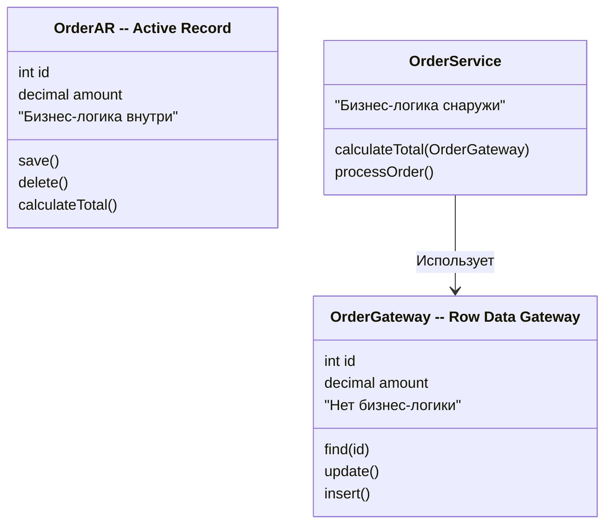
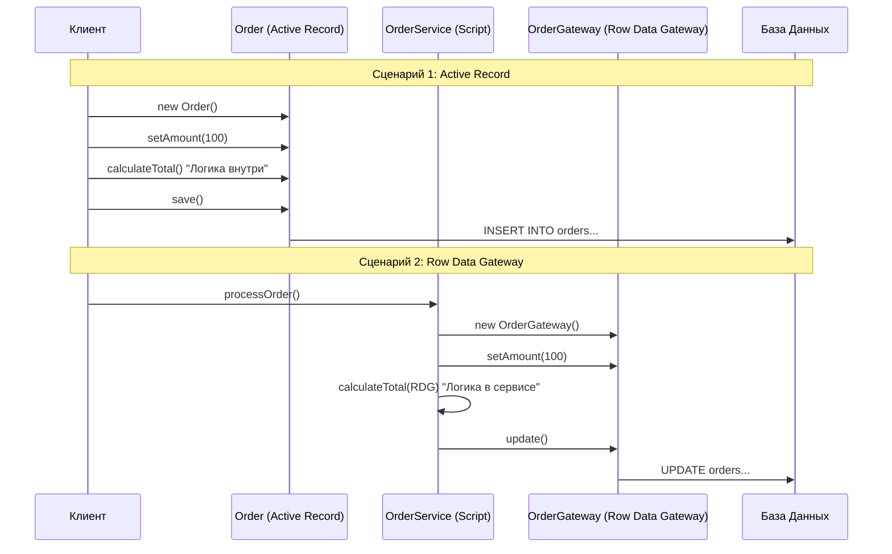

В книге Мартина Фаулера *Patterns of Enterprise Application Architecture* паттерны **Active Record** и **Row Data Gateway** очень похожи структурно, но фундаментально различаются по ответственности и месту размещения бизнес-логики.

Оба паттерна реализуют подход **"Один объект = Одна строка в базе данных"**. Однако вопрос в том, что именно этот объект умеет делать.

---

### 1. Суть различий

| Характеристика | Active Record (Активная запись) | Row Data Gateway (Шлюз на строку) |
| :--- | :--- | :--- |
| **Бизнес-логика** | **Внутри объекта.** Объект знает, как себя валидировать, считать скидки и т.д. | **Снаружи объекта.** Объект только хранит данные и делает SQL. Логика в Транзакционном Скрипте. |
| **Ответственность** | Данные + Доступ к БД + Логика предметной области. | Данные + Доступ к БД. |
| **Связанность** | Высокая (Coupling). Модель зависит от схемы БД. | Средняя. Логика отделена от доступа к данным. |
| **Типичное использование** | Rails (AR), Laravel (Eloquent), Django ORM. | Часто используется в связке с паттерном **Transaction Script**. |

---

### 2. Структурное сравнение (Mermaid Class Diagram)

На этой диаграмме видно, где живет логика.
*   В **Active Record** метод `calculateTotal()` находится внутри класса `Order`.
*   В **Row Data Gateway** метод `calculateTotal()` вынесен в отдельный сервис `OrderService` (Транзакционный скрипт), а `OrderGateway` только хранит данные и умеет делать `update()`.

---

### 3. Поток выполнения (Mermaid Sequence Diagram)

Здесь показано, как происходит сохранение и вычисление данных.

*   **Active Record:** Клиент обращается напрямую к объекту. Объект сам решает, как сохраниться.
*   **Row Data Gateway:** Клиент обращается к Сервису (Скрипту). Сервис манипулирует данными в Gateway и командует ему сохраниться.

---

### 4. Плюсы и Минусы

#### Active Record
**✅ Плюсы:**
*   **Простота:** Очень мало кода. Объект сам о себе заботится.
*   **Интуитивность:** Легко понять, где данные и как их сохранить.
*   **Разработка:** Идеально для CRUD-приложений и прототипов.

**❌ Минусы:**
*   **Нарушение SRP:** Класс делает слишком много (логика + хранение).
*   **Тестирование:** Сложно тестировать логику без базы данных (так как `save()` внутри).
*   **Наследование:** Сложно реализовать сложное наследование моделей (см. паттерн Inheritance Mappers).

#### Row Data Gateway
**✅ Плюсы:**
*   **Разделение ответственности:** Логика доступа к данным отделена от бизнес-правил.
*   **Гибкость:** Легче менять SQL-запросы, не трогая бизнес-логику.
*   **Тестирование:** Бизнес-логику (в Сервисе) можно тестировать без БД, подменяя Gateway моками.

**❌ Минусы:**
*   **Бойлерплейт:** Нужно создавать отдельные классы для Gateway и для Сервисов.
*   **Анемичная модель:** Объекты данных (Gateway) часто становятся просто контейнерами данных ("анемичная доменная модель").
*   **Сложность навигации:** сложнее понять, где именно находится конкретное бизнес-правило (разбросано по скриптам).

---

### 5. Когда что выбирать? (Рекомендации Фаулера)

#### Выбирайте **Active Record**, если:
1.  **Простая предметная область:** Логика близка к данным (CRUD).
2.  **Скорость разработки:** Нужно сделать быстро (Startups, MVP).
3.  **Команда:** Меньший опыт или предпочтение конвенции над конфигурацией.
4.  **Схема БД:** Стабильна и хорошо отражает структуру объектов.

#### Выбирайте **Row Data Gateway**, если:
1.  **Транзакционный скрипт:** Вы уже используете паттерн Transaction Script для логики.
2.  **Сложные запросы:** Нужен полный контроль над SQL, но Data Mapper (полное разделение) избыточен.
3.  **Легаси:** Вы работаете со старой базой данных, где схема не совпадает с объектами, но не хотите строить сложную ORM.
4.  **Разделение:** Вы хотите отделить логику от доступа к данным, но не готовы к сложности полноценного Domain Model + Data Mapper.

### Итог
*   **Active Record** = "Умный объект" (Данные + Логика + БД).
*   **Row Data Gateway** = "Умный контейнер" (Данные + БД), а Логика живет в отдельном скрипте/сервисе.

Если **Active Record** — это шаг в сторону Объектно-Ориентированного проектирования (Domain Model), то **Row Data Gateway** — это шаг в сторону процедурного проектирования (Transaction Script), но с удобной оберткой над данными.