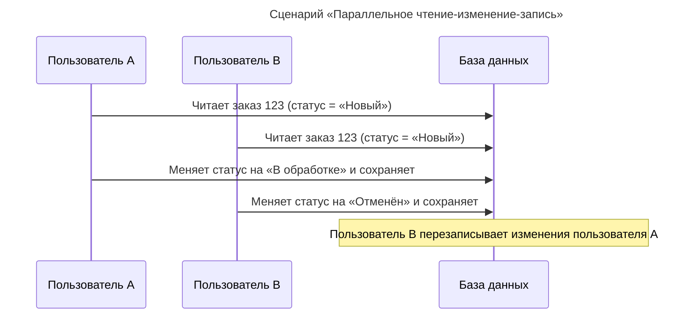
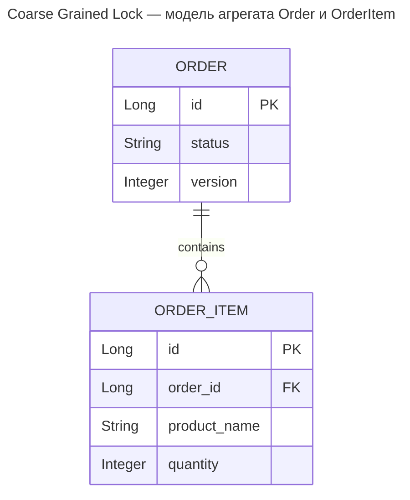
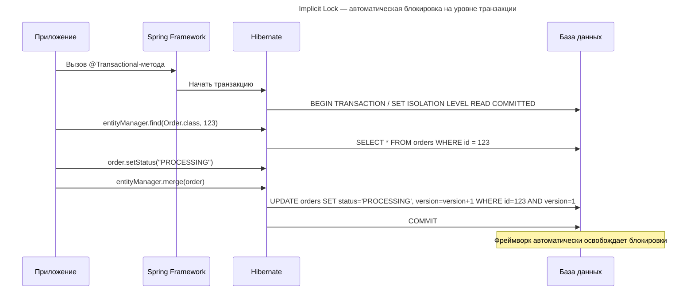
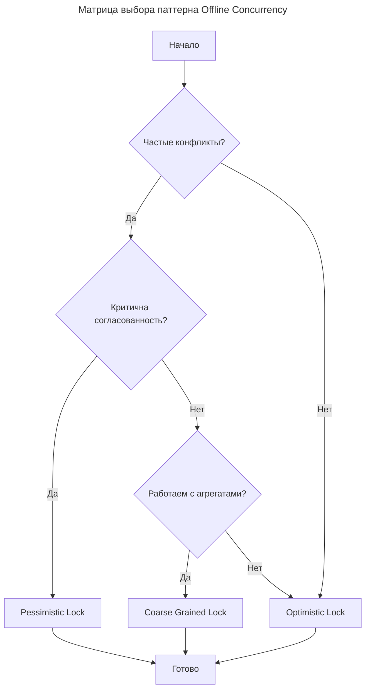

---
aliases:
  - Coarse Grained Lock
  - Coarse-Grained Lock
  - Implicit Lock
  - LockModeType
  - Martin Fowler
  - OCC
  - Offline Concurrency
  - Optimistic Lock
  - Optimistic Locking
  - Patterns of Enterprise Application Architecture
  - Pessimistic Lock
  - Pessimistic Locking
  - PESSIMISTIC_WRITE
  - POEAA
  - Transaction
  - Автономная блокировка
  - Конкурентность вне соединения
  - Крупнозернистая блокировка
  - Неявная блокировка
  - Оптимистическая блокировка
  - Оптимистичная блокировка
  - Пессимистическая блокировка
  - Пессимистичная блокировка
---

## Offline Concurrency

Offline Concurrency by [[PoEAA|PoEAA]].

Паттерны конкурентного доступа к данным из книги **«[[PoEAA|Patterns of Enterprise Application Architecture]]»** Мартина Фаулера #👨 #📘 решают проблему конкурентного доступа к данным в корпоративных приложениях.

- Optimistic Lock
- Pessimistic Lock
- Coarse Grained Lock
- Implicit Lock

---

### Контекст: проблема конкурентности

**Сценарий «Параллельное чтение-изменение-запись»**



**Проблема**
Пользователь B не знал, что данные изменились после его чтения.

---

### Паттерн Offline Concurrency

**Суть**
Общий паттерн для решения конкурентности, когда объекты:

- Загружаются из БД.
- Работают с ними вне соединения (в памяти, возможно долго).
- Сохраняются обратно в БД.

**Ключевая идея**
Соединение с БД не держится открытым во время работы с объектом. Конфликты при сохранении предотвращаются одним из нижеописанных паттернов.

**Решения для Offline Concurrency**

| Паттерн           | Когда использовать                           | Сложность |
| ----------------- | -------------------------------------------- | --------- |
| Optimistic Lock   | Редкие конфликты, высокая производительность | Низкая    |
| Pessimistic Lock  | Частые конфликты, критичные данные           | Высокая   |
| Coarse Grained Lock | Работа с агрегатами объектов               | Средняя   |

**Пример проблемы**

```java
// Пользователь A
Order orderA = orderRepository.findById(123L);
orderA.setStatus("PROCESSING");
// ... пользователь думает 5 минут ...
orderRepository.save(orderA); // Сохраняет успешно

// Пользователь B (параллельно)
Order orderB = orderRepository.findById(123L);
orderB.setStatus("CANCELLED");
// ... пользователь думает 3 минуты ...
orderRepository.save(orderB); // ПЕРЕЗАПИСЫВАЕТ изменения A!
```

---

### Optimistic Lock

**Суть**
Проверка конфликтов только при сохранении. Предполагается, что конфликты редки, и проверяется их момент в момент записи.

**Аналогия**
> «Я редактирую документ в Google Docs. Если кто-то изменил его до меня, система предупредит при сохранении.»

**Как работает**

```mermaid
---
title: Оптимистичная блокировка: проверка версии при сохранении
---
sequenceDiagram
    participant UserA as Пользователь A
    participant UserB as Пользователь B
    participant DB as База данных

    UserA->>DB: SELECT * FROM orders WHERE id=123 AND version=1
    UserB->>DB: SELECT * FROM orders WHERE id=123 AND version=1
    UserA->>UserA: Изменяет данные
    UserA->>DB: UPDATE orders SET status='PROCESSING', version=2 WHERE id=123 AND version=1
    Note over DB: Успешно (версия совпала)
    UserB->>UserB: Изменяет данные
    UserB->>DB: UPDATE orders SET status='CANCELLED', version=2 WHERE id=123 AND version=1
    Note over DB: Ошибка (версия теперь равна 2)
    DB-->>UserB: OptimisticLockException
```

**Реализация на Java (JPA/[[hibernate|Hibernate]])**

```java
@Entity
@Table(name = "orders")
public class Order {
    @Id
    private Long id;

    private String status;

    @Version // Ключевая аннотация!
    private Integer version;

    // getters/setters...
}

// Использование:
try {
    Order order = entityManager.find(Order.class, 123L);
    order.setStatus("PROCESSING");
    entityManager.merge(order); // Автоматически проверит версию
} catch (OptimisticLockException e) {
    // Обработка конфликта
    System.out.println("Данные были изменены другим пользователем!");
}
```

**Реализация на SQL**

```sql
-- Таблица с версией
CREATE TABLE orders (
    id BIGINT PRIMARY KEY,
    status VARCHAR(50),
    version INT NOT NULL DEFAULT 0
);

-- Чтение
SELECT id, status, version FROM orders WHERE id = 123;

-- Обновление с проверкой версии
UPDATE orders
SET status = 'PROCESSING', version = version + 1
WHERE id = 123 AND version = 1; -- Ключевое условие!

-- Если версия изменилась, вернёт 0 обновлённых строк
SELECT ROW_COUNT(); -- 0 = конфликт!
```

**Преимущества**

| Преимущество            | Объяснение                                        |
| ----------------------- | ------------------------------------------------- |
| Высокая производительность | Нет блокировок при чтении                       |
| Масштабируемость        | Подходит для высоконагруженных систем            |
| Простота                | Легко реализовать (аннотация `@Version`)          |
| Отсутствие взаимоблокировок | Нет риска [[multithreading|deadlock]]                              |

**Недостатки**

| Недостаток                   | Объяснение                                          |
| ---------------------------- | --------------------------------------------------- |
| Конфликты обнаруживаются поздно | Только при сохранении                             |
| Требует обработки ошибок     | Нужно реализовать логику разрешения конфликтов      |
| Не подходит для частых конфликтов | Постоянные ошибки раздражают пользователей      |

**Когда использовать**

| Сценарий                   | Рекомендация                    |
| -------------------------- | ------------------------------- |
| Веб-приложения             | Идеально (короткие сессии)      |
| Редактирование документов  | Подходит (редкие конфликты)     |
| Финансовые операции        | Лучше Pessimistic               |
| Высокая конкуренция        | Частые конфликты = плохой UX    |

---

### Pessimistic Lock

**Суть**
Блокировка данных при чтении. Другие процессы не могут читать или писать эти данные, пока блокировка не будет снята.

**Аналогия**
> «Я беру книгу в библиотеке и кладу на неё табличку „Занято“. Никто другой не может её взять, пока я не верну.»

**Как работает**

```mermaid
---
title: Пессимистичная блокировка: SELECT ... FOR UPDATE
---
sequenceDiagram
    participant UserA as Пользователь A
    participant UserB as Пользователь B
    participant DB as База данных

    UserA->>DB: SELECT * FROM orders WHERE id=123 FOR UPDATE
    Note over DB: Блокирует строку
    UserB->>DB: SELECT * FROM orders WHERE id=123 FOR UPDATE
    Note over DB: Ждёт освобождения блокировки
    UserA->>UserA: Работает с данными (10 минут)
    UserA->>DB: COMMIT
    Note over DB: Освобождает блокировку
    Note over UserB: Может продолжить
    UserB->>DB: Получает данные
```

**Реализация на Java ([[java-persistence-api|JPA]])**

```java
@Entity
@Table(name = "orders")
public class Order {
    @Id
    private Long id;

    private String status;

    // getters/setters...
}

// Использование:
Order order = entityManager.find(
    Order.class,
    123L,
    LockModeType.PESSIMISTIC_WRITE // Блокируем при чтении
);

order.setStatus("PROCESSING");
entityManager.merge(order);
entityManager.getTransaction().commit(); // Освобождает блокировку
```

**Реализация на SQL**

```sql
-- Блокировка при чтении
SELECT * FROM orders WHERE id = 123 FOR UPDATE;

-- Теперь другие транзакции НЕ МОГУТ:
-- - Читать эту строку с FOR UPDATE
-- - Обновлять эту строку
-- - Удалять эту строку

-- Работаем с данными...
UPDATE orders SET status = 'PROCESSING' WHERE id = 123;

-- COMMIT освобождает блокировку
COMMIT;
```

**Пример с таймаутом блокировки**

```java
@Service
public class OrderService {

    @PersistenceContext
    private EntityManager entityManager;

    public void processWithTimeout(Long orderId) {
        Map<String, Object> properties = new HashMap<>();
        properties.put("javax.persistence.lock.timeout", 5000); // 5 секунд

        Order order = entityManager.find(
            Order.class,
            orderId,
            LockModeType.PESSIMISTIC_WRITE,
            properties // Таймаут блокировки
        );

        // Если блокировка не получена за 5 секунд, выбросит исключение
        order.setStatus("PROCESSING");
    }
}
```

**Преимущества**

| Преимущество                    | Объяснение                                  |
| ------------------------------- | ------------------------------------------- |
| Гарантированная согласованность | Никаких конфликтов при сохранении           |
| Предсказуемость                 | Данные не изменятся во время работы         |
| Простота логики                 | Не нужно обрабатывать конфликты             |

**Недостатки**

| Недостаток                    | Объяснение                                          |
| ----------------------------- | --------------------------------------------------- |
| Низкая производительность     | Блокировки замедляют систему                        |
| Риск взаимоблокировок (deadlock) | Две транзакции блокируют друг друга               |
| Плохая масштабируемость       | Не подходит для высоконагруженных систем            |
| Долгие блокировки             | Если пользователь «ушёл» — данные заблокированы     |

**Когда использовать**

| Сценарий               | Рекомендация                              |
| ---------------------- | ----------------------------------------- |
| Финансовые операции    | Критично для согласованности              |
| Резервирование мест    | Нельзя продать одно место дважды          |
| Высокая конкуренция    | Частые конфликты                          |
| Веб-приложения         | Пользователь может «зависнуть»            |
| Долгие операции        | Блокировка на длительное время = проблемы |

---

### Coarse Grained Lock

**Суть**
Блокировка целого агрегата (группы связанных объектов), а не отдельных объектов. Упрощает управление конкурентностью.

**Аналогия**
> «Вместо того чтобы запирать каждую комнату в доме, мы запираем весь дом одним ключом.»

**Проблема, которую решает**

```java
// Без Coarse Grained Lock:
Order order = orderRepository.findById(123L);
order.getItems().get(0).setQuantity(5); // Нужно блокировать каждый товар
order.getItems().get(1).setQuantity(3);
orderRepository.save(order);

// Проблема: что если другой процесс изменил товар #2 между чтением и записью?
```

**Решение через агрегат**



**Реализация на Java**

```java
@Entity
@Table(name = "orders")
public class Order {
    @Id
    private Long id;

    @Version // Блокировка на уровне заказа
    private Integer version;

    @OneToMany(cascade = CascadeType.ALL, mappedBy = "order")
    private List<OrderItem> items;

    // Метод для изменения агрегата
    public void updateItemQuantity(Long itemId, Integer quantity) {
        OrderItem item = items.stream()
            .filter(i -> i.getId().equals(itemId))
            .findFirst()
            .orElseThrow();

        item.setQuantity(quantity);
        // Версия заказа увеличится при сохранении
    }
}

// Использование:
Order order = orderRepository.findById(123L);
order.updateItemQuantity(456L, 10); // Изменяем один товар
orderRepository.save(order); // Проверит версию заказа целиком
```

**Преимущества**

| Преимущество            | Объяснение                                        |
| ----------------------- | ------------------------------------------------- |
| Простота управления     | Одна блокировка вместо многих                     |
| Согласованность агрегата | Все связанные объекты изменяются вместе           |
| Меньше конфликтов       | Реже случаются частичные обновления               |

**Недостатки**

| Недостаток            | Объяснение                                                      |
| --------------------- | --------------------------------------------------------------- |
| Избыточная блокировка | Блокируется весь агрегат, даже если нужно изменить один объект |
| Снижение параллелизма | Два пользователя не могут менять разные товары одного заказа    |

**Когда использовать**

| Сценарий           | Рекомендация                     |
| ------------------ | -------------------------------- |
| Агрегаты DDD       | Идеально подходит                |
| Заказ + товары     | Всегда изменяются вместе         |
| Независимые объекты | Лучше блокировать по отдельности |

---

### Implicit Lock

**Суть**
Автоматическая блокировка, управляемая фреймворком или слоем доступа к данным, без явного кода в приложении.

**Аналогия**
> «Вы не думаете о блокировках, когда едете на машине. ABS и стабилизация работают автоматически.»

**Как работает**

```java
// Приложение НЕ знает о блокировках:
@Service
public class OrderService {

    @Transactional // Фреймворк сам управляет блокировками
    public void processOrder(Long orderId) {
        Order order = orderRepository.findById(orderId);
        order.setStatus("PROCESSING");
        // ... бизнес-логика ...
    }
}

// Фреймворк (Spring/Hibernate) автоматически:
// 1. Открывает транзакцию
// 2. Применяет настройки блокировок (из @Transactional)
// 3. Фиксирует или откатывает
// 4. Освобождает блокировки
```

**Конфигурация на [[spring|Spring]]**

```java
@Service
public class OrderService {

    // Изоляция по умолчанию: READ_COMMITTED
    @Transactional
    public void updateOrder(Long id, String status) {
        Order order = orderRepository.findById(id);
        order.setStatus(status);
    }

    // Явное указание уровня изоляции
    @Transactional(isolation = Isolation.SERIALIZABLE)
    public void criticalUpdate(Long id) {
        // SERIALIZABLE = самая строгая изоляция (как Pessimistic)
    }

    // Только для чтения = нет блокировок записи
    @Transactional(readOnly = true)
    public Order getOrder(Long id) {
        return orderRepository.findById(id);
    }
}
```

**Уровни изоляции транзакций (SQL)**

| Уровень        | Описание                                          | Блокировки                  |
| -------------- | ------------------------------------------------- | --------------------------- |
| READ UNCOMMITTED | Может читать незафиксированные данные           | Минимальные                 |
| READ COMMITTED | Читает только зафиксированные данные              | Строковые при записи        |
| REPEATABLE READ | Гарантирует повторяемость чтения                  | Строковые + диапазонные     |
| [[transaction-isolation|SERIALIZABLE]]   | Полная изоляция (как последовательное выполнение) | Максимальные                |

**Как работает автоматическая блокировка**



**Преимущества**

| Преимущество            | Объяснение                                        |
| ----------------------- | ------------------------------------------------- |
| Простота кода           | Не нужно писать код блокировок                    |
| Единообразие            | Все транзакции управляются одинаково              |
| Меньше ошибок           | Нельзя забыть освободить блокировку               |
| Интеграция с фреймворком | Работает с остальными фичами Spring/Hibernate     |

**Недостатки**

| Недостаток                 | Объяснение                                          |
| -------------------------- | --------------------------------------------------- |
| Меньше контроля            | Сложно настроить тонкие сценарии                    |
| Производительность         | Фреймворк может использовать избыточные блокировки  |
| Отладка                    | Сложнее понять, где возникла блокировка             |
| Зависимость от фреймворка  | Трудно перейти на другой стек                       |

**Когда использовать**

| Сценарий              | Почему                                        |
| --------------------- | --------------------------------------------- |
| Стандартные CRUD-операции | Фреймворк отлично справляется              |
| Низкая конкуренция    | Редкие конфликты                              |
| Простые транзакции    | Нет сложной бизнес-логики                     |
| Простой код           | Не нужно думать о блокировках                 |
| Использование фреймворка | Spring, Hibernate, JPA                     |

---

### Сравнение всех паттернов

| Паттерн            | Когда конфликт обнаруживается | Блокировка               | Производительность | Сложность |
| ------------------ | ----------------------------- | ------------------------ | ------------------ | --------- |
| Optimistic Lock    | При сохранении                | Нет (до сохранения)      | ⭐⭐⭐⭐⭐         | Низкая    |
| Pessimistic Lock   | При чтении                    | Да (до коммита)          | ⭐⭐               | Высокая   |
| Coarse Grained Lock | При сохранении агрегата       | Нет или да (зависит от реализации) | ⭐⭐⭐⭐    | Средняя   |
| Implicit Lock      | Зависит от уровня изоляции    | Автоматическая           | ⭐⭐⭐             | Низкая    |

---

### Сравнение Implicit Lock и Pessimistic Lock

Это два разных уровня абстракции управления конкурентностью, которые часто путают.

| Критерий                       | Implicit Lock                | Pessimistic Lock             |
| ------------------------------ | ---------------------------- | ---------------------------- |
| Уровень абстракции             | Высокий (фреймворк)          | Низкий (приложение)          |
| Кто управляет блокировками     | Фреймворк / ORM              | Разработчик явно             |
| Видимость в коде               | Скрытая (аннотации, конфигурация) | Явная (вызовы методов, SQL) |
| Гибкость                       | Ограниченная (настройки фреймворка) | Полная (контроль на уровне запросов) |
| Отладка                        | Сложнее (не видно в коде)    | Проще (явные вызовы)         |
| Переносимость                  | Зависит от фреймворка        | Зависит от СУБД              |
| Производительность             | Оптимизирована фреймворком   | Зависит от реализации        |

**Когда применяется блокировка**

| Паттерн           | Когда блокируется                                              |
| ----------------- | -------------------------------------------------------------- |
| Implicit Lock     | Автоматически при начале транзакции (на основе уровня изоляции) |
| Pessimistic Lock  | Явно при выполнении `SELECT ... FOR UPDATE` или `LockModeType.PESSIMISTIC_WRITE` |

**Контроль над блокировкой**

```java
// Implicit Lock — контроль через настройки
@Transactional(isolation = Isolation.SERIALIZABLE)
public void implicitApproach() {
    // Блокировка происходит автоматически
    Order order = orderRepository.findById(123L);
    order.setStatus("PROCESSING");
}

// Pessimistic Lock — полный контроль
public void explicitApproach() {
    Order order = orderRepository.findByIdWithPessimisticLock(123L);
    // Видно, что происходит блокировка
    order.setStatus("PROCESSING");
}
```

**Отладка и мониторинг**

```java
// Implicit Lock — сложно отследить
@Transactional
public void process() {
    // Где блокировка? Когда освободится?
    // Нужно смотреть логи Hibernate/Spring
}

// Pessimistic Lock — явно видно
public void process() {
    log.info("Захватываю блокировку...");
    Order order = entityManager.find(Order.class, 123L, LockModeType.PESSIMISTIC_WRITE);
    log.info("Блокировка захвачена");
    // ... работа ...
    log.info("Освобождаю блокировку при коммите");
}
```

**Таймауты и обработка ошибок**

```java
// Implicit Lock — ограниченные возможности
@Transactional(isolation = Isolation.SERIALIZABLE, timeout = 30)
public void implicitWithTimeout() {
    // Таймаут на ВСЮ транзакцию, не на блокировку
}

// Pessimistic Lock — гибкие настройки
public void explicitWithTimeout() {
    Map<String, Object> props = new HashMap<>();
    props.put("javax.persistence.lock.timeout", 5000); // 5 сек на блокировку

    try {
        Order order = entityManager.find(Order.class, 123L,
            LockModeType.PESSIMISTIC_WRITE, props);
    } catch (PersistenceException e) {
        if (e.getCause() instanceof LockTimeoutException) {
            // Обработка таймаута блокировки
            log.warn("Не удалось захватить блокировку");
        }
    }
}
```

**Когда использовать какой паттерн**

| Ситуация                | Подход                                              |
| ----------------------- | --------------------------------------------------- |
| Простые CRUD            | Implicit Lock (READ_COMMITTED)                      |
| Чтение данных           | Implicit Lock (readOnly = true)                     |
| Редкие конфликты        | Implicit Lock + Optimistic (@Version)               |
| Частые конфликты        | Pessimistic Lock                                    |
| Критичные данные        | Pessimistic Lock                                    |
| Долгие операции         | Optimistic Lock (без удержания блокировки)          |
| Высокая нагрузка        | Optimistic Lock                                     |

**Производительность при 1000 параллельных запросов**

| Подход                     | Среднее время  | Конфликты |
| -------------------------- | -------------- | --------- |
| Implicit Lock (READ_COMMITTED) | 50 мс       | 2%        |
| Pessimistic Lock           | 200 мс         | 0%        |
| Optimistic Lock            | 45 мс          | 5%        |

---

### Матрица выбора паттерна



---

### Рекомендации по выбору

**Используйте Optimistic Lock, если**

- Конфликты редки (< 5% операций).
- Производительность важнее, чем абсолютная согласованность.
- Веб-приложение с короткими сессиями.

**Используйте Pessimistic Lock, если**

- Конфликты часты (> 30% операций).
- Данные критичны (финансы, резервирование).
- Соединение можно держать открытым недолго.

**Используйте Coarse Grained Lock, если**

- Работа с агрегатами (заказ + товары).
- Нужна согласованность всей группы объектов.
- Объекты всегда изменяются вместе.

**Используйте Implicit Lock, если**

- Нужен простой код.
- Стандартные уровни изоляции подходят.
- Настроек фреймворка достаточно.

---

### Реальные примеры

**Электронная коммерция**

```java
@Service
public class ShoppingCartService {

    // Implicit Lock — для корзины (редкие конфликты)
    @Transactional
    public void addToCart(Long userId, Long productId, Integer quantity) {
        Cart cart = cartRepository.findByUserId(userId);
        cart.addItem(productId, quantity);
        // Фреймворк сам управляет блокировками
    }

    // Pessimistic Lock — для резервирования товара
    @Transactional
    public void reserveProduct(Long productId, Integer quantity) {
        Product product = entityManager.find(
            Product.class,
            productId,
            LockModeType.PESSIMISTIC_WRITE // Явная блокировка
        );

        if (product.getStock() >= quantity) {
            product.setStock(product.getStock() - quantity);
        } else {
            throw new InsufficientStockException();
        }
    }
}
```

**Банковское приложение**

```java
@Service
public class BankingService {

    // Implicit Lock — для чтения баланса
    @Transactional(readOnly = true)
    public BigDecimal getBalance(Long accountId) {
        Account account = accountRepository.findById(accountId);
        return account.getBalance();
    }

    // Pessimistic Lock — для перевода денег (критично!)
    @Transactional
    public void transferMoney(Long fromId, Long toId, BigDecimal amount) {
        // Явно блокируем оба счёта
        Account from = entityManager.find(
            Account.class, fromId, LockModeType.PESSIMISTIC_WRITE);

        Account to = entityManager.find(
            Account.class, toId, LockModeType.PESSIMISTIC_WRITE);

        if (from.getBalance().compareTo(amount) < 0) {
            throw new InsufficientFundsException();
        }

        from.setBalance(from.getBalance().subtract(amount));
        to.setBalance(to.getBalance().add(amount));
    }
}
```

**Система управления документами**

```java
// Редактирование документа — редкие конфликты
@Version
private Integer version; // Optimistic Lock

// Публикация документа — критичная операция
@Transactional(isolation = Isolation.REPEATABLE_READ)
public void publishDocument(Document doc) {
    // Coarse Grained Lock на уровне документа
}
```

---

### Распространённые ошибки

| Ошибка                     | Последствие                    | Как исправить                                        |
| -------------------------- | ------------------------------ | ---------------------------------------------------- |
| Забыть @Version            | Перезапись данных              | Всегда добавлять версию для изменяемых сущностей     |
| Долгая транзакция с Pessimistic | Блокировка на минуты       | Использовать Optimistic для долгих операций          |
| Смешивать подходы          | Непредсказуемое поведение      | Выбрать один подход на агрегат                       |
| Игнорировать конфликты     | Тихая перезапись данных        | Всегда обрабатывать OptimisticLockException          |

**Ошибка: смешивание подходов без понимания**

```java
// Неясно, какая блокировка применяется
@Transactional(isolation = Isolation.SERIALIZABLE)
public void confusingMethod(Long id) {
    Order order = entityManager.find(
        Order.class, id, LockModeType.PESSIMISTIC_WRITE);
    // SERIALIZABLE + PESSIMISTIC_WRITE = избыточно!
}
```

**Ошибка: долгая блокировка в Pessimistic**

```java
// Блокировка на 10 минут!
@Transactional
public void longRunningOperation(Long id) {
    Order order = entityManager.find(
        Order.class, id, LockModeType.PESSIMISTIC_WRITE);

    Thread.sleep(600000); // 10 минут!
    // Другие пользователи ждут 10 минут!
}
```

**Правильно: Optimistic для долгих операций**

```java
// Проверка при сохранении
@Transactional
public void longOperationWithOptimistic(Long id) {
    Order order = entityManager.find(Order.class, id);

    // Долгая операция без блокировки
    Thread.sleep(600000);

    // Проверка версии при сохранении
    order.setStatus("COMPLETED");
    // Если кто-то изменил данные, будет исключение
}
```

---

### Итог

> **Offline Concurrency** — общая проблема конкурентного доступа к данным вне соединения.
>
> **Optimistic Lock** — проверка конфликтов при сохранении (быстро, но возможны ошибки).
>
> **Pessimistic Lock** — блокировка при чтении (медленно, но надёжно).
>
> **Coarse Grained Lock** — блокировка агрегата целиком (проще, но менее гибко).
>
> **Implicit Lock** — фреймворк управляет блокировками автоматически (проще для разработчика).

**Главное правило**
Паттерн выбирается на основе частоты конфликтов и критичности данных, а не личных предпочтений.

В сравнении Implicit и Pessimistic: Implicit Lock — автоматическая коробка передач (просто в использовании, фреймворк решает, когда и как блокировать), Pessimistic Lock — ручная коробка передач (полный контроль, явное управление блокировками). Используйте простое решение (Implicit), пока не потребуется сложное (Pessimistic).

**Оптимальный подход в современных приложениях**
Используйте Optimistic Lock по умолчанию, переключайтесь на Pessimistic только для критичных операций и применяйте Coarse Grained Lock для агрегатов.
