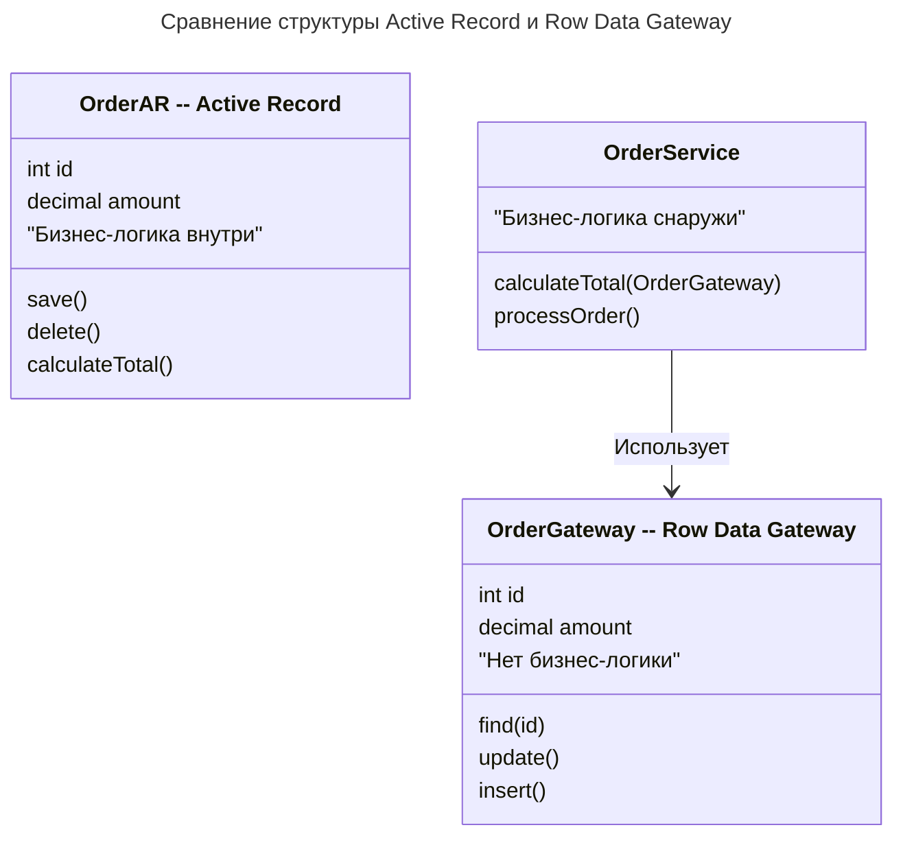
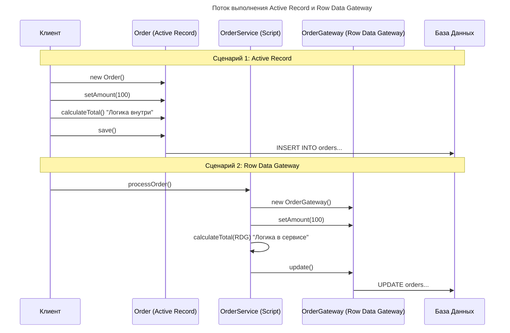

---
aliases:
  - Active Record
  - Data Mapper
  - Patterns of Enterprise Application Architecture
  - PoEAA
  - Row Data Gateway
  - Transaction Script
  - Активная запись
  - Шлюз на строку
---
## Row Data Gateway vs Active Record

В книге Мартина Фаулера #👨 *Patterns of Enterprise Application Architecture* #📘 паттерны **Active Record** и **Row Data Gateway** очень похожи структурно, но фундаментально различаются по ответственности и месту размещения бизнес-логики.

Оба паттерна реализуют подход **«Один объект = Одна строка в базе данных»**. Однако вопрос в том, что именно этот объект умеет делать.

## Суть различий

| Характеристика | Active Record (Активная запись) | Row Data Gateway (Шлюз на строку) |
|---|---|---|
| **Бизнес-логика** | **Внутри объекта.** Объект знает, как себя валидировать, считать скидки и т. д. | **Снаружи объекта.** Объект только хранит данные и делает SQL. Логика в Транзакционном Скрипте. |
| **Ответственность** | Данные + Доступ к БД + Логика предметной области. | Данные + Доступ к БД. |
| **Связанность** | Высокая (Coupling). Модель зависит от схемы БД. | Средняя. Логика отделена от доступа к данным. |
| **Типичное использование** | Rails (AR), Laravel (Eloquent), Django ORM. | Часто используется в связке с паттерном **Transaction Script**. |

## Структурное сравнение (Mermaid Class Diagram)

На этой диаграмме видно, где живёт логика:

- В **Active Record** метод `calculateTotal()` находится внутри класса `Order`.
- В **Row Data Gateway** метод `calculateTotal()` вынесен в отдельный сервис `OrderService` (Транзакционный скрипт), а `OrderGateway` только хранит данные и умеет делать `update()`.

## Поток выполнения (Mermaid Sequence Diagram)

Здесь показано, как происходит сохранение и вычисление данных:

- **Active Record:** клиент обращается напрямую к объекту. Объект сам решает, как сохраниться.
- **Row Data Gateway:** клиент обращается к Сервису (Скрипту). Сервис манипулирует данными в Gateway и командует ему сохраниться.

## Особенности

### Active Record

**✅ Плюсы:**

- **Простота:** очень мало кода. Объект сам о себе заботится.
- **Интуитивность:** легко понять, где данные и как их сохранить.
- **Разработка:** идеально для CRUD-приложений и прототипов.

**❌ Минусы:**

- **Нарушение [[SOLID|SRP]]:** класс делает слишком много (логика + хранение).
- **Тестирование:** сложно тестировать логику без базы данных (так как `save()` внутри).
- **Наследование:** сложно реализовать сложное наследование моделей (см. паттерн [[Inheritance-mappers|Inheritance Mappers]]).

### Row Data Gateway

**✅ Плюсы:**

- **Разделение ответственности:** логика доступа к данным отделена от бизнес-правил.
- **Гибкость:** легче менять SQL-запросы, не трогая бизнес-логику.
- **Тестирование:** бизнес-логику (в Сервисе) можно тестировать без БД, подменяя Gateway моками.

**❌ Минусы:**

- **Бойлерплейт:** нужно создавать отдельные классы для Gateway и для Сервисов.
- **Анемичная модель:** объекты данных (Gateway) часто становятся просто контейнерами данных («анемичная доменная модель»).
- **Сложность навигации:** сложнее понять, где именно находится конкретное бизнес-правило (разбросано по скриптам).

## Когда что выбирать? (Рекомендации Фаулера)

### Когда выбирать Active Record

1. **Простая предметная область:** логика близка к данным (CRUD).
2. **Скорость разработки:** нужно сделать быстро (Startups, MVP).
3. **Команда:** меньший опыт или предпочтение конвенции над конфигурацией.
4. **Схема БД:** стабильна и хорошо отражает структуру объектов.

### Когда выбирать Row Data Gateway

1. **Транзакционный скрипт:** вы уже используете паттерн Transaction Script для логики.
2. **Сложные запросы:** нужен полный контроль над SQL, но [[data-mapper|Data Mapper]] (полное разделение) избыточен.
3. **Легаси:** вы работаете со старой базой данных, где схема не совпадает с объектами, но не хотите строить сложную ORM.
4. **Разделение:** вы хотите отделить логику от доступа к данным, но не готовы к сложности полноценного Domain Model + Data Mapper.

## Итог

- **Active Record** = «умный объект» (Данные + Логика + БД).
- **Row Data Gateway** = «умный контейнер» (Данные + БД), а логика живёт в отдельном скрипте/сервисе.

Если **Active Record** — это шаг в сторону объектно-ориентированного проектирования (Domain Model), то **Row Data Gateway** — это шаг в сторону процедурного проектирования (Transaction Script), но с удобной обёрткой над данными.
