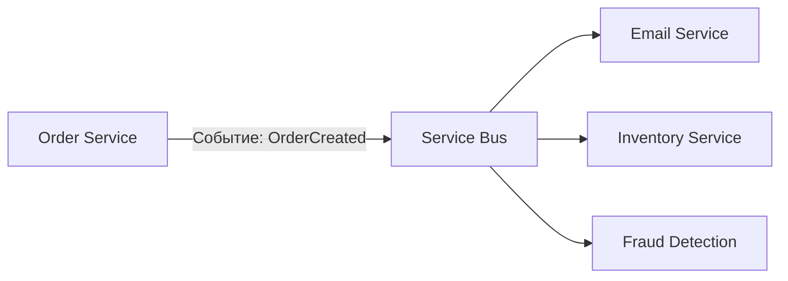

**Service Bus** и **[[event-bus]]** — звучат похоже, но на самом деле **относятся к разным уровням абстракции**.  

| Аспект          | **Service Bus**                                                    | **Event Bus**                                |
| --------------- | ------------------------------------------------------------------ | -------------------------------------------- |
| **Тип**         | Архитектурный паттерн                                              | Техническая реализация                       |
| **Определение** | Паттерн: система, где компоненты общаются через центральный брокер | Конкретная технология, реализующая messaging |
| **Примеры**     | [[Event-Driven Architecture]], [[message-broker]] как концепция                          | Kafka, RabbitMQ, AWS EventBridge             |
| **Уровень**     | Концептуальный (архитектура)                                       | Реализационный (инструмент)                  |
| **Аналогия**    | Идея почтового ящика                                               | Почта России                                 |

> 🔑 **Service Bus — это *концепция*.**  
> **Event Bus — это *реализация* этой концепции в виде конкретной системы.**

---

## ✅ 1. Что такое **Service Bus**?

### 🔹 Определение:
> **Service Bus** — это **архитектурный паттерн**, при котором **разные сервисы обмениваются сообщениями через централизованный брокер** (шину), чтобы избежать прямых зависимостей.

Это **не инструмент**, а **принцип проектирования**:  
- Сервис A не вызывает B напрямую → он отправляет сообщение в **шину**
- Сервис B **подписывается** на нужные события
- Никакой зависимости между A и B

### 💡 Цель Service Bus:
- Декуплинг (слабая связность)
- Асинхронность
- Масштавируемость
- Отказоустойчивость
- Управление трафиком (очереди, топики)

### 🔄 Пример Service Bus в архитектуре:



→ `Order Service` ничего не знает о других сервисах — просто "бросает" событие в шину.

---

## ✅ 2. Что такое **Event Bus**?

### 🔹 Определение:
> **Event Bus** — это **конкретная система или инструмент**, реализующий **паттерн Service Bus** для **событий**.

Это **реализация**, а не паттерн.

### 📦 Примеры Event Bus:
| Инструмент | Тип |
|-----------|------|
| **Kafka** | Распределённая платформа потоковой обработки |
| **RabbitMQ** | Сообщения + очереди |
| **AWS EventBridge** | Managed event bus для SaaS и микросервисов |
| **Azure Event Grid** | Облачный Event Bus |
| **Google Cloud Pub/Sub** | Глобальная доставка событий |
| **Redis Streams** | Лёгкий Event Bus для небольших систем |

> ✅ **Event Bus — это то, что вы устанавливаете, настраиваете, масштабируете.**

---

## 🆚 Сравнение: Service Bus vs Event Bus

| Критерий | **Service Bus** | **Event Bus** |
|----------|----------------|---------------|
| **Что это?** | Архитектурный паттерн | Конкретная технология |
| **Где используется?** | В описании архитектуры, документации | В CI/CD, Docker, Kubernetes |
| **Зависимость от технологии?** | ❌ Нет — можно реализовать любым способом | ✅ Да — зависит от Kafka, RabbitMQ и др. |
| **Можно ли заменить?** | ✅ Да — меняется только реализация | ✅ Да — например, RabbitMQ → Kafka |
| **Пример фразы** | _«Мы используем Service Bus для интеграции сервисов»_ | _«Мы используем Kafka как Event Bus»_ |
| **Цель** | Декуплинг, асинхронность | Реализовать паттерн Service Bus |
| **Связь** | Это **идея** | Это **инструмент** |

> 💬 **Service Bus — это «почта».**  
> **Event Bus — это «Почта России».**

---

## 🔧 Как соотносятся?
```plaintext
Service Bus (паттерн)
      ↑
      └─ реализуется через → Event Bus (Kafka, RabbitMQ, ...)
```

> ✅ **Event Bus — это один из способов реализации Service Bus.**  
> Но не единственный.

---

## ✅ Когда говорят "Service Bus", имеют в виду?

В разных контекстах этот термин может означать:

| Значение | Пример |
|---------|--------|
| **1. Паттерн (общее)** | *"We use a service bus to decouple our microservices"* |
| **2. Конкретный продукт** | *"We use Azure Service Bus as our message broker"* |
| **3. Enterprise Service Bus (ESB)** | Устаревшая корпоративная система (например, MuleSoft, WSO2) |

> ⚠️ **Azure Service Bus ≠ Service Bus (паттерн)** — это **продукт Microsoft**, который **реализует паттерн**.

---

## ✅ Разница между **Event Bus** и **Message Queue**

Иногда эти понятия тоже путают.

| | **Event Bus** | **Message Queue** |
|--|-------------|------------------|
| **Фокус** | События (event-driven) | Очереди задач |
| **Топология** | Часто Pub/Sub | Чаще P2P |
| **Примеры** | Kafka, EventBridge | RabbitMQ, SQS |
| **Ключевая идея** | "Что-то произошло" | "Нужно сделать" |
| **Может быть частью Service Bus** | ✅ Да | ✅ Да |

> ✅ **Event Bus — подвид Service Bus**, сфокусированный на **событиях (events)**.

---

## ✅ Примеры использования

### 1. **Service Bus (как паттерн)**

> Мы решили **не делать прямые вызовы между сервисами**.  
> Теперь все взаимодействие происходит через **шину сообщений** — это наш **Service Bus**.

✅ Здесь — **архитектурное решение**.

---

### 2. **Event Bus (как инструмент)**

> Для реализации Service Bus мы выбрали **Apache Kafka** — он будет работать как **Event Bus**.

✅ Здесь — **выбор технологии**.

---

### 3. **Объединённый пример**

```mermaid
graph LR
    A[Order Service] -->|Publish| B[Kafka (Event Bus)]
    B --> C[Email Service]
    B --> D[Inventory Service]
    B --> E[Analytics Service]

    style B fill:#f0ad4e,stroke:#c9510c,color:#fff
    style A,C,D,E fill:#dfe9f5,stroke:#000
```

> 🔹 **Service Bus** — это **архитектурный подход**:  
> > *«Мы используем централизованную шину для обмена сообщениями»*

> 🔹 **Kafka** — это **Event Bus**:  
> > *«Наши события хранятся и маршрутизируются через Kafka»*

---

## ✅ Когда что использовать?

| Ваша цель | Рекомендация |
|----------|--------------|
| ✅ Вы описываете архитектуру | → Говорите: **Service Bus** |
| ✅ Вы выбираете технологию | → Говорите: **Event Bus: Kafka / RabbitMQ / EventBridge** |
| ✅ Вам нужно масштабирование | → **Event Bus: Kafka** |
| ✅ Вам нужно управление сложными интеграциями | → **Azure Service Bus** |
| ✅ Вы делаете event-driven систему | → **Event Bus + Service Bus как паттерн** |
| ✅ Вы пишете в документации | → *«Мы используем паттерн Service Bus. Реализован через Kafka как Event Bus»* |

---

## ✅ Финальный вывод

| Вопрос | Ответ |
|--------|-------|
| **Чем отличается Service Bus от Event Bus?** | **Service Bus — это архитектурный паттерн. Event Bus — это его техническая реализация.** |
| **Можно ли иметь Service Bus без Event Bus?** | Теоретически да (например, через HTTP-уведомления), но **практически всегда нужен Event Bus** |
| **Можно ли использовать Event Bus вне Service Bus?** | Можно, но тогда вы просто используете очередь — не применяя архитектурный подход |
| **Лучше сказать: «Мы используем Service Bus» или «Мы используем Kafka»?** | Лучше: **«Мы используем паттерн Service Bus, реализованный через Kafka как Event Bus»** |

---

## 💬 Цитата для запоминания

> _“Service Bus is the architecture.  
> Event Bus is the engine that makes it run.”_

> 🔹 **Service Bus** — это **план города**.  
> 🔹 **Event Bus** — это **трамвайная линия**, которая по этому плану работает.

---

## ✅ Итог: Сводная таблица

| Понятие | Что это? | Примеры |
|--------|----------|---------|
| **Service Bus** | Архитектурный паттерн для декуплинга | Идея: "все сервисы общаются через шину" |
| **Event Bus** | Конкретная реализация Service Bus для событий | Kafka, RabbitMQ, AWS EventBridge |
| **Message Queue** | Подсистема внутри Event Bus | Oчередь в Kafka или RabbitMQ |
| **Pub/Sub** | Шаблон доставки | Один источник → много подписчиков |

---

✅ **Запомните:**

> - **Service Bus** = **Как мы общаемся? Через шину.**  
> - **Event Bus** = **Что за шина? Kafka.**

---

## 📚 Где учиться дальше?

- [https://microservices.io/patterns/communication-style/messaging.html](https://microservices.io/patterns/communication-style/messaging.html)
- [https://kafka.apache.org/intro](https://kafka.apache.org/intro)
- [https://www.rabbitmq.com/tutorials/amqp-concepts.html](https://www.rabbitmq.com/tutorials/amqp-concepts.html)
- Book: **"Designing Data-Intensive Applications" — Martin Kleppmann**

---

💡 **Если вы строите распределённую систему — вам нужен и Service Bus (как принцип), и Event Bus (как инструмент).**  
Выберите правильный инструмент — и ваша архитектура станет **масштабируемой, надёжной и живой**.